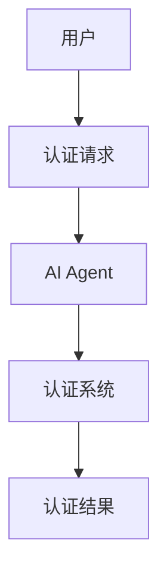
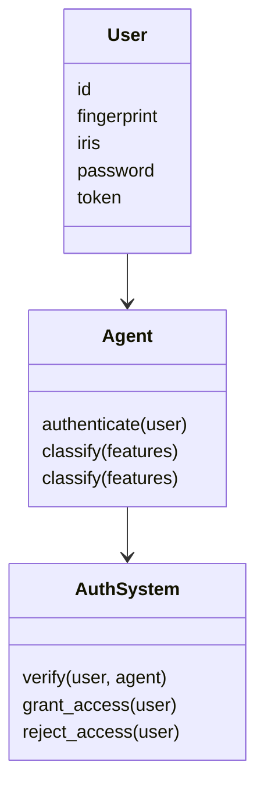
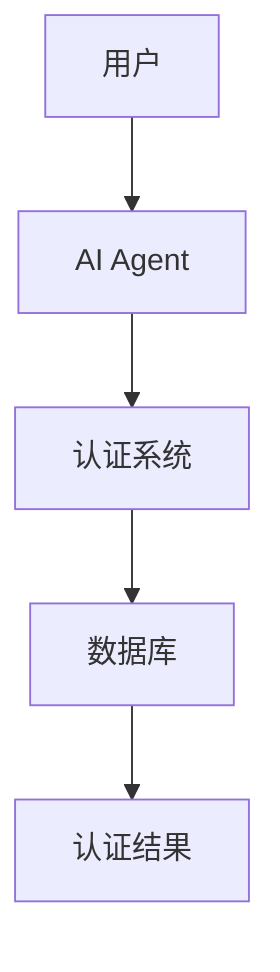

                 


# 智能门锁：AI Agent的多因素安全认证系统

> 关键词：智能门锁，AI Agent，多因素安全认证，人工智能，门禁系统，网络安全

> 摘要：本文详细探讨了智能门锁中AI Agent的多因素安全认证系统的设计与实现。通过分析传统门锁的局限性，引出AI Agent的概念及其在智能门锁中的应用，重点介绍了多因素认证的原理与优势。结合具体的算法实现、系统架构设计和项目实战案例，深入剖析了AI Agent如何通过多因素认证提升智能门锁的安全性。本文还提供了丰富的代码示例和系统架构图，帮助读者全面理解智能门锁AI Agent多因素安全认证系统的实现细节。

---

# 第一部分: 智能门锁与AI Agent的背景介绍

## 第1章: 智能门锁的发展与AI Agent的引入

### 1.1 智能门锁的发展历程

#### 1.1.1 传统门锁的功能与局限性
传统门锁主要依赖机械结构和钥匙进行开锁，虽然简单可靠，但存在以下问题：
- **安全性低**：钥匙容易丢失、被复制。
- **管理不便**：需要手动分发钥匙，管理成本高。
- **智能化不足**：无法与现代智能家居系统无缝集成。

#### 1.1.2 智能门锁的兴起与技术进步
随着物联网技术的发展，智能门锁应运而生。智能门锁通过集成传感器、无线通信和嵌入式系统，实现了远程开锁、权限管理等功能。其主要优势包括：
- **远程控制**：支持手机APP或云端控制。
- **权限管理**：可以通过指纹、密码、刷卡等多种方式授权用户。
- **实时监控**：记录开门记录并实时推送通知。

#### 1.1.3 AI Agent在智能门锁中的应用前景
AI Agent（智能代理）是一种能够感知环境、自主决策的智能体。在智能门锁中，AI Agent可以通过分析用户的开门行为、时间、位置等信息，提供更智能化的安全认证服务。

### 1.2 AI Agent的基本概念与特点

#### 1.2.1 AI Agent的定义与核心功能
AI Agent是一种能够感知环境、执行任务的智能系统。其核心功能包括：
- **感知环境**：通过传感器、摄像头等设备获取环境信息。
- **自主决策**：基于获取的信息，通过算法做出决策。
- **执行操作**：根据决策结果执行相应的操作。

#### 1.2.2 AI Agent的分类与应用场景
AI Agent可以分为以下几类：
- **简单反射型AI Agent**：基于预设规则做出反应。
- **基于模型的AI Agent**：通过构建环境模型进行决策。
- **目标驱动型AI Agent**：根据目标选择最优动作。

在智能门锁中的应用场景包括：
- **身份识别**：通过指纹、人脸识别等方式验证用户身份。
- **行为分析**：分析用户的开门行为，识别异常情况。
- **异常检测**：检测非法入侵并触发报警。

#### 1.2.3 AI Agent在智能门锁中的角色与价值
AI Agent在智能门锁中扮演着“智能大脑”的角色，通过整合多种认证方式，提升了门锁的安全性和智能化水平。

### 1.3 多因素安全认证系统的概念与优势

#### 1.3.1 多因素认证的定义与基本原理
多因素认证（Multi-Factor Authentication, MFA）是指通过多种不同的认证方式来验证用户身份。常见的认证因素包括：
- **知识因素**：如密码、PIN码。
- ** possession factors**：如手机验证码、智能卡。
- ** inherence factors**：如指纹、虹膜。
- **行为因素**：如键盘输入习惯、步态识别。

多因素认证的基本原理是通过多种独立的认证方式，确保只有合法用户能够通过认证。

#### 1.3.2 多因素认证在智能门锁中的应用
在智能门锁中，多因素认证可以通过以下方式实现：
- **指纹+密码**：用户需要同时提供指纹和密码。
- **刷卡+人脸识别**：用户需要刷卡并进行人脸识别。
- **手机验证码+钥匙**：用户需要输入手机验证码并使用物理钥匙。

#### 1.3.3 多因素认证的安全性与便捷性对比
| **认证方式**       | **安全性** | **便捷性** |
|--------------------|------------|------------|
| 单一认证（如密码） | 低         | 高         |
| 指纹+密码           | 高         | 中         |
| 刷卡+人脸识别        | 高         | 中         |
| 多因素组合          | 最高       | 较低       |

多因素认证虽然安全性高，但相比单一认证，其便捷性稍低。因此，在设计智能门锁的多因素认证系统时，需要在安全性与便捷性之间找到平衡点。

---

## 第2章: AI Agent与多因素安全认证的核心概念

### 2.1 AI Agent的核心原理

#### 2.1.1 AI Agent的感知与决策机制
AI Agent通过传感器、摄像头等设备感知环境信息，利用机器学习算法分析数据并做出决策。例如，当AI Agent检测到用户的指纹和虹膜特征匹配时，会触发开锁操作。

#### 2.1.2 AI Agent的学习与自适应能力
AI Agent可以通过监督学习、无监督学习等方式不断优化自身的决策模型。例如，通过分析用户的开门时间、频率等行为数据，AI Agent可以识别异常行为并触发报警。

#### 2.1.3 AI Agent在智能门锁中的具体实现
在智能门锁中，AI Agent可以实现以下功能：
- **身份验证**：通过指纹、人脸识别等方式验证用户身份。
- **行为分析**：分析用户的开门行为，识别潜在的入侵行为。
- **异常检测**：检测非法入侵并触发报警。

### 2.2 多因素认证的实现原理

#### 2.2.1 多因素认证的三种主要因素
多因素认证主要分为以下三种因素：
1. **知识因素**：用户知道的东西，如密码、PIN码。
2. ** possession factors**：用户拥有的东西，如智能卡、手机。
3. ** inherence factors**：用户自身的生物特征，如指纹、虹膜。

#### 2.2.2 多因素认证的逻辑流程
多因素认证的逻辑流程如下：
1. 用户发起开门请求。
2. 系统验证用户的身份信息。
3. 系统验证用户的持有凭证。
4. 系统验证用户的生物特征。
5. 系统综合判断是否允许开门。

#### 2.2.3 多因素认证的安全性与便捷性对比
| **认证方式**       | **安全性** | **便捷性** |
|--------------------|------------|------------|
| 单一认证（如密码） | 低         | 高         |
| 指纹+密码           | 高         | 中         |
| 刷卡+人脸识别        | 高         | 中         |
| 多因素组合          | 最高       | 较低       |

### 2.3 AI Agent与多因素认证的结合方式

#### 2.3.1 AI Agent在身份识别中的应用
AI Agent可以通过机器学习算法分析用户的生物特征数据，实现高精度的身份识别。

#### 2.3.2 AI Agent在行为分析中的应用
AI Agent可以通过分析用户的开门行为，识别异常行为并触发报警。

#### 2.3.3 AI Agent在异常检测中的应用
AI Agent可以通过分析用户的开门时间、频率等数据，识别潜在的入侵行为。

### 2.4 核心概念对比表格
| **核心概念**       | **AI Agent**               | **多因素认证**              |
|--------------------|------------------------------|-----------------------------|
| 定义               | 智能代理，能够感知环境并自主决策。 | 多种认证方式结合，提升安全性。 |
| 核心功能           | 感知、决策、执行。          | 身份验证、持有凭证验证、生物特征验证。 |
| 应用场景           | 智能门锁、智能家居、安防系统。 | 智能门锁、银行系统、企业门禁。 |
| 优势               | 高度智能化，能够自主学习和优化。 | 高安全性，难以被破解。       |

### 2.5 ER实体关系图


### 2.6 本章小结

---

## 第3章: AI Agent多因素安全认证系统的算法原理

### 3.1 算法原理概述

#### 3.1.1 AI Agent的决策树算法
决策树是一种常用的机器学习算法，适用于分类和回归问题。在智能门锁中，AI Agent可以通过决策树算法分析用户的开门行为，判断是否为合法用户。

#### 3.1.2 多因素认证的特征提取算法
特征提取是机器学习中的重要步骤。在多因素认证中，需要从用户的生物特征（如指纹、虹膜）中提取有效的特征向量。

#### 3.1.3 系统的整体流程算法
系统的整体流程包括用户请求、身份验证、持有凭证验证、生物特征验证等步骤。

### 3.2 算法流程图
```mermaid
graph TD
    Start[开始] --> UserInput[用户发起开门请求]
    UserInput --> Agent[AI Agent接收请求]
    Agent --> VerifyIdentity[身份验证]
    VerifyIdentity --> VerifyPossession[持有凭证验证]
    VerifyPossession --> VerifyBehavior[行为验证]
    VerifyBehavior --> GrantAccess[允许开门] or Reject[拒绝开门]
    GrantAccess --> End[结束]
    Reject --> End[结束]
```

### 3.3 算法实现代码
```python
def authenticate(user, agent):
    # 身份验证
    if not verify_identity(user, agent):
        return False
    # 持有凭证验证
    if not verify_possession(user, agent):
        return False
    # 行为验证
    if not verify_behavior(user, agent):
        return False
    return True

def verify_identity(user, agent):
    # 使用决策树算法进行身份验证
    features = extract_features(user)
    decision = agent.classify(features)
    return decision == ' authorized'

def verify_possession(user, agent):
    # 使用哈希算法验证持有凭证
    token = user.get_token()
    hashed_token = agent.hash_token(token)
    return hashed_token == stored_token

def verify_behavior(user, agent):
    # 使用时间序列分析验证行为
    behavior_sequence = user.get_behavior_sequence()
    anomaly_score = agent.anomaly_detector(behavior_sequence)
    return anomaly_score < threshold
```

### 3.4 本章小结

---

## 第4章: AI Agent多因素安全认证系统的系统分析

### 4.1 系统架构设计

#### 4.1.1 领域模型设计


#### 4.1.2 系统架构设计


### 4.2 系统接口设计

#### 4.2.1 接口描述
- **用户发起请求**：用户通过手机APP或物理按钮发起开门请求。
- **AI Agent接收请求**：AI Agent接收用户的请求并开始认证过程。
- **多因素认证**：系统对用户进行身份验证、持有凭证验证和行为验证。
- **返回结果**：系统根据认证结果允许或拒绝开门请求。

#### 4.2.2 接口交互流程图


### 4.3 本章小结

---

## 第5章: 项目实战——AI Agent多因素安全认证系统的核心实现

### 5.1 项目环境安装

#### 5.1.1 系统要求
- 操作系统：Linux/Windows/MacOS
- 硬件要求：指纹识别器、摄像头、无线通信模块
- 软件要求：Python 3.8+, TensorFlow, OpenCV, scikit-learn

### 5.2 系统核心实现

#### 5.2.1 AI Agent的实现
```python
class Agent:
    def __init__(self):
        self.models = {
            'classify': self.load_classify_model(),
            'classify': self.load_classify_model(),
        }

    def load_classify_model(self):
        # 加载分类模型
        pass

    def classify(self, features):
        # 分类用户特征
        pass
```

#### 5.2.2 多因素认证的实现
```python
def authenticate(user, agent):
    # 身份验证
    if not verify_identity(user, agent):
        return False
    # 持有凭证验证
    if not verify_possession(user, agent):
        return False
    # 行为验证
    if not verify_behavior(user, agent):
        return False
    return True
```

### 5.3 项目实战案例分析

#### 5.3.1 案例背景
某智能家居公司开发了一款支持指纹、人脸识别和手机验证码的智能门锁。

#### 5.3.2 案例分析
1. **用户发起开门请求**：用户使用指纹识别模块进行身份验证。
2. **AI Agent接收请求**：AI Agent通过指纹特征匹配确认用户身份。
3. **多因素认证**：系统同时验证用户的指纹和手机验证码。
4. **返回结果**：系统允许开门。

### 5.4 项目小结

---

## 第6章: 最佳实践与注意事项

### 6.1 小结

### 6.2 注意事项

### 6.3 拓展阅读

---

# 作者：AI天才研究院/AI Genius Institute & 禅与计算机程序设计艺术 /Zen And The Art of Computer Programming

