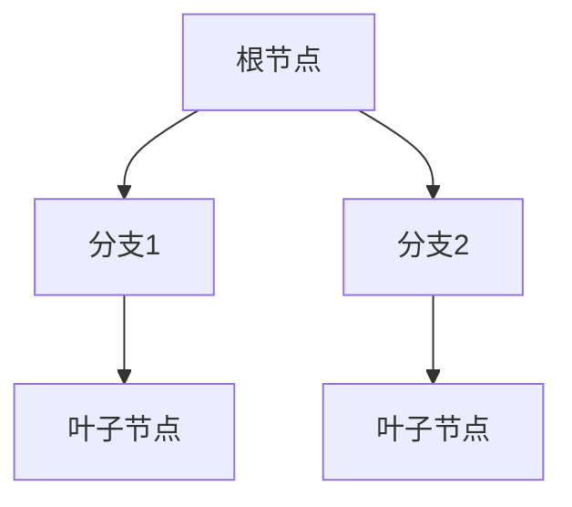
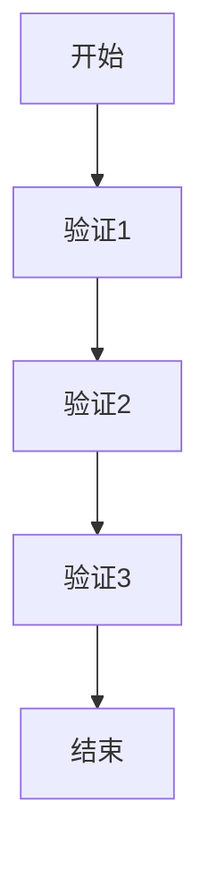
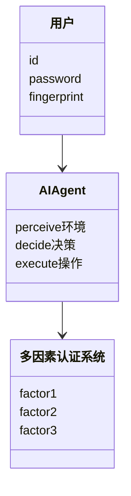
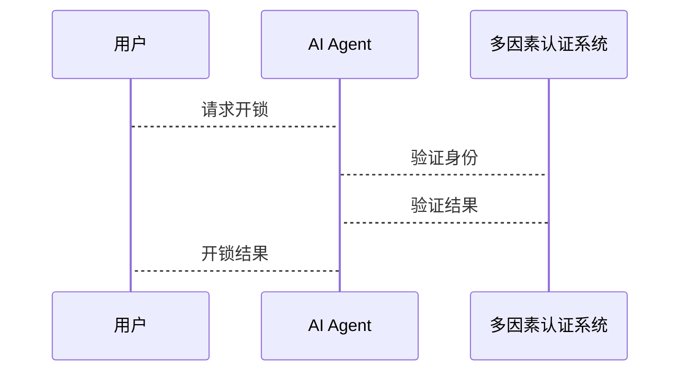
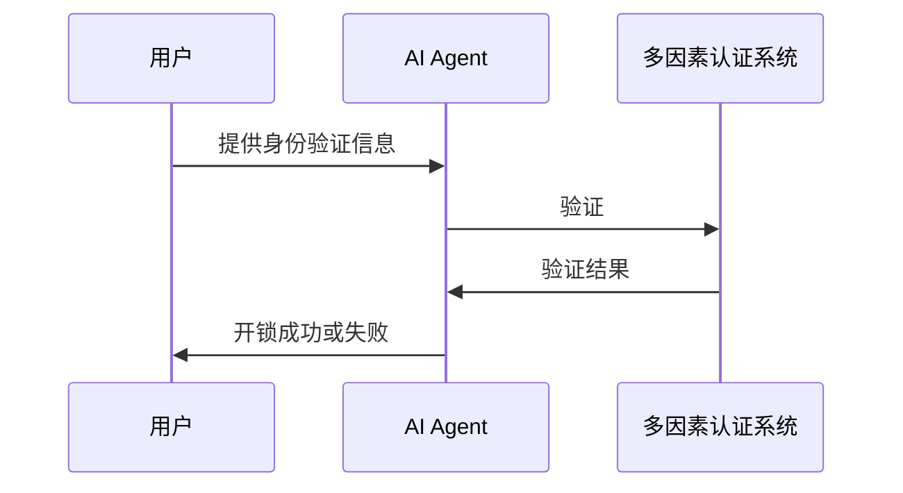

                 


# 智能门锁：AI Agent的多因素认证系统

## 关键词：智能门锁，AI Agent，多因素认证，人工智能，安全系统

## 摘要：智能门锁作为智能家居的重要组成部分，近年来随着人工智能技术的发展，逐渐引入AI Agent和多因素认证技术，以提高门锁的安全性和智能化水平。本文将从背景介绍、核心概念、算法原理、系统架构、项目实战等多方面详细探讨智能门锁中AI Agent与多因素认证系统的结合与应用，通过实际案例分析和代码实现，帮助读者全面理解这一前沿技术。

---

# 第一部分: 背景介绍

## 第1章: 智能门锁的发展历程

### 1.1 智能门锁的定义与分类

#### 1.1.1 传统门锁的局限性
传统门锁主要依赖机械结构实现开锁功能，存在以下问题：
- **安全性低**：钥匙容易被复制，且一旦丢失，需要更换锁具。
- **管理不便**：多人使用时，每次授权都需要手动分发钥匙，管理复杂。
- **智能化不足**：无法与其他智能家居设备联动，也无法记录开锁记录。

#### 1.1.2 智能门锁的定义
智能门锁是一种结合了机械结构与电子技术的门禁设备，通过电子元件实现开锁功能的智能化管理。

#### 1.1.3 智能门锁的主要分类
- **指纹锁**：通过指纹识别技术实现开锁。
- **密码锁**：通过输入密码实现开锁。
- **刷卡锁**：通过读取射频卡信息实现开锁。
- **智能蓝牙锁**：通过蓝牙连接实现开锁。

### 1.2 AI Agent的基本概念

#### 1.2.1 人工智能代理的定义
AI Agent（人工智能代理）是指能够感知环境、自主决策并执行任务的智能实体。

#### 1.2.2 AI Agent的核心功能
- **感知环境**：通过传感器或其他输入设备获取环境信息。
- **自主决策**：基于获取的信息，通过算法进行决策。
- **执行任务**：根据决策结果执行相应的操作。

#### 1.2.3 AI Agent与传统门锁系统的区别
- AI Agent具有自主决策能力，能够根据环境信息动态调整行为。
- 传统门锁系统仅能执行预设的操作，无法自主决策。

### 1.3 多因素认证系统的发展

#### 1.3.1 多因素认证的定义
多因素认证是指通过多种不同的验证方式来确认用户身份的过程。

#### 1.3.2 多因素认证的主要技术
- **知识因素**：如密码、个人识别号（PIN）。
- **所有物因素**：如智能卡、钥匙。
- **生物因素**：如指纹、虹膜、面部识别。

#### 1.3.3 多因素认证在智能门锁中的应用
智能门锁可以通过结合多种认证方式（如指纹+密码）来提高安全性。

### 1.4 本章小结
本章介绍了智能门锁的发展历程、AI Agent的基本概念以及多因素认证系统的核心原理，为后续内容奠定了基础。

---

# 第二部分: 核心概念与联系

## 第2章: AI Agent与多因素认证系统的核心原理

### 2.1 AI Agent的核心原理

#### 2.1.1 AI Agent的基本工作流程
1. **感知环境**：AI Agent通过传感器或其他输入设备获取环境信息。
2. **信息处理**：AI Agent对获取的信息进行分析和处理。
3. **决策制定**：基于处理后的信息，AI Agent通过算法制定决策。
4. **执行操作**：AI Agent根据决策结果执行相应的操作。

#### 2.1.2 AI Agent的感知与决策机制
- **感知机制**：通过传感器、摄像头等设备获取环境信息。
- **决策机制**：基于获取的信息，通过算法（如决策树、神经网络）进行决策。

#### 2.1.3 AI Agent的学习与优化算法
- **监督学习**：通过标记数据进行训练，优化决策模型。
- **无监督学习**：通过聚类等技术发现数据中的潜在模式。

### 2.2 多因素认证系统的核心原理

#### 2.2.1 多因素认证的三要素
1. **知识因素**：用户知道的信息，如密码。
2. **所有物因素**：用户拥有的物品，如智能卡。
3. **生物因素**：用户的生理特征，如指纹。

#### 2.2.2 多因素认证的实现流程
1. **用户发起请求**：用户尝试通过门锁。
2. **多因素验证**：系统对用户的多种身份验证方式逐一验证。
3. **权限判断**：系统根据验证结果判断用户权限。
4. **执行操作**：验证通过后，门锁打开。

#### 2.2.3 多因素认证的安全性分析
- **安全性高**：多因素认证通过结合多种验证方式，大幅提高了安全性。
- **抗攻击性**：即使单一验证方式被攻破，其他验证方式仍能提供保护。

### 2.3 AI Agent与多因素认证系统的联系

#### 2.3.1 AI Agent在多因素认证中的作用
- **自主决策**：AI Agent可以根据环境信息动态调整验证方式。
- **智能联动**：AI Agent可以联动其他智能家居设备，提升整体安全性。

#### 2.3.2 多因素认证对AI Agent的增强
- **安全性提升**：多因素认证提高了AI Agent的验证强度。
- **用户体验优化**：多因素认证可以通过结合用户的习惯数据，优化验证流程。

#### 2.3.3 两者的结合优势
- **智能化**：AI Agent可以动态调整验证策略，提升智能化水平。
- **安全性**：多因素认证结合AI Agent的智能决策，大幅提高了安全性。

### 2.4 核心概念对比表

| 比较维度 | AI Agent | 多因素认证系统 |
|----------|----------|----------------|
| 核心功能 | 智能决策与执行 | 多重身份验证 |
| 优势     | 高效性与自主性 | 高安全性 |
| 适用场景 | 智能家居、安防 | 身份验证、金融支付 |

### 2.5 ER实体关系图

```mermaid
erd
    entity AI Agent {
        id
        decision-making
        learning capability
    }
    entity 多因素认证系统 {
        factor1
        factor2
        factor3
    }
    relationship 验证 {
        AI Agent -> 多因素认证系统
    }
```

---

## 2.5 ER实体关系图

通过上述分析，我们可以看到AI Agent与多因素认证系统在智能门锁中的结合，不仅提高了安全性，还提升了智能化水平。

---

# 第三部分: 算法原理

## 第3章: AI Agent的算法实现

### 3.1 AI Agent的算法原理

#### 3.1.1 决策树算法



#### 3.1.2 神经网络算法

```python
import numpy as np

# 定义神经网络模型
class NeuralNetwork:
    def __init__(self, input_size, hidden_size, output_size):
        self.W1 = np.random.randn(input_size, hidden_size)
        self.W2 = np.random.randn(hidden_size, output_size)
    
    def forward(self, X):
        self.z2 = np.dot(X, self.W1)
        self.a2 = self.sigmoid(self.z2)
        self.z3 = np.dot(self.a2, self.W2)
        self.a3 = self.softmax(self.z3)
        return self.a3
    
    def sigmoid(self, x):
        return 1 / (1 + np.exp(-x))
    
    def softmax(self, x):
        exp_x = np.exp(x - np.max(x))
        return exp_x / exp_x.sum(axis=0)
```

### 3.2 多因素认证系统的算法实现

#### 3.2.1 多因素认证的算法流程



#### 3.2.2 基于概率的多因素认证算法

```python
def calculate_probability(factor1, factor2, factor3):
    p1 = 0.9  # 单一因素验证成功的概率
    p_all = p1 * p2 * p3  # 多因素验证成功的概率
    return p_all
```

### 3.3 算法原理小结

通过对AI Agent和多因素认证系统算法的分析，我们可以看到，AI Agent通过智能决策算法实现自主验证，而多因素认证系统通过结合多种验证方式提高了安全性。

---

# 第四部分: 系统分析与架构设计

## 第4章: 智能门锁AI Agent多因素认证系统分析

### 4.1 问题场景介绍

#### 4.1.1 智能门锁的应用场景
智能门锁通常应用于家庭、办公室、酒店等多种场景。

#### 4.1.2 系统需求分析
- **安全性**：多因素认证必须确保高安全性。
- **智能化**：AI Agent需要能够自主决策和优化。

### 4.2 系统功能设计

#### 4.2.1 领域模型设计



#### 4.2.2 系统架构设计


### 4.3 系统接口设计

#### 4.3.1 系统接口设计



#### 4.3.2 接口交互流程图



---

# 第五部分: 项目实战

## 第5章: 智能门锁AI Agent多因素认证系统实现

### 5.1 环境安装

#### 5.1.1 安装Python
```bash
# 安装Python
sudo apt-get install python3
```

#### 5.1.2 安装依赖库
```bash
pip install numpy scikit-learn
```

### 5.2 系统核心实现

#### 5.2.1 AI Agent实现

```python
class AI_Agent:
    def __init__(self):
        self.sensors = []
        self.decision_model = self.initialize_model()
    
    def initialize_model(self):
        # 初始化决策模型
        return "决策树模型"
    
    def perceive(self, environment):
        # 感知环境
        return self.sensors
    
    def decide(self, environment):
        # 决策
        return self.decision_model.predict(environment)
```

#### 5.2.2 多因素认证系统实现

```python
class Multi_Factor_Authentication:
    def __init__(self):
        self.factors = []
    
    def verify(self, factor_list):
        # 验证多种因素
        return all(factor in self.factors for factor in factor_list)
```

### 5.3 代码实现与解读

#### 5.3.1 代码实现
```python
# 安装依赖
import numpy as np
from sklearn.tree import DecisionTreeClassifier

# 定义AI Agent
class AI_Agent:
    def __init__(self):
        self.model = DecisionTreeClassifier()
    
    def train(self, X, y):
        self.model.fit(X, y)
    
    def predict(self, X):
        return self.model.predict(X)

# 定义多因素认证系统
class Multi_Factor_Authentication:
    def __init__(self):
        self.auth_factors = []
    
    def add_factor(self, factor):
        self.auth_factors.append(factor)
    
    def verify(self, factors):
        return all(factor in self.auth_factors for factor in factors)
```

#### 5.3.2 代码功能解读
- **AI Agent实现**：通过决策树模型实现智能决策。
- **多因素认证系统实现**：通过多种验证方式实现高安全性认证。

### 5.4 实际案例分析

#### 5.4.1 实际案例分析
- **案例1**：用户输入指纹和密码，系统验证成功，门锁打开。
- **案例2**：用户仅输入指纹，系统验证失败，门锁保持关闭。

#### 5.4.2 代码实现与实际案例结合
```python
# 初始化AI Agent和多因素认证系统
agent = AI_Agent()
auth = Multi_Factor_Authentication()

# 训练AI Agent模型
X = [[1, 2], [3, 4]]  # 特征数据
y = [0, 1]            # 标签
agent.train(X, y)

# 添加多因素认证方式
auth.add_factor("指纹")
auth.add_factor("密码")

# 用户输入
user_input = ["指纹", "密码"]
auth_result = auth.verify(user_input)

# AI Agent决策
agent_result = agent.predict([user_input])
```

### 5.5 项目小结

---

# 第六部分: 最佳实践

## 第6章: 最佳实践与注意事项

### 6.1 小结
本章通过实际案例分析和代码实现，展示了智能门锁中AI Agent与多因素认证系统的结合与应用。

### 6.2 注意事项
- **安全性**：多因素认证系统需要确保高安全性，防止攻击。
- **用户体验**：AI Agent需要优化用户体验，避免过多验证步骤。
- **维护性**：系统需要定期更新和维护，确保其安全性和稳定性。

### 6.3 拓展阅读
- **AI Agent**：进一步学习AI Agent的相关知识，如强化学习、自适应算法。
- **多因素认证**：深入研究多因素认证的最新技术，如无密码认证、行为认证。

---

# 作者：AI天才研究院/AI Genius Institute & 禅与计算机程序设计艺术 /Zen And The Art of Computer Programming

---

通过上述分析，我们可以看到智能门锁中AI Agent与多因素认证系统的结合，不仅提高了安全性，还提升了智能化水平。

