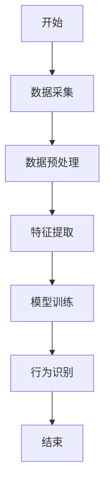
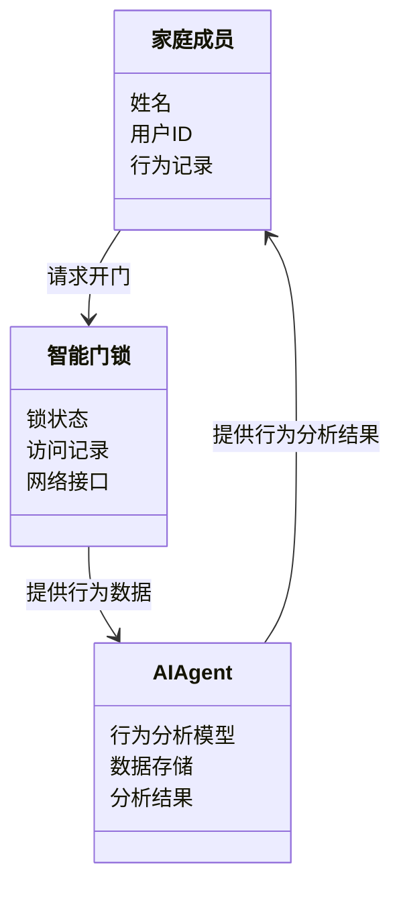
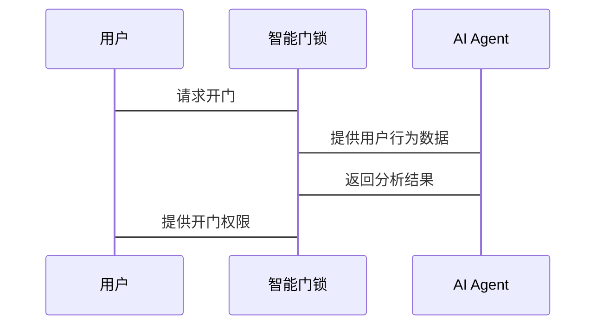

                 


# {{智能门锁：AI Agent的家庭成员行为模式分析}}

> 关键词：智能门锁，AI Agent，家庭成员行为模式，数据采集，行为分析，算法原理，系统架构

> 摘要：随着智能家居技术的快速发展，智能门锁作为家庭安全的重要组成部分，逐渐融入了人工智能技术。本文通过分析AI Agent在智能门锁中的应用，探讨如何通过行为模式分析提升家庭安全性和便利性。文章详细阐述了智能门锁与AI Agent的核心概念、算法原理、系统架构设计，以及实际项目中的应用案例，为智能门锁的未来发展提供了理论支持和实践指导。

---

# {{目录大纲}}

---

# 第一部分: 智能门锁与AI Agent概述

# 第1章: 智能门锁与AI Agent的背景与概念

## 1.1 智能门锁的发展历程
### 1.1.1 传统门锁的局限性
### 1.1.2 智能门锁的定义与特点
### 1.1.3 AI Agent在智能门锁中的应用

## 1.2 家庭成员行为模式分析的必要性
### 1.2.1 家庭成员行为模式的定义
### 1.2.2 行为模式分析的背景与意义
### 1.2.3 智能门锁如何支持行为模式分析

## 1.3 本章小结
### 1.3.1 智能门锁的核心功能
### 1.3.2 AI Agent在行为模式分析中的作用
### 1.3.3 本书的研究目标与内容

# 第2章: 智能门锁与AI Agent的核心概念

## 2.1 智能门锁的系统组成
### 2.1.1 门锁硬件组件
### 2.1.2 门锁软件系统
### 2.1.3 网络通信模块

## 2.2 AI Agent的基本原理
### 2.2.1 AI Agent的定义与特点
### 2.2.2 AI Agent的核心算法
### 2.2.3 AI Agent与智能门锁的结合

## 2.3 家庭成员行为模式的分析框架
### 2.3.1 行为数据的采集与处理
### 2.3.2 行为模式的识别与分类
### 2.3.3 行为模式的反馈与优化

## 2.4 核心概念对比表格
### 表2-1: 智能门锁与传统门锁对比
### 表2-2: AI Agent与传统算法对比

## 2.5 ER实体关系图
```mermaid
er
    actor: 家庭成员
    smart_lock: 智能门锁
    ai_agent: AI Agent
    action: 行为数据
    relation: 行为分析关系
    actor -[通过门锁进行操作] -> smart_lock
    smart_lock -[采集数据] -> ai_agent
    ai_agent -[分析行为] -> action
    action -[建立关系] -> relation
```

# 第3章: 智能门锁与AI Agent的算法原理

## 3.1 数据采集与预处理
### 3.1.1 数据采集方式
### 3.1.2 数据预处理步骤
### 3.1.3 数据特征提取

## 3.2 行为模式识别算法
### 3.2.1 基于机器学习的分类算法
### 3.2.2 基于深度学习的模型
### 3.2.3 算法流程图


## 3.3 算法数学模型
### 3.3.1 机器学习分类模型
$$ P(y|x) = \frac{P(x|y)P(y)}{P(x)} $$
### 3.3.2 深度学习模型
$$ y = \sigma(wx + b) $$

## 3.4 算法实现代码示例
```python
import numpy as np
from sklearn.linear_model import LogisticRegression

# 数据集准备
X = np.array([[1, 2], [3, 4], [5, 6], [7, 8]])
y = np.array([0, 1, 0, 1])

# 模型训练
model = LogisticRegression()
model.fit(X, y)

# 预测
print(model.predict([[2, 3]]))  # 输出：[0]
```

## 3.5 算法对比分析
### 3.5.1 机器学习与深度学习的优缺点对比
### 3.5.2 不同算法的性能对比
### 3.5.3 实际场景中的适用性分析

# 第4章: 智能门锁与AI Agent的系统分析与架构设计

## 4.1 问题场景介绍
### 4.1.1 家庭成员行为分析的典型场景
### 4.1.2 智能门锁在家庭安全中的应用
### 4.1.3 系统需求分析

## 4.2 系统功能设计
### 4.2.1 领域模型设计


## 4.3 系统架构设计
### 4.3.1 分层架构设计


## 4.4 系统接口设计
### 4.4.1 API接口定义
### 4.4.2 接口调用流程
### 4.4.3 接口安全性设计

## 4.5 系统交互设计
### 4.5.1 典型交互流程
### 4.5.2 交互时序图


# 第5章: 项目实战——基于Python的智能门锁系统实现

## 5.1 环境安装与配置
### 5.1.1 Python环境安装
### 5.1.2 相关库的安装（如numpy, scikit-learn）
### 5.1.3 开发工具配置

## 5.2 系统核心实现
### 5.2.1 门锁数据采集模块
### 5.2.2 AI Agent行为分析模块
### 5.2.3 系统交互模块

## 5.3 代码实现与解读
### 5.3.1 数据采集代码
```python
import serial

# 串口通信配置
ser = serial.Serial('COM3', 9600)
data = ser.read(10)
print(data)
```

### 5.3.2 行为分析代码
```python
from sklearn.tree import DecisionTreeClassifier

# 训练数据
X = [[1, 2], [3, 4], [5, 6], [7, 8]]
y = [0, 1, 0, 1]

# 模型训练
model = DecisionTreeClassifier()
model.fit(X, y)

# 预测
print(model.predict([[2, 3]]))  # 输出：[1]
```

### 5.3.3 系统交互代码
```python
# 定义API接口
from flask import Flask, request

app = Flask(__name__)

@app.route('/api/lock', methods=['POST'])
def unlock():
    data = request.json
    # 调用AI Agent进行分析
    return '门锁状态已更新'

if __name__ == '__main__':
    app.run()
```

## 5.4 案例分析与优化
### 5.4.1 案例分析
### 5.4.2 系统优化建议
### 5.4.3 可能的问题与解决方案

# 第6章: 总结与展望

## 6.1 全文总结
### 6.1.1 核心内容回顾
### 6.1.2 创新点总结
### 6.1.3 实践意义

## 6.2 未来展望
### 6.2.1 技术发展趋势
### 6.2.2 应用领域的扩展
### 6.2.3 挑战与机遇

## 6.3 最佳实践Tips
### 6.3.1 系统设计中的注意事项
### 6.3.2 开发中的常见问题与解决方案
### 6.3.3 未来研究方向建议

---

# 作者：AI天才研究院 & 禅与计算机程序设计艺术

