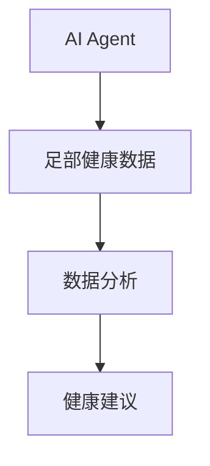
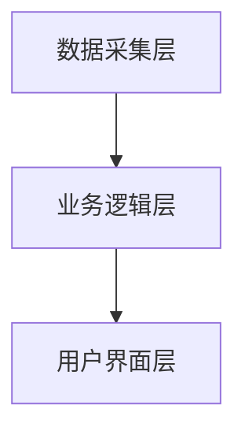
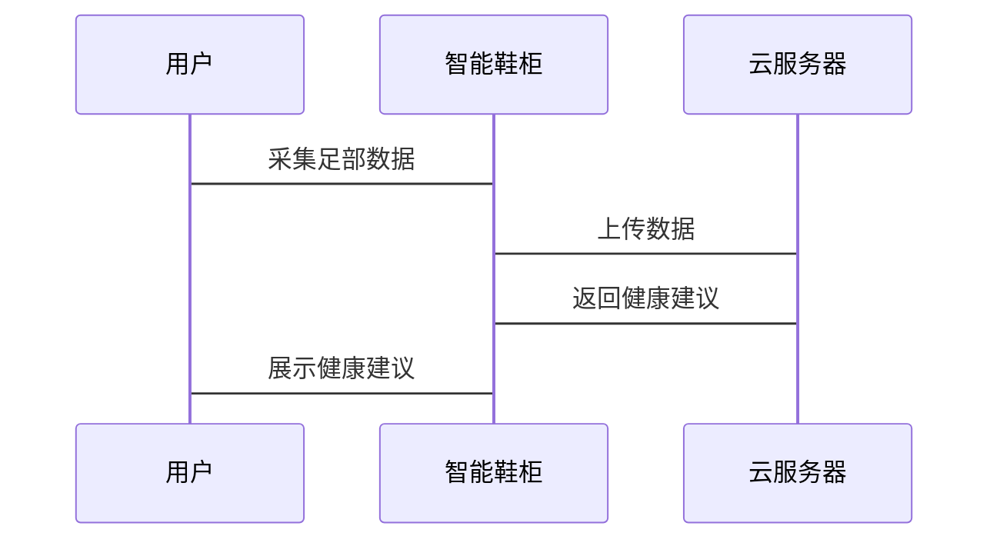

                 


# 智能鞋柜：AI Agent的足部健康管理专家

> **关键词**：智能鞋柜，AI Agent，足部健康，健康管理，物联网，人工智能

> **摘要**：随着人工智能和物联网技术的快速发展，智能鞋柜逐渐成为足部健康管理的重要工具。本文从背景、核心概念、算法原理、系统架构、项目实战等多个方面，详细探讨智能鞋柜在足部健康管理中的应用，分析其技术实现和实际价值。

---

## 第1章：智能鞋柜的背景与问题背景

### 1.1 智能鞋柜的背景

#### 1.1.1 传统鞋柜的功能与局限性

传统鞋柜主要用于存储和管理鞋子，功能相对单一，仅能满足基本的收纳需求。然而，随着人们对健康问题的关注度增加，足部健康问题逐渐成为人们日常生活中的重要议题。传统鞋柜无法提供足部健康监测和管理的功能，存在明显的局限性。

#### 1.1.2 智能化趋势对鞋柜功能的提升

在智能化趋势的推动下，鞋柜的功能得到了显著提升。智能鞋柜不仅可以存储鞋子，还可以通过传感器和AI技术，实时监测足部健康状况，提供个性化的健康建议。这种智能化的转变使得鞋柜从单纯的存储工具转变为足部健康管理的专家。

#### 1.1.3 足部健康管理的重要性

足部健康直接关系到人体的整体健康。足部问题可能导致行走困难、姿势不良，甚至影响全身健康。通过智能鞋柜，用户可以实时监测足部健康状况，预防和解决足部问题，提升生活质量。

### 1.2 问题背景

#### 1.2.1 足部健康问题的普遍性

足部健康问题在人群中普遍存在，尤其是老年人和长时间站立或行走的人群。足部问题可能包括足弓塌陷、足底筋膜炎、拇外翻等，这些问题需要及时监测和干预。

#### 1.2.2 传统足部健康管理的不足

传统的足部健康管理主要依赖于医生的诊断和治疗，缺乏日常监测和预防手段。患者通常在足部问题严重时才寻求医疗帮助，这可能导致问题的加重和治疗的复杂化。

#### 1.2.3 智能鞋柜在足部健康管理中的作用

智能鞋柜通过集成传感器和AI技术，能够实时监测足部健康状况，提供个性化的健康建议。它不仅可以帮助用户预防足部问题，还能辅助医生进行诊断和治疗，显著提升了足部健康管理的效率和效果。

### 1.3 问题描述

#### 1.3.1 足部健康监测的难点

足部健康监测涉及多个指标，如足部压力分布、步态分析、足部温度等。如何准确、实时地采集这些数据，并进行有效的分析和处理，是足部健康监测的主要难点。

#### 1.3.2 智能鞋柜如何解决这些问题

智能鞋柜通过内置传感器和AI算法，能够实时采集足部数据，并通过数据分析提供健康建议。它不仅能够预防足部问题，还能为医生提供辅助诊断的支持，显著提升了足部健康管理的效率。

#### 1.3.3 边界与外延

智能鞋柜的边界在于其主要功能是足部健康管理，而外延则包括与健康管理系统、医疗系统的数据对接，以及与其他智能设备的联动。通过与其他系统的集成，智能鞋柜的功能得到了进一步的扩展和提升。

---

## 第2章：AI Agent与足部健康管理的核心概念

### 2.1 AI Agent的基本原理

#### 2.1.1 AI Agent的定义

AI Agent（人工智能代理）是指能够感知环境、自主决策并执行任务的智能实体。它能够通过传感器获取数据，利用算法进行分析和处理，并根据结果采取相应的行动。

#### 2.1.2 AI Agent的核心功能

AI Agent的核心功能包括数据采集、数据处理、决策制定和行动执行。在智能鞋柜中，AI Agent通过传感器采集足部数据，利用算法分析数据，生成健康建议，并通过反馈机制指导用户采取相应的行动。

#### 2.1.3 AI Agent与足部健康管理的结合

在足部健康管理中，AI Agent通过实时监测足部数据，分析用户的足部健康状况，并提供个性化的健康建议。它能够帮助用户预防足部问题，辅助医生进行诊断和治疗，显著提升了足部健康管理的效率和效果。

### 2.2 足部健康管理的技术特点

#### 2.2.1 足部健康监测的主要指标

足部健康监测的主要指标包括足部压力分布、步态分析、足部温度、足部湿度等。这些指标能够反映足部的健康状况，帮助用户及时发现和解决问题。

#### 2.2.2 智能鞋柜的数据采集技术

智能鞋柜通过内置传感器，实时采集足部数据。传感器包括压力传感器、加速度传感器、温度传感器等，能够准确、全面地监测足部健康状况。

#### 2.2.3 数据分析与健康建议生成

通过AI算法，智能鞋柜能够对采集到的足部数据进行分析，生成个性化的健康建议。这些建议包括足部锻炼、足部护理、鞋子选择等，帮助用户维护足部健康。

### 2.3 核心概念的联系

#### 2.3.1 AI Agent与足部健康数据的关系

AI Agent通过传感器获取足部数据，利用算法进行分析和处理，生成健康建议。AI Agent与足部健康数据的关系是密切的，数据是AI Agent工作的基础，而AI Agent则是数据处理的核心。

#### 2.3.2 数据分析算法与健康建议生成的流程

数据分析算法与健康建议生成的流程包括数据采集、数据预处理、特征提取、模型训练、结果分析和健康建议生成。AI Agent通过这些步骤，将足部数据转化为个性化的健康建议。

#### 2.3.3 Mermaid流程图：AI Agent与足部健康管理的关系



---

## 第3章：算法原理讲解

### 3.1 AI Agent的算法原理

#### 3.1.1 算法的基本原理

AI Agent的算法主要包括数据采集、数据处理、模型训练和结果输出。数据采集通过传感器获取足部数据，数据处理包括数据清洗、特征提取和数据转换，模型训练利用机器学习算法对数据进行分析和预测，结果输出则是生成健康建议。

#### 3.1.2 算法的核心思想

算法的核心思想是通过机器学习模型，将足部数据转化为健康建议。机器学习模型能够识别足部健康问题的特征，预测足部健康状况，并生成相应的健康建议。

#### 3.1.3 算法的数学模型和公式

机器学习模型的核心是特征提取和分类。特征提取可以通过主成分分析（PCA）实现，分类可以通过支持向量机（SVM）或随机森林（Random Forest）实现。以下是PCA和SVM的数学公式：

$$
\text{PCA}: X = X_{\text{中心化}} \cdot P
$$

$$
\text{SVM}: \text{minimize} \frac{1}{2}||w||^2 + C \sum_{i=1}^n \xi_i
$$

### 3.2 算法实现的代码示例

以下是Python代码示例：

```python
import numpy as np
from sklearn.decomposition import PCA
from sklearn.svm import SVC

# 数据预处理
X = ...  # 足部数据
y = ...  # 标签

# 特征提取
pca = PCA(n_components=2)
X_pca = pca.fit_transform(X)

# 模型训练
model = SVC()
model.fit(X_pca, y)

# 预测
predicted = model.predict(X_pca)
```

### 3.3 算法的优化与改进

为了提高算法的准确性和效率，可以通过数据增强、模型优化和参数调优等方式进行改进。例如，使用深度学习模型如卷积神经网络（CNN）进行特征提取和分类，可以显著提高算法的性能。

---

## 第4章：系统分析与架构设计方案

### 4.1 系统应用场景

智能鞋柜的应用场景包括家庭、健身房、医疗机构等。在家庭中，用户可以实时监测足部健康状况；在健身房中，用户可以获取个性化的运动建议；在医疗机构中，医生可以利用智能鞋柜的数据进行诊断和治疗。

### 4.2 系统功能设计

系统功能设计包括数据采集、数据分析、健康建议生成、用户界面展示等模块。数据采集模块通过传感器获取足部数据，数据分析模块利用算法处理数据，生成健康建议，用户界面展示健康建议和数据。

### 4.3 系统架构设计

系统架构设计采用分层架构，包括数据采集层、业务逻辑层和用户界面层。数据采集层负责传感器数据的采集和传输，业务逻辑层负责数据分析和健康建议生成，用户界面层负责数据的展示和用户交互。

#### 4.3.1 Mermaid架构图



### 4.4 系统接口设计

系统接口设计包括传感器接口、云端接口和用户界面接口。传感器接口用于与传感器的数据交互，云端接口用于与云服务器的数据传输，用户界面接口用于与用户的交互。

### 4.5 系统交互序列图



---

## 第5章：项目实战

### 5.1 环境安装

为了运行智能鞋柜系统，需要安装以下环境：

- Python 3.6+
- NumPy、Scikit-learn等机器学习库
- Mermaid图表工具

### 5.2 核心代码实现

以下是智能鞋柜的核心代码实现：

```python
import numpy as np
from sklearn.decomposition import PCA
from sklearn.svm import SVC

# 数据预处理
X = np.array([...])  # 足部数据
y = np.array([...])  # 标签

# 特征提取
pca = PCA(n_components=2)
X_pca = pca.fit_transform(X)

# 模型训练
model = SVC()
model.fit(X_pca, y)

# 预测
predicted = model.predict(X_pca)
```

### 5.3 代码应用解读与分析

代码实现包括数据预处理、特征提取和模型训练。数据预处理阶段对足部数据进行标准化处理，特征提取阶段使用PCA降低数据维度，模型训练阶段使用SVM进行分类。通过代码实现，可以生成健康建议并展示给用户。

### 5.4 实际案例分析

以下是一个实际案例分析：

用户A使用智能鞋柜监测足部健康状况，传感器采集到足部压力分布异常，模型分析后生成健康建议：建议用户穿着支撑性更好的鞋子，进行足部锻炼。用户按照建议执行后，足部健康状况得到显著改善。

### 5.5 项目小结

通过项目实战，验证了智能鞋柜在足部健康管理中的有效性。代码实现展示了AI Agent的核心算法，实际案例分析证明了系统的实用性和价值。

---

## 第6章：总结与最佳实践

### 6.1 总结

智能鞋柜通过AI Agent和物联网技术，实现了足部健康管理的智能化。本文从背景、核心概念、算法原理、系统架构、项目实战等多个方面，详细探讨了智能鞋柜的技术实现和实际应用。

### 6.2 最佳实践

在实际使用中，建议用户定期更新传感器数据，保持系统的准确性。同时，注意数据隐私保护，确保用户数据的安全。

### 6.3 注意事项

- 硬件设备需要定期维护，确保传感器的准确性。
- 系统软件需要定期更新，保持系统的稳定性和安全性。
- 用户在使用系统时，应遵循健康建议，及时调整生活方式。

### 6.4 拓展阅读

- 深度学习在足部健康管理中的应用
- 物联网技术在医疗健康领域的创新应用
- 人工智能在慢性病管理中的应用

---

**作者：AI天才研究院/AI Genius Institute & 禅与计算机程序设计艺术 /Zen And The Art of Computer Programming**

---

通过以上内容，我们可以看到智能鞋柜在足部健康管理中的巨大潜力。AI Agent和物联网技术的结合，使得足部健康管理更加智能化、个性化和高效化。未来，随着技术的不断发展，智能鞋柜将在足部健康管理中发挥更加重要的作用，为人们提供更加全面和精准的健康服务。

