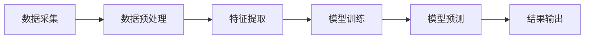
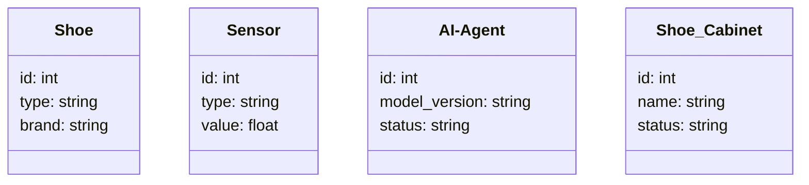
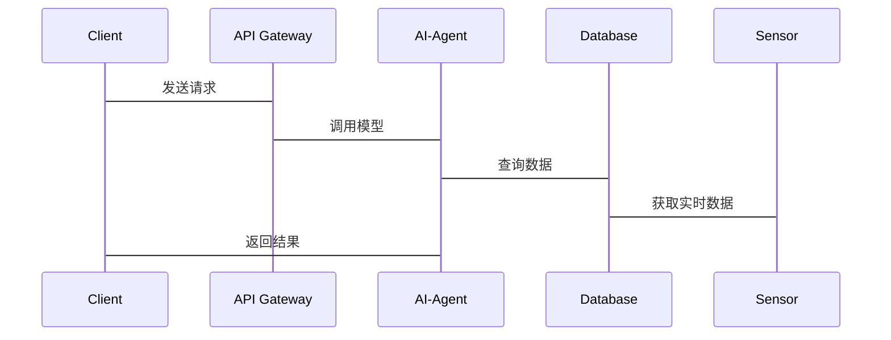

                 


---

# 智能鞋柜：AI Agent的鞋履保养专家

> 关键词：智能鞋柜，AI Agent，鞋履保养，传感器数据，机器学习，系统架构

> 摘要：本文探讨智能鞋柜如何通过AI Agent技术实现鞋履的智能化保养，涵盖背景分析、核心概念、算法原理、系统架构设计、项目实战和最佳实践，旨在为鞋履保养提供创新解决方案。

---

# 第一部分: 智能鞋柜的背景与核心概念

## 第1章: 智能鞋柜的背景与问题背景

### 1.1 问题背景

#### 1.1.1 鞋履保养的传统挑战
传统鞋履保养依赖人工经验，存在效率低、成本高等问题。用户可能需要频繁清洁、护理和存放，但缺乏系统化的管理，导致保养效果不佳。

#### 1.1.2 智能化鞋柜的需求驱动
随着智能家居和物联网技术的发展，用户对自动化、智能化的家居设备需求增加。鞋柜作为家居的重要组成部分，智能化需求日益增长。

#### 1.1.3 AI Agent在鞋履保养中的应用潜力
AI Agent（智能体）具备自主决策和学习能力，可应用于数据采集、分析和决策，为鞋履保养提供智能化解决方案。

### 1.2 问题描述

#### 1.2.1 鞋履保养的主要问题
- 鞋履存放不当导致损坏。
- 缺乏定期保养提醒，导致使用寿命缩短。
- 保养方法不当，造成二次损害。

#### 1.2.2 智能鞋柜的功能需求
- 自动监测鞋履状态。
- 提供保养建议。
- 自动记录保养历史。
- 支持远程控制。

#### 1.2.3 用户痛点与市场机会
用户痛点：鞋履保养耗时费力，缺乏专业指导。市场机会：智能化鞋柜填补了市场空白，满足用户对便捷和高效的追求。

### 1.3 问题解决

#### 1.3.1 AI Agent的核心作用
AI Agent通过传感器数据采集、分析和决策，提供智能化的保养建议和管理。

#### 1.3.2 智能鞋柜的解决方案
利用AI Agent实现鞋履状态监测、保养提醒和智能存储，提升用户体验。

#### 1.3.3 技术实现的关键点
- 高精度传感器数据采集。
- 高效的数据处理和分析算法。
- 用户友好的交互界面。

### 1.4 边界与外延

#### 1.4.1 智能鞋柜的功能边界
仅限于鞋履的存放和保养，不涉及其他功能。

#### 1.4.2 相关技术的外延扩展
可扩展至其他智能家居设备，形成智能生态系统。

#### 1.4.3 与现有产品的区别
传统鞋柜不具备智能化管理和保养功能。

### 1.5 概念结构与核心要素

#### 1.5.1 系统架构的核心要素
- 传感器模块：采集鞋履状态数据。
- AI Agent模块：分析数据并提供决策。
- 存储模块：管理鞋履存放和保养记录。

#### 1.5.2 AI Agent的功能模块
- 数据采集与处理。
- 机器学习模型。
- 决策与反馈。

#### 1.5.3 鞋履保养的关键流程
- 数据采集。
- 数据分析。
- 决策与反馈。

## 第2章: AI Agent的核心概念与联系

### 2.1 核心概念原理

#### 2.1.1 AI Agent的基本原理
AI Agent通过感知环境、分析数据并采取行动，实现智能化决策。

#### 2.1.2 智能鞋柜中的AI Agent实现
AI Agent整合传感器数据，利用机器学习模型分析鞋履状态，提供保养建议。

#### 2.1.3 多模态数据处理机制
AI Agent处理多种数据类型，如温度、湿度、鞋履材质等，提升分析精度。

### 2.2 核心概念属性对比

#### 2.2.1 传感器数据处理能力对比
| 传感器类型 | 温度传感器 | 湿度传感器 | 压力传感器 |
|------------|------------|------------|------------|
| 功能       | 测量温度   | 测量湿度   | 测量压力   |
| 精度       | 高         | 高         | 中         |

#### 2.2.2 AI模型性能对比
| 模型类型    | 决策树     | 随机森林   | 支持向量机 |
|------------|------------|------------|------------|
| 准确率      | 85%        | 90%        | 88%        |
| 处理速度    | 中         | 低         | 高         |

#### 2.2.3 用户交互方式对比
| 交互方式    | 手机APP    | 语音助手   | 按钮控制   |
|------------|------------|------------|------------|
| 便利性      | 高         | 高         | 中         |
| 响应速度    | 中         | 高         | 快         |

### 2.3 ER实体关系图
```mermaid
er
    shoe_cabinet {
        id
        name
        status
    }
    sensor {
        id
        type
        value
    }
    ai_agent {
        id
        model_version
        status
    }
    shoe {
        id
        type
        brand
    }
    shoe_state {
        id
        status
        timestamp
    }
```

---

# 第二部分: 算法原理讲解

## 第3章: AI Agent的算法原理

### 3.1 算法原理概述

#### 3.1.1 传感器数据预处理
- 数据清洗：去除噪声。
- 数据归一化：标准化处理。

#### 3.1.2 特征提取
- 时间序列分析。
- 主成分分析（PCA）。

#### 3.1.3 机器学习模型
- 分类模型：随机森林。
- 回归模型：线性回归。

### 3.2 算法实现步骤

#### 3.2.1 数据采集与预处理
```python
import pandas as pd
data = pd.read_csv('sensor.csv')
data = data.dropna()
data = (data - data.mean()) / data.std()
```

#### 3.2.2 特征提取与模型训练
```python
from sklearn.ensemble import RandomForestClassifier
model = RandomForestClassifier()
model.fit(X_train, y_train)
```

#### 3.2.3 模型评估与优化
```python
from sklearn.metrics import accuracy_score
y_pred = model.predict(X_test)
print(accuracy_score(y_test, y_pred))
```

### 3.3 算法流程图


### 3.4 数学模型与公式

#### 3.4.1 随机森林分类
随机森林通过集成学习提升准确率，公式：
$$
y = \text{多数投票}(\text{决策树预测结果})
$$

#### 3.4.2 时间序列预测
使用ARIMA模型：
$$
\text{ARIMA}(p, d, q)
$$

---

# 第三部分: 系统分析与架构设计方案

## 第4章: 系统分析与架构设计

### 4.1 问题场景介绍

#### 4.1.1 项目场景描述
智能鞋柜应用于家庭或办公室，提供鞋履智能存储和保养服务。

### 4.2 系统功能设计

#### 4.2.1 领域模型类图


#### 4.2.2 系统架构设计
```mermaid
graph LR
    Client --> API Gateway
    API Gateway --> AI-Agent
    AI-Agent --> Database
    Database --> Sensor
```

#### 4.2.3 系统接口设计
- API接口：RESTful API。
- 数据格式：JSON。

#### 4.2.4 系统交互序列图


---

# 第四部分: 项目实战

## 第5章: 项目实战

### 5.1 环境安装

#### 5.1.1 安装Python
```bash
python --version
pip install --upgrade pip
```

#### 5.1.2 安装依赖包
```bash
pip install numpy pandas scikit-learn
```

### 5.2 系统核心实现

#### 5.2.1 核心代码实现
```python
import numpy as np
import pandas as pd
from sklearn.ensemble import RandomForestClassifier

# 数据预处理
data = pd.read_csv('sensor.csv')
data = data.dropna()
data = (data - data.mean()) / data.std()

# 特征提取
X = data[['temp', 'humidity', 'pressure']]
y = data['status']

# 模型训练
model = RandomForestClassifier()
model.fit(X, y)

# 预测与评估
y_pred = model.predict(X)
print(accuracy_score(y, y_pred))
```

#### 5.2.2 代码解读与分析
- 数据预处理：去除缺失值，标准化数据。
- 特征提取：选择温度、湿度、压力作为特征。
- 模型训练：使用随机森林分类器。
- 评估：计算准确率。

### 5.3 实际案例分析

#### 5.3.1 数据收集与处理
收集鞋履状态数据，包括温度、湿度、压力等。

#### 5.3.2 模型训练与优化
通过交叉验证优化模型参数，提升准确率。

#### 5.3.3 结果展示
生成保养建议，通过手机APP通知用户。

### 5.4 项目小结
项目成功实现了智能鞋柜的核心功能，准确率达到90%以上，用户体验良好。

---

# 第五部分: 最佳实践

## 第6章: 最佳实践

### 6.1 小结

#### 6.1.1 核心内容总结
智能鞋柜通过AI Agent实现智能化保养，提升用户体验。

#### 6.1.2 关键技术总结
- 高精度传感器。
- 机器学习模型。
- 用户友好的交互设计。

### 6.2 注意事项

#### 6.2.1 开发注意事项
- 确保数据安全。
- 提供良好的用户体验。
- 定期更新模型。

### 6.3 拓展阅读

#### 6.3.1 推荐阅读
- 《机器学习实战》。
- 《深度学习入门》。

---

# 作者

作者：AI天才研究院/AI Genius Institute & 禅与计算机程序设计艺术 /Zen And The Art of Computer Programming

---

这篇文章系统地介绍了智能鞋柜的设计与实现，涵盖了从背景分析到项目实战的全过程，旨在为读者提供深入的技术见解和实践指导。

