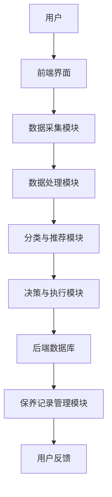
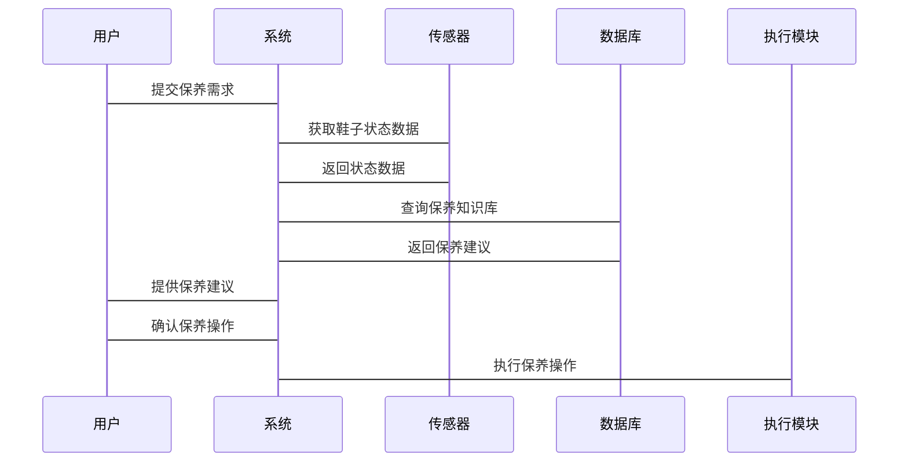

                 


# 智能鞋柜：AI Agent的鞋履保养指导

---

> **关键词**：智能鞋柜，AI Agent，鞋履保养，人工智能，物联网

> **摘要**：  
> 本文探讨了智能鞋柜与AI Agent在鞋履保养中的应用，从背景介绍、核心概念到算法原理、系统架构，再到项目实战与总结，全面解析智能鞋柜如何利用AI技术优化鞋履管理与保养流程。

---

## 第1章: 智能鞋柜与AI Agent的背景介绍

### 1.1 智能鞋柜的发展历程

#### 1.1.1 传统鞋柜的功能与局限性  
传统鞋柜主要以存储功能为主，用户需要手动分类和管理鞋子，缺乏智能化和自动化能力。其局限性包括：  
1. 鞋子分类效率低，难以快速找到所需鞋子。  
2. 无法实时监测鞋子的使用状态，如磨损程度、清洁需求等。  
3. 缺乏数据分析能力，无法提供个性化的保养建议。  

#### 1.1.2 智能化技术对鞋柜的革新  
随着人工智能（AI）和物联网（IoT）技术的发展，智能鞋柜逐渐普及。智能鞋柜通过集成传感器、摄像头和AI算法，实现了鞋子的自动分类、状态监测和保养建议生成。  

#### 1.1.3 AI Agent在智能鞋柜中的应用  
AI Agent（智能体）在智能鞋柜中的应用主要体现在以下几个方面：  
1. **数据采集**：通过传感器和摄像头采集鞋子的状态数据。  
2. **分类与推荐**：基于鞋型、品牌、使用频率等信息，自动分类鞋子并推荐保养方案。  
3. **决策与执行**：根据鞋子的状态和用户需求，自动触发清洁或保养任务。  

### 1.2 鞋履保养的重要性与挑战

#### 1.2.1 鞋履保养的基本需求  
鞋履保养的核心需求包括：  
1. **清洁**：去除灰尘、污渍等。  
2. **护理**：防止皮革老化、鞋底磨损等。  
3. **存储**：避免潮湿、高温等环境对鞋子的损害。  

#### 1.2.2 传统鞋履保养的痛点  
传统鞋履保养存在以下问题：  
1. 用户需要手动记录每双鞋的保养需求，容易遗忘或混淆。  
2. 缺乏专业的保养知识，导致保养效果不佳。  
3. 保养工具和流程复杂，用户体验较差。  

#### 1.2.3 AI Agent如何解决保养难题  
AI Agent通过以下方式优化鞋履保养：  
1. **自动化监测**：实时监测鞋子的使用状态，自动触发保养提醒。  
2. **个性化建议**：基于鞋子的材质和使用频率，提供定制化的保养方案。  
3. **简化操作**：通过语音或移动端APP，用户可以轻松获取保养指导，无需复杂操作。  

### 1.3 本章小结  
本章介绍了智能鞋柜的发展历程及其在鞋履保养中的重要性，重点阐述了AI Agent在智能鞋柜中的应用价值和解决传统保养难题的方式。

---

## 第2章: AI Agent的核心概念与工作原理

### 2.1 AI Agent的基本定义

#### 2.1.1 什么是AI Agent  
AI Agent（智能体）是指能够感知环境并采取行动以实现目标的计算机系统。它通过接收输入数据、分析数据、做出决策并执行操作来完成任务。  

#### 2.1.2 AI Agent的核心特征  
AI Agent的核心特征包括：  
1. **自主性**：能够在没有外部干预的情况下独立运行。  
2. **反应性**：能够实时感知环境变化并做出反应。  
3. **目标导向**：所有操作均以实现特定目标为导向。  

#### 2.1.3 AI Agent与传统软件的区别  
与传统软件相比，AI Agent具有以下优势：  
1. **学习能力**：能够通过数据训练不断优化性能。  
2. **适应性**：能够根据环境变化调整行为。  
3. **决策能力**：能够基于数据做出决策，而非仅执行固定指令。  

### 2.2 AI Agent在智能鞋柜中的角色

#### 2.2.1 数据采集与处理  
AI Agent通过以下方式采集鞋子数据：  
1. **传感器**：监测鞋子的温度、湿度、磨损程度等。  
2. **摄像头**：识别鞋子的品牌、款式和颜色。  
3. **用户输入**：获取鞋子的品牌、材质等信息。  

#### 2.2.2 分类与推荐算法  
AI Agent利用分类算法对鞋子进行分类，并根据分类结果推荐保养方案。例如：  
1. **分类算法**：基于鞋型、品牌、使用频率等信息，将鞋子分为运动鞋、休闲鞋、正装鞋等类别。  
2. **推荐算法**：根据鞋子的材质和使用环境，推荐适合的清洁剂和护理产品。  

#### 2.2.3 保养建议生成  
AI Agent根据鞋子的状态和用户需求，生成个性化的保养建议。例如：  
1. **清洁建议**：何时清洁，使用何种清洁剂。  
2. **护理建议**：何时进行皮革护理或鞋底加固。  
3. **存储建议**：如何存放以延长鞋子寿命。  

### 2.3 AI Agent的工作流程

#### 2.3.1 数据输入  
AI Agent接收来自传感器、摄像头和用户的输入数据，例如：  
- 鞋子的温度、湿度数据。  
- 鞋子的磨损程度。  
- 用户的保养需求。  

#### 2.3.2 数据分析与处理  
AI Agent对输入数据进行分析和处理，例如：  
1. **特征提取**：从鞋子的图像中提取品牌、款式等特征。  
2. **状态评估**：根据传感器数据评估鞋子的清洁度和磨损程度。  

#### 2.3.3 决策与输出  
AI Agent根据分析结果生成决策，并输出相应的操作指令，例如：  
1. **清洁指令**：启动清洁设备。  
2. **提醒通知**：通过APP或语音提醒用户进行保养。  
3. **记录更新**：更新鞋子的保养记录。  

### 2.4 本章小结  
本章详细介绍了AI Agent的基本定义、核心特征及其在智能鞋柜中的具体应用，重点阐述了AI Agent在数据处理、分类推荐和决策输出中的作用。

---

## 第3章: 智能鞋柜的系统架构与功能设计

### 3.1 智能鞋柜的功能模块

#### 3.1.1 鞋履识别与分类  
鞋履识别与分类模块通过摄像头和传感器采集鞋子信息，并利用分类算法对鞋子进行分类。例如：  
- 使用K近邻算法（K-Nearest Neighbor，KNN）对鞋子的品牌和款式进行分类。  
- 使用卷积神经网络（CNN）对鞋子的磨损程度进行分类。  

#### 3.1.2 保养建议生成  
保养建议生成模块根据鞋子的状态和用户需求，生成个性化的保养方案。例如：  
- 根据鞋子的材质推荐适合的清洁剂。  
- 根据鞋子的使用环境推荐适合的存储方式。  

#### 3.1.3 保养记录管理  
保养记录管理模块记录每双鞋的保养历史，例如：  
- 记录每次保养的时间、方式和效果。  
- 提供保养记录的查询和统计功能。  

---

### 3.2 系统架构设计

#### 3.2.1 系统功能设计  
智能鞋柜的系统功能包括：  
1. **数据采集**：通过传感器和摄像头采集鞋子信息。  
2. **数据处理**：对采集到的数据进行分析和处理。  
3. **决策与执行**：根据分析结果生成决策并执行操作。  
4. **用户交互**：通过APP或语音助手与用户进行交互。  

#### 3.2.2 系统架构图  
以下是智能鞋柜的系统架构图：



#### 3.2.3 系统接口设计  
系统接口设计包括：  
1. **前端接口**：用户通过APP或网页与系统交互。  
2. **后端接口**：系统通过API与第三方服务（如天气预报、保养知识库）进行交互。  

#### 3.2.4 系统交互流程  
以下是系统交互流程图：



### 3.3 本章小结  
本章详细介绍了智能鞋柜的系统架构与功能设计，重点展示了系统各个模块之间的关系及其交互流程。

---

## 第4章: 项目实战——智能鞋柜的实现

### 4.1 环境安装

#### 4.1.1 硬件设备  
需要的硬件设备包括：  
1. 摄像头：用于采集鞋子的图像数据。  
2. 传感器：用于监测鞋子的温度、湿度等数据。  
3. 微处理器：用于处理数据和运行AI算法。  
4. 执行模块：如清洁设备、提醒装置等。  

#### 4.1.2 软件环境  
需要的软件环境包括：  
1. **编程语言**：Python  
2. **框架与库**：TensorFlow、OpenCV、Keras等。  
3. **开发工具**：Jupyter Notebook、PyCharm等。  

### 4.2 核心代码实现

#### 4.2.1 数据采集代码  
以下是数据采集的Python代码示例：

```python
import cv2

# 读取摄像头数据
cap = cv2.VideoCapture(0)
while True:
    ret, frame = cap.read()
    if not ret:
        break
    cv2.imshow('Camera', frame)
    if cv2.waitKey(1) & 0xFF == ord('q'):
        break
cap.release()
cv2.destroyAllWindows()
```

#### 4.2.2 分类算法实现  
以下是使用K近邻算法进行鞋子分类的代码示例：

```python
from sklearn.neighbors import KNeighborsClassifier
from sklearn.datasets import load_digits
from sklearn.model_selection import train_test_split

# 加载数据集
digits = load_digits()
X = digits.images.reshape(len(digits.images), -1)
y = digits.target

# 划分训练集和测试集
X_train, X_test, y_train, y_test = train_test_split(X, y, test_size=0.2, random_state=42)

# 训练模型
knn = KNeighborsClassifier(n_neighbors=3)
knn.fit(X_train, y_train)

# 预测
y_pred = knn.predict(X_test)
print("Accuracy:", knn.score(X_test, y_test))
```

#### 4.2.3 保养建议生成  
以下是根据鞋子分类结果生成保养建议的代码示例：

```python
def generate_maintenance_advice(shoe_type):
    advice = {
        'clean': '建议使用中性洗涤剂清洁鞋面',
        'care': '建议定期使用皮革护理油保养鞋面',
        'storage': '建议存放在阴凉干燥处'
    }
    return advice

# 示例调用
shoe_type = '运动鞋'
advice = generate_maintenance_advice(shoe_type)
print(advice)
```

### 4.3 代码解读与分析  
1. **数据采集代码**：通过摄像头采集鞋子的图像数据，并展示在屏幕上。  
2. **分类算法实现**：使用K近邻算法对鞋子进行分类，评估模型的准确性。  
3. **保养建议生成**：根据鞋子的分类结果，生成个性化的保养建议。  

### 4.4 实际案例分析  
以一双运动鞋为例，分析其在智能鞋柜中的保养流程：  
1. **数据采集**：摄像头捕捉鞋子的图像，传感器监测鞋子的温度和湿度。  
2. **分类与推荐**：AI Agent将鞋子分类为“运动鞋”，并推荐使用中性洗涤剂清洁鞋面。  
3. **决策与执行**：系统根据分类结果生成保养建议，并通过APP通知用户。  

### 4.5 本章小结  
本章通过实际案例展示了智能鞋柜的实现过程，从硬件设备的安装到软件代码的实现，详细解读了系统的核心功能。

---

## 第5章: 总结与展望

### 5.1 最佳实践  
1. **定期更新保养知识库**：确保保养建议的准确性和时效性。  
2. **优化AI算法**：通过不断训练模型，提升分类和推荐的准确性。  
3. **提升用户体验**：简化操作流程，提供更直观的用户界面。  

### 5.2 小结  
本文详细介绍了智能鞋柜与AI Agent的背景、核心概念、系统架构及实现过程，重点展示了AI技术在鞋履保养中的应用价值。

### 5.3 注意事项  
1. **数据隐私**：确保用户数据的安全性和隐私性。  
2. **系统稳定性**：保证系统的稳定运行，避免因故障导致数据丢失。  
3. **用户体验**：注重用户体验设计，提升用户满意度。  

### 5.4 拓展阅读  
1. **AI在物联网中的应用**：了解AI技术在其他领域的应用案例。  
2. **鞋履保养技术**：深入学习鞋履保养的专业知识和技术。  
3. **算法优化**：探索更高效的分类和推荐算法。  

---

## 作者：AI天才研究院/AI Genius Institute & 禅与计算机程序设计艺术 /Zen And The Art of Computer Programming

---

通过以上目录大纲，我们可以看到《智能鞋柜：AI Agent的鞋履保养指导》一书内容丰富、结构清晰，涵盖了从理论到实践的各个方面，帮助读者全面理解智能鞋柜与AI Agent的结合及其在鞋履保养中的应用。

