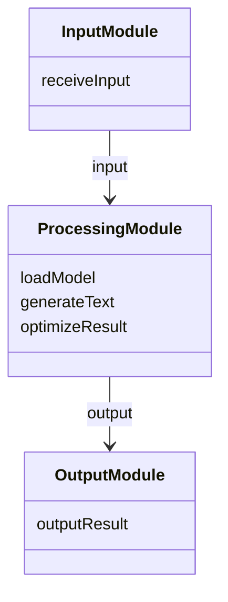

                 

# 智能音乐创作 AI Agent：LLM 在艺术创作中的应用

> 关键词：智能音乐创作、LLM、AI、艺术创作、音乐生成

> 摘要：随着人工智能技术的快速发展，大语言模型（LLM）在艺术创作领域的应用逐渐成为研究热点。本文深入探讨了LLM在音乐创作中的潜力与挑战，从技术原理到系统架构，再到实际应用案例，全面分析了智能音乐创作AI Agent的实现与优化。本文不仅为音乐创作者提供了新的创作工具，也为AI技术在艺术领域的进一步发展提供了理论支持与实践指导。

---

## 第一部分: 智能音乐创作的背景与基础

### 第1章: 智能音乐创作的背景与现状

#### 1.1 问题背景与问题描述

##### 1.1.1 音乐创作的痛点与挑战
音乐创作是一个复杂而富有创造力的过程，但传统创作方式存在以下痛点：
- 创作灵感难以捕捉和记录
- 创作者需要掌握多种音乐理论与技能
- 音乐制作过程耗时且成本高
- 创作工具单一，缺乏智能化辅助

##### 1.1.2 AI技术在音乐创作中的潜力
AI技术，尤其是大语言模型（LLM），为音乐创作带来了新的可能性：
- 提供灵感生成与创意辅助
- 自动完成部分创作任务
- 实现跨领域音乐风格融合
- 提供实时创作反馈与优化建议

##### 1.1.3 LLM在音乐创作中的独特优势
与传统音乐生成工具相比，LLM具有以下独特优势：
- 能够理解上下文，生成连贯的音乐文本
- 支持多语言、多风格的创作
- 可以根据用户需求定制音乐内容
- 具备强大的上下文理解和生成能力

#### 1.2 智能音乐创作的核心概念

##### 1.2.1 智能音乐创作的定义
智能音乐创作是指利用AI技术，特别是大语言模型（LLM），辅助或自动化音乐创作过程，包括旋律生成、和声编配、歌词创作等环节。

##### 1.2.2 LLM在音乐创作中的角色与功能
LLM在音乐创作中的角色可以是：
- 创作助手：提供灵感、生成音乐片段
- 创作工具：自动化完成部分创作任务
- 创作导师：提供创作建议与优化方案

##### 1.2.3 智能音乐创作的边界与外延
智能音乐创作的边界包括：
- 创作内容的原创性与版权问题
- 模型的生成能力与音乐质量
- 用户对AI创作工具的接受度与使用习惯

#### 1.3 音乐创作与AI技术的结合

##### 1.3.1 音乐创作中的AI工具现状
当前，AI在音乐创作中的应用主要集中在以下几个方面：
- 旋律生成
- 和声编配
- 节奏设计
- 歌词创作
- 音乐风格转换

##### 1.3.2 LLM在音乐创作中的应用领域
LLM在音乐创作中的主要应用领域包括：
- 流行音乐创作
- 电影配乐
- 电子音乐制作
- 游戏音乐设计

##### 1.3.3 智能音乐创作的未来趋势
未来的智能音乐创作将呈现以下趋势：
- 多模态创作工具的普及
- 创作过程的全自动化
- 用户定制化创作体验
- 音乐创作的民主化

---

## 第二部分: 智能音乐创作的技术原理与系统架构

### 第2章: LLM的基本原理与技术基础

#### 2.1 大语言模型（LLM）的定义与特点

##### 2.1.1 LLM的定义
大语言模型（LLM）是指基于大规模数据训练的深度学习模型，能够理解和生成多种语言的文本。

##### 2.1.2 LLM的核心技术特点
- 大规模数据训练
- 分布式并行计算
- 微调与迁移学习
- 多任务学习能力

#### 2.2 LLM的训练过程

##### 2.2.1 数据预处理与训练数据
- 数据清洗与格式化
- 数据增强与多样化
- 数据分块与并行处理

##### 2.2.2 模型训练的基本流程
1. 数据准备
2. 模型初始化
3. 前向传播
4. 损失计算
5. 反向传播与参数更新

##### 2.2.3 LLM的训练目标与损失函数
- 训练目标：最小化生成文本的损失
- 损失函数：交叉熵损失

#### 2.3 LLM的生成机制

##### 2.3.1 解码过程与生成策略
- 前向解码
- 注意力机制
- 温度调节与采样策略

##### 2.3.2 概率生成模型的基本原理
- 生成模型的数学基础
- 贝叶斯推断与马尔可夫链

##### 2.3.3 LLM生成音乐文本的数学模型
$$ P(y|x) = \prod_{i=1}^{n} P(y_i|x_{<i}, y_{<i}) $$

---

## 第三部分: 智能音乐创作的系统架构与实现

### 第3章: 系统架构设计

#### 3.1 系统功能模块划分

##### 3.1.1 输入模块
- 用户输入：音乐类型、风格、主题等
- 数据预处理：文本清洗与格式化

##### 3.1.2 处理模块
- 模型加载与初始化
- 文本生成：基于LLM的音乐文本生成
- 结果优化：生成结果的调整与优化

##### 3.1.3 输出模块
- 生成结果输出：音乐文本、 MIDI 文件等
- 用户反馈与模型调优

#### 3.2 系统架构的Mermaid类图

---

## 第四部分: 智能音乐创作的应用与案例

### 第4章: 应用场景与实际案例

#### 4.1 智能音乐创作的实际应用

##### 4.1.1 作曲
- 自动生成旋律与和声
- 音乐结构设计

##### 4.1.2 编曲
- 自动分配乐器与音色
- 调整节奏与节拍

##### 4.1.3 歌词创作
- 歌词生成与优化
- 歌词与音乐风格匹配

#### 4.2 案例分析

##### 4.2.1 案例1：流行音乐创作
- 音乐类型：流行
- 风格特点：情感丰富、节奏明快
- 生成结果：旋律、和声、歌词

##### 4.2.2 案例2：电影配乐
- 音乐类型：交响乐
- 风格特点：戏剧性、情感张力
- 生成结果：主题音乐、场景配乐

---

## 第五部分: 智能音乐创作的挑战与未来

### 第5章: 挑战与未来方向

#### 5.1 当前的主要挑战

##### 5.1.1 技术层面
- 模型的生成能力与音乐质量
- 模型的训练成本与计算资源

##### 5.1.2 应用层面
- 创作工具的易用性
- 用户对AI创作的接受度

#### 5.2 未来发展方向

##### 5.2.1 技术优化
- 更高效的模型训练方法
- 更精准的生成算法
- 多模态创作工具的开发

##### 5.2.2 应用场景拓展
- 教育领域的音乐创作教学
- 音乐产业的智能化转型
- 个性化音乐体验的打造

---

## 第六部分: 总结与展望

### 第6章: 总结与展望

#### 6.1 全文总结
智能音乐创作AI Agent的实现，不仅提升了音乐创作的效率，也为音乐创作带来了新的可能性。通过LLM技术的应用，音乐创作者能够更专注于创作本身，而无需被技术细节所困扰。

#### 6.2 未来展望
随着AI技术的不断发展，智能音乐创作将更加智能化与个性化。未来的音乐创作工具将更加多样化，能够满足不同用户的需求，推动音乐创作进入一个全新的时代。

---

## 作者信息

作者：AI天才研究院/AI Genius Institute & 禅与计算机程序设计艺术 /Zen And The Art of Computer Programming

---

这篇博客文章系统地介绍了智能音乐创作AI Agent的实现与应用，涵盖了从技术原理到实际案例的各个方面，为读者提供了全面的视角和深入的分析。

