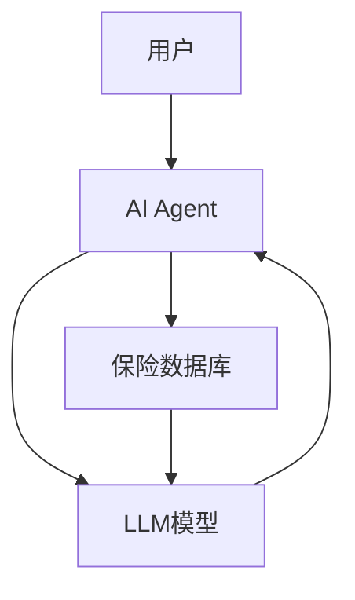
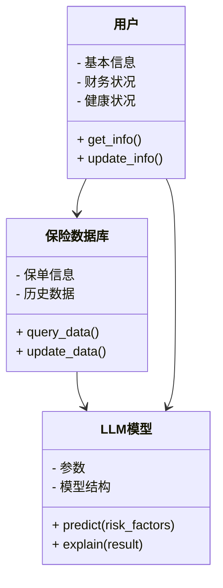
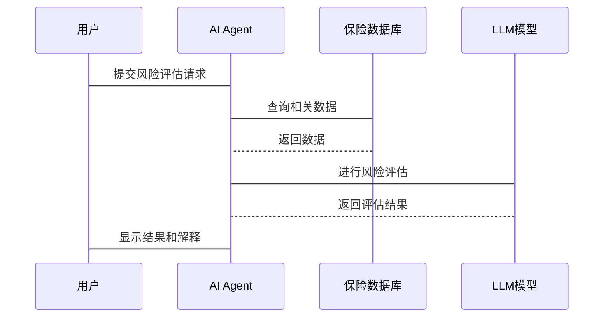

                 


```markdown
# 智能风险评估 AI Agent：LLM 在保险行业中的应用

## 关键词：智能风险评估，AI Agent，LLM，保险行业，风险预测

## 摘要：本文深入探讨了智能风险评估AI Agent在保险行业中的应用，结合大语言模型（LLM）的技术优势，分析了其在风险预测、文本处理和决策支持中的具体应用场景。文章从背景介绍、核心原理、系统架构到项目实战，全面解析了LLM在保险行业的技术实现与实际效果，为保险行业智能化转型提供了实践参考。

---

# 第一部分: 智能风险评估 AI Agent 背景与概述

## 第1章: 智能风险评估与AI Agent 概述

### 1.1 保险行业的现状与挑战
#### 1.1.1 保险行业的核心问题
保险行业作为金融领域的重要组成部分，面临着数据繁杂、风险评估不准确、客户体验差等核心问题。传统风险评估方法依赖人工经验，效率低且准确性不足，难以应对日益复杂的市场需求。

#### 1.1.2 风险评估的传统方法与局限性
传统风险评估主要依赖统计分析和经验判断，存在以下局限性：
- 数据来源单一，难以覆盖非结构化数据。
- 模型复杂度高，难以实时响应。
- 解释性差，用户难以理解评估结果。

#### 1.1.3 AI技术在保险行业的应用潜力
AI技术，尤其是大语言模型（LLM），为保险行业带来了新的可能性。通过自然语言处理和机器学习技术，可以实现对海量数据的智能分析，提升风险评估的准确性和效率。

### 1.2 大语言模型（LLM）的崛起
#### 1.2.1 LLM的基本概念与技术原理
大语言模型（LLM）是一种基于深度学习的自然语言处理模型，通过大量数据的预训练，掌握了丰富的语言规律和知识。其技术原理包括预训练和微调两个阶段。

#### 1.2.2 LLM在自然语言处理中的优势
LLM在自然语言处理中具有以下优势：
- 强大的文本生成能力。
- 准确的信息抽取能力。
- 良好的上下文理解能力。

#### 1.2.3 LLM在保险行业的应用前景
在保险行业中，LLM可以应用于风险预测、客户咨询、合同分析等多个领域，显著提升业务效率和客户体验。

### 1.3 智能风险评估AI Agent的定义与特点
#### 1.3.1 AI Agent的基本概念
AI Agent是一种智能代理系统，能够感知环境、理解需求并执行任务。在保险行业中，AI Agent主要用于风险评估和决策支持。

#### 1.3.2 智能风险评估AI Agent的核心功能
智能风险评估AI Agent的核心功能包括：
- 数据采集与处理
- 风险预测与评估
- 结果解释与反馈

#### 1.3.3 LLM在AI Agent中的作用
LLM作为AI Agent的核心模块，负责处理文本数据、生成风险评估报告，并提供解释性的反馈。

### 1.4 本章小结
本章介绍了保险行业的现状与挑战，探讨了大语言模型（LLM）的技术优势及其在保险行业中的应用潜力。智能风险评估AI Agent作为保险行业智能化转型的重要工具，将通过LLM的强大能力，推动行业迈向更高的效率和准确性。

---

# 第二部分: 智能风险评估AI Agent的核心概念与联系

## 第2章: 智能风险评估AI Agent的核心原理

### 2.1 智能风险评估AI Agent的原理
#### 2.1.1 数据输入与处理
AI Agent通过采集结构化和非结构化的数据，如保单信息、客户对话记录等，进行清洗和预处理。

#### 2.1.2 模型推理过程
模型基于预训练和微调的LLM，对数据进行深度分析，生成风险评估结果。

#### 2.1.3 结果输出与反馈
AI Agent将评估结果以可视化形式呈现，并根据用户反馈不断优化模型。

### 2.2 LLM在风险评估中的应用
#### 2.2.1 文本分析与信息提取
LLM通过自然语言处理技术，从客户对话中提取关键信息，如健康状况、财务状况等。

#### 2.2.2 风险预测与评估
基于提取的信息，模型生成风险评分，并预测未来可能发生的风险事件。

#### 2.2.3 自然语言生成与解释
模型通过自然语言生成技术，提供可读的解释，帮助用户理解评估结果。

### 2.3 智能风险评估AI Agent的系统架构
#### 2.3.1 数据层
数据层包括结构化数据（如保单信息）和非结构化数据（如客户对话记录）。

#### 2.3.2 模型层
模型层包括预训练的LLM和微调后的保险领域模型。

#### 2.3.3 应用层
应用层包括用户界面和API接口，供用户与AI Agent交互。

### 2.4 核心概念对比表
| 概念 | 传统风险评估 | 智能风险评估AI Agent |
|------|--------------|----------------------|
| 数据来源 | 结构化数据 | 结构化+非结构化数据 |
| 分析方法 | 统计分析 | 机器学习+自然语言处理 |
| 输出结果 | 风险评分 | 风险评分+解释说明 |

### 2.5 系统实体关系图


### 2.6 本章小结
本章详细讲解了智能风险评估AI Agent的核心原理，分析了LLM在风险评估中的具体应用，并通过对比表和实体关系图展示了传统方法与AI Agent的区别。

---

# 第三部分: 智能风险评估AI Agent的算法原理

## 第3章: 大语言模型的训练与微调

### 3.1 LLM的预训练过程
#### 3.1.1 预训练目标
预训练目标是通过大量通用数据训练模型，使其掌握语言规律和常识知识。

#### 3.1.2 常用预训练模型
常用的预训练模型包括GPT、BERT等。

#### 3.1.3 预训练的数学模型
预训练的数学模型通常采用交叉熵损失函数：
$$ \mathcal{L} = -\sum_{i=1}^{n} \log p(y_i|x_i) $$

优化器通常使用Adam算法：
$$ \theta_{t+1} = \theta_t - \eta \frac{\partial \mathcal{L}}{\partial \theta_t} $$

### 3.2 LLM的微调过程
#### 3.2.1 微调的目标
微调的目标是将预训练模型适应特定领域，如保险行业的风险评估。

#### 3.2.2 微调的数据与方法
微调使用保险领域的标注数据，采用小批量训练和学习率调整策略。

#### 3.2.3 微调的数学模型
微调的数学模型与预训练相同，但数据范围和任务目标有所不同。

### 3.3 模型评估与优化
#### 3.3.1 评估指标
常用的评估指标包括准确率、召回率和F1分数。

#### 3.3.2 模型优化策略
模型优化策略包括增加训练数据、调整超参数和使用早停技术。

### 3.4 本章小结
本章详细讲解了LLM的训练与微调过程，分析了预训练和微调的数学模型，并讨论了模型评估与优化策略。

---

# 第四部分: 智能风险评估AI Agent的系统架构与设计

## 第4章: 保险行业的AI Agent系统

### 4.1 问题场景介绍
保险行业的AI Agent系统主要用于客户风险评估和保险产品推荐。

### 4.2 系统功能设计
系统功能包括数据采集、风险评估、结果解释和用户交互。

### 4.3 系统架构设计
系统架构采用分层设计，包括数据层、模型层和应用层。



### 4.4 系统接口设计
系统接口包括数据接口和用户接口，数据接口用于与保险数据库交互，用户接口用于与用户交互。

### 4.5 系统交互设计
系统交互流程包括用户请求、数据采集、模型推理和结果反馈。



### 4.6 本章小结
本章详细设计了保险行业的AI Agent系统，包括功能设计、架构设计和交互设计，并通过mermaid图展示了系统结构和交互流程。

---

# 第五部分: 项目实战与案例分析

## 第5章: 保险行业AI Agent的实现

### 5.1 环境安装与配置
#### 5.1.1 安装Python
```bash
python --version
pip install --upgrade pip
```

#### 5.1.2 安装依赖库
```bash
pip install numpy pandas transformers
```

### 5.2 系统核心实现源代码
#### 5.2.1 数据预处理
```python
import pandas as pd
import numpy as np

def preprocess_data(data):
    # 数据清洗和特征提取
    pass
```

#### 5.2.2 模型训练
```python
from transformers import AutoTokenizer, AutoModelForCausalLM

model_name = "gpt2"
tokenizer = AutoTokenizer.from_pretrained(model_name)
model = AutoModelForCausalLM.from_pretrained(model_name)
```

#### 5.2.3 模型预测
```python
def predict_risk(risk_factors):
    inputs = tokenizer(risk_factors, return_tensors="np")
    outputs = model.generate(inputs.input_ids, max_length=50)
    return tokenizer.decode(outputs[0], skip_special_tokens=True)
```

### 5.3 代码应用解读与分析
#### 5.3.1 数据预处理
数据预处理包括清洗和特征提取，确保数据质量。

#### 5.3.2 模型训练
使用预训练的LLM进行微调，适应保险行业的特定需求。

#### 5.3.3 模型预测
通过模型生成风险评估结果，并提供解释性的反馈。

### 5.4 案例分析与实际效果
#### 5.4.1 案例分析
分析一个具体案例，展示AI Agent在风险评估中的应用效果。

#### 5.4.2 实际效果
通过实验数据，验证AI Agent在保险行业中的实际效果和优势。

### 5.5 项目总结
总结项目实施过程中的经验教训，提出改进建议。

### 5.6 本章小结
本章通过项目实战，详细讲解了保险行业AI Agent的实现过程，并通过案例分析展示了其实际效果。

---

# 第六部分: 最佳实践与总结

## 第6章: 智能风险评估AI Agent的最佳实践

### 6.1 小结
总结全文内容，强调智能风险评估AI Agent在保险行业中的重要性。

### 6.2 注意事项
在实际应用中，需要注意数据隐私、模型可解释性等问题。

### 6.3 拓展阅读
推荐相关领域的书籍和论文，供读者进一步学习。

### 6.4 本章小结
本章总结了智能风险评估AI Agent的应用经验，并提出了未来的研究方向。

---

# 作者：AI天才研究院/AI Genius Institute & 禅与计算机程序设计艺术 /Zen And The Art of Computer Programming
```

