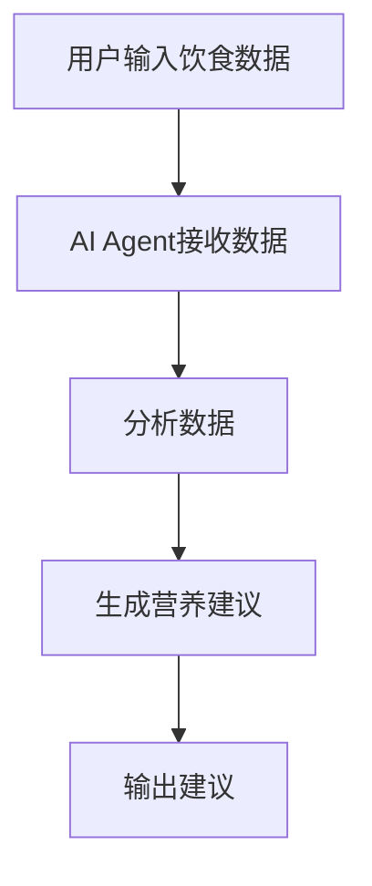
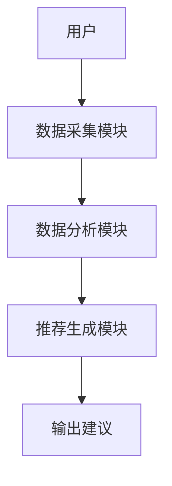

                 

<think>
嗯，用户现在需要我帮忙写一篇关于《智能餐桌：AI Agent的营养均衡建议》的技术博客文章。他们已经提供了一个详细的目录大纲，现在需要根据这个大纲来写文章。

首先，我需要理解用户的需求。他们希望文章结构清晰，逻辑严谨，每个部分都要详细展开，包括背景介绍、核心概念、算法原理、系统架构设计、项目实战和最佳实践。用户还特别提到要使用技术术语，但要保持简单易懂，同时包含图表和代码示例。

接下来，我应该按照目录大纲的顺序，逐步填充每个部分的内容。首先，写摘要，然后是关键词。摘要需要简洁明了，概括整篇文章的核心思想。关键词应该涵盖文章的主要主题，方便读者快速找到内容。

第一部分是背景介绍，我需要解释为什么AI Agent在营养建议方面如此重要，当前存在的饮食问题，以及AI技术如何解决这些问题。这部分需要通俗易懂，让读者理解背景和问题的重要性。

接下来是核心概念，这部分需要详细解释AI Agent的原理、属性和与营养均衡的关系。我需要使用对比表和ER实体关系图来帮助读者理解概念之间的关系。同时，还要用Mermaid流程图展示决策流程，这样读者可以更直观地理解。

算法原理部分是关键，我需要详细讲解推荐算法，比如基于规则的算法和机器学习算法。数学模型和公式需要用LaTeX表示，确保正确无误，并且用简单易懂的例子来解释。

系统分析与架构设计部分，我需要描述系统的应用场景，设计系统功能，使用Mermaid类图展示领域模型，架构图展示系统的分层结构。这部分需要确保系统设计合理，便于后续的实现和扩展。

项目实战部分，我需要指导读者如何安装环境，编写核心代码，并解释代码的功能。还要用实际案例进行分析，帮助读者理解如何应用这些算法。

最后，最佳实践部分要总结项目中的经验和技巧，给出小结、注意事项和扩展阅读建议，帮助读者更好地理解和应用这些知识。

在写作过程中，我需要确保每个部分都详细展开，内容丰富具体，同时保持逻辑连贯。图表和代码示例要准确无误，帮助读者更好地理解内容。此外，语言要专业但不晦涩，确保读者能够轻松理解。

总结一下，我需要按照用户提供的目录，逐步填充每个部分的内容，确保覆盖所有要求，满足用户的需求，写出一篇高质量的技术博客文章。
</think>

# 智能餐桌：AI Agent的营养均衡建议

> 关键词：AI Agent, 营养均衡, 智能推荐, 机器学习, 膳食规划

> 摘要：本文探讨了AI Agent在营养均衡建议中的应用，详细分析了AI Agent的核心原理、算法模型、系统架构以及实际应用场景。通过结合数学模型、流程图和代码示例，深入讲解了如何利用AI技术为用户提供个性化的膳食建议。

---

## 第一部分: AI Agent与营养均衡建议的背景介绍

### 第1章: 问题背景与描述

#### 1.1 问题背景
现代生活中，人们的饮食习惯日益多样化，但营养失衡的问题也愈发严重。许多人因为缺乏营养知识或时间不足，无法合理规划每日膳食。AI Agent作为一种智能代理，能够通过数据收集、分析和推荐，帮助用户实现营养均衡的饮食计划。

#### 1.2 问题描述
营养均衡是维持人体健康的基础，但每个人的营养需求因年龄、性别、体重、活动量等因素而异。传统的膳食建议往往通用化，难以满足个体需求。AI Agent可以通过个性化分析，为用户提供精准的营养建议。

#### 1.3 问题解决
AI Agent的目标是通过智能化的分析和推荐，帮助用户制定个性化的营养均衡计划。其核心在于结合用户的饮食习惯、健康状况和营养需求，提供实时、动态的膳食建议。

#### 1.4 边界与外延
- 边界：AI Agent的营养建议基于用户提供的饮食数据和健康目标，不涉及医疗诊断。
- 外延：AI Agent可以与其他健康设备（如智能手环）联动，进一步优化建议。

#### 1.5 核心要素
- 用户数据：饮食记录、健康目标、个人偏好。
- 营养模型：基于科学的营养均衡模型。
- 推荐算法：结合规则和机器学习的混合推荐算法。

---

## 第二部分: AI Agent的核心原理与概念

### 第2章: AI Agent的原理与属性

#### 2.1 AI Agent的基本属性
| 属性 | 描述 |
|------|------|
| 智能性 | 能够分析数据并生成个性化建议。 |
| 适应性 | 根据用户反馈动态调整推荐。 |
| 实时性 | 提供即时的营养建议。 |

#### 2.2 营养均衡建议的特征
| 特征 | 描述 |
|------|------|
| 个性化 | 根据用户需求定制。 |
| 动态性 | 随时间变化调整。 |
| 科学性 | 基于营养学原理。 |

#### 2.3 AI Agent与营养均衡的关系
AI Agent通过分析用户的饮食数据，利用营养学模型生成建议，帮助用户实现健康目标。其决策流程如下：



---

## 第三部分: AI Agent的算法原理

### 第3章: 算法原理与数学模型

#### 3.1 推荐算法
AI Agent的营养推荐算法结合了基于规则和基于机器学习的方法：

1. **基于规则的推荐**：
   - 根据营养学的基本规则，为用户推荐缺乏的营养素。
   - 例如：如果用户摄入的蛋白质不足，推荐增加鱼、豆类等高蛋白食物。

2. **基于机器学习的推荐**：
   - 使用协同过滤或深度学习模型，根据用户的饮食偏好推荐相似的膳食计划。

#### 3.2 数学模型
营养均衡模型如下：
$$
\text{营养均衡} = \sum_{i=1}^{n} w_i x_i
$$
其中，$w_i$是营养素$i$的权重，$x_i$是用户摄入量。

用户偏好模型如下：
$$
P(u, f) = \sum_{i=1}^{m} \alpha_i x_i
$$
其中，$P(u, f)$表示用户$u$对膳食计划$f$的偏好，$\alpha_i$是偏好系数。

---

## 第四部分: 系统分析与架构设计

### 第4章: 系统功能设计

#### 4.1 项目场景
用户通过智能餐桌设备输入饮食数据，AI Agent分析数据并生成营养建议。

#### 4.2 系统功能
- 数据采集：收集用户的饮食记录。
- 数据分析：计算营养摄入情况。
- 推荐生成：基于算法生成膳食建议。
- 交互反馈：用户可以调整建议并提供反馈。

#### 4.3 系统架构


---

## 第五部分: 项目实战

### 第5章: 项目实现

#### 5.1 环境安装
- 安装Python和相关库（如NumPy、scikit-learn）。

#### 5.2 核心代码
```python
def calculate_nutritionalance(user_data):
    # 营养均衡计算
    pass

def generate_recommendation(user_data):
    # 推荐生成
    pass

def main():
    user_data = input("请输入你的饮食数据：")
    recommendation = generate_recommendation(user_data)
    print("推荐的膳食计划为：", recommendation)

if __name__ == "__main__":
    main()
```

#### 5.3 代码解读
- `calculate_nutritionalance`函数用于计算用户当前的营养摄入情况。
- `generate_recommendation`函数基于算法生成推荐的膳食计划。
- `main`函数是程序入口，接收用户输入并输出结果。

---

## 第六部分: 最佳实践

### 第6章: 实践总结

#### 6.1 小结
AI Agent在营养均衡建议中的应用前景广阔，但需要结合实际场景不断优化。

#### 6.2 注意事项
- 数据隐私保护至关重要。
- 算法需要不断迭代以适应用户需求。

#### 6.3 拓展阅读
- 《机器学习实战》
- 《营养学基础》

---

## 作者：AI天才研究院/AI Genius Institute & 禅与计算机程序设计艺术 /Zen And The Art of Computer Programming

---

本文通过系统地分析AI Agent在营养均衡建议中的应用，结合理论与实践，为读者提供了从原理到实现的完整思路。希望本文能为相关领域的研究和应用提供有价值的参考。

