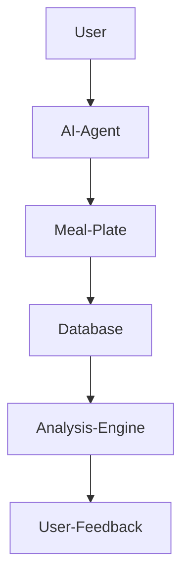
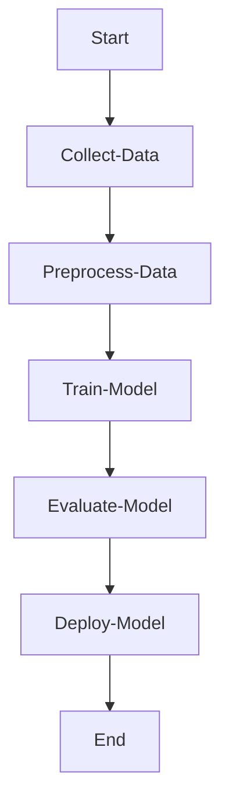
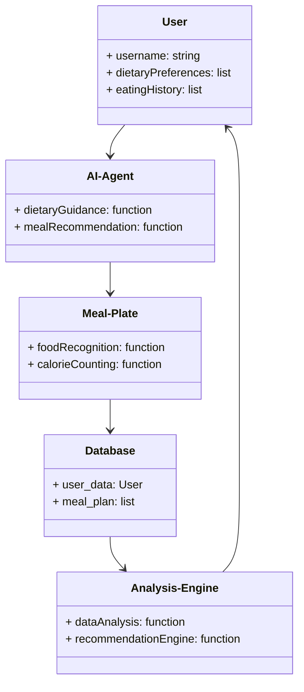
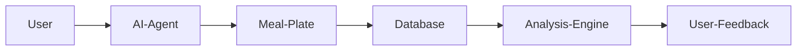

                 

<think>
嗯，我现在需要根据用户的要求，详细设计一本名为《智能餐盘：AI Agent的膳食均衡指导系统》的目录大纲。这本书需要涵盖背景介绍、核心概念、算法原理、系统架构、项目实战等多个方面，结构要清晰，内容要详细。

首先，我得理解这本书的主题是什么。智能餐盘听起来像是一个结合了AI技术的餐盘，可能用于指导用户均衡饮食。所以，这本书应该是介绍如何利用AI代理来实现膳食均衡指导的系统。

接下来，我要考虑用户的需求。用户希望我设计一个详细且逻辑清晰的目录大纲，覆盖主题内容。根据示例，用户希望目录分为多个部分，每个部分下有章节和小节，细化到三级目录。

好的，现在开始组织内容。首先，背景介绍部分，我需要涵盖问题背景、问题描述、解决方案、边界和外延，以及核心概念。这部分可能会包括当前人们对健康饮食的关注，以及如何利用AI来解决膳食不均衡的问题。

然后是核心概念与联系。这里需要详细解释AI代理和膳食均衡指导系统的工作原理，可能包括系统架构和数据流。我可能需要使用Mermaid流程图来展示这些关系，帮助读者更好地理解系统结构。

接下来是算法原理。这部分需要详细讲解AI代理背后的算法，比如机器学习模型，特别是用于分类和推荐的算法。我应该用Mermaid流程图展示算法步骤，并提供Python代码示例，解释每个部分的功能。

数学模型和公式部分，我需要介绍支持向量机或其他分类算法的数学基础，给出公式并解释其应用。这部分需要清晰且详细，帮助读者理解算法背后的数学原理。

系统分析与架构设计是关键。我需要描述问题场景，比如用户使用智能餐盘的情况，然后设计系统的功能模块，如数据采集、分析、推荐等。使用Mermaid类图和架构图来展示系统结构，以及接口和交互流程。

项目实战部分，我需要指导读者如何安装环境，比如Python和相关库，然后提供核心代码实现，解释代码的功能，并通过实际案例分析，展示系统的实际应用。

最后，最佳实践、小结、注意事项和拓展阅读等内容，帮助读者巩固知识，提供进一步的学习方向。

我需要确保目录结构完整，包含至少七章，每章内容详细且逻辑清晰。同时，遵守用户的格式要求，使用markdown的#、##、###结构，并嵌入Mermaid图表和数学公式。

现在，我开始组织这些内容。第一章介绍背景，第二章讲解核心概念，第三章算法，第四章数学模型，第五章系统架构，第六章项目实战，第七章总结和扩展。每个章节下有相应的子章节，细化到三级目录。

在编写过程中，我要确保每个部分都涵盖用户要求的内容，比如背景介绍、核心概念、算法原理、系统架构、项目实战等。同时，使用Mermaid图表和数学公式来增强理解。

最后，检查目录结构是否完整，是否符合用户的要求，确保没有遗漏任何关键部分。这样，用户就能得到一个详细且逻辑清晰的目录大纲，帮助他们撰写这本书。
</think>

# 《智能餐盘：AI Agent的膳食均衡指导系统》

## 关键词：
智能餐盘、AI Agent、膳食均衡、健康饮食、机器学习、数据流分析

## 摘要：
智能餐盘是一种结合了人工智能技术的创新解决方案，旨在通过AI代理帮助用户实现膳食均衡。本文将从背景介绍、核心概念、算法原理、系统架构到项目实战，全面解析智能餐盘的实现逻辑和技术细节。通过详细的技术分析和实际案例，揭示AI代理在膳食指导中的应用潜力和实现方法。

## 目录大纲：

## # 第一部分: 背景介绍

### ## 第1章: 智能餐盘与AI Agent的背景概述

#### ### 1.1 问题背景与现状
- 1.1.1 当前膳食不均衡问题的现状
- 1.1.2 AI技术在健康领域的应用潜力
- 1.1.3 智能餐盘的市场与用户需求

#### ### 1.2 问题描述与目标
- 1.2.1 膳食均衡指导的核心问题
- 1.2.2 智能餐盘的功能目标
- 1.2.3 用户需求与场景分析

#### ### 1.3 解决方案与边界
- 1.3.1 AI Agent在膳食均衡中的作用
- 1.3.2 智能餐盘的技术边界
- 1.3.3 系统的适用范围与限制

#### ### 1.4 核心概念与组成
- 1.4.1 AI Agent的基本概念
- 1.4.2 智能餐盘的系统组成
- 1.4.3 膳食均衡指导的实现逻辑

## # 第二部分: 核心概念与联系

### ## 第2章: AI Agent与膳食均衡指导系统的关系

#### ### 2.1 AI Agent的核心原理
- 2.1.1 AI Agent的基本工作原理
- 2.1.2 机器学习在AI Agent中的应用
- 2.1.3 自然语言处理在膳食指导中的作用

#### ### 2.2 膳食均衡指导系统的架构
- 2.2.1 系统的输入输出关系
- 2.2.2 数据流与信息处理流程
- 2.2.3 系统的模块划分与功能分配

#### ### 2.3 实体关系与数据流图


## # 第三部分: 算法原理

### ## 第3章: AI Agent的算法实现

#### ### 3.1 算法选择与原理
- 3.1.1 机器学习模型的选择
- 3.1.2 支持向量机（SVM）在分类中的应用
- 3.1.3 基于K-近邻算法的膳食推荐

#### ### 3.2 算法实现步骤


#### ### 3.3 算法实现代码
```python
from sklearn import svm
import numpy as np

# 数据预处理
X = np.array([[50, 100],  # 蛋白质和碳水化合物含量
              [80, 80],   # 蛋白质和碳水化合物含量
              [20, 120],  # 蛋白质和碳水化合物含量
              [70, 70]])  # 蛋白质和碳水化合物含量

y = np.array([0, 1, 1, 0])  # 标签：0代表不均衡，1代表均衡

# 训练模型
model = svm.SVC()
model.fit(X, y)

# 预测新数据
new_data = np.array([[50, 80]])
print("预测结果：", model.predict(new_data))
```

## # 第四部分: 数学模型与公式

### ## 第4章: 算法的数学基础

#### ### 4.1 支持向量机（SVM）的数学模型
$$
\text{目标函数：} \min \frac{1}{2} ||\mathbf{w}||^2 + C \sum_{i=1}^{n} \xi_i
$$

#### ### 4.2 膳食均衡的数学表达
$$
\text{均衡条件：} \sum_{i=1}^{n} a_i x_i = b
$$

## # 第五部分: 系统分析与架构设计

### ## 第5章: 系统架构设计

#### ### 5.1 系统功能模块


#### ### 5.2 系统架构图


## # 第六部分: 项目实战

### ## 第6章: 智能餐盘的实现

#### ### 6.1 环境安装与配置
- 安装Python和必要的库（如scikit-learn、numpy）
- 安装TensorFlow或PyTorch（可选）

#### ### 6.2 核心代码实现
```python
import numpy as np
from sklearn.svm import SVC

# 数据预处理
X = np.array([[50, 100],  # 蛋白质和碳水化合物含量
              [80, 80],   # 蛋白质和碳水化合物含量
              [20, 120],  # 蛋白质和碳水化合物含量
              [70, 70]])  # 蛋白质和碳水化合物含量

y = np.array([0, 1, 1, 0])  # 标签：0代表不均衡，1代表均衡

# 训练模型
model = SVC()
model.fit(X, y)

# 预测新数据
new_data = np.array([[50, 80]])
print("预测结果：", model.predict(new_data))
```

#### ### 6.3 实际案例分析与解读
- 用户数据输入
- 系统分析与推荐
- 结果展示与反馈

## # 第七部分: 总结与扩展

### ## 第7章: 总结与最佳实践

#### ### 7.1 小结
- AI Agent在膳食均衡指导中的作用
- 智能餐盘的技术实现要点
- 项目成功的关键因素

#### ### 7.2 注意事项
- 数据隐私与安全
- 算法的可解释性
- 系统的可扩展性

#### ### 7.3 拓展阅读
- 推荐的AI相关书籍和资源
- 相关领域的最新研究进展
- 技术社区和论坛

## 作者：
AI天才研究院/AI Genius Institute  
禅与计算机程序设计艺术/Zen And The Art of Computer Programming

