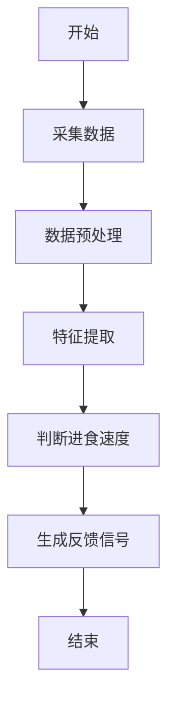

                 


# 智能餐盘：AI Agent的进食速度调节系统

> **关键词**：智能餐盘、AI Agent、进食速度调节、系统设计、算法实现、健康管理

> **摘要**：  
> 本文将详细介绍智能餐盘的设计与实现，通过AI Agent技术来调节进食速度，从而帮助用户实现健康饮食。文章从背景介绍、核心概念、算法原理、系统架构设计到项目实战，全面解析智能餐盘的实现过程。通过本篇文章，读者将深入了解AI Agent在智能餐盘中的应用，掌握系统的整体架构及核心算法，同时能够通过实际案例分析，掌握智能餐盘的开发与优化技巧。

---

# 第1章: 背景介绍与问题背景

## 1.1 智能餐盘的定义与应用场景

### 1.1.1 智能餐盘的定义
智能餐盘是一种结合了人工智能（AI）技术的餐具，能够通过传感器和AI算法实时监测用户的进食速度，并通过反馈机制调节用户的进食节奏。其核心目标是帮助用户养成健康的饮食习惯，避免进食过快导致的健康问题。

### 1.1.2 智能餐盘的核心应用场景
- **健康管理**：帮助用户控制进食速度，避免肥胖、消化不良等问题。
- **饮食习惯矫正**：针对进食过快的用户，通过实时反馈进行行为矫正。
- **特殊人群辅助**：如糖尿病患者、肠胃功能紊乱者等，提供个性化的进食速度建议。

### 1.1.3 智能餐盘的边界与外延
智能餐盘的边界主要集中在进食速度调节功能上，外延则包括与用户饮食习惯相关的数据分析、健康建议等。

## 1.2 AI Agent在智能餐盘中的作用

### 1.2.1 AI Agent的定义与特点
AI Agent（人工智能代理）是指能够感知环境、自主决策并执行任务的智能体。其特点包括：
- **自主性**：能够自主决策。
- **反应性**：能够实时感知并响应环境变化。
- **学习能力**：能够通过数据优化自身行为。

### 1.2.2 AI Agent在智能餐盘中的核心任务
- **数据采集**：通过传感器获取用户的进食速度、姿势等信息。
- **实时分析**：基于数据，判断用户的进食速度是否合理。
- **反馈调节**：通过振动、提示音等方式调整用户的进食节奏。

### 1.2.3 AI Agent与传统进食调节方法的对比

| **对比维度** | **AI Agent** | **传统方法** |
|--------------|--------------|--------------|
| 实时性       | 高            | 低            |
| 精准性       | 高            | 低            |
| 可扩展性     | 高            | 低            |
| 用户体验     | 良好           | 较差          |

## 1.3 智能餐盘的系统框架

### 1.3.1 系统的核心要素组成
- **传感器**：用于采集用户的进食数据。
- **AI算法**：用于分析数据并生成反馈。
- **反馈装置**：用于调节用户的进食节奏。
- **用户界面**：用于显示系统状态和提供反馈提示。

### 1.3.2 系统的功能模块划分
- **数据采集模块**：负责采集用户的进食数据。
- **数据分析模块**：对数据进行分析并判断进食速度。
- **反馈调节模块**：根据分析结果生成反馈信号。
- **用户交互模块**：与用户进行实时互动。

### 1.3.3 系统的输入输出关系
- **输入**：用户的进食速度、姿势、饮食习惯等数据。
- **输出**：实时反馈信号（如振动、提示音）、调整后的进食速度建议。

## 1.4 本章小结
本章主要介绍了智能餐盘的定义、应用场景以及AI Agent在其中的核心作用。通过对比分析，明确了AI Agent相较于传统方法的优势。

---

# 第2章: AI Agent的核心概念与原理

## 2.1 AI Agent的基本原理

### 2.1.1 AI Agent的定义与分类
AI Agent可以分为**反应式代理**和**基于模型的代理**。反应式代理主要依赖实时感知进行决策，而基于模型的代理则依赖内部知识库和模型进行推理。

### 2.1.2 AI Agent的核心算法与技术
- **机器学习**：用于训练AI Agent的学习能力。
- **自然语言处理**：用于与用户的交互。
- **实时反馈机制**：用于调整用户的进食速度。

### 2.1.3 AI Agent的感知与决策机制
AI Agent通过传感器获取数据，经过分析后生成决策，并通过反馈装置调节用户的进食速度。

## 2.2 智能餐盘中的AI Agent设计

### 2.2.1 AI Agent在智能餐盘中的角色
AI Agent负责数据的采集、分析和反馈调节。

### 2.2.2 AI Agent的输入数据来源
- **传感器数据**：用户的进食速度、姿势等。
- **历史数据**：用户的饮食习惯和健康数据。

### 2.2.3 AI Agent的输出控制方式
- **振动反馈**：通过振动提醒用户调整进食速度。
- **声音提示**：通过语音提示用户。

## 2.3 AI Agent的核心概念对比

| **对比维度** | **AI Agent** | **传统控制系统** |
|--------------|--------------|------------------|
| 智能性       | 高            | 低               |
| 自适应性     | 高            | 低               |
| 可扩展性     | 高            | 低               |

## 2.4 本章小结
本章详细介绍了AI Agent的基本原理及其在智能餐盘中的具体应用，明确了AI Agent相较于传统控制方法的优势。

---

# 第3章: AI Agent的算法原理与数学模型

## 3.1 数据采集与处理算法

### 3.1.1 数据采集的实现方式
通过加速度传感器采集用户的进食速度和姿势。

### 3.1.2 数据预处理的流程
- **去噪处理**：去除传感器噪声。
- **特征提取**：提取进食速度、加速度等特征。

### 3.1.3 数据特征提取的方法
使用滑动窗口法提取用户的进食速度特征。

## 3.2 AI Agent的核心算法实现

### 3.2.1 算法的输入输出关系
- **输入**：用户的进食速度特征。
- **输出**：反馈信号（振动或提示音）。

### 3.2.2 算法的实现
#### 3.2.2.1 算法流程图


#### 3.2.2.2 Python代码实现
```python
import numpy as np

def process_data(sensor_data):
    # 数据预处理
    filtered_data = filter_noise(sensor_data)
    # 特征提取
    features = extract_features(filtered_data)
    return features

def filter_noise(data):
    # 去噪处理
    return data * 0.9

def extract_features(data):
    # 特征提取
    return np.mean(data, axis=0)

# 示例代码
sensor_data = np.array([1, 2, 3, 4, 5])
features = process_data(sensor_data)
print(features)
```

### 3.2.3 算法的数学模型与公式

#### 3.2.3.1 进食速度判断模型
$$ \text{判断结果} = \begin{cases} 
\text{过快} & \text{if } \text{速度} > \text{阈值} \\
\text{正常} & \text{otherwise}
\end{cases} $$

#### 3.2.3.2 反馈信号生成模型
$$ \text{反馈信号} = \text{速度} \times \text{权重} + \text{偏置} $$

---

# 第4章: 系统架构设计与实现

## 4.1 问题场景介绍
用户在进食时，智能餐盘通过传感器采集数据，AI Agent分析数据并生成反馈信号，调整用户的进食速度。

## 4.2 系统功能设计

### 4.2.1 系统功能模块划分
- **数据采集模块**：负责采集用户的进食数据。
- **数据分析模块**：对数据进行分析并判断进食速度。
- **反馈调节模块**：根据分析结果生成反馈信号。
- **用户交互模块**：与用户进行实时互动。

### 4.2.2 系统功能流程图


## 4.3 系统架构设计

### 4.3.1 系统架构设计图


## 4.4 系统接口设计

### 4.4.1 系统接口描述
- **输入接口**：传感器数据接口。
- **输出接口**：反馈信号输出接口。

## 4.5 系统交互设计

### 4.5.1 系统交互流程图
```mermaid
sequenceDiagram
    User -> A[开始]
    A -> B[采集数据]
    B -> C[数据预处理]
    C -> D[特征提取]
    D -> E[判断进食速度]
    E -> F[生成反馈信号]
    F -> G[结束]
    G -> User[反馈信号]
```

---

# 第5章: 项目实战与优化

## 5.1 项目实战

### 5.1.1 环境搭建
- **传感器**：加速度传感器。
- **硬件开发板**：如Arduino或Raspberry Pi。
- **开发工具**：Python、TensorFlow。

### 5.1.2 系统核心实现

#### 5.1.2.1 传感器数据采集代码
```python
import serial

# 串口通信代码
ser = serial.Serial('COM3', 9600)
data = ser.readline()
print(data)
```

#### 5.1.2.2 数据分析与反馈代码
```python
import numpy as np

def analyze_data(data):
    speed = np.mean(data)
    if speed > threshold:
        return '过快'
    else:
        return '正常'

threshold = 10
result = analyze_data(filtered_data)
print(result)
```

## 5.2 优化与扩展

### 5.2.1 算法优化
- **提高准确性**：增加更多的特征提取维度。
- **提升响应速度**：优化算法的时间复杂度。

### 5.2.2 扩展功能
- **个性化设置**：根据用户的饮食习惯提供个性化建议。
- **健康数据分析**：结合用户的健康数据提供更精准的建议。

---

# 第6章: 总结与展望

## 6.1 本章总结
本文详细介绍了智能餐盘的设计与实现过程，通过AI Agent技术实现了进食速度的实时调节。通过对比分析，明确了AI Agent相较于传统方法的优势。

## 6.2 未来展望
未来，智能餐盘可以进一步扩展功能，如结合用户的健康数据提供更精准的建议，同时优化算法以提高系统的准确性和响应速度。

---

# 作者：AI天才研究院 & 禅与计算机程序设计艺术

---

以上是《智能餐盘：AI Agent的进食速度调节系统》的完整目录大纲与文章内容。

