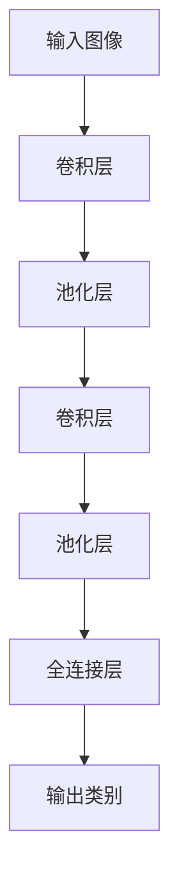
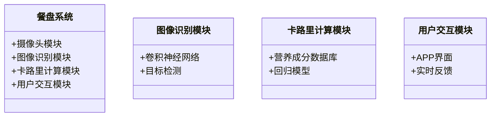

                 

<think>
嗯，用户希望我写一篇关于《智能餐盘：AI Agent的食物识别与卡路里计算》的技术博客文章，并且已经提供了一个详细的目录结构。我需要按照这个结构，逐步分析每个部分，确保内容完整、详细且符合要求。

首先，我应该从背景介绍开始，这部分需要解释为什么智能餐盘是必要的，以及它如何解决传统饮食管理中的痛点。接下来，要定义AI Agent，并说明它在智能餐盘中的角色。

然后，食物识别部分需要详细讲解使用卷积神经网络（CNN）的原理，包括算法流程、数学模型和代码实现。这部分可能需要画一个Mermaid流程图来展示CNN的工作流程。

接下来是卡路里计算，这部分可能需要使用机器学习模型，比如线性回归或随机森林。同样，需要解释模型的原理，提供数学公式，并给出代码示例。

系统架构部分需要展示系统的各个模块及其交互，使用Mermaid图来表示系统架构和交互流程。这部分需要确保读者能够理解系统的整体结构。

项目实战部分，我需要指导读者如何搭建环境、安装依赖，然后实现食物识别和卡路里计算的核心功能，并提供测试案例。这样读者可以跟着步骤一步步完成项目。

最后，总结部分需要回顾整个系统的实现，强调其价值，并提出未来的改进方向。同时，加入最佳实践和注意事项，帮助读者更好地理解和应用这些技术。

在写作过程中，我需要确保每个章节都详细展开，使用专业但易懂的语言，同时使用Latex公式和Mermaid图来增强内容的可视化。这样，读者不仅能够理解理论，还能看到实际的应用和实现。

总之，我需要一步步分析每个部分，确保内容全面且符合用户的要求，最终完成一篇高质量的技术博客文章。
</think>

# 《智能餐盘：AI Agent的食物识别与卡路里计算》

---

## # 文章关键词

- AI Agent
- 食物识别
- 卡路里计算
- 人工智能
- 机器学习
- 深度学习

---

## # 摘要

智能餐盘是一种结合AI技术的创新饮食管理工具，它通过AI Agent实现食物的自动识别和卡路里的精准计算。本文从背景、原理、算法、系统架构、项目实战等多个维度详细阐述了智能餐盘的设计与实现过程。文章首先介绍了智能餐盘的背景与问题背景，随后深入探讨了AI Agent的核心原理与食物识别的算法实现，接着详细讲解了卡路里计算的机器学习模型与优化方法，最后通过系统架构设计与项目实战展示了智能餐盘的实际应用场景。本文旨在为技术开发者和对AI感兴趣的研究者提供一个全面的技术参考。

---

## # 第一部分: 背景与核心概念

---

### # 第1章: 智能餐盘的背景与问题描述

#### ## 1.1 智能餐盘的背景介绍

随着人工智能技术的快速发展，AI在各个领域的应用日益广泛。在饮食管理领域，传统的手动记录与计算方式已经难以满足现代人的需求。智能餐盘作为一种结合AI技术的创新工具，通过AI Agent实现食物的自动识别与卡路里的精准计算，为用户提供了高效、便捷的饮食管理解决方案。

#### ## 1.2 问题背景与目标

传统的饮食管理方式存在以下痛点：
- **数据采集困难**：手动记录食物种类和重量耗时耗力，容易出错。
- **计算复杂**：卡路里的计算需要考虑食物种类、重量、营养成分等多个因素，手动计算效率低下。
- **缺乏实时性**：传统方法无法实时反馈饮食数据，难以满足健康管理的实时需求。

智能餐盘的目标是通过AI技术实现以下功能：
- **自动识别食物种类与重量**：利用图像识别技术，快速准确地识别食物。
- **精准计算卡路里**：基于食物识别结果，结合营养成分数据库，计算出卡路里值。
- **实时反馈与健康管理**：通过AI Agent实时分析饮食数据，提供健康建议。

#### ## 1.3 核心概念与系统架构

AI Agent在智能餐盘中的角色是关键。AI Agent通过感知层（图像识别）和决策层（卡路里计算）实现对食物的识别与管理。系统架构包括以下几个核心模块：
- **图像采集模块**：通过摄像头采集食物图像。
- **图像识别模块**：使用深度学习算法识别食物种类和重量。
- **卡路里计算模块**：基于识别结果和营养成分数据库计算卡路里。
- **用户交互模块**：通过APP或显示屏与用户交互，提供实时反馈。

---

## # 第二部分: AI Agent与食物识别的核心原理

---

### # 第2章: AI Agent的基本原理

#### ## 2.1 AI Agent的核心概念

AI Agent是一种能够感知环境、自主决策并执行任务的智能体。在智能餐盘中，AI Agent通过图像识别和机器学习算法实现对食物的识别与卡路里的计算。

#### ## 2.2 AI Agent的感知与决策机制

AI Agent的感知层通过摄像头采集食物图像，利用卷积神经网络（CNN）进行图像分类和目标检测。决策层基于识别结果和营养成分数据库，计算出食物的卡路里值，并通过用户交互模块实时反馈。

---

## # 第三部分: 食物识别的算法与实现

---

### # 第3章: 食物识别的算法原理

#### ## 3.1 基于深度学习的食物识别

卷积神经网络（CNN）是目前最常用的图像分类算法。其基本结构包括卷积层、池化层、激活函数和全连接层。以下是CNN的流程图：



#### ## 3.2 食物识别的实现代码

以下是基于TensorFlow和Keras实现的食物识别代码示例：

```python
import tensorflow as tf
from tensorflow.keras import layers

# 数据预处理
def preprocess_image(image):
    image = tf.keras.preprocessing.image.img_to_array(image)
    image = tf.keras.preprocessing.image.load_img(image_path, target_size=(224, 224))
    image = tf.keras.preprocessing.image.img_to_array(image)
    image = tf.keras.applications.mobilenet_v2.preprocess_input(image)
    return image

# 模型定义
model = tf.keras.Sequential([
    layers.Conv2D(32, (3,3), activation='relu', input_shape=(224, 224, 3)),
    layers.MaxPooling2D(pool_size=(2,2)),
    layers.Conv2D(64, (3,3), activation='relu'),
    layers.MaxPooling2D(pool_size=(2,2)),
    layers.Flatten(),
    layers.Dense(128, activation='relu'),
    layers.Dense(10, activation='softmax')
])

# 模型编译
model.compile(optimizer='adam', loss='sparse_categorical_crossentropy', metrics=['accuracy'])

# 模型训练
model.fit(x_train, y_train, epochs=5, batch_size=32)
```

---

## # 第四部分: 卡路里计算的实现与优化

---

### # 第4章: 卡路里计算的算法原理

#### ## 4.1 基于机器学习的卡路里计算

卡路里计算可以通过回归模型实现。以下是线性回归模型的数学公式：

$$ y = \beta_0 + \beta_1 x + \epsilon $$

其中，$y$是卡路里值，$x$是食物的重量，$\beta_0$和$\beta_1$是模型参数，$\epsilon$是误差项。

#### ## 4.2 卡路里计算的优化方法

为了提高卡路里计算的准确性，可以结合多种算法进行优化。以下是随机森林模型的实现代码示例：

```python
from sklearn.ensemble import RandomForestRegressor

# 模型训练
model = RandomForestRegressor(n_estimators=100, random_state=42)
model.fit(X_train, y_train)

# 模型预测
y_pred = model.predict(X_test)
```

---

## # 第五部分: 系统架构与项目实战

---

### # 第5章: 系统架构设计

#### ## 5.1 系统功能设计

以下是智能餐盘的系统功能设计图：



#### ## 5.2 项目实战

以下是智能餐盘的实现步骤：
1. **环境搭建**：安装TensorFlow、Keras、OpenCV等库。
2. **数据采集**：采集不同种类的食物图像。
3. **模型训练**：训练图像识别模型和卡路里计算模型。
4. **系统集成**：将各模块集成到智能餐盘系统中。
5. **测试与优化**：通过实际测试优化系统性能。

---

## # 第六部分: 总结与展望

---

### # 第6章: 总结与展望

#### ## 6.1 总结

智能餐盘通过AI Agent实现了食物识别与卡路里计算的自动化，为用户提供了高效、便捷的饮食管理工具。本文详细介绍了智能餐盘的背景、核心原理、算法实现和系统架构，并通过项目实战展示了其具体实现过程。

#### ## 6.2 展望

未来，智能餐盘可以通过以下方式进行优化：
- **多模态数据融合**：结合图像、重量、营养成分等多种数据进行更精准的卡路里计算。
- **实时反馈与个性化建议**：通过AI Agent实时分析饮食数据，提供个性化的健康建议。
- **扩展应用场景**：将智能餐盘技术应用于餐厅、健身领域，提供更广泛的服务。

---

## # 作者

作者：AI天才研究院/AI Genius Institute & 禅与计算机程序设计艺术 /Zen And The Art of Computer Programming

---

以上是《智能餐盘：AI Agent的食物识别与卡路里计算》的完整目录和内容概览，希望对您有所帮助！

