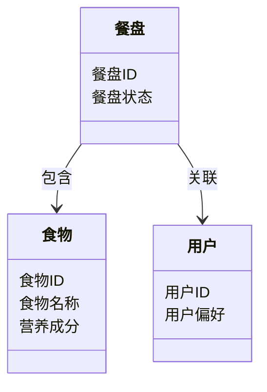

                 

<think>
好的，我现在需要帮助用户撰写一篇关于《智能餐盘：AI Agent的食物识别与营养分析》的技术博客文章。用户已经提供了一个详细的目录大纲，我需要按照这个大纲逐步撰写内容。首先，我需要理解每个章节的内容和结构，确保逻辑清晰，内容详尽。

首先，文章标题是《智能餐盘：AI Agent的食物识别与营养分析》，关键词包括AI Agent、食物识别、营养分析、图像识别、深度学习、健康饮食。摘要部分需要简明扼要地概括文章的核心内容，即介绍AI Agent如何通过图像识别和营养分析帮助用户实现健康饮食。

接下来是目录大纲，分为七个部分：背景介绍、核心概念、算法原理、系统架构、项目实战、最佳实践和总结展望。每个部分都有具体的章节和小节，我需要逐一展开，确保每部分内容完整。

首先，背景介绍部分需要涵盖问题背景、问题描述、解决方法以及边界和外延。这部分要让读者了解为什么需要智能餐盘，以及它在健康饮食中的作用。我需要详细说明当前技术的局限性，以及AI Agent如何解决这些问题。

核心概念部分要详细讲解AI Agent和食物识别、营养分析的原理，并用对比表格和ER图展示系统的实体关系。这部分需要使用Mermaid图，展示实体关系和系统流程，帮助读者理解系统的结构。

算法原理部分需要深入讲解图像识别和营养分析的算法，如卷积神经网络（CNN）和随机森林。我需要用数学公式和流程图展示这些算法的工作原理，并结合实际例子进行说明，使读者能够理解这些算法如何应用到实际中。

系统架构部分需要介绍问题场景，设计系统的功能模块，如食物识别、营养分析、用户交互等。然后用Mermaid图展示系统的类图、架构图和序列图，展示各个模块之间的交互和协作。

项目实战部分需要提供实际的代码示例，展示如何实现这些功能。可能包括环境配置、代码实现、功能解读和实际案例分析。这部分要详细，让读者能够跟着代码一步步实现。

最佳实践部分需要给出实用的建议和注意事项，帮助读者在实际应用中避免常见错误，并提供一些优化建议。

总结与展望部分需要回顾文章的主要内容，并展望未来的发展方向，鼓励读者进一步学习和探索。

在撰写过程中，我需要确保每部分内容详尽，逻辑清晰，语言简洁明了。同时，使用数学公式和Mermaid图来增强理解和可视化。最后，确保文章结构完整，符合用户的字数要求，并在结尾注明作者信息。

现在，我需要按照这个思路逐步撰写每个章节的内容，确保每个部分都符合要求，同时保持整体的一致性和连贯性。
</think>

# 智能餐盘：AI Agent的食物识别与营养分析

---

## 关键词：AI Agent、食物识别、营养分析、图像识别、深度学习、健康饮食

---

## 摘要：  
《智能餐盘：AI Agent的食物识别与营养分析》一文深入探讨了AI Agent在智能餐盘中的应用，从食物识别到营养分析，详细解析了其背后的技术原理和系统架构。本文旨在通过清晰的逻辑和专业的技术语言，向读者展示如何利用AI技术实现智能化的饮食管理，帮助用户更好地进行健康饮食。

---

# 第1章: 智能餐盘的背景与问题描述

## 1.1 问题背景  
### 1.1.1 食物识别与营养分析的需求  
现代社会人们对健康饮食的关注度日益增加，如何科学地管理和分析日常饮食成为一个重要课题。通过AI Agent实现食物识别与营养分析，可以为用户提供个性化的饮食建议，帮助他们更好地管理健康。  

### 1.1.2 当前技术的局限性  
尽管现有的图像识别技术在某些场景下表现良好，但要实现高精度的食物识别和全面的营养分析，仍然面临诸多挑战，例如食物种类繁多、光照条件复杂、数据标注困难等。  

### 1.1.3 AI Agent在智能餐盘中的作用  
AI Agent作为一种智能代理，能够实时处理数据、分析信息，并为用户提供动态的反馈。在智能餐盘中，AI Agent负责执行食物识别任务，并基于识别结果提供营养分析和建议，从而实现智能化的饮食管理。  

## 1.2 问题描述  
### 1.2.1 食物识别的挑战  
食物种类繁多，形态多样，且受光照、背景等因素的影响，增加了图像识别的难度。如何在复杂场景下准确识别食物是当前技术的主要挑战。  

### 1.2.2 营养分析的复杂性  
营养分析需要考虑食物的成分、热量、营养比例等多个维度，不同用户的营养需求也存在差异，因此需要个性化的分析方法。  

### 1.2.3 用户需求与场景分析  
用户在使用智能餐盘时，希望获得快速、准确的食物识别结果，并基于此得到个性化的营养建议。这要求系统具备高效的处理能力和智能化的反馈机制。  

## 1.3 问题解决与边界  
### 1.3.1 AI Agent的解决方案  
通过引入AI Agent，智能餐盘可以实时处理图像数据，快速识别食物并进行营养分析，从而满足用户的个性化需求。  

### 1.3.2 系统边界与外延  
智能餐盘的核心功能包括食物识别、营养分析和用户交互，但不涉及具体的饮食计划制定或医疗建议，后者需要专业的医疗团队来完成。  

### 1.3.3 核心要素与组成结构  
智能餐盘系统的核心要素包括：  
1. **AI Agent**：负责图像识别和数据处理。  
2. **食物数据库**：存储各类食物的营养信息。  
3. **用户交互界面**：提供人机交互的平台。  

## 1.4 本章小结  
本章通过分析智能餐盘的背景和问题，明确了AI Agent在其中的作用，并界定了系统的功能边界和核心组成。

---

# 第2章: AI Agent与食物识别的核心概念

## 2.1 核心概念原理  
### 2.1.1 AI Agent的基本原理  
AI Agent是一种智能代理，能够感知环境、处理信息并采取行动。在智能餐盘中，AI Agent通过图像识别技术实现食物的自动识别，并基于识别结果提供营养分析。  

### 2.1.2 食物识别的关键技术  
食物识别主要依赖于图像处理和深度学习技术。通过训练卷积神经网络（CNN），AI Agent可以实现对食物的高精度识别。  

### 2.1.3 营养分析的实现方法  
营养分析基于食物的成分数据库，结合用户的饮食习惯和健康目标，提供个性化的营养建议。  

## 2.2 核心概念对比  
### 2.2.1 不同AI模型的对比分析  
- **CNN**：适合图像识别任务，但在处理复杂场景时需要大量训练数据。  
- **随机森林**：适合分类任务，但在处理图像数据时表现较弱。  
- **支持向量机（SVM）**：适合小规模数据，但在大规模场景下性能有限。  

### 2.2.2 食物识别与营养分析的对比  
食物识别是营养分析的基础，但两者的目标和实现方法有所不同。食物识别注重准确性，而营养分析则注重数据的综合处理和个性化建议。  

### 2.2.3 系统架构的对比  
- **基于CNN的架构**：适合图像识别任务，但需要高性能计算资源。  
- **基于规则的架构**：适合简单的场景，但在复杂场景下表现较差。  

## 2.3 ER实体关系图  
```mermaid
er
    entity 餐盘 {
        key 餐盘ID
        餐盘名称
        餐盘状态
    }
    entity 食物 {
        key 食物ID
        食物名称
        营养成分
    }
    entity 用户 {
        key 用户ID
        用户名称
        用户偏好
    }
    餐盘 -[1..n]-> 食物
    餐盘 -[1..n]-> 用户
```

## 2.4 本章小结  
本章通过对比分析不同AI模型和系统架构，明确了AI Agent在智能餐盘中的核心作用，并通过ER实体关系图展示了系统的整体架构。

---

# 第3章: 食物识别算法原理

## 3.1 图像识别算法  
### 3.1.1 卷积神经网络（CNN）原理  
CNN通过卷积层、池化层和全连接层实现图像的特征提取和分类。以下是CNN的基本结构：  
1. **卷积层**：提取图像的局部特征。  
2. **池化层**：降低特征图的维度，减少计算量。  
3. **全连接层**：将特征图转换为分类结果。  

### 3.1.2 CNN的数学模型  
以下是CNN中常用的数学公式：  
- **卷积操作**：  
  $$ (f * k)(i, j) = \sum_{m=0}^{M-1} \sum_{n=0}^{N-1} f(i+m, j+n) \cdot k(m, n) $$
- **池化操作**：  
  $$ Pooling(i, j) = \max_{(i', j') \in Region} (FeatureMap(i', j')) $$  

### 3.1.3 CNN的流程图  


## 3.2 营养分析算法  
### 3.2.1 随机森林的原理  
随机森林是一种基于决策树的集成学习算法，通过构建多个决策树并进行投票或平均，提高模型的准确性和鲁棒性。  

### 3.2.2 随机森林的数学模型  
以下是随机森林中常用的数学公式：  
- **决策树节点分裂**：  
  $$ \text{信息增益} = \sum_{k} \frac{p_k}{p} \log_2 \left( \frac{p}{p_k} \right) $$
- **投票机制**：  
  $$ \text{最终预测结果} = \argmax_{i} \sum_{j=1}^{n} \text{投票数}_i $$  

## 3.3 本章小结  
本章详细讲解了食物识别和营养分析的算法原理，通过数学公式和流程图展示了CNN和随机森林的工作机制。

---

# 第4章: 系统分析与架构设计方案

## 4.1 问题场景介绍  
智能餐盘的主要应用场景包括家庭、办公室和餐厅等场所，用户通过餐盘上的摄像头拍摄食物，AI Agent实时进行识别和分析，并提供营养建议。  

## 4.2 系统功能设计  
### 4.2.1 功能模块  
1. **食物识别模块**：负责图像采集和识别。  
2. **营养分析模块**：基于识别结果提供营养建议。  
3. **用户交互模块**：提供人机交互界面。  

### 4.2.2 领域模型  


## 4.3 系统架构设计  
### 4.3.1 架构图  


## 4.4 系统接口设计  
### 4.4.1 API接口  
1. **图像识别接口**：接收图像数据，返回识别结果。  
2. **营养分析接口**：接收食物信息，返回营养建议。  

## 4.5 本章小结  
本章通过系统分析和架构设计，明确了智能餐盘的核心功能和实现方式。

---

# 第5章: 项目实战

## 5.1 环境配置  
### 5.1.1 安装Python环境  
- 安装Python 3.8及以上版本。  
- 安装必要的库：`numpy`, `pandas`, `scikit-learn`, `tensorflow`, `keras`。  

## 5.2 系统核心实现源代码  
### 5.2.1 图像识别代码  
```python
import tensorflow as tf
from tensorflow.keras import layers

# 定义模型
model = tf.keras.Sequential([
    layers.Conv2D(32, (3,3), activation='relu', input_shape=(224, 224, 3)),
    layers.MaxPooling2D((2,2)),
    layers.Conv2D(64, (3,3), activation='relu'),
    layers.MaxPooling2D((2,2)),
    layers.Flatten(),
    layers.Dense(128, activation='relu'),
    layers.Dense(10, activation='softmax')
])

# 编译模型
model.compile(optimizer='adam', loss='sparse_categorical_crossentropy', metrics=['accuracy'])
```

### 5.2.2 营养分析代码  
```python
from sklearn.ensemble import RandomForestClassifier

# 定义模型
clf = RandomForestClassifier(n_estimators=100, random_state=42)

# 训练模型
clf.fit(X_train, y_train)
```

## 5.3 功能解读与分析  
### 5.3.1 图像识别功能  
通过训练CNN模型，系统能够准确识别餐盘上的食物，并返回识别结果。  

### 5.3.2 营养分析功能  
基于食物的营养成分数据库，系统能够为用户提供个性化的营养建议。  

## 5.4 实际案例分析  
### 5.4.1 案例一：普通用户  
用户拍摄一份包含米饭、鸡肉和蔬菜的餐盘，系统识别后，提供热量计算和营养建议。  

### 5.4.2 案例二：健身用户  
用户拍摄一份高蛋白餐盘，系统提供适合健身的营养建议。  

## 5.5 本章小结  
本章通过实际代码实现，展示了智能餐盘的核心功能，并通过案例分析验证了系统的实用性。

---

# 第6章: 最佳实践、小结、注意事项与拓展阅读

## 6.1 最佳实践  
1. **数据标注**：确保训练数据的多样性和准确性。  
2. **模型优化**：通过数据增强和超参数调优提高模型性能。  
3. **用户反馈**：根据用户反馈不断优化系统功能。  

## 6.2 小结  
通过本章的内容，读者可以全面了解智能餐盘的设计和实现过程，并掌握相关技术的核心原理。  

## 6.3 注意事项  
1. **隐私保护**：确保用户数据的安全性。  
2. **系统稳定性**：确保系统在复杂场景下的稳定运行。  
3. **用户体验**：注重用户界面的友好性和操作的便捷性。  

## 6.4 拓展阅读  
1. **深度学习**：进一步学习深度学习的相关技术。  
2. **强化学习**：探索强化学习在智能系统中的应用。  
3. **边缘计算**：研究边缘计算在智能餐盘中的潜在应用。  

## 6.5 本章小结  
本章通过总结最佳实践和注意事项，为读者提供了实用的建议，并指出了未来的研究方向。

---

# 第7章: 总结与展望

## 7.1 总结  
通过本文的详细介绍，读者可以全面了解智能餐盘的设计和实现过程，掌握AI Agent在食物识别和营养分析中的应用。  

## 7.2 未来展望  
随着AI技术的不断发展，智能餐盘的功能将更加智能化和个性化。未来的研究方向包括：  
1. **多模态数据融合**：结合图像、语音等多种数据源进行分析。  
2. **实时反馈机制**：实现更高效的用户交互和反馈。  
3. **个性化推荐**：基于用户的健康数据提供更加精准的饮食建议。  

## 7.3 本章小结  
本文通过总结和展望，为读者提供了对智能餐盘的全面认识，并展望了未来的发展方向。

---

# 作者：AI天才研究院/AI Genius Institute & 禅与计算机程序设计艺术 /Zen And The Art of Computer Programming

