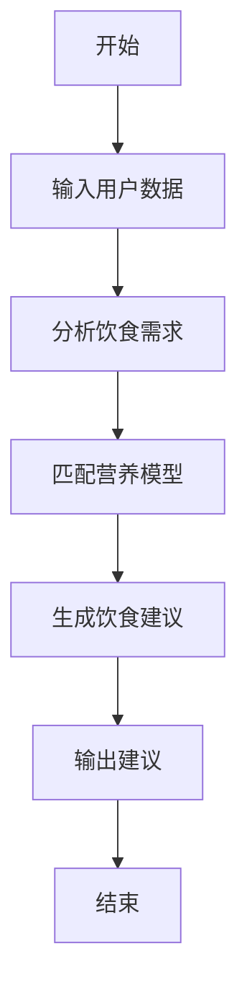
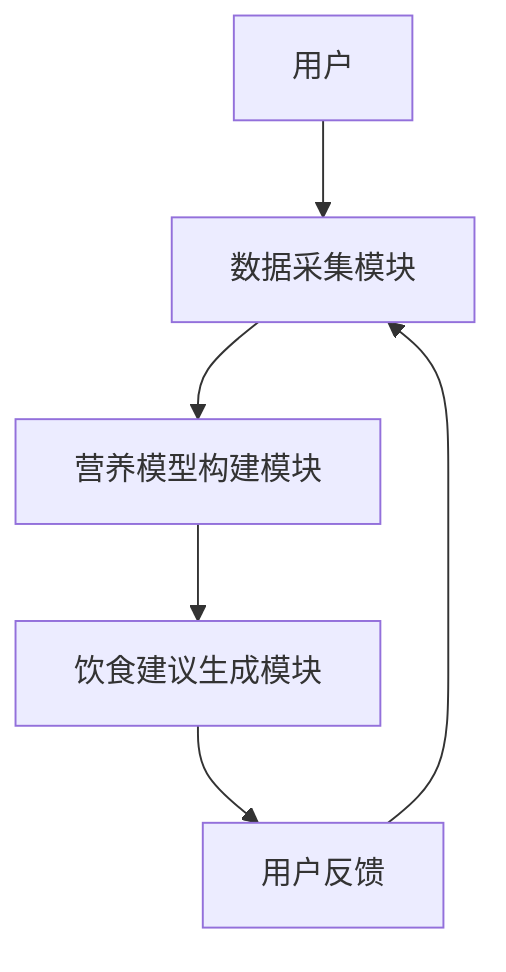
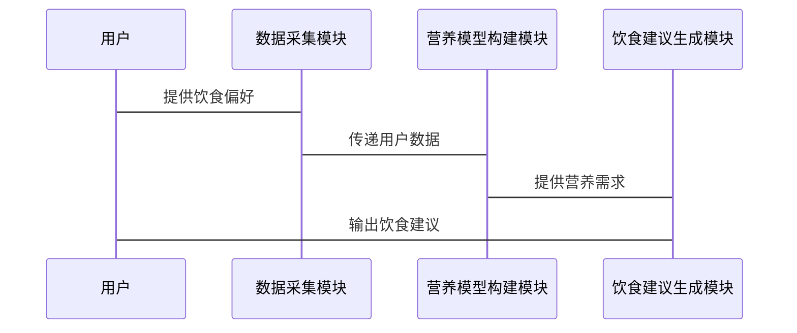

                 


# 智能餐盘：AI Agent的饮食均衡建议系统

> 关键词：智能餐盘、AI Agent、饮食均衡、健康建议系统、推荐算法

> 摘要：本文探讨了智能餐盘系统的设计与实现，结合AI Agent技术，提出了一种基于营养均衡的饮食建议系统，通过算法优化和系统架构设计，为用户提供个性化的饮食推荐。

---

## 第3章: 智能餐盘的算法原理与数学模型

### 3.1 基于AI Agent的推荐算法

#### 3.1.1 协同过滤推荐算法
协同过滤是一种常见的推荐算法，通过分析用户的历史行为和偏好，找到与之相似的用户群体，进而推荐相似的食物或餐点。例如，如果用户A经常选择低脂高蛋白的食物，系统会推荐其他具有相似饮食偏好的用户所选择的食物。

#### 3.1.2 基于内容的推荐算法
内容推荐算法依赖于食物本身的属性（如热量、蛋白质含量、碳水化合物含量等）进行推荐。系统会根据用户的饮食需求，匹配最接近营养均衡标准的食物组合。

#### 3.1.3 混合推荐算法
混合推荐算法结合了协同过滤和内容推荐的优点，通过用户的偏好和食物属性的双重因素进行推荐，能够提供更精准的饮食建议。

### 3.2 营养均衡模型的数学公式

#### 3.2.1 食物热量计算公式
$$ \text{热量} = \text{蛋白质} \times 4 + \text{脂肪} \times 9 + \text{碳水化合物} \times 4 $$

#### 3.2.2 营养均衡指数计算公式
$$ \text{均衡指数} = \sum_{i=1}^{n} | \text{需求}_i - \text{摄取}_i | $$

### 3.3 AI Agent的决策树模型



---

## 第4章: 智能餐盘的系统架构设计

### 4.1 项目背景与目标
智能餐盘系统旨在通过AI技术帮助用户实现饮食均衡，提升健康水平。系统的核心目标是为用户提供个性化的饮食建议，优化饮食结构。

### 4.2 系统功能设计

#### 4.2.1 用户数据采集模块
该模块负责采集用户的饮食偏好、健康状况和饮食习惯等数据。通过问卷调查、传感器数据等方式获取用户信息。

#### 4.2.2 营养模型构建模块
基于用户数据，构建个性化的营养均衡模型，计算用户的每日营养需求。

#### 4.2.3 饮食建议生成模块
根据营养模型，结合推荐算法，生成个性化的饮食建议，并通过用户友好的界面展示。

### 4.3 系统架构图



### 4.4 系统接口设计
系统需要与用户端、数据源（如食品数据库）和第三方服务（如健康监测设备）进行交互。通过RESTful API实现模块之间的通信。

### 4.5 系统交互流程



---

## 第5章: 项目实战与代码实现

### 5.1 环境安装
需要安装Python、TensorFlow、Scikit-learn等机器学习库，以及Flask或Django框架用于Web开发。

### 5.2 核心代码实现

#### 5.2.1 数据预处理
```python
import pandas as pd

# 读取用户数据
data = pd.read_csv('user_data.csv')

# 数据清洗
data = data.dropna()
```

#### 5.2.2 营养模型构建
```python
from sklearn.neighbors import NearestNeighbors

# 训练协同过滤模型
model = NearestNeighbors(n_neighbors=5, algorithm='ball_tree').fit(data)
```

#### 5.2.3 饮食建议生成
```python
def generate_diet_suggestion(user_id):
    # 获取用户数据
    user_data = data.iloc[user_id]
    # 生成饮食建议
    suggestion = model.kneighbors(user_data)
    return suggestion
```

### 5.3 案例分析
通过实际案例分析，展示系统如何根据用户数据生成个性化的饮食建议，并验证系统的有效性和准确性。

### 5.4 项目小结
总结项目实现的关键点，强调AI技术在饮食建议中的应用价值。

---

## 第6章: 最佳实践与总结

### 6.1 最佳实践
- 数据隐私保护：确保用户数据的安全性
- 模型优化：定期更新和优化推荐算法
- 用户反馈机制：收集用户反馈，持续改进系统

### 6.2 总结与展望
本文详细介绍了智能餐盘系统的设计与实现，结合AI Agent技术，为用户提供个性化的饮食建议。未来，随着AI技术的不断发展，智能餐盘系统将更加智能化和个性化，为用户的健康保驾护航。

---

作者：AI天才研究院/AI Genius Institute & 禅与计算机程序设计艺术 /Zen And The Art of Computer Programming

