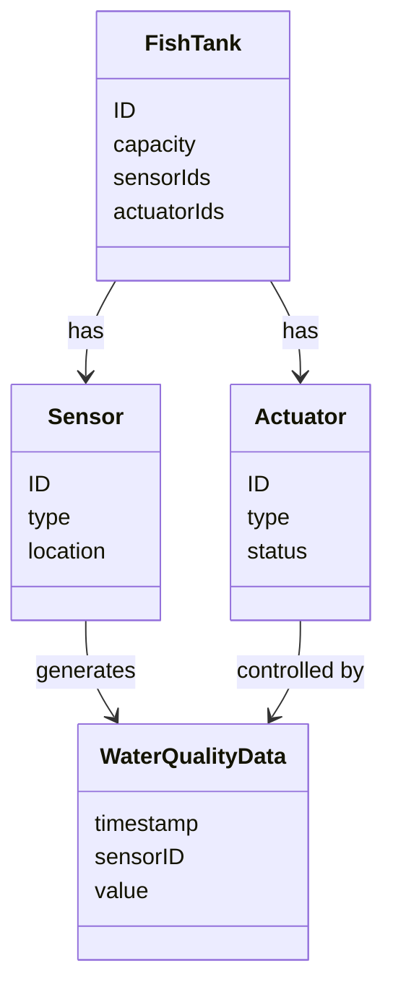

                 


# 智能鱼缸：AI Agent的水质平衡维护

## 关键词：AI Agent，水质平衡，智能鱼缸，机器学习，系统架构设计

## 摘要：  
本文探讨了AI Agent在智能鱼缸中的应用，重点分析了水质平衡维护的核心算法和系统架构设计。通过详细的技术分析和实际案例，展示了AI技术如何实现智能水质监测与控制，为现代渔业和家庭养鱼爱好者提供了一种高效可靠的解决方案。

---

# 第1章 智能鱼缸与AI Agent的背景介绍

## 1.1 智能鱼缸的概念与背景  
智能鱼缸是一种结合物联网（IoT）和人工智能（AI）技术的新型养鱼系统，通过实时监测和调节水质参数，确保鱼缸内水环境的稳定。传统的鱼缸管理依赖人工操作，存在效率低、误差大的问题，而智能鱼缸通过AI Agent实现自动化管理，显著提升了养鱼的便捷性和成功率。

### 1.1.1 传统鱼缸的水质管理问题  
- **人工监测的局限性**：水质参数如氨氮、亚硝酸盐、溶解氧等需要定期手动测量，耗时且容易遗漏。  
- **水质波动的影响**：鱼类代谢、饲料残渣等会导致水质快速变化，人工干预不及时可能引发鱼类疾病甚至死亡。  
- **管理复杂性**：对于大规模鱼缸或养殖场，人工管理成本高且效率低。

### 1.1.2 智能化水质管理的需求  
- **实时监测**：通过传感器实时采集水质数据，实现精准监测。  
- **智能调节**：基于AI算法自动调整水质参数，如温度、pH值、溶解氧等。  
- **远程控制**：通过手机或电脑远程监控和管理鱼缸，便于用户随时随地操作。

### 1.1.3 AI Agent在智能鱼缸中的作用  
AI Agent（智能代理）作为系统的核心，负责数据采集、分析、决策和执行。其主要功能包括：  
1. **数据采集**：通过传感器获取水质参数。  
2. **数据处理**：分析水质数据，识别异常情况。  
3. **决策控制**：根据分析结果，触发水泵、加热器、增氧机等设备进行调节。  
4. **学习优化**：通过机器学习算法不断优化水质控制策略。

## 1.2 水质平衡的核心问题  
水质平衡是鱼缸管理的核心目标，主要涉及以下几个方面：  
- **水质参数的动态变化**：鱼缸内的水质参数会随时间变化，受温度、鱼类活动、饲料投放等因素影响。  
- **多参数的关联性**：水质参数之间相互影响，例如温度升高会影响溶解氧含量，进而影响鱼类生存。  
- **非线性关系**：某些水质参数之间的关系较为复杂，可能呈现非线性特征，需要更复杂的算法进行建模。

---

# 第2章 AI Agent的基本原理

## 2.1 AI Agent的定义与特点  
AI Agent是一种智能代理系统，能够感知环境、自主决策并执行任务。其特点包括：  
- **自主性**：能够在无外部干预的情况下独立运行。  
- **反应性**：能够实时感知环境变化并做出反应。  
- **学习能力**：通过机器学习算法不断优化自身的决策模型。  
- **可扩展性**：能够适应不同规模和复杂度的鱼缸管理需求。

## 2.2 AI Agent在智能鱼缸中的架构  
智能鱼缸中的AI Agent通常采用分层架构，包括感知层、决策层和执行层。  

### 2.2.1 感知层  
感知层负责采集鱼缸内的水质数据，主要包括以下传感器：  
- **温度传感器**：监测水温。  
- **pH传感器**：监测水的酸碱度。  
- **溶解氧传感器**：监测溶解氧含量。  
- **氨氮传感器**：监测氨氮浓度。  

### 2.2.2 决策层  
决策层是AI Agent的核心，负责分析感知层获取的数据，并做出调节决策。其主要功能包括：  
- **数据预处理**：对传感器数据进行清洗和归一化处理。  
- **模型训练**：使用机器学习算法训练水质预测模型。  
- **决策制定**：根据当前水质状态和目标水质，制定调节方案。  

### 2.2.3 执行层  
执行层负责根据决策层的指令，通过执行机构（如水泵、加热器、增氧机等）调整水质参数。

---

# 第3章 水质监测与AI Agent的协同工作

## 3.1 水质监测系统的技术实现  
水质监测系统是智能鱼缸的核心组成部分，主要由传感器、数据采集模块和数据处理模块组成。  

### 3.1.1 传感器的选择与应用  
选择传感器时需要考虑以下因素：  
- **测量精度**：传感器的测量精度直接影响水质监测的准确性。  
- **响应时间**：传感器的响应时间影响系统的实时性。  
- **成本**：传感器的成本需要与系统的总体预算相匹配。  

### 3.1.2 数据采集与传输  
数据采集模块负责将传感器信号转换为数字信号，并通过无线或有线方式传输到决策层。  

### 3.1.3 数据预处理  
数据预处理包括以下步骤：  
1. **去除噪声**：通过滤波算法消除传感器噪声。  
2. **数据归一化**：将不同传感器的数据归一化处理，便于后续分析。  
3. **异常检测**：识别并处理异常数据点。  

## 3.2 AI Agent的感知与决策机制  
AI Agent通过以下步骤实现水质平衡：  
1. **数据采集**：从传感器获取实时水质数据。  
2. **状态分析**：基于当前数据，分析水质是否偏离目标范围。  
3. **决策制定**：根据分析结果，制定调节方案。  
4. **执行指令**：触发执行机构进行调整。  

### 3.2.1 感知数据的采集与处理  
感知数据的采集与处理流程如下：  
- 传感器采集数据 → 数据预处理 → 数据传输 → 数据存储。  

### 3.2.2 决策算法的选择与实现  
决策算法的选择需要考虑以下因素：  
- **实时性**：算法需要能够在较短的时间内完成计算。  
- **准确性**：算法需要能够准确预测水质变化趋势。  
- **可解释性**：算法的决策过程需要能够被用户理解。  

### 3.2.3 执行机构的控制逻辑  
执行机构的控制逻辑包括以下步骤：  
1. **接收决策指令**：从决策层获取调节方案。  
2. **触发执行机构**：启动相应的设备进行调整。  
3. **反馈执行结果**：将执行结果反馈到决策层。  

---

# 第4章 智能鱼缸的系统架构设计

## 4.1 系统功能设计  
智能鱼缸的系统功能包括：  
- **实时监测**：显示当前水质参数。  
- **智能调节**：根据水质变化自动调整。  
- **远程控制**：通过手机或电脑远程操作。  
- **历史记录**：记录水质数据，便于分析和追溯。  

### 4.1.1 领域模型设计  
领域模型是系统功能实现的基础，主要包括以下实体：  
- **鱼缸**：鱼缸的基本信息，如容量、用途等。  
- **传感器**：传感器的类型、安装位置等。  
- **执行机构**：执行机构的类型、连接方式等。  
- **水质数据**：包括时间戳、传感器ID、数据值等。  

### 4.1.2 领域模型的Mermaid类图  


## 4.2 系统架构设计  
系统架构设计包括以下部分：  
- **感知层**：传感器和数据采集模块。  
- **决策层**：AI Agent和机器学习算法。  
- **执行层**：执行机构和设备。  
- **用户界面**：人机交互界面，支持远程控制和数据查看。  

### 4.2.1 系统架构的Mermaid架构图  


---

# 第5章 项目实战：智能鱼缸的实现

## 5.1 环境安装与配置  
### 5.1.1 硬件安装  
- 安装传感器、数据采集模块和执行机构。  
- 确保硬件连接稳定，传感器安装位置合理。  

### 5.1.2 软件环境  
- 安装Python、机器学习库（如Scikit-learn、TensorFlow）和物联网开发框架。  

## 5.2 核心代码实现  

### 5.2.1 数据采集与预处理  
```python
import numpy as np
import pandas as pd

# 读取传感器数据
data = pd.read_csv('water_quality.csv')

# 数据预处理
data = data.dropna()  # 删除缺失值
data = pd.get_dummies(data)  # 独热编码
```

### 5.2.2 机器学习模型训练  
```python
from sklearn.linear_model import LinearRegression

# 数据分割
X = data.drop('target', axis=1)
y = data['target']

# 模型训练
model = LinearRegression()
model.fit(X, y)

# 模型预测
predictions = model.predict(X)
```

### 5.2.3 AI Agent的决策逻辑  
```python
def decide_action(current_state, target_state):
    if current_state['temperature'] < target_state['temperature']:
        return 'increase_temperature'
    elif current_state['temperature'] > target_state['temperature']:
        return 'decrease_temperature'
    else:
        return 'no_action'

# 示例调用
current_state = {'temperature': 24, 'ph': 7.5, 'dissolved_oxygen': 5}
target_state = {'temperature': 25, 'ph': 7.8, 'dissolved_oxygen': 6}
action = decide_action(current_state, target_state)
print(action)  # 输出：'increase_temperature'
```

## 5.3 实际案例分析  
假设某鱼缸的目标水质为：温度25°C，pH 7.8，溶解氧6 mg/L。当前水质为：温度24°C，pH 7.5，溶解氧5 mg/L。AI Agent会根据当前状态和目标状态，决定启动加热器以提高水温。

---

# 第6章 最佳实践与注意事项

## 6.1 最佳实践  
1. **传感器校准**：定期校准传感器，确保测量精度。  
2. **模型优化**：根据实际数据不断优化机器学习模型，提升预测准确性。  
3. **系统维护**：定期检查硬件设备，确保系统稳定运行。  

## 6.2 注意事项  
1. **数据隐私**：确保水质数据的安全性，防止数据泄露。  
2. **系统稳定性**：确保系统在断网或传感器故障时能够正常运行。  
3. **用户教育**：向用户普及AI Agent的工作原理，避免误操作。  

---

# 第7章 小结与展望

## 7.1 小结  
本文详细介绍了AI Agent在智能鱼缸中的应用，从系统架构设计到算法实现，再到项目实战，全面展示了如何利用AI技术实现水质平衡维护。通过AI Agent的引入，智能鱼缸在实时监测、智能调节和远程控制方面取得了显著的进步。

## 7.2 展望  
未来，随着AI技术的不断发展，智能鱼缸将更加智能化和自动化。可能的发展方向包括：  
- **多参数协同优化**：进一步优化多参数的协同控制策略。  
- **边缘计算**：在边缘设备上部署AI算法，提升系统的实时性和响应速度。  
- **用户个性化需求**：根据用户的个性化需求，定制水质管理方案。  

---

# 作者：AI天才研究院 & 禅与计算机程序设计艺术

---

这篇文章详细介绍了AI Agent在智能鱼缸中的应用，涵盖了从背景介绍到系统架构设计、项目实战等多个方面，为读者提供了一个全面的技术视角。希望对您有所帮助！

