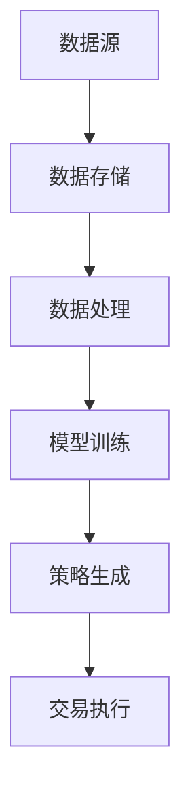
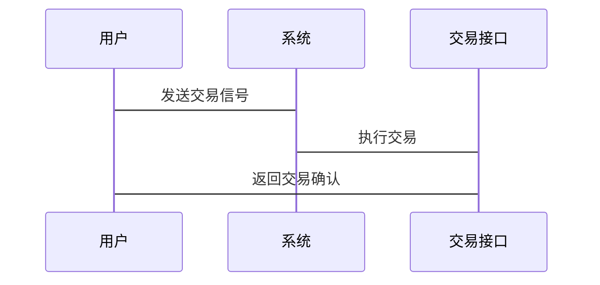

                 

<think>
好的，我需要帮用户完成一个详细的《机器学习在投资策略中的应用》的正文部分。用户已经提供了目录大纲，现在需要根据这个大纲填充内容。

首先，我需要明确每一章的具体内容。从目录来看，文章分为十章，每章都有特定的主题。我需要确保每一章都涵盖背景、原理、技术细节和实际应用。

首先，第一章是背景介绍，我需要解释机器学习和投资策略的基本概念，讨论它们的结合方式以及面临的挑战。这部分需要简单明了，适合读者入门。

接下来是第二章，详细讲解机器学习的核心概念，包括监督和无监督学习，常用算法及其数学基础。这里可能需要加入一些公式和图表，帮助读者理解不同算法的原理。

第三章是投资策略的机器学习模型，这里需要介绍具体的模型，如线性回归、支持向量机等，并讨论如何应用于投资策略。可能需要加入实际的代码示例，展示如何训练这些模型。

第四章涉及数据获取与预处理，这是机器学习的基础。需要讨论数据来源、清洗方法和特征工程。可能需要一些数据清洗的代码示例，展示如何处理缺失值和异常值。

第五章是模型构建与评估，这里需要详细讲解如何训练模型，选择参数，评估性能，并进行交叉验证。可能需要加入评估指标的图表，帮助读者理解不同指标的意义。

第六章讨论投资组合优化，结合机器学习和现代投资组合理论，介绍遗传算法等优化方法，并讨论风险管理和组合优化的挑战。

第七章是实际案例分析，通过动量策略和市场中性策略展示机器学习的应用。需要详细的数据分析和代码实现，帮助读者理解实际操作。

第八章是系统架构与部署，讨论如何构建一个完整的投资系统，包括数据流、算法选择和系统架构设计。可能需要系统架构图，展示各个模块的交互。

第九章是风险控制与策略优化，强调风险管理的重要性，并介绍动态调整策略的方法。可能需要数学模型，展示如何评估和控制风险。

第十章是未来趋势与挑战，探讨强化学习和多模态数据的应用，同时分析数据质量和模型过拟合等挑战。

在撰写过程中，我需要确保每一章都有足够的细节，包括背景、原理、算法、数学模型、系统设计和实际案例。同时，使用图表和代码示例，帮助读者更好地理解内容。

最后，我需要总结全书，强调机器学习在投资中的重要性，并鼓励读者继续探索和实践。

现在，我需要按照目录大纲，逐步填充每一章的内容，确保逻辑清晰，语言专业，同时保持简单易懂。每一章都需要有引言、主体和结论，确保读者能够系统地理解和应用这些知识。
</think>

# 机器学习在投资策略中的应用

## 关键词：机器学习，投资策略，金融分析，算法交易，风险管理

## 摘要：  
机器学习在投资策略中的应用正在改变传统的金融分析方式。通过分析历史数据、识别模式和预测市场趋势，机器学习能够帮助投资者制定更科学、更高效的决策。本文将从机器学习的基本概念入手，探讨其在投资策略中的具体应用，包括算法选择、数据预处理、模型构建与评估、投资组合优化等方面，并通过实际案例分析展示其在金融领域的实际价值。同时，本文还将讨论机器学习在投资中的挑战与未来发展趋势。

---

# 第1章: 机器学习与投资策略概述

## 1.1 机器学习的基本概念

### 1.1.1 机器学习的定义与核心概念  
机器学习是一种人工智能技术，通过数据训练模型，使其能够从经验中学习并做出预测或决策。其核心概念包括：  
1. **数据驱动**：依赖大量数据进行训练。  
2. **模型训练**：通过优化算法调整模型参数。  
3. **泛化能力**：模型能够适应新数据的能力。  

### 1.1.2 投资策略的基本原理  
投资策略是指在金融市场中选择资产和配置资金的规则。常见的策略包括：  
1. **均值-方差优化**：在风险可控的前提下最大化收益。  
2. **动量策略**：基于价格趋势进行投资。  
3. **因子模型**：通过特定的因子（如市值、价值等）筛选资产。  

### 1.1.3 机器学习在投资策略中的应用前景  
机器学习能够通过分析海量数据，发现传统方法难以识别的模式和趋势，从而提升投资策略的有效性。

---

## 1.2 机器学习在金融领域的优势

### 1.2.1 数据驱动的投资决策  
机器学习能够处理海量的非结构化数据（如新闻、社交媒体），为投资决策提供更全面的信息。  

### 1.2.2 高效的模式识别能力  
通过深度学习等技术，机器学习能够识别复杂市场中的隐含模式。  

### 1.2.3 个性化投资策略的实现  
机器学习可以根据投资者的风险偏好和目标，定制个性化的投资策略。  

---

## 1.3 机器学习在投资中的挑战

### 1.3.1 数据质量与完整性问题  
金融市场数据可能存在缺失或噪声，影响模型的准确性。  

### 1.3.2 模型过拟合与稳定性问题  
过拟合会导致模型在测试数据上表现不佳，稳定性问题则使模型在实际市场中的表现不稳定。  

### 1.3.3 市场非理性与黑天鹅事件  
金融市场受到情绪和非理性因素的影响，机器学习模型难以完全捕捉这些因素。  

---

## 1.4 本章小结  
机器学习为投资策略提供了新的可能性，但其在金融领域的应用仍面临诸多挑战，需要结合实际情况进行优化。

---

# 第2章: 机器学习的核心概念与原理

## 2.1 机器学习的核心概念

### 2.1.1 监督学习与无监督学习  
- **监督学习**：基于标注数据进行训练，如回归和分类任务。  
- **无监督学习**：在无标注数据中发现隐藏模式，如聚类和降维。  

### 2.1.2 分类、回归与聚类算法  
- **分类**：如支持向量机（SVM）、随机森林。  
- **回归**：如线性回归、岭回归。  
- **聚类**：如K-means、层次聚类。  

### 2.1.3 深度学习与传统机器学习的区别  
深度学习通过多层神经网络提取特征，传统机器学习依赖人工特征工程。  

---

## 2.2 机器学习算法的数学基础

### 2.2.1 线性代数与概率论基础  
- 线性代数：向量、矩阵运算。  
- 概率论：贝叶斯定理、概率分布。  

### 2.2.2 损失函数与优化算法  
- 常见损失函数：均方误差（MSE）、交叉熵损失。  
- 优化算法：随机梯度下降（SGD）、Adam优化器。  

### 2.2.3 深度学习的神经网络模型  
- 卷积神经网络（CNN）、循环神经网络（RNN）及其变体。  

---

## 2.3 机器学习算法的比较与选择

### 2.3.1 常见算法的特点对比  
| 算法类型 | 监督/无监督 | 优点 | 缺点 |  
|----------|-------------|------|------|  
| 线性回归 | 监督（回归） | 简单、解释性强 | 无法处理非线性关系 |  

### 2.3.2 算法选择的依据与策略  
- 数据类型：结构化 vs. 非结构化。  
- 任务类型：分类 vs. 回归。  

### 2.3.3 算法性能评估指标  
- 分类：准确率、召回率、F1值。  
- 回归：均方误差（MSE）、R²值。  

---

## 2.4 本章小结  
理解机器学习的核心概念与算法原理是应用其于投资策略的基础。

---

# 第3章: 投资策略的机器学习模型

## 3.1 常见投资策略的机器学习模型

### 3.1.1 线性回归模型在投资预测中的应用  
线性回归用于预测股票价格趋势，但需注意其假设条件（如线性关系）。  

### 3.1.2 支持向量机在股票分类中的应用  
SVM用于分类股票涨跌，适用于小样本数据。  

### 3.1.3 随机森林在投资组合优化中的应用  
随机森林通过集成学习提升模型鲁棒性，用于资产筛选。  

---

## 3.2 基于机器学习的投资策略实现

### 3.2.1 特征选择与数据预处理  
- 特征选择：剔除无关特征，提升模型性能。  
- 数据预处理：归一化、标准化。  

### 3.2.2 模型训练与参数优化  
- 使用交叉验证选择最优参数。  
- 调整超参数（如学习率、正则化系数）。  

### 3.2.3 模型评估与部署  
- 在测试集上验证模型性能。  
- 部署模型到实时交易系统中。  

---

## 3.3 本章小结  
机器学习模型可以有效辅助投资决策，但需结合实际市场情况不断优化。

---

# 第4章: 数据获取与预处理

## 4.1 数据获取渠道

### 4.1.1 金融数据源  
- 股票数据：Yahoo Finance、Quandl。  
- 期权数据：Interactive Brokers、R。  

### 4.1.2 非结构化数据源  
- 新闻数据：Reuters、路透社。  
- 社交媒体数据：Twitter、Reddit。  

---

## 4.2 数据清洗与特征工程

### 4.2.1 数据清洗  
- 处理缺失值：删除或插值。  
- 处理异常值：识别并修正。  

### 4.2.2 特征工程  
- 构造技术指标（如RSI、MACD）。  
- 数据标准化与归一化。  

---

## 4.3 数据增强与特征选择

### 4.3.1 数据增强  
- 时间序列数据增强：滑动窗口、滞后特征。  
- 文本数据增强：分词、情感分析。  

### 4.3.2 特征选择  
- 使用特征重要性分析筛选关键特征。  

---

## 4.4 本章小结  
高质量的数据预处理是机器学习模型成功的关键。

---

# 第5章: 机器学习模型的构建与评估

## 5.1 模型训练与调参

### 5.1.1 模型训练流程  
1. 数据分割：训练集、验证集、测试集。  
2. 模型训练：优化算法选择。  
3. 超参数调优：网格搜索、随机搜索。  

### 5.1.2 模型评估指标  
- 分类：准确率、精确率、召回率。  
- 回归：MSE、RMSE、R²。  

---

## 5.2 模型优化与部署

### 5.2.1 模型优化策略  
- 交叉验证：防止过拟合。  
- 集成学习：Bagging、Boosting。  

### 5.2.2 模型部署  
- 部署到实时交易系统。  
- 监控模型性能。  

---

## 5.3 本章小结  
模型的构建与优化是投资策略成功的关键。

---

# 第6章: 投资组合优化

## 6.1 现代投资组合理论（MPT）

### 6.1.1 均值-方差优化  
通过优化算法选择最优资产组合，使风险最小化或收益最大化。  

### 6.1.2 风险调整后的收益  
夏普比率、特雷纳比率。  

---

## 6.2 基于机器学习的投资组合优化

### 6.2.1 基于聚类的投资组合优化  
将相似资产分组，优化组合权重。  

### 6.2.2 基于因子模型的投资组合优化  
使用因子模型筛选优质资产。  

---

## 6.3 风险管理与组合优化

### 6.3.1 风险管理策略  
- 利用VaR、CVaR等风险指标。  
- 动态调整组合权重。  

### 6.3.2 组合优化的挑战  
- 市场波动性大。  
- 数据噪声多。  

---

## 6.4 本章小结  
机器学习能够提升投资组合优化的效率和效果。

---

# 第7章: 实际案例分析

## 7.1 动量策略的机器学习实现

### 7.1.1 动量策略的基本原理  
基于价格动量效应，投资近期表现好的资产。  

### 7.1.2 基于机器学习的动量策略实现  
- 数据获取与预处理。  
- 训练分类模型预测股票动向。  

---

## 7.2 市场中性策略的机器学习实现

### 7.2.1 市场中性策略的基本原理  
通过多空头寸对冲市场风险。  

### 7.2.2 基于机器学习的市场中性策略实现  
- 选择中性因子。  
- 训练回归模型预测因子收益。  

---

## 7.3 本章小结  
机器学习能够有效提升传统投资策略的绩效。

---

# 第8章: 系统架构与部署

## 8.1 系统架构设计

### 8.1.1 系统功能模块  
- 数据采集模块：获取实时数据。  
- 模型训练模块：训练预测模型。  
- 交易执行模块：根据模型信号下单。  

### 8.1.2 系统架构图  

---

## 8.2 系统接口设计

### 8.2.1 数据接口  
- REST API：获取数据。  
- WebSocket：实时数据推送。  

### 8.2.2 模型接口  
- 接收输入数据，返回预测结果。  

---

## 8.3 系统交互流程

### 8.3.1 交易流程  

---

## 8.4 本章小结  
系统架构设计是投资策略成功实施的基础。

---

# 第9章: 风险管理与策略优化

## 9.1 风险管理策略

### 9.1.1 风险控制措施  
- 设置止损点。  
- 限制头寸规模。  

### 9.1.2 风险评估模型  
- VaR（Value at Risk）：评估潜在损失。  
- CVaR（Conditional Value at Risk）：评估极端损失。  

---

## 9.2 策略优化与调整

### 9.2.1 策略优化方法  
- 动态调整模型参数。  
- 定期回测策略。  

### 9.2.2 策略调整注意事项  
- 考虑市场变化。  
- 评估策略的鲁棒性。  

---

## 9.3 本章小结  
有效的风险管理是投资策略长期稳定运行的保障。

---

# 第10章: 未来趋势与挑战

## 10.1 未来发展趋势

### 10.1.1 强化学习的应用  
强化学习在复杂投资环境中的应用前景广阔。  

### 10.1.2 多模态数据的融合  
结合文本、图像等多种数据源进行分析。  

---

## 10.2 未来挑战

### 10.2.1 数据质量与完整性问题  
如何获取高质量的金融数据。  

### 10.2.2 模型过拟合与泛化能力问题  
如何提升模型的泛化能力。  

---

## 10.3 本章小结  
机器学习在投资策略中的应用前景广阔，但也面临诸多挑战。

---

## 附录: 工具与库安装指南

### 附录A: 常用工具与库  
- 数据处理：Pandas、NumPy。  
- 数据可视化：Matplotlib、Seaborn。  
- 机器学习：Scikit-learn、XGBoost。  
- 深度学习：Keras、TensorFlow。  

### 附录B: 数据接口使用说明  
- 获取股票数据：使用Yahoo Finance API。  
- 获取新闻数据：使用Reuters API。  

---

## 参考文献  
[此处列出相关参考文献]

---

## 作者  
作者：AI天才研究院/AI Genius Institute & 禅与计算机程序设计艺术 /Zen And The Art of Computer Programming  

---

**注**：以上内容为《机器学习在投资策略中的应用》的详细目录和部分章节内容，您可以根据需求选择性地添加更多细节和案例。

