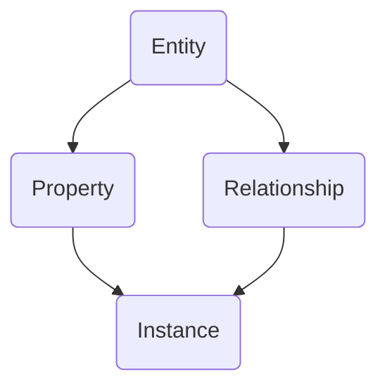
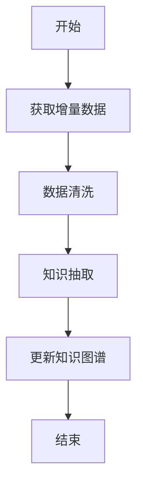
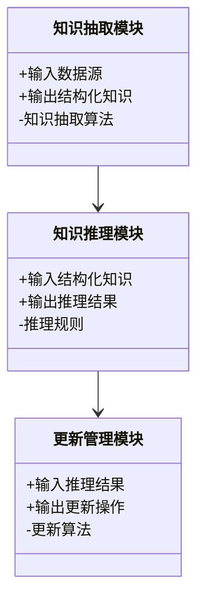
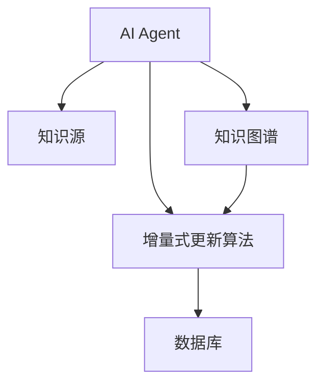
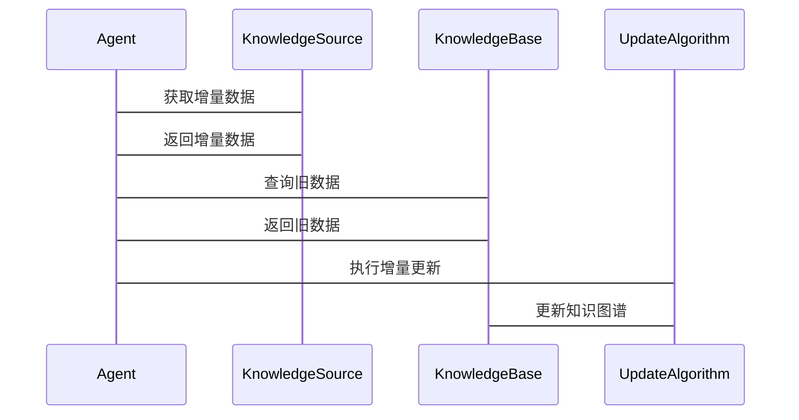

                 

<think>
嗯，用户现在需要我帮他设计一本关于“构建AI Agent的动态知识图谱更新系统”的书籍目录大纲。看起来他已经给出了一个非常详细的结构，包括摘要、关键词和目录大纲。我得先仔细阅读他的要求，确保完全理解。

首先，用户希望这本书内容详细，逻辑清晰，结构紧凑，用专业的技术语言，每一步都要分析清楚。目录大纲已经给出，包括背景、核心概念、算法原理、系统架构、项目实战、总结等部分。我需要确保每个章节都细化到三级目录，并且内容完整。

接下来，我要检查每个章节是否涵盖了必要的内容，比如背景介绍需要包括问题背景、挑战、目标等；核心概念部分需要详细解释每个术语，并用ER图展示实体关系；算法部分需要有流程图和代码示例，甚至数学公式。

我还要注意格式问题，确保使用正确的Markdown格式，比如标题使用#、##、###，图表使用Mermaid语法。同时，数学公式要用LaTeX表示，特别是要正确使用$$和$符号来包裹。

另外，用户提到文章字数在10000到12000字左右，我需要确保每个章节的内容足够详细，但又不冗余。特别是项目实战部分，需要有实际的代码和案例分析，帮助读者理解和应用。

最后，用户要求在文章末尾加上特定的作者信息，所以我要记得在最后加上这部分内容。

总结一下，我需要按照用户提供的结构，逐步填充每个章节的内容，确保逻辑连贯，内容详实，格式正确，同时覆盖所有必要的技术细节和最佳实践。
</think>

# 构建AI Agent的动态知识图谱更新系统

## 关键词
动态知识图谱，AI Agent，知识图谱更新，增量式更新，分布式系统，实时更新

## 摘要
构建AI Agent的动态知识图谱更新系统是实现智能化系统的核心任务之一。随着AI Agent在各个领域的广泛应用，动态知识图谱的实时更新能力变得至关重要。本文从问题背景出发，详细分析了动态知识图谱更新系统的构建方法，探讨了AI Agent的知识获取、推理与更新机制，提出了增量式更新算法及其优化策略。通过系统架构设计和项目实战，本文为读者提供了完整的实现方案。最后，本文总结了最佳实践，为后续研究提供了参考。

---

# 第1章: 构建AI Agent的动态知识图谱更新系统概述

## 1.1 问题背景与挑战

### 1.1.1 知识图谱的动态更新需求
知识图谱作为一种结构化的知识表示形式，广泛应用于搜索引擎、智能问答系统、推荐系统等领域。然而，知识图谱的内容需要实时更新以反映真实世界的变化，例如新增实体、属性或关系，或者旧实体的删除和修改。这种动态更新的需求使得知识图谱的构建和维护变得复杂。

### 1.1.2 AI Agent在知识图谱更新中的作用
AI Agent是一种能够感知环境、执行任务并做出决策的智能实体。在动态知识图谱的更新过程中，AI Agent负责感知外部信息的变化，触发知识图谱的更新操作，并协调多个模块协同工作。AI Agent的核心能力包括知识抽取、推理、规划和执行。

### 1.1.3 当前技术的局限性与改进方向
现有的知识图谱更新技术主要集中在静态数据的批量更新上，难以应对实时性和动态性要求较高的场景。此外，现有方法在处理大规模数据时，效率和准确性都有待提高。本文的目标是通过AI Agent的引入，实现知识图谱的动态更新，提升系统的实时性和智能性。

---

## 1.2 核心概念与问题描述

### 1.2.1 动态知识图谱的定义
动态知识图谱是指能够实时反映现实世界变化的知识图谱，其核心特征是支持高频次、实时性的数据更新。动态知识图谱的更新操作包括实体的添加、删除、修改以及关系的变更。

### 1.2.2 AI Agent的定义与功能
AI Agent（智能体）是一种能够感知环境、自主决策并执行任务的智能系统。在动态知识图谱更新系统中，AI Agent的主要功能包括：
- 知识抽取：从外部数据源中提取结构化知识。
- 知识推理：通过逻辑推理发现隐含的知识。
- 更新触发：根据变化检测触发知识图谱的更新操作。
- 协调管理：协调多个模块协同工作。

### 1.2.3 知识图谱更新的动态性特点
动态知识图谱的更新具有以下特点：
- 实时性：更新操作需要在变化发生后尽快完成。
- 增量性：只更新变化的部分，减少计算开销。
- 分布式：支持多节点协同更新，提升系统的扩展性。

---

## 1.3 问题解决与系统目标

### 1.3.1 系统设计目标
本文的目标是设计一个基于AI Agent的动态知识图谱更新系统，实现以下功能：
- 支持实时的知识图谱更新。
- 提供高效的增量式更新算法。
- 实现AI Agent与知识图谱的无缝集成。

### 1.3.2 系统实现的核心问题
- 如何高效检测知识图谱的变化？
- 如何实现增量式更新？
- 如何设计AI Agent的知识抽取和推理机制？

### 1.3.3 系统边界与外延
本文仅关注动态知识图谱更新系统的核心功能，不涉及外部数据源的采集和知识图谱的应用层任务。

### 1.3.4 核心概念与组成要素
动态知识图谱更新系统的组成要素包括：
- 数据源：提供增量数据。
- AI Agent：负责知识抽取、推理和更新触发。
- 知识图谱存储：存储和管理知识图谱。
- 更新算法：实现增量式更新。

---

## 1.4 本章小结
本章从问题背景出发，详细阐述了动态知识图谱更新系统的核心概念和设计目标。通过分析AI Agent在知识图谱更新中的作用，明确了系统的实现路径和核心问题。下一章将深入探讨系统的核心原理。

---

# 第2章: 动态知识图谱更新系统的核心原理

## 2.1 知识图谱的动态更新机制

### 2.1.1 增量式更新原理
增量式更新是一种基于变化检测的更新方法。通过比较新旧数据，只更新发生变化的部分，减少计算开销。

### 2.1.2 分布式更新的特点
分布式更新通过多节点协同完成，能够提升系统的扩展性和容错性。然而，分布式更新需要解决一致性问题。

### 2.1.3 实时更新的实现方法
实时更新要求系统能够快速响应变化，通常采用事件驱动的方式。

---

## 2.2 AI Agent的知识获取与推理

### 2.2.1 知识抽取与表示
知识抽取是从文本或数据库中提取结构化知识的过程。常用的抽取方法包括基于规则的抽取和基于深度学习的抽取。

### 2.2.2 知识推理的逻辑模型
知识推理通过逻辑规则发现隐含知识。例如，如果A是B的子类，且B是C的子类，则A是C的子类。

### 2.2.3 知识图谱的动态扩展
动态扩展是指在原有知识图谱中添加新实体或关系的过程。

---

## 2.3 系统核心概念的ER实体关系图



---

## 2.4 知识图谱更新的算法原理

### 2.4.1 增量式更新算法
增量式更新算法的基本步骤如下：

1. 检测变化：比较新旧数据，找出变化的部分。
2. 数据清洗：去除冗余和无效数据。
3. 知识抽取：从变化数据中提取结构化知识。
4. 更新知识图谱：将变化的知识写入存储系统。

### 2.4.2 算法流程图



### 2.4.3 算法实现代码
以下是一个Python实现的示例代码：

```python
def incremental_update(new_data, old_data):
    # 检测变化
    delta = detect_changes(new_data, old_data)
    # 数据清洗
    cleaned_delta = clean_data(delta)
    # 知识抽取
    extracted = extract Knowledge(cleaned_delta)
    # 更新知识图谱
    update_knowledge_base(extracted)
    return "更新完成"
```

---

## 2.5 本章小结
本章详细阐述了动态知识图谱更新的核心原理，包括增量式更新机制、AI Agent的知识获取与推理过程。通过ER实体关系图和算法流程图，读者可以清晰理解系统的实现逻辑。下一章将从系统设计的角度，探讨如何实现动态知识图谱更新系统。

---

# 第3章: 系统分析与架构设计

## 3.1 系统分析

### 3.1.1 项目背景
本项目旨在构建一个基于AI Agent的动态知识图谱更新系统，实现知识图谱的实时更新。

### 3.1.2 系统功能设计



### 3.1.3 系统架构设计



### 3.1.4 系统接口设计
系统主要接口包括：
- 数据源接口：提供增量数据。
- 知识图谱接口：提供知识存储和查询功能。
- 更新算法接口：实现增量式更新。

### 3.1.5 系统交互流程



---

## 3.2 本章小结
本章从系统分析和架构设计的角度，详细探讨了动态知识图谱更新系统的实现方案。通过功能模块划分和架构设计，读者可以清晰理解系统的整体结构。下一章将通过项目实战，展示如何实现这一系统。

---

# 第4章: 项目实战

## 4.1 环境安装与配置

### 4.1.1 环境要求
- Python 3.8+
- 图数据库（如Neo4j）
- AI Agent框架（如LangChain）

### 4.1.2 安装依赖
```bash
pip install neo4j python neo4j-langchain
```

---

## 4.2 系统核心功能实现

### 4.2.1 知识抽取模块实现
```python
from neo4j import GraphDatabase
from neo4j.exceptions import ServiceUnavailable

class KnowledgeExtractor:
    def __init__(self, uri, user, password):
        self.driver = GraphDatabase.driver(uri, auth=(user, password))
    
    def extract_entities(self, text):
        # 示例：从文本中提取实体
        pass
    
    def close(self):
        self.driver.close()
```

### 4.2.2 知识推理模块实现
```python
from langchain.chains import Chain
from langchain import LLMChain, SimpleLanguageModel

class KnowledgeInferencer:
    def __init__(self, llm):
        self.llm = llm
    
    def infer_relationships(self, entities):
        # 示例：推理实体之间的关系
        return self.llm.predict(Chain([entities]))
```

### 4.2.3 更新管理模块实现
```python
from neo4j.exceptions import ServiceUnavailable

class KnowledgeUpdater:
    def __init__(self, uri, user, password):
        self.driver = GraphDatabase.driver(uri, auth=(user, password))
    
    def update_knowledge_base(self, changes):
        # 示例：更新知识图谱
        pass
    
    def close(self):
        self.driver.close()
```

---

## 4.3 实际案例分析

### 4.3.1 案例背景
假设我们有一个动态知识图谱，用于存储企业员工信息。当员工的职位发生变化时，系统需要实时更新知识图谱。

### 4.3.2 操作步骤
1. AI Agent获取增量数据（职位变更信息）。
2. 知识抽取模块提取变更的实体和属性。
3. 知识推理模块推理变更对知识图谱的影响。
4. 更新管理模块执行增量式更新。

### 4.3.3 代码实现与解读
```python
# 获取增量数据
delta = get_changes()

# 知识抽取
extracted = extractor.extract_entities(delta)

# 知识推理
inferences = inferencer.infer_relationships(extracted)

# 更新知识图谱
updater.update_knowledge_base(inferences)
```

---

## 4.4 本章小结
本章通过项目实战，展示了如何实现动态知识图谱更新系统。通过环境配置、模块实现和案例分析，读者可以掌握系统的具体实现方法。

---

# 第5章: 总结与展望

## 5.1 最佳实践 tips
- 定期进行数据清洗，避免知识图谱膨胀。
- 使用高效的增量式更新算法，降低计算开销。
- 采用分布式架构，提升系统的扩展性和容错性。

## 5.2 小结
本文详细探讨了动态知识图谱更新系统的核心原理和实现方法，通过系统设计和项目实战，为读者提供了完整的解决方案。

## 5.3 注意事项
- 确保数据源的可靠性和实时性。
- 处理分布式更新的一致性问题。
- 定期监控系统性能，及时优化。

## 5.4 拓展阅读
建议读者阅读以下文献：
1. "Dynamic Knowledge Graphs: A Survey"。
2. "Incremental Updates in Distributed Knowledge Bases"。

---

# 作者
作者：AI天才研究院/AI Genius Institute & 禅与计算机程序设计艺术/Zen And The Art of Computer Programming

