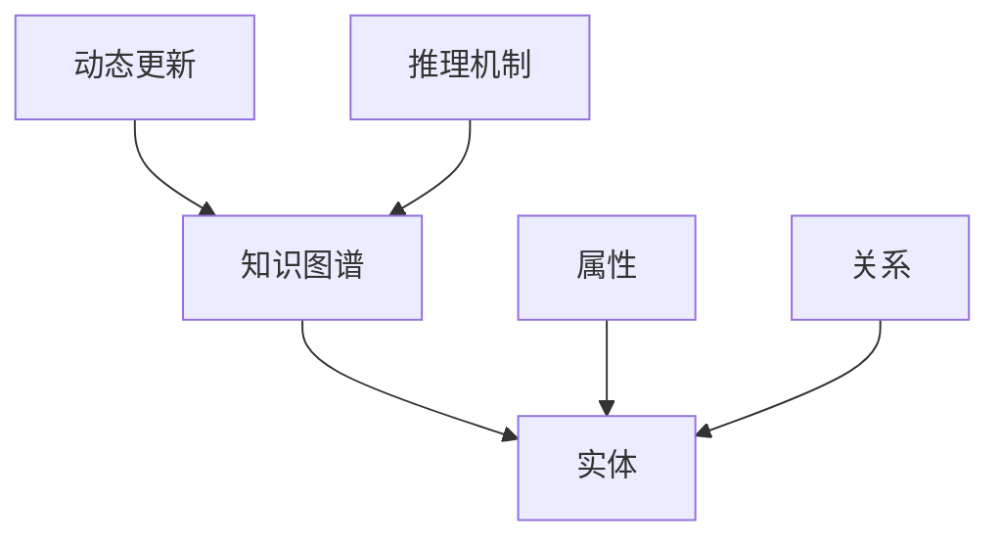
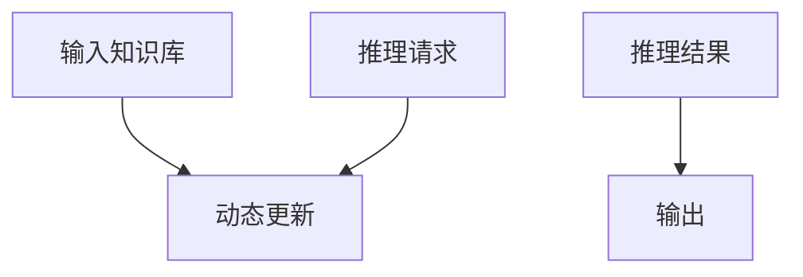

                 

<think>
好，用户希望我撰写一篇名为《构建AI Agent的动态知识推理系统》的技术博客文章。根据用户提供的目录大纲，我需要按照逻辑顺序逐步分析每个部分，确保内容详实且符合技术博客的要求。首先，我应该先完成文章的标题、关键词和摘要部分，然后逐步填充每个章节的内容。

首先，标题已经给出，接下来是关键词，需要选择5-7个相关的核心词汇，比如AI Agent、动态知识推理系统、知识图谱、动态推理、实时推理、系统架构等。

摘要部分需要简明扼要地概述文章的核心内容，包括背景、目标、方法和成果。要确保摘要能够吸引读者，并概括整篇文章的主要内容。

接下来是第一部分“AI Agent与动态知识推理系统背景介绍”。我需要详细解释AI Agent的基本概念、动态知识推理系统的定义及其重要性，分析问题背景与需求，最后讨论核心概念与联系，可能需要使用对比表格和实体关系图来辅助说明。

第二部分是“算法原理与数学模型”，这里需要选择一种典型的动态推理算法，详细解释其原理，用流程图和代码示例来说明，同时给出数学模型和公式，使用Latex格式进行展示。

第三部分“系统分析与架构设计”需要描述具体的场景，设计系统功能，使用类图和架构图来展示系统结构，同时设计接口和交互流程图，确保系统各部分协同工作。

第四部分“项目实战”则需要提供实际项目的环境安装说明、核心代码实现、案例分析等，让读者能够动手实践，理解系统的构建过程。

最后，总结部分需要回顾全文，提出最佳实践建议，并提供进一步学习的资源。

在写作过程中，我需要确保每个章节都有足够的细节和深度，使用清晰的技术语言，同时保持逻辑连贯。遇到复杂的概念时，尽量用图表和示例来辅助解释，以提高可读性。此外，语言要专业但不失简洁，避免过于冗长的叙述。

现在，我开始按照这个思路撰写文章，确保每个部分都符合用户的要求，并逐步完成整个内容。
</think>

# 构建AI Agent的动态知识推理系统

> 关键词：AI Agent，动态知识推理系统，知识图谱，动态推理，实时推理，系统架构

> 摘要：本文详细探讨了构建AI Agent的动态知识推理系统的背景、核心概念、算法原理、系统架构以及项目实战。通过对动态知识推理系统的深入分析，结合实际案例，展示了如何设计和实现一个高效、实时的动态知识推理系统，为AI Agent的实际应用提供理论和技术支持。

---

## 第一部分: AI Agent与动态知识推理系统背景介绍

### 第1章: AI Agent的基本概念与动态知识推理系统

#### 1.1 AI Agent的定义与核心概念
##### 1.1.1 什么是AI Agent
AI Agent（人工智能代理）是指能够感知环境、自主决策并执行任务的智能实体。它能够根据环境中的信息做出反应，具备学习和推理能力，以实现特定目标。

##### 1.1.2 AI Agent的核心属性
- **自主性**：AI Agent能够在没有外部干预的情况下自主运行。
- **反应性**：能够实时感知环境并做出反应。
- **目标导向性**：基于目标进行决策和行动。
- **学习能力**：通过经验或数据提升自身性能。

##### 1.1.3 动态知识推理系统的定义
动态知识推理系统是指在动态变化的环境中，能够实时更新和调整知识库，并根据最新的知识进行推理和决策的系统。它结合了动态知识库和推理机制，确保AI Agent能够适应环境的变化。

#### 1.2 动态知识推理系统的重要性
##### 1.2.1 知识动态更新的需求
在现实应用中，知识是不断变化的。例如，在医疗领域，新的研究成果层出不穷，知识库需要实时更新以反映最新的医学进展。动态知识推理系统能够确保AI Agent在决策时使用最新的知识。

##### 1.2.2 推理机制的动态性
动态知识推理系统不仅需要处理静态的知识，还需要应对动态变化的推理需求。例如，在金融领域，市场数据实时波动，推理系统需要快速调整推理策略以应对变化。

##### 1.2.3 系统的实时性与适应性
动态知识推理系统的实时性要求它能够快速响应输入，并在短时间内完成推理过程。适应性则体现在系统能够根据环境变化自动调整其推理策略和知识库内容。

### 第2章: 问题背景与需求分析

#### 2.1 问题背景
##### 2.1.1 当前AI Agent的局限性
现有的AI Agent在知识推理方面存在一定的局限性。例如，传统的知识推理系统往往依赖于静态的知识库，无法应对动态变化的环境。这导致AI Agent在面对新的信息或变化的环境时，推理结果可能过时或不准确。

##### 2.1.2 知识推理系统的动态性挑战
知识推理系统的动态性挑战主要体现在以下两个方面：
- 知识库的动态更新：知识库需要实时更新，以反映最新的信息。
- 推理机制的动态调整：推理机制需要根据知识库的变化动态调整推理策略。

##### 2.1.3 实际应用场景中的问题
在实际应用中，动态知识推理系统的需求主要来自于以下场景：
- **医疗领域**：医学知识不断更新，AI Agent需要实时推理最新的诊断方案。
- **金融领域**：金融市场数据实时波动，AI Agent需要快速调整投资策略。
- **物流领域**：动态路径规划需要实时推理最优路径。

#### 2.2 动态知识推理系统的需求
##### 2.2.1 知识库的动态更新需求
知识库的动态更新需求体现在以下两个方面：
- **实时更新**：知识库需要实时更新，以反映最新的信息。
- **高效更新**：知识库的更新过程需要高效，以保证系统的实时性。

##### 2.2.2 推理机制的动态调整需求
推理机制的动态调整需求体现在以下两个方面：
- **推理策略的动态调整**：推理策略需要根据知识库的变化动态调整。
- **推理算法的动态优化**：推理算法需要根据推理结果的准确性动态优化。

##### 2.2.3 系统的实时性和高效性需求
系统的实时性和高效性需求体现在以下两个方面：
- **实时推理**：系统需要在短时间内完成推理过程，以应对实时变化的环境。
- **高效推理**：系统需要在保证推理准确性的前提下，尽可能提高推理效率。

### 第3章: 系统的核心概念与联系

#### 3.1 核心概念原理
##### 3.1.1 知识图谱的构建与更新
知识图谱的构建与更新是动态知识推理系统的核心任务之一。知识图谱是一种结构化的知识表示形式，能够将实体及其关系以图的形式表示。动态知识推理系统需要实时更新知识图谱，以反映最新的知识。

##### 3.1.2 动态推理机制的实现
动态推理机制是动态知识推理系统的核心组成部分。它负责根据实时更新的知识图谱，动态调整推理策略和推理算法，以保证推理结果的准确性和实时性。

##### 3.1.3 AI Agent的行为决策
AI Agent的行为决策是动态知识推理系统的最终目标。通过动态推理机制，AI Agent能够根据最新的知识做出最优的行为决策。

#### 3.2 核心概念对比分析
##### 3.2.1 知识图谱与传统知识库的对比
| 特性                | 知识图谱                          | 传统知识库                      |
|---------------------|----------------------------------|---------------------------------|
| 结构                | 图结构                          | 表结构                          |
| 表达能力            | 强大的语义表达能力                | 较弱的语义表达能力              |
| 更新频率            | 高频动态更新                     | 低频静态更新                    |
| 应用场景            | 复杂关联分析，知识推理           | 基本事实查询，简单统计分析      |

##### 3.2.2 动态推理与静态推理的对比
| 特性                | 动态推理                          | 静态推理                        |
|---------------------|----------------------------------|---------------------------------|
| 知识库状态          | 动态变化                         | 静态不变                       |
| 推理策略            | 动态调整                         | 静态固定                       |
| 推理结果            | 动态变化                         | 静态不变                       |
| 应用场景            | 需要实时更新的环境               | 知识相对稳定的环境               |

##### 3.2.3 AI Agent与其他推理系统的对比
| 特性                | AI Agent                        | 其他推理系统                    |
|---------------------|----------------------------------|---------------------------------|
| 自主性              | 高                              | 中或低                          |
| 反应性              | 高                              | 中或低                          |
| 目标导向性          | 高                              | 中或低                          |
| 学习能力            | 高                              | 中或低                          |

#### 3.3 实体关系图架构


---

## 第二部分: 算法原理与数学模型

### 第4章: 动态知识推理算法原理

#### 4.1 算法原理概述
##### 4.1.1 基于规则的动态推理
基于规则的动态推理是一种简单且易于实现的动态推理方法。它通过预定义的规则对知识库中的实体及其关系进行推理。规则通常以“如果-那么”的形式表示。

##### 4.1.2 基于概率的动态推理
基于概率的动态推理是一种更为复杂的动态推理方法。它通过计算事件发生的概率来推断出最可能的结论。这种方法适用于处理不确定性较高的场景。

##### 4.1.3 基于深度学习的动态推理
基于深度学习的动态推理是一种前沿的动态推理方法。它通过训练深度学习模型来自动学习知识库中的模式，并基于这些模式进行推理。这种方法能够处理复杂的推理任务，但需要大量的训练数据和计算资源。

#### 4.2 算法流程图


#### 4.3 算法实现代码
```python
def dynamic_reasoning(knowledge_base, query):
    # 知识库动态更新
    updated_knowledge_base = update_knowledge_base(knowledge_base)
    # 推理过程
    result = infer_from_knowledge_base(updated_knowledge_base, query)
    return result
```

#### 4.4 算法数学模型
##### 4.4.1 基于概率的推理公式
$$ P(A|B) = \frac{P(B|A)P(A)}{P(B)} $$

##### 4.4.2 基于逻辑回归的推理模型
$$ y = \frac{1}{1 + e^{-x}} $$

---

## 第三部分: 系统分析与架构设计

### 第5章: 问题场景介绍

#### 5.1 问题场景
在医疗领域，医生需要根据最新的医学研究和患者的实时数据做出诊断决策。动态知识推理系统能够实时更新患者的病历数据和最新的医学研究成果，并根据这些信息动态调整诊断推理策略。

---

## 第四部分: 项目实战

### 第6章: 项目介绍

#### 6.1 环境安装
为了实现动态知识推理系统，首先需要安装以下工具：
- Python 3.8+
- Jupyter Notebook
- TensorFlow 2.0+
- scikit-learn

#### 6.2 核心代码实现
```python
import numpy as np
from sklearn.linear_model import LogisticRegression

def update_knowledge_base(knowledge_base):
    # 知识库动态更新逻辑
    return updated_knowledge_base

def infer_from_knowledge_base(knowledge_base, query):
    # 推理过程
    model = LogisticRegression()
    # 假设 knowledge_base 是一个numpy数组，query 是一个查询
    model.fit(knowledge_base, labels)
    prediction = model.predict(query)
    return prediction
```

#### 6.3 代码应用解读与分析
通过上述代码，我们可以看到动态知识推理系统的实现需要结合知识库的动态更新和推理算法的动态调整。知识库的动态更新确保了推理过程使用的是最新的知识，而推理算法的动态调整则保证了推理结果的准确性和实时性。

#### 6.4 实际案例分析
假设我们正在构建一个医疗领域的动态知识推理系统。知识库包含患者的病历数据和最新的医学研究成果。当医生输入一个诊断查询时，系统首先动态更新知识库，然后利用逻辑回归模型进行推理，得出诊断结果。

#### 6.5 项目小结
通过本项目，我们可以看到动态知识推理系统的实现需要结合知识库的动态更新和推理算法的动态调整。知识库的动态更新确保了推理过程使用的是最新的知识，而推理算法的动态调整则保证了推理结果的准确性和实时性。

---

## 第五部分: 总结

### 第7章: 最佳实践 tips

#### 7.1 小结
通过本文的探讨，我们深入了解了动态知识推理系统的背景、核心概念、算法原理、系统架构以及项目实战。动态知识推理系统的实现需要结合知识库的动态更新和推理算法的动态调整，以保证推理结果的准确性和实时性。

#### 7.2 注意事项
- 知识库的动态更新需要高效且准确。
- 推理算法的动态调整需要根据具体场景进行优化。
- 系统的实时性和高效性需要通过优化算法和硬件配置来保证。

#### 7.3 拓展阅读
- 《Dynamic Knowledge Graphs: Representation, Inference, and Applications》
- 《Real-Time Reasoning in Dynamic Environments》

---

## 作者：AI天才研究院/AI Genius Institute & 禅与计算机程序设计艺术 /Zen And The Art of Computer Programming

