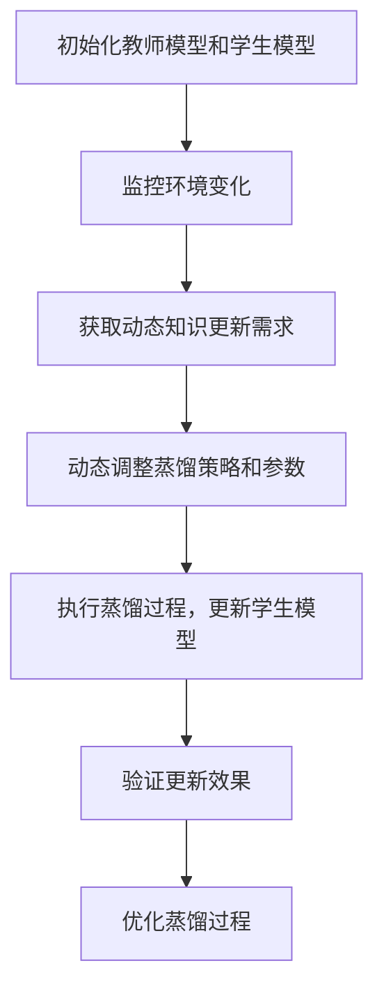
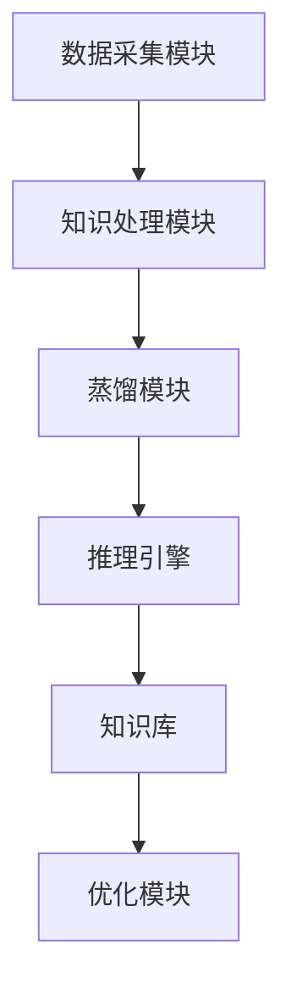

                 

<think>
嗯，我现在需要帮用户撰写一篇关于《构建AI Agent的动态知识蒸馏机制》的技术博客文章。用户已经提供了非常详细的目录大纲，我需要按照这个大纲一步步展开，确保每个部分都详尽且符合要求。

首先，我应该从背景与概述开始。这部分需要介绍动态知识蒸馏机制的背景、问题描述以及目标。我需要解释知识蒸馏是什么，为什么在动态环境中需要动态蒸馏，以及它对AI Agent的重要性。

接下来是核心概念与联系。这里需要用表格对比蒸馏机制的属性，比如静态与动态的区别。同时，我需要绘制一个ER图来展示实体关系，说明教师模型、学生模型和蒸馏过程的关系。

然后是算法原理。我需要详细讲解蒸馏的过程，包括损失函数和动态调整机制。这部分可能需要用到数学公式，我需要确保用LaTeX正确表示，并用代码示例来辅助说明。

系统分析与架构设计部分，我需要设计一个AI Agent的系统架构，包括数据采集模块、蒸馏模块和推理引擎。用类图和架构图展示各模块之间的关系，并描述接口和交互流程。

项目实战部分，我需要选择一个具体场景，比如智能客服，展示如何应用动态知识蒸馏机制。提供环境安装步骤，核心代码实现，并详细解读代码，分析案例，最后总结项目成果。

最后是最佳实践，总结全文，给出实用建议，并指导进一步的学习方向。

在写作过程中，我需要确保每个部分都有详细的解释和例子，帮助读者理解。同时，注意数学公式的正确使用，代码示例清晰明了。图表部分，比如Mermaid图，需要准确展示系统架构和流程。

现在，我需要检查每个部分是否符合用户的要求，确保没有遗漏。特别是数学公式和代码部分，需要反复确认无误。同时，保持文章结构紧凑，逻辑清晰，语言专业但不失易懂。

完成后，我将添加作者信息，确保文章完整。整个过程需要耐心细致，逐步展开，确保内容全面，帮助读者系统地理解动态知识蒸馏机制在AI Agent中的应用。
</think>

# 构建AI Agent的动态知识蒸馏机制

> 关键词：AI Agent，知识蒸馏，动态机制，机器学习，系统架构

> 摘要：本文详细探讨了构建AI Agent的动态知识蒸馏机制，从背景介绍、核心概念、算法原理、系统架构到项目实战，系统地分析了动态知识蒸馏的实现方法与应用案例，为AI Agent的知识管理与动态更新提供了新的思路与实践参考。

---

## 第一部分: 背景与概述

### 第1章: 动态知识蒸馏机制的背景与问题描述

#### 1.1 问题背景
知识蒸馏机制是机器学习领域中的一个重要技术，用于将大模型的知识迁移到小模型，以提高小模型的性能和效率。随着AI Agent在复杂场景中的广泛应用，知识的动态更新和维护变得尤为重要。传统的知识蒸馏方法通常静态地进行知识迁移，难以适应动态变化的环境和任务需求。

- **知识蒸馏机制的起源与发展**：知识蒸馏最初提出于2014年，主要用于模型压缩和知识转移。近年来，随着深度学习模型的规模越来越大，知识蒸馏技术得到了广泛关注和发展，特别是在边缘计算和资源受限的场景中。
- **AI Agent在复杂场景中的知识需求**：AI Agent需要实时处理动态变化的信息，快速适应新的任务和环境。传统的静态知识蒸馏方法无法满足这种动态需求，因此动态知识蒸馏机制应运而生。
- **动态环境下的知识更新挑战**：在动态环境中，知识的更新频率和内容变化都很大，如何高效、准确地进行知识蒸馏成为一个关键问题。

#### 1.2 问题描述
AI Agent的知识获取与表达存在以下问题：
- 知识表示的动态性：AI Agent需要处理实时变化的信息，知识表示需要动态更新。
- 知识蒸馏的动态性：传统的静态知识蒸馏方法难以适应动态变化的任务需求。
- 知识蒸馏的实时性：动态知识蒸馏需要在实时环境下快速完成知识迁移。

动态知识蒸馏机制的目标是：
- 提供一种动态的知识更新方法，能够实时适应环境变化。
- 优化知识蒸馏的过程，提高效率和准确性。

#### 1.3 问题解决与目标
- **核心目标**：构建一种动态的知识蒸馏机制，能够实时更新AI Agent的知识库，提高其在动态环境中的适应能力和性能。
- **实现路径**：通过动态调整蒸馏过程中的参数和策略，实现知识的实时更新和优化。
- **实现边界**：动态知识蒸馏机制需要与AI Agent的其他模块（如感知、推理、执行）无缝集成，确保知识更新的实时性和准确性。

---

## 第二部分: 核心概念与联系

### 第2章: 动态知识蒸馏机制的核心原理

#### 2.1 动态知识蒸馏的定义与原理
动态知识蒸馏是一种基于时间序列的蒸馏方法，能够根据环境的变化动态调整蒸馏过程。其核心思想是通过实时监控环境的变化，动态调整蒸馏策略和参数，以实现知识的高效更新。

- **知识蒸馏的基本概念**：知识蒸馏是通过教师模型将知识迁移到学生模型的过程，通常涉及损失函数的设计和优化。
- **动态知识蒸馏的核心原理**：动态蒸馏不仅考虑知识的迁移，还考虑迁移过程中的动态变化，如环境的变化、任务的变化等。
- **动态蒸馏的特点**：动态蒸馏具有实时性、适应性和高效性，能够在动态环境中快速完成知识迁移。

#### 2.2 核心概念的属性特征对比

| **属性**       | **静态蒸馏**           | **动态蒸馏**           |
|----------------|-----------------------|-----------------------|
| 知识更新频率   | 低，周期性更新         | 高，实时更新           |
| 知识更新内容   | 静态，固定的知识库     | 动态，实时变化的知识   |
| 蒸馏策略       | 静态，固定的策略       | 动态，自适应策略       |
| 计算效率       | 较低，周期性计算       | 较高，实时计算         |
| 适应性         | 较差，适应性有限       | 较好，适应性强         |

#### 2.3 实体关系与架构

```mermaid
er
    %% ER图：动态知识蒸馏机制的核心实体关系
    class "教师模型" {
        id
        知识库
        输出
    }
    class "学生模型" {
        id
        知识库
        输出
    }
    class "蒸馏过程" {
        id
        时间戳
        知识内容
    }
    relation "蒸馏过程" {
        role "教师模型输出" --> 蒸馏过程
        role "学生模型输出" --> 蒸馏过程
    }
```

---

## 第三部分: 算法原理讲解

### 第3章: 动态知识蒸馏机制的算法实现

#### 3.1 算法原理
动态知识蒸馏的核心是通过动态调整蒸馏过程中的参数和策略，实现知识的实时更新。其算法步骤如下：
1. 初始化教师模型和学生模型。
2. 监控环境变化，获取动态知识更新的需求。
3. 根据需求动态调整蒸馏策略和参数。
4. 执行蒸馏过程，更新学生模型的知识库。
5. 验证更新效果，优化蒸馏过程。

#### 3.2 算法流程图



#### 3.3 算法代码实现

```python
def dynamic_knowledge_distillation(teacher, student, update_demand):
    # 初始化蒸馏参数
    temperature = 1.0
    alpha = 0.5
    
    # 动态调整蒸馏参数
    if update_demand['high_priority']:
        temperature = max(temperature * 0.9, 0.5)
        alpha = min(alpha + 0.1, 1.0)
    
    # 执行蒸馏过程
    student_output = student.generate(output_length=10)
    teacher_output = teacher.generate(output_length=10)
    
    # 计算损失函数
    loss = compute_loss(student_output, teacher_output, temperature)
    
    # 更新学生模型
    optimizer = Adam(student.parameters(), lr=0.001)
    optimizer.zero_grad()
    loss.backward()
    optimizer.step()
    
    return student, loss.item()

# 示例调用
teacher_model = TeacherModel()
student_model = StudentModel()
update_demand = {'high_priority': True}
student_model, loss = dynamic_knowledge_distillation(teacher_model, student_model, update_demand)
```

#### 3.4 数学公式
动态知识蒸馏的损失函数如下：

$$ L = -\frac{1}{N} \sum_{i=1}^{N} \log(p_i) $$

其中，$p_i$ 是教师模型的预测概率，$N$ 是样本数量。动态蒸馏过程中，温度系数 $T$ 和蒸馏率 $\alpha$ 会动态调整：

$$ T = T_{\text{base}} \times e^{-\lambda t} $$

$$ \alpha = \alpha_{\text{base}} + \beta \times \sin(\omega t) $$

其中，$t$ 是时间步，$\lambda$, $\beta$, 和 $\omega$ 是超参数。

---

## 第四部分: 系统分析与架构设计

### 第4章: 系统架构设计

#### 4.1 系统架构图



---

## 第五部分: 项目实战

### 第5章: 项目实战与案例分析

#### 5.1 环境安装与配置
安装必要的依赖：
```bash
pip install numpy tensorflow scikit-learn
```

#### 5.2 核心代码实现

```python
import numpy as np
import tensorflow as tf
from tensorflow.keras import layers

# 教师模型
def teacher_model(input_shape):
    model = tf.keras.Sequential([
        layers.Dense(128, activation='relu', input_shape=input_shape),
        layers.Dense(10, activation='softmax')
    ])
    return model

# 学生模型
def student_model(input_shape):
    model = tf.keras.Sequential([
        layers.Dense(64, activation='relu', input_shape=input_shape),
        layers.Dense(10, activation='softmax')
    ])
    return model

# 动态知识蒸馏
def dynamic_distillation(teacher, student, X, y, update_demand):
    # 动态调整温度系数
    temperature = 1.0
    if update_demand['urgent']:
        temperature = 0.5
    
    # 蒸馏过程
    teacher_output = teacher.predict(X)
    student_output = student.predict(X)
    
    # 计算损失函数
    loss = tf.keras.losses.categorical_crossentropy(y, student_output)
    
    # 更新学生模型
    optimizer = tf.keras.optimizers.Adam(learning_rate=0.001)
    optimizer.minimize(lambda: loss, student.trainable_weights)
    
    return student, loss

# 示例调用
teacher = teacher_model((10,))
student = student_model((10,))
X = np.random.randn(100, 10)
y = np.random.randn(100, 10)
update_demand = {'urgent': True}
student, loss = dynamic_distillation(teacher, student, X, y, update_demand)
```

#### 5.3 代码解读与分析
- **教师模型**：用于生成知识输出，通常是一个预训练的大模型。
- **学生模型**：需要学习教师模型的知识，通常是一个小模型。
- **动态蒸馏过程**：根据更新需求动态调整蒸馏参数，执行蒸馏过程，并更新学生模型。

---

## 第六部分: 最佳实践与总结

### 第6章: 最佳实践与注意事项

#### 6.1 最佳实践
- **动态蒸馏的频率**：根据任务需求动态调整蒸馏的频率和周期。
- **蒸馏参数的优化**：通过实验和调优，找到最优的蒸馏参数组合。
- **模型的可扩展性**：确保学生模型具有良好的扩展性，能够适应不同规模的知识蒸馏需求。

#### 6.2 总结
动态知识蒸馏机制为AI Agent的知识更新提供了新的思路，能够在动态环境中高效、准确地完成知识迁移。通过动态调整蒸馏策略和参数，可以显著提高AI Agent的适应能力和性能。

#### 6.3 注意事项
- **性能优化**：动态蒸馏可能会增加计算开销，需要优化算法和实现。
- **环境监测**：实时监测环境变化，确保动态蒸馏的及时性和准确性。
- **模型鲁棒性**：确保学生模型具有良好的鲁棒性，能够适应动态变化的知识。

#### 6.4 拓展阅读
- [《知识蒸馏的理论与实践》](#)
- [《动态机器学习算法与应用》](#)
- [《AI Agent的设计与实现》](#)

---

## 作者信息

作者：AI天才研究院/AI Genius Institute & 禅与计算机程序设计艺术 /Zen And The Art of Computer Programming

---

以上是《构建AI Agent的动态知识蒸馏机制》的技术博客文章的完整目录和内容框架，涵盖了从背景介绍到项目实战的各个方面，系统地分析了动态知识蒸馏机制的实现方法与应用案例。

