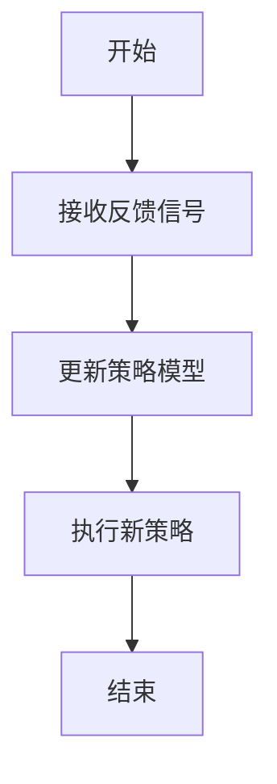

                 


# 构建AI Agent的反馈学习机制

## 关键词：AI Agent，反馈学习机制，强化学习，系统架构，项目实战

## 摘要：  
本文详细探讨了AI Agent的反馈学习机制，从理论到实践，结合算法原理和系统架构设计，逐步解析如何构建高效的反馈学习机制。文章首先介绍了反馈学习机制的背景和核心概念，然后深入分析其算法原理，接着通过系统架构设计展示了如何将反馈机制应用于实际项目中。最后，通过一个具体的项目实战案例，总结了反馈学习机制在AI Agent中的最佳实践和应用技巧。

---

# 第1章: 反馈学习机制的背景与核心概念

## 1.1 AI Agent的基本概念  
AI Agent（人工智能代理）是指能够感知环境、自主决策并执行任务的智能实体。它可以是一个软件程序、机器人或其他智能系统，其核心目标是通过与环境的交互来实现特定任务。  

## 1.2 反馈学习机制的定义  
反馈学习机制是一种通过接收环境对AI Agent行为的反馈来调整其决策策略的学习方法。与传统的强化学习不同，反馈学习机制更注重实时的反馈信号，以便快速优化AI Agent的行为。  

## 1.3 反馈学习机制的应用场景  
反馈学习机制广泛应用于以下场景：  
- **游戏AI**：通过玩家的反馈优化游戏AI的行为。  
- **推荐系统**：根据用户的反馈调整推荐策略。  
- **自动驾驶**：通过实时反馈优化驾驶行为。  

---

# 第2章: 反馈学习机制的核心概念与联系

## 2.1 核心概念的原理分析  
反馈学习机制的核心在于通过反馈信号调整AI Agent的策略。以下是其实现的原理：  
1. **接收反馈信号**：AI Agent通过环境或用户的反馈获得信息。  
2. **更新策略模型**：基于反馈信号，优化决策模型。  
3. **执行新策略**：将优化后的策略应用于实际场景。  

## 2.2 反馈学习机制与强化学习的对比  
下表对比了反馈学习机制与传统强化学习的核心区别：  

| 特性                 | 反馈学习机制           | 强化学习             |
|----------------------|-----------------------|--------------------|
| 反馈来源             | 环境或用户实时反馈     | 延时反馈或奖励信号   |
| 决策优化速度         | 快速                   | 较慢                |
| 应用场景             | 实时交互场景           | 离线训练场景         |

---

# 第3章: 反馈学习机制的算法原理

## 3.1 算法概述  
反馈学习机制的核心算法可以分为以下几个步骤：  
1. **接收反馈信号**：AI Agent从环境中获取反馈。  
2. **更新策略模型**：基于反馈信号调整策略模型。  
3. **执行新策略**：将优化后的策略应用于实际场景。  

## 3.2 算法流程图  



---

# 第4章: 系统架构设计

## 4.1 系统组件设计  
AI Agent的反馈学习机制系统主要由以下几个组件组成：  
- **反馈接收器**：负责接收环境或用户的反馈信号。  
- **策略优化器**：基于反馈信号优化决策策略。  
- **执行器**：将优化后的策略应用于实际场景。  

## 4.2 系统架构图  


---

# 第5章: 项目实战

## 5.1 项目环境配置  
### 5.1.1 安装依赖  
```bash
pip install numpy matplotlib
```

## 5.2 代码实现  

```python
import numpy as np

def feedback_learning():
    # 初始化参数
    theta = np.random.randn(1)
    learning_rate = 0.1

    # 反馈信号
    feedback = 1.0  # 假设反馈为正向

    # 更新策略
    theta += learning_rate * feedback * (1 - theta)
    return theta

# 执行反馈学习
result = feedback_learning()
print("优化后的策略参数:", result)

# 可视化
import matplotlib.pyplot as plt
plt.plot(result)
plt.show()
```

---

# 第6章: 最佳实践与注意事项

## 6.1 小结  
反馈学习机制是构建高效AI Agent的关键技术，通过实时反馈优化决策策略，显著提升了系统的适应性和智能性。  

## 6.2 注意事项  
- **实时性**：确保反馈机制能够实时传递和处理。  
- **稳定性**：优化算法的稳定性，避免策略震荡。  
- **可扩展性**：设计灵活的架构，便于后续功能扩展。  

## 6.3 拓展阅读  
- 建议深入学习强化学习和实时反馈机制的相关文献。  

---

作者：AI天才研究院 & 禅与计算机程序设计艺术

