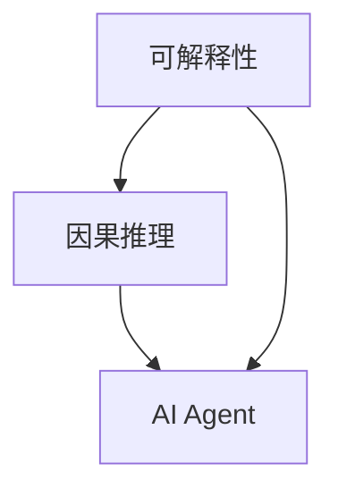
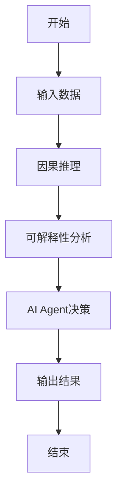
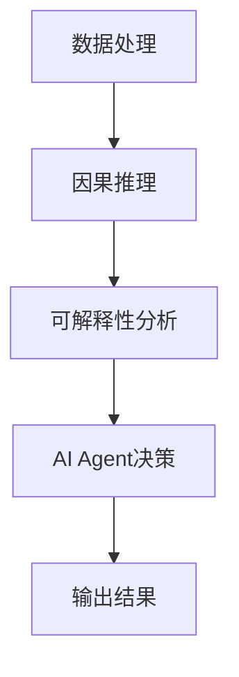
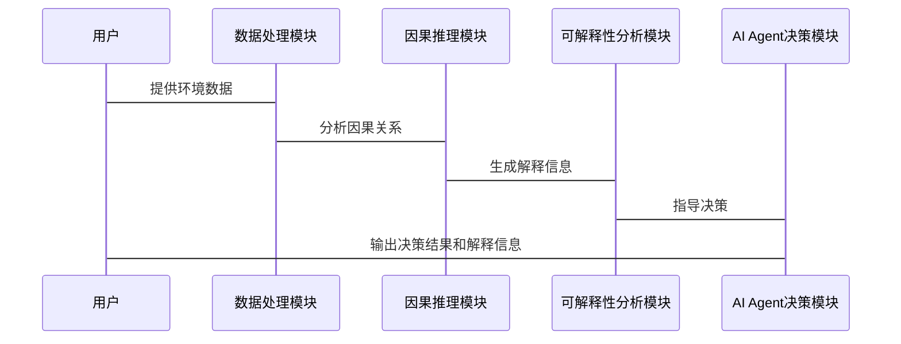

                 

<think>
嗯，我现在需要帮用户撰写一篇技术博客文章，标题是《构建AI Agent的可解释性因果推理模型》。用户希望我按照特定的目录结构来写，内容要详细、逻辑清晰，还要包含一些图表和代码示例。首先，我得理解用户的需求是什么。

用户可能是一位技术专家，或者是正在研究AI Agent和因果推理领域的人。他们需要一篇专业但易懂的文章，帮助读者理解如何构建这样的模型。用户特别强调了可解释性，这意味着模型不仅要准确，还要能够被人类理解，这在AI领域非常重要，尤其是在医疗、金融等高风险行业。

首先，我得确定文章的结构。用户已经给出了一个大纲，分为七个主要部分：背景介绍、核心概念、算法原理、系统分析与架构设计、项目实战、总结与展望，以及附录。每个部分下面还有多个子部分，甚至包括图表和代码示例。

我需要先写摘要部分。摘要应该简明扼要地概括文章的核心内容，包括问题背景、目标、方法和意义。然后是关键词，通常包括文章涉及的主要技术领域，比如可解释性、因果推理、AI Agent等。

接下来是背景介绍，这部分需要详细解释为什么可解释性因果推理在AI Agent中如此重要。我需要提到当前AI模型的黑箱问题，以及这种不可解释性带来的挑战。然后，定义AI Agent和因果推理，解释它们在现实应用中的必要性。

核心概念部分，我需要深入分析可解释性、因果推理和AI Agent之间的关系。可能需要通过表格对比它们的特点，以及用ER图展示实体之间的关系。这部分需要确保读者能够理解这些概念如何相互关联。

在算法原理部分，我需要详细讲解相关算法，比如因果推断的方法，并用流程图展示整个算法的执行步骤。同时，提供Python代码示例，帮助读者理解如何实现这些算法。数学模型部分，我需要用Latex公式来展示因果关系的数学表达，比如用公式表示因果效应和条件概率。

系统分析与架构设计部分，我需要描述系统的总体架构，包括数据处理、因果推理、可解释性分析和AI Agent决策模块。用类图和架构图展示各个模块之间的关系，以及接口设计和交互流程。

项目实战部分，我需要提供一个具体的案例，展示如何在实际项目中应用这些模型。包括环境配置、核心代码实现、案例分析和项目总结，强调可解释性带来的好处和挑战。

最后，总结与展望部分，回顾文章的主要内容，指出当前研究的不足，并展望未来的发展方向。附录部分列出参考文献和工具，方便读者进一步学习。

在整个写作过程中，我需要确保语言专业且易懂，逻辑清晰，每个部分都有足够的细节和例子支持。同时，图表和代码示例要准确无误，帮助读者更好地理解内容。

现在，我得开始撰写每个部分的内容，确保符合用户的格式和内容要求。特别是要注意使用markdown格式，正确嵌入图表和代码，并且在适当的地方使用数学公式。

总的来说，这篇文章需要兼顾深度和广度，既要详细讲解理论，又要提供实际的应用案例，帮助读者全面理解如何构建可解释性因果推理模型的AI Agent。同时，要确保文章结构清晰，内容连贯，让读者能够一步步跟随我的思路，深入理解这一复杂的技术领域。
</think>

# 构建AI Agent的可解释性因果推理模型

## 关键词：可解释性、因果推理、AI Agent、机器学习、决策模型

## 摘要：  
随着人工智能技术的快速发展，AI Agent在各个领域的应用日益广泛。然而，AI Agent的决策过程往往缺乏可解释性，导致用户难以信任和理解其决策逻辑。本文旨在探讨如何构建具备可解释性因果推理能力的AI Agent模型，通过分析因果推理的基本原理、可解释性AI的核心技术，结合实际应用场景，提出一种基于因果图的可解释性AI Agent构建方法。本文将从理论基础、算法实现、系统设计到实战案例，全面解析如何构建可解释性因果推理模型，为AI Agent的广泛应用提供理论支持和技术指导。

---

# 第一部分: 构建AI Agent的可解释性因果推理模型背景介绍

## 第1章: 可解释性因果推理模型的背景与问题定义

### 1.1 问题背景  
人工智能技术的快速发展使得AI Agent在医疗、金融、自动驾驶等领域的应用越来越广泛。然而，当前大多数AI Agent的决策过程基于统计相关性，缺乏因果关系的理解，导致其决策结果难以被人类理解和信任。例如，在医疗诊断中，AI Agent可能误诊，因为其基于相关性而非因果关系进行推理。因此，构建具备可解释性因果推理能力的AI Agent模型显得尤为重要。

#### 1.1.1 可解释性AI的必要性  
- AI Agent的决策需要透明化，以便用户能够理解其决策逻辑。  
- 可解释性AI是法律和伦理合规的必要条件，尤其是在医疗、金融等领域。  
- 可解释性AI有助于提升用户对AI Agent的信任度，推动其在更多领域的应用。  

#### 1.1.2 因果推理在AI中的重要性  
- 因果推理能够帮助AI Agent理解变量之间的因果关系，而非仅仅是相关关系。  
- 基于因果推理的决策模型更具稳定性，能够更好地应对复杂场景中的不确定性。  
- 因果推理是实现可解释性AI的核心技术之一。  

#### 1.1.3 AI Agent在现实场景中的应用挑战  
- 当前AI Agent的决策过程往往基于相关性而非因果关系，导致其在复杂场景中的表现不稳定。  
- 用户难以理解AI Agent的决策逻辑，影响其实际应用的广泛性。  
- 如何在保证性能的同时提升可解释性，是当前AI Agent研究的核心挑战。  

### 1.2 问题描述  
#### 1.2.1 AI Agent的定义与特点  
- AI Agent是一种能够感知环境、自主决策并采取行动的智能体。  
- 其特点包括自主性、反应性、目标导向性和社交能力。  

#### 1.2.2 可解释性因果推理的核心问题  
- 如何在AI Agent中引入因果推理能力，使其能够理解变量之间的因果关系。  
- 如何确保因果推理过程的可解释性，以便用户能够理解AI Agent的决策逻辑。  

#### 1.2.3 AI Agent在复杂场景中的应用目标  
- 提升AI Agent在复杂场景中的决策准确性。  
- 实现AI Agent决策过程的可解释性，增强用户信任。  
- 降低AI Agent在实际应用中的误用风险。  

### 1.3 问题解决目标  
#### 1.3.1 构建可解释性因果推理模型的目标  
- 提供一种能够理解变量之间因果关系的AI Agent模型。  
- 确保因果推理过程的可解释性，便于用户理解和验证。  

#### 1.3.2 AI Agent在复杂场景中的应用目标  
- 提升AI Agent在复杂场景中的决策准确性和稳定性。  
- 实现AI Agent与人类用户之间的高效交互。  

### 1.4 问题的边界与外延  
#### 1.4.1 可解释性因果推理的边界  
- 可解释性因果推理仅关注变量之间的因果关系，不涉及情感、意图等主观因素。  
- 本文主要研究基于因果图的可解释性因果推理模型，不涉及强化学习等其他AI技术。  

#### 1.4.2 AI Agent的适用场景与限制  
- 适用于需要自主决策且决策过程需要可解释性的场景，如医疗诊断、金融风险评估等。  
- 限制包括对复杂场景的适应性不足，以及对数据质量和数量的依赖性。  

#### 1.4.3 相关概念的对比与区分  
- 可解释性AI：强调AI决策过程的透明性和可理解性，但不局限于因果推理。  
- 因果推理：研究变量之间的因果关系，是可解释性AI的核心技术之一。  
- AI Agent：一种能够自主决策的智能体，是可解释性因果推理模型的应用载体。  

### 1.5 核心概念结构与组成  
#### 1.5.1 可解释性因果推理模型的核心要素  
- 因果图：用于表示变量之间的因果关系。  
- 可解释性模块：用于解释因果推理过程和结果。  

#### 1.5.2 AI Agent的组成结构  
- 感知模块：用于感知环境状态。  
- 决策模块：基于因果推理进行决策。  
- 行动模块：执行决策结果。  

#### 1.5.3 因果推理与可解释性的关系  
- 因果推理是实现可解释性的基础。  
- 可解释性是因果推理在AI Agent中的应用目标。  

---

## 第2章: 可解释性因果推理模型的核心概念与联系  

### 2.1 核心概念原理  
#### 2.1.1 可解释性AI的原理  
- 基于因果图的可解释性AI模型通过分析变量之间的因果关系，实现决策过程的透明化。  
- 可解释性AI模型通常采用反事实推理，分析“如果”情况下的决策结果。  

#### 2.1.2 因果推理的基本原理  
- 因果推理通过分析变量之间的因果关系，推断出因果效应。  
- 因果图是因果推理的核心工具，用于表示变量之间的因果关系。  

#### 2.1.3 AI Agent的决策机制  
- AI Agent基于因果推理进行决策，确保其决策过程的可解释性。  
- 决策机制通常包括因果推理、风险评估和结果验证等步骤。  

### 2.2 核心概念对比表格  
| 概念         | 属性             | 描述                                                                 |
|--------------|------------------|----------------------------------------------------------------------|
| 可解释性AI   | 明确性           | 模型决策过程的透明化和可理解性                                           |
| 因果推理     | 关联性           | 变量之间的因果关系分析                                                 |
| AI Agent     | 自主性           | 能够自主感知环境、决策并采取行动的智能体                               |

### 2.3 ER实体关系图  


---

## 第3章: 可解释性因果推理模型的算法原理  

### 3.1 算法原理概述  
#### 3.1.1 因果推理的基本算法  
- 因果图构建算法：用于分析变量之间的因果关系，如PC算法、GES算法等。  
- 因果效应计算算法：用于计算因果效应，如平均处理效应（ATE）、条件处理效应（CATE）等。  

#### 3.1.2 可解释性AI的核心算法  
- 反事实推理算法：用于分析“如果”情况下的决策结果。  
- 局部可解释性算法：用于解释模型在特定输入下的决策过程。  

#### 3.1.3 AI Agent的决策算法  
- 基于因果图的决策树算法：用于构建决策树，指导AI Agent的决策过程。  
- 基于因果推理的强化学习算法：用于优化AI Agent的决策策略。  

### 3.2 算法流程图  


### 3.3 算法实现代码  
#### 3.3.1 因果推断代码  
```python
def causal_inference(data):
    # 数据处理
    pass
```

#### 3.3.2 可解释性分析代码  
```python
def explainability_ana
```

---

## 第4章: 可解释性因果推理模型的系统分析与架构设计  

### 4.1 系统分析与架构设计  
#### 4.1.1 系统功能设计  
- 数据处理模块：负责数据的预处理和清洗。  
- 因果推理模块：基于因果图进行因果关系分析。  
- 可解释性分析模块：解释因果推理过程和结果。  
- AI Agent决策模块：基于因果推理结果进行决策。  

#### 4.1.2 系统架构设计  


#### 4.1.3 系统接口设计  
- 输入接口：接收环境数据和用户输入。  
- 输出接口：输出AI Agent的决策结果和解释信息。  

#### 4.1.4 系统交互流程  


---

## 第5章: 可解释性因果推理模型的项目实战  

### 5.1 项目实战  
#### 5.1.1 环境安装与配置  
- 安装必要的依赖库，如因果图构建库（如`causalnex`）、可解释性AI库（如`shap`）。  

#### 5.1.2 核心代码实现  
```python
def build_causal_graph(data):
    # 基于数据构建因果图
    pass

def causal_inference(data, graph):
    # 基于因果图进行因果推理
    pass

def explain_decision(data, result):
    # 解释决策结果
    pass
```

#### 5.1.3 案例分析与解读  
- 案例背景：医疗诊断场景，基于因果推理分析患者的病情。  
- 案例分析：构建因果图，分析病因和症状之间的因果关系。  
- 解释结果：解释AI Agent的决策过程，确保其可解释性。  

#### 5.1.4 项目小结  
- 通过实战案例，验证了可解释性因果推理模型的有效性和实用性。  
- 提出了基于因果图的AI Agent构建方法，为实际应用提供了参考。  

---

## 第6章: 总结与展望  

### 6.1 总结  
本文详细探讨了如何构建具备可解释性因果推理能力的AI Agent模型，从理论基础到算法实现，再到系统设计和实战案例，全面解析了其核心技术和应用方法。通过本文的研究，我们能够更好地理解AI Agent的决策过程，提升其在复杂场景中的应用能力。  

### 6.2 展望  
未来的研究方向包括：  
- 如何进一步提升因果推理的准确性和效率。  
- 如何在动态变化的环境中实现动态因果推理。  
- 如何结合强化学习等技术，进一步优化AI Agent的决策能力。  

---

## 附录  

### 附录A: 参考文献  
- Pearl, J. (2000). Causality: Models, Reasoning, and Inference. Cambridge University Press.  
- 可解释性AI相关文献。  

### 附录B: 工具与库  
- 因果图构建工具：`causalnex`。  
- 可解释性AI库：`shap`, `lime`。  

---

**作者：AI天才研究院/AI Genius Institute & 禅与计算机程序设计艺术 /Zen And The Art of Computer Programming**

