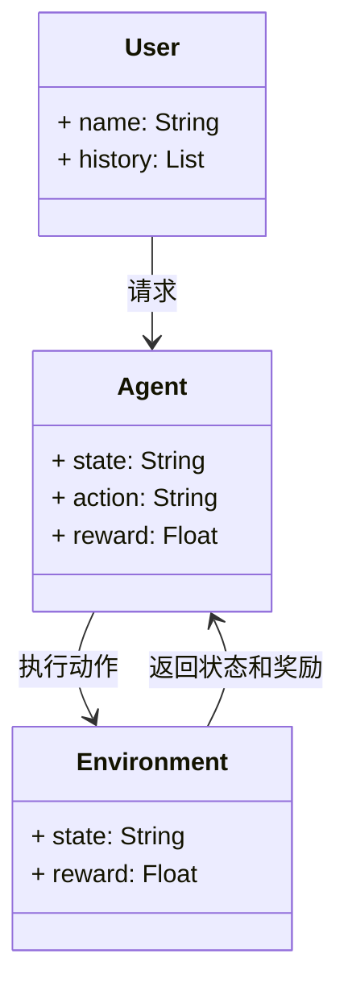
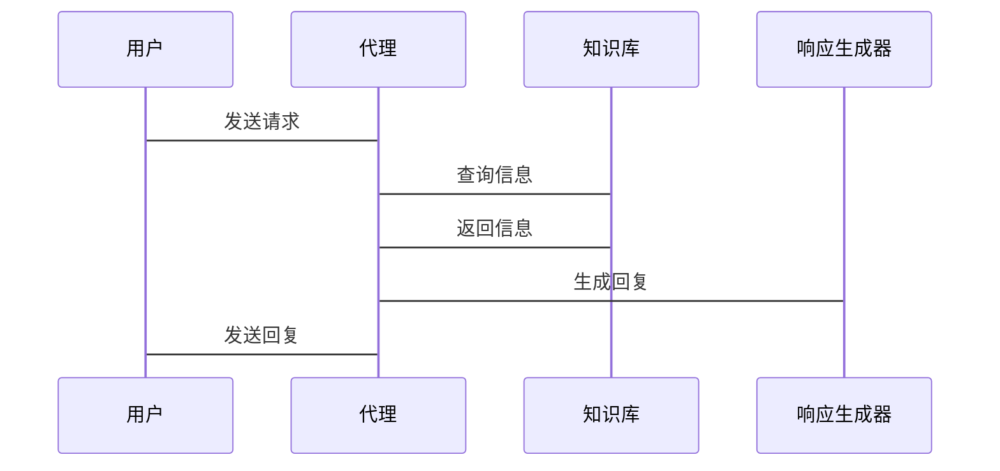

                 


# 构建AI Agent的可解释性强化学习模型

> 关键词：强化学习，可解释性AI，AI Agent，DQN，REINFORCE，系统架构

> 摘要：本文详细探讨了构建AI Agent的可解释性强化学习模型的关键技术。通过分析强化学习算法的基本原理，结合可解释性AI的核心概念，本文提出了一种基于DQN和REINFORCE的可解释性强化学习框架，并通过实际案例展示了如何在智能客服对话系统中实现这一模型。

---

# 第1章: 强化学习与可解释性AI概述

## 1.1 强化学习的基本概念

### 1.1.1 强化学习的定义
强化学习是一种机器学习范式，其中智能体通过与环境交互来学习策略，以最大化累积奖励。智能体通过试错方法优化其行为，以达到长期目标。

### 1.1.2 强化学习的核心要素
- **状态 (State)**：智能体所处环境的当前情况。
- **动作 (Action)**：智能体在某一状态下选择的行为。
- **奖励 (Reward)**：智能体执行动作后获得的反馈，用于评估动作的好坏。
- **策略 (Policy)**：智能体选择动作的规则，可以是确定性或概率性的。

### 1.1.3 可解释性AI的定义与重要性
可解释性AI是指AI系统能够以人类可理解的方式解释其决策过程。在医疗、金融等领域，可解释性是信任和合规的关键。

## 1.2 AI Agent的基本概念

### 1.2.1 AI Agent的定义
AI Agent是具有感知环境、做出决策并执行动作的智能实体，广泛应用于游戏、推荐系统和自动驾驶等领域。

### 1.2.2 AI Agent的类型
- **简单反射型**：基于当前状态直接做出反应。
- **基于模型型**：使用环境模型进行决策。
- **目标驱动型**：根据目标选择最优动作。

### 1.2.3 可解释性AI Agent的优势
可解释性AI Agent能够帮助用户理解其决策过程，增强信任并便于调试和优化。

## 1.3 强化学习与可解释性AI的结合

### 1.3.1 强化学习在AI Agent中的应用
- 游戏AI：通过强化学习训练AI Agent在复杂环境中做出最优决策。
- 自动驾驶：通过强化学习优化驾驶策略。

### 1.3.2 可解释性在AI Agent中的必要性
- **透明性**：用户需要理解AI Agent的决策逻辑。
- **责任归属**：在决策错误时，需要明确责任方。

### 1.3.3 强化学习与可解释性的关系
通过设计可解释的强化学习算法，AI Agent可以在优化性能的同时，保持决策过程的透明性。

---

# 第2章: 强化学习算法基础

## 2.1 马尔可夫决策过程

### 2.1.1 状态空间
所有可能的状态的集合，状态转移由动作决定。

### 2.1.2 动作空间
所有可能的动作的集合。

### 2.1.3 奖励函数
定义智能体在某一状态执行某动作后获得的奖励。

## 2.2 Q-learning算法

### 2.2.1 Q-learning的基本原理
通过学习Q值表，Q(s, a)表示在状态s执行动作a的期望奖励。

### 2.2.2 Q-learning的更新公式
$$ Q(s, a) = Q(s, a) + \alpha [r + \gamma \max Q(s', a') - Q(s, a)] $$

### 2.2.3 Q-learning的优缺点
- 优点：简单易实现。
- 缺点：在复杂环境中性能不稳定。

## 2.3 策略梯度方法

### 2.3.1 策略梯度的基本原理
通过优化策略的参数，最大化累积奖励的期望。

### 2.3.2 策略梯度的数学模型
$$ \nabla \theta = \mathbb{E}[ \nabla \log \pi_\theta(a|s) \cdot Q_\theta(s, a) ] $$

### 2.3.3 策略梯度的优缺点
- 优点：在高维状态空间中表现良好。
- 缺点：计算复杂，收敛较慢。

---

# 第3章: 可解释性AI的核心概念

## 3.1 可解释性的定义与维度

### 3.1.1 可解释性的定义
AI系统能够以人类可理解的方式解释其决策过程。

### 3.1.2 可解释性的关键维度
- **可理解性**：决策逻辑清晰。
- **可追溯性**：能够回溯决策过程。
- **可控制性**：用户能够干预决策。

### 3.1.3 可解释性的评估方法
通过用户研究、日志分析等方法评估解释的清晰度和实用性。

## 3.2 可解释性与强化学习的结合

### 3.2.1 强化学习中的可解释性需求
用户需要理解AI Agent的决策逻辑，以增强信任。

### 3.2.2 可解释性在强化学习中的实现方法
通过可视化Q值变化、记录策略优化过程等方式增强可解释性。

### 3.2.3 可解释性对AI Agent的影响
提高可解释性能够增强用户信任，便于调试和优化。

---

# 第4章: 强化学习算法的可解释性实现

## 4.1 DQN算法的可解释性

### 4.1.1 DQN算法的基本原理
通过神经网络近似Q值函数，解决Q-learning的样本不稳定问题。

### 4.1.2 DQN算法的可解释性实现
通过可视化Q值的变化，展示不同状态下的决策过程。

### 4.1.3 DQN算法的优缺点
- 优点：稳定，适用于离散动作空间。
- 缺点：在连续动作空间中表现不佳。

## 4.2 D3QN算法的可解释性

### 4.2.1 D3QN算法的基本原理
通过引入优先经验回放和延迟策略更新，提高样本利用率。

### 4.2.2 D3QN算法的可解释性实现
通过记录经验回放中的重要样本，展示决策过程的关键因素。

### 4.2.3 D3QN算法的优缺点
- 优点：提高样本效率。
- 缺点：实现复杂度较高。

## 4.3 REINFORCE算法的可解释性

### 4.3.1 REINFORCE算法的基本原理
通过策略梯度方法优化策略参数，最大化累积奖励。

### 4.3.2 REINFORCE算法的可解释性实现
通过记录策略参数的变化，展示决策过程的优化路径。

### 4.3.3 REINFORCE算法的优缺点
- 优点：适用于连续动作空间。
- 缺点：收敛速度较慢。

---

# 第5章: 系统分析与架构设计

## 5.1 问题场景介绍

### 5.1.1 问题背景
构建一个智能客服对话系统，要求系统能够理解用户需求并做出最优回复。

### 5.1.2 问题描述
系统需要在多种对话场景中做出决策，确保回复的准确性和可解释性。

## 5.2 系统功能设计

### 5.2.1 领域模型
使用Mermaid类图展示系统的模块关系。



## 5.3 系统架构设计

### 5.3.1 系统架构
使用Mermaid架构图展示系统的整体架构。


## 5.4 系统接口设计

### 5.4.1 系统接口
定义系统的主要接口，如：
- `start()`: 初始化系统。
- `process_request(request: String) -> String`: 处理用户请求并返回回复。

## 5.5 系统交互流程

### 5.5.1 系统交互
使用Mermaid序列图展示系统的交互流程。



---

# 第6章: 项目实战

## 6.1 环境安装

### 6.1.1 安装Python
确保安装Python 3.8及以上版本。

### 6.1.2 安装依赖
使用pip安装所需的依赖包，如numpy、tensorflow、keras等。

## 6.2 核心代码实现

### 6.2.1 DQN算法实现

```python
import numpy as np
import tensorflow as tf

class DQN:
    def __init__(self, state_space, action_space):
        self.state_space = state_space
        self.action_space = action_space
        self.model = self.build_model()

    def build_model(self):
        model = tf.keras.Sequential([
            tf.keras.layers.Dense(32, activation='relu'),
            tf.keras.layers.Dense(32, activation='relu'),
            tf.keras.layers.Dense(self.action_space, activation='linear')
        ])
        return model

    def remember(self, state, action, reward, next_state):
        # 实现记忆功能
        pass

    def act(self, state):
        # 实现动作选择
        pass

    def replay(self, batch_size):
        # 实现经验回放
        pass
```

### 6.2.2 REINFORCE算法实现

```python
import numpy as np
import tensorflow as tf

class REINFORCE:
    def __init__(self, state_space, action_space):
        self.state_space = state_space
        self.action_space = action_space
        self.model = self.build_model()

    def build_model(self):
        model = tf.keras.Sequential([
            tf.keras.layers.Dense(32, activation='relu'),
            tf.keras.layers.Dense(32, activation='relu'),
            tf.keras.layers.Dense(self.action_space, activation='softmax')
        ])
        return model

    def act(self, state):
        # 实现动作选择
        pass

    def update(self, episodes):
        # 实现策略更新
        pass
```

## 6.3 实际案例分析

### 6.3.1 智能客服对话系统
实现一个基于DQN算法的智能客服对话系统，通过训练模型优化对话策略。

### 6.3.2 模型测试与优化
通过测试数据评估模型性能，并根据反馈优化模型参数。

## 6.4 项目小结

### 6.4.1 项目总结
详细总结项目实现的关键点和遇到的问题。

### 6.4.2 优化方向
提出进一步优化模型性能和可解释性的建议。

---

# 第7章: 最佳实践与总结

## 7.1 最佳实践

### 7.1.1 可解释性设计
在算法设计阶段就考虑可解释性需求。

### 7.1.2 模型监控
定期监控模型性能，及时发现和解决问题。

## 7.2 小结

### 7.2.1 项目总结
总结整个项目的实施过程和取得的成果。

### 7.2.2 展望未来
展望未来的研究方向和应用前景。

## 7.3 注意事项

### 7.3.1 模型选择
根据具体场景选择合适的强化学习算法。

### 7.3.2 数据质量
确保数据质量和多样性，避免模型过拟合。

## 7.4 拓展阅读

### 7.4.1 推荐书籍
推荐几本关于强化学习和可解释性AI的经典书籍。

### 7.4.2 在线资源
推荐一些相关的在线课程和论文。

---

# 作者：AI天才研究院 & 禅与计算机程序设计艺术

---

通过以上结构，您可以逐步完成一篇详细的技术博客文章，涵盖从理论到实践的各个方面，帮助读者全面理解如何构建可解释性强化学习模型的AI Agent。

