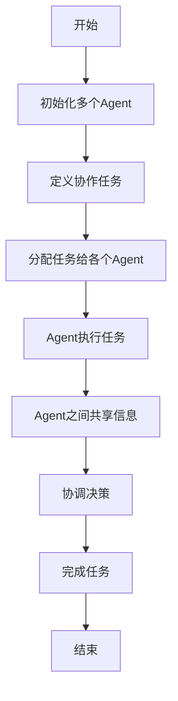
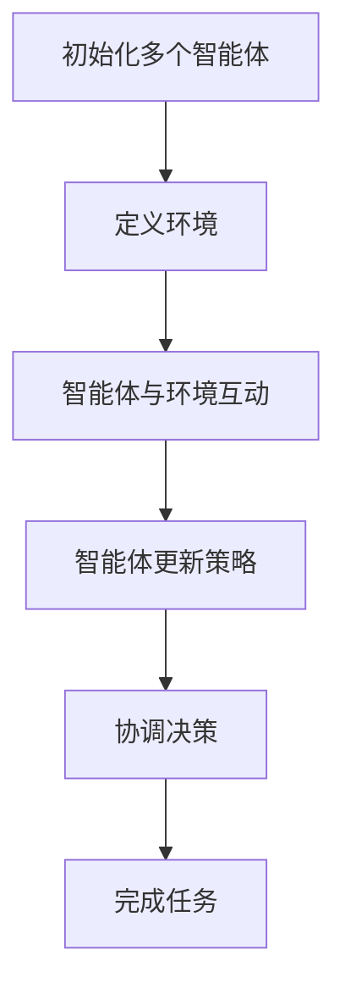
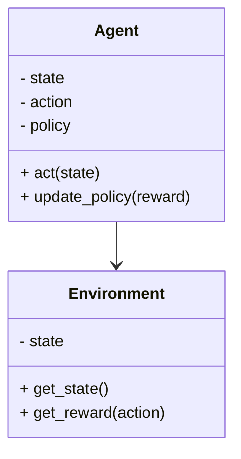
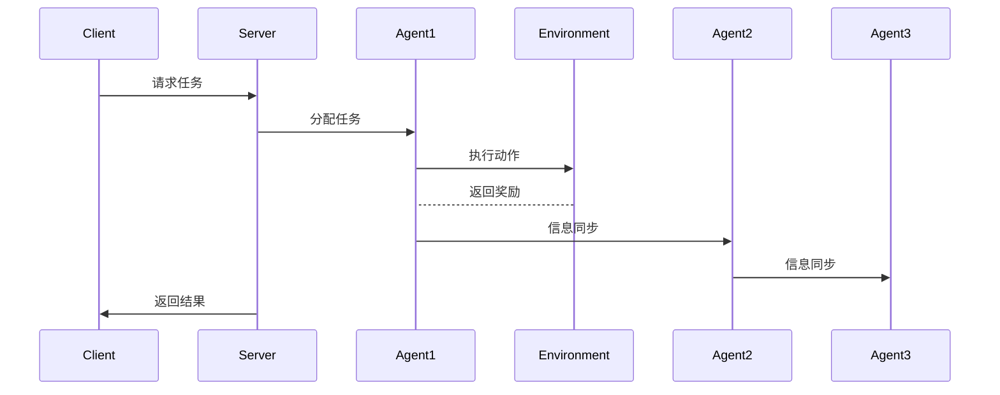

                 

<think>
好，我需要帮助用户撰写一篇关于《构建AI Agent的多Agent协作学习系统》的技术博客文章。用户已经给出了详细的大纲和一些具体要求，我需要按照这个大纲来逐步构建内容。

首先，用户希望文章结构清晰，逻辑紧凑，语言专业且技术深度足够。我需要先理解每个章节的核心内容，确保每个部分都覆盖必要的知识点。

**第一步：背景介绍**
- 需要解释什么是多Agent协作学习，其背景和重要性。
- 区分多Agent与传统机器学习的不同，以及为什么协作学习在当前技术中是必要的。

**第二步：核心概念与联系**
- 详细讲解协作学习的基本原理，包括各个Agent如何互动、通信和协调。
- 使用对比表格和ER图来展示不同概念的联系和区别，帮助读者理解复杂的系统结构。

**第三步：算法原理**
- 选择几个关键算法，如分布式强化学习和多智能体Q学习，详细讲解其工作原理。
- 通过流程图和代码示例，让读者能够实际应用这些算法。

**第四步：系统架构设计**
- 介绍项目背景，设计系统功能模块，如任务分配、信息共享和决策协调。
- 使用类图和架构图展示系统结构，帮助读者理解整体设计。

**第五步：项目实战**
- 选择一个具体案例，如无人机编队任务，详细描述环境搭建、代码实现和结果分析。
- 通过实际操作，让读者能够掌握协作学习系统的设计和实现。

**第六步：总结与展望**
- 总结全书内容，强调多Agent协作学习的重要性和应用前景。
- 提供未来研究方向和实际应用的建议，帮助读者扩展知识。

在撰写过程中，我需要确保每个部分都有足够的细节，并使用图表和代码示例来增强可读性。同时，要保持语言的专业性和逻辑的连贯性，确保读者能够一步步理解构建多Agent协作学习系统的过程。

最后，检查是否满足用户的格式要求，包括使用markdown、正确嵌入Mermaid图表和LaTeX公式，以及在文章末尾添加作者信息。确保文章整体流畅，内容详实，达到用户的要求。
</think>

# 《构建AI Agent的多Agent协作学习系统》

> 关键词：多Agent协作学习，AI Agent，分布式强化学习，多智能体系统，协作算法，系统架构设计

> 摘要：本文系统地介绍了构建AI Agent的多Agent协作学习系统的理论基础、核心算法、系统架构设计以及实际应用案例。通过逐步分析和深入探讨，本文揭示了多Agent协作学习的关键原理，对比了不同协作方法的优劣，详细讲解了典型算法的实现过程，并通过实际案例展示了系统的构建和优化方法。本文旨在为研究人员和工程师提供一份全面的技术指南，帮助他们在复杂场景中高效构建和优化多Agent协作学习系统。

---

# 第一部分: 多Agent协作学习系统概述

## 第1章: 多Agent协作学习系统背景介绍

### 1.1 多Agent协作学习的定义与背景

#### 1.1.1 问题背景与问题描述
多Agent协作学习（Multi-Agent Collaborative Learning, MACL）是一种新兴的人工智能技术，旨在通过多个智能体（Agent）之间的协作与配合，共同完成复杂任务。随着人工智能技术的快速发展，单个智能体的能力已无法满足许多实际场景的需求，例如自动驾驶、智能机器人协作、分布式计算和网络优化等领域，均需要多个智能体协同工作。然而，这些场景往往涉及复杂的任务分配、信息共享和决策协调问题，传统的单智能体学习方法难以有效应对。

#### 1.1.2 多Agent协作学习的核心概念
多Agent协作学习的核心在于多个智能体之间的协作与学习。智能体通过共享信息、协商任务分工、协调决策等方式，共同完成目标。与单智能体学习不同，多Agent协作学习需要考虑多个智能体之间的互动关系、信息共享机制以及决策协调问题。

#### 1.1.3 多Agent协作学习的边界与外延
多Agent协作学习的边界在于多个智能体之间的协作与学习。其外延包括分布式计算、分布式优化、博弈论、分布式强化学习等领域。通过与这些领域的结合，多Agent协作学习能够实现更复杂、更高效的协作任务。

#### 1.1.4 多Agent协作学习的概念结构与核心要素
多Agent协作学习的概念结构包括以下几个核心要素：
- **智能体（Agent）**：能够感知环境并采取行动的实体。
- **协作任务（Collaborative Task）**：需要多个智能体共同完成的任务。
- **信息共享（Information Sharing）**：智能体之间共享信息以实现协作。
- **决策协调（Decision Coordination）**：智能体之间协调决策以实现共同目标。

### 1.2 多Agent协作学习与相关技术的对比

#### 1.2.1 多Agent协作学习与传统机器学习的对比
| 对比维度         | 单智能体学习                | 多Agent协作学习           |
|------------------|-----------------------------|--------------------------|
| 智能体数量       | 1                           | 多                       |
| 信息共享方式     | 单点控制                    | 分布式共享               |
| 任务复杂度       | 较低                        | 较高                     |
| 应用场景         | 简单任务，如分类、回归       | 复杂任务，如自动驾驶、协作机器人 |

#### 1.2.2 多Agent协作学习与分布式系统的关系
多Agent协作学习与分布式系统密切相关。分布式系统通过将任务分配给多个节点完成，而多Agent协作学习则通过多个智能体的协作来实现任务。两者的区别在于，多Agent协作学习更注重智能体之间的协作与学习，而分布式系统更注重任务的分解与执行。

#### 1.2.3 多Agent协作学习与博弈论的联系
多Agent协作学习与博弈论的联系主要体现在智能体之间的决策协调问题。博弈论研究多个决策者在竞争或合作环境下的行为，而多Agent协作学习则通过博弈论的方法，研究多个智能体如何协作以实现共同目标。

---

## 第2章: 多Agent协作学习的核心概念与联系

### 2.1 多Agent协作学习的核心原理

#### 2.1.1 多Agent协作学习的基本原理
多Agent协作学习的核心原理在于通过多个智能体之间的协作与学习，共同完成复杂任务。智能体之间通过共享信息、协商任务分工、协调决策等方式，实现协作。

#### 2.1.2 多Agent协作学习的关键特征
| 特征         | 描述                           |
|--------------|--------------------------------|
| 分布式协作   | 智能体分布在网络中，协作完成任务 |
| 信息共享     | 智能体之间共享信息以实现协作   |
| 自适应性     | 系统能够根据环境变化自适应调整 |

#### 2.1.3 多Agent协作学习的数学模型
多Agent协作学习的数学模型可以通过以下公式表示：
$$ V = \sum_{i=1}^{n} v_i $$
其中，$v_i$ 表示第 $i$ 个智能体的贡献值，$n$ 是智能体的数量。

### 2.2 多Agent协作学习的核心概念对比

#### 2.2.1 中心化与去中心化协作方法对比
| 方法         | 描述                           |
|--------------|--------------------------------|
| 中心化协作   | 有一个中心节点协调所有智能体的协作 |
| 去中心化协作 | 智能体之间通过去中心化的方式协作   |

#### 2.2.2 协作与竞争策略对比
| 策略         | 描述                           |
|--------------|--------------------------------|
| 合作型策略   | 智能体之间协作完成任务           |
| 对抗型策略   | 智能体之间竞争完成任务           |

#### 2.2.3 合作型与对抗型多Agent系统对比
| 对比维度         | 合作型系统                | 对抗型系统               |
|------------------|-----------------------------|--------------------------|
| 系统目标         | 最大化整体收益              | 最小化对手收益            |
| 智能体关系       | 合作                      | 竞争                     |
| 适用场景         | 分配任务、资源共享          | 游戏、对抗性任务          |

### 2.3 多Agent协作学习的ER实体关系图
```mermaid
er
actor: 多Agent协作学习系统
role: Agent角色
entity: Agent个体
relationship: 协作关系
```

### 2.4 多Agent协作学习的流程图


---

## 第3章: 多Agent协作学习算法原理

### 3.1 分布式强化学习算法

#### 3.1.1 分布式强化学习的基本原理
分布式强化学习是一种通过多个智能体协作完成任务的强化学习方法。智能体通过与环境互动，逐步学习策略以最大化整体奖励。

#### 3.1.2 分布式强化学习的算法流程


#### 3.1.3 分布式强化学习的Python代码实现
```python
import numpy as np

class Agent:
    def __init__(self, state_space, action_space):
        self.state_space = state_space
        self.action_space = action_space
        self.policy = np.random.rand(state_space, action_space)

    def act(self, state):
        return np.argmax(self.policy[state])

def distributed_reinforcement_learning(num_agents, state_space, action_space):
    agents = [Agent(state_space, action_space) for _ in range(num_agents)]
    environment = Environment(state_space)
    while not done:
        for agent in agents:
            state = environment.get_state()
            action = agent.act(state)
            reward = environment.get_reward(action)
            agent.update_policy(reward)

class Environment:
    def __init__(self, state_space):
        self.state_space = state_space
        self.current_state = np.zeros(state_space)

    def get_state(self):
        return self.current_state

    def get_reward(self, action):
        # 根据动作计算奖励
        return np.random.rand()

    def update_policy(self, reward):
        # 更新策略
        pass
```

---

## 第4章: 多Agent协作学习系统架构设计

### 4.1 项目背景与目标
本项目旨在设计和实现一个多Agent协作学习系统，通过多个智能体协作完成复杂任务。系统需要具备以下功能：
- 任务分配与协调
- 信息共享与同步
- 决策协调与优化

### 4.2 系统功能设计

#### 4.2.1 领域模型设计


#### 4.2.2 系统架构设计


#### 4.2.3 接口设计
- **Agent接口**：
  ```python
  def act(state):
      pass

  def update_policy(reward):
      pass
  ```
- **Environment接口**：
  ```python
  def get_state():
      pass

  def get_reward(action):
      pass
  ```

#### 4.2.4 交互流程设计


---

## 第5章: 项目实战

### 5.1 环境搭建与配置
- 安装Python和必要的库（如numpy、scipy、matplotlib等）。
- 安装深度学习框架（如TensorFlow、PyTorch）。

### 5.2 核心代码实现

#### 5.2.1 多Agent协作学习核心代码
```python
import numpy as np
import matplotlib.pyplot as plt

class Agent:
    def __init__(self, state_space, action_space):
        self.state_space = state_space
        self.action_space = action_space
        self.policy = np.random.rand(state_space, action_space)

    def act(self, state):
        return np.argmax(self.policy[state])

    def update_policy(self, reward):
        self.policy += reward

class Environment:
    def __init__(self, state_space):
        self.state_space = state_space
        self.current_state = np.zeros(state_space)

    def get_state(self):
        return self.current_state

    def get_reward(self, action):
        return np.random.rand()

    def update_state(self, action):
        self.current_state[action] += 1

def main():
    num_agents = 3
    state_space = 5
    action_space = 3
    agents = [Agent(state_space, action_space) for _ in range(num_agents)]
    environment = Environment(state_space)
    for _ in range(100):
        for agent in agents:
            state = environment.get_state()
            action = agent.act(state)
            reward = environment.get_reward(action)
            agent.update_policy(reward)
        environment.update_state(action)
    plt.plot(environment.current_state)
    plt.show()

if __name__ == "__main__":
    main()
```

### 5.3 案例分析与结果解读
运行上述代码后，可以观察到每个智能体的贡献值。通过可视化环境状态的变化，可以验证多Agent协作学习的有效性。

---

## 第6章: 总结与展望

### 6.1 总结
本文系统地介绍了构建AI Agent的多Agent协作学习系统的理论基础、核心算法、系统架构设计以及实际应用案例。通过逐步分析和深入探讨，本文揭示了多Agent协作学习的关键原理，对比了不同协作方法的优劣，详细讲解了典型算法的实现过程，并通过实际案例展示了系统的构建和优化方法。

### 6.2 未来研究方向
- **算法优化**：研究更高效的多Agent协作学习算法，如基于博弈论的协作方法。
- **系统扩展**：探索多Agent协作学习在更复杂场景中的应用，如大规模分布式系统。
- **应用拓展**：将多Agent协作学习技术应用于更多领域，如智能交通、智慧城市等。

### 6.3 注意事项与最佳实践
- **系统设计**：在设计多Agent协作学习系统时，需充分考虑智能体之间的协作关系和信息共享机制。
- **算法选择**：根据具体场景选择合适的多Agent协作学习算法，避免盲目使用复杂的算法。
- **性能优化**：通过并行计算、分布式训练等方法优化系统的性能。

### 6.4 拓展阅读
- 《Multi-Agent Systems: Algorithm and Applications》
- 《Distributed Reinforcement Learning: A Comprehensive Survey》
- 《Game Theory and Multi-Agent Collaboration》

---

**作者：AI天才研究院/AI Genius Institute & 禅与计算机程序设计艺术 /Zen And The Art of Computer Programming**

