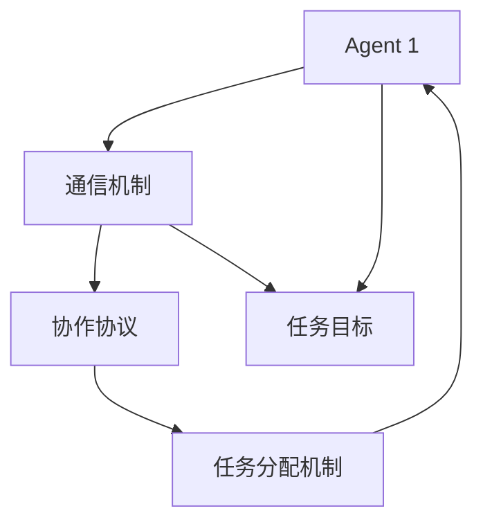
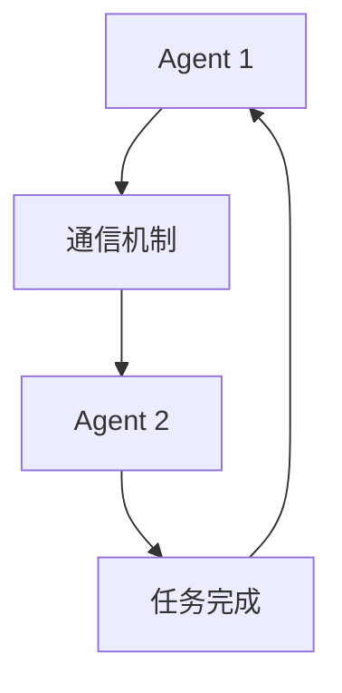
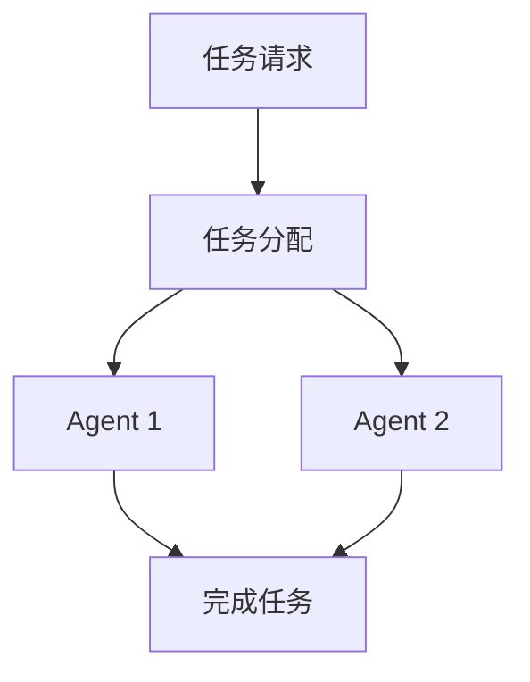
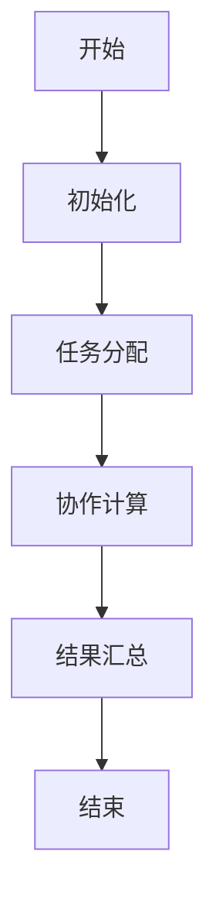
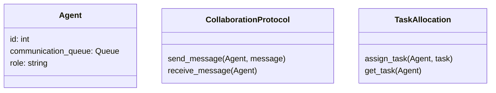
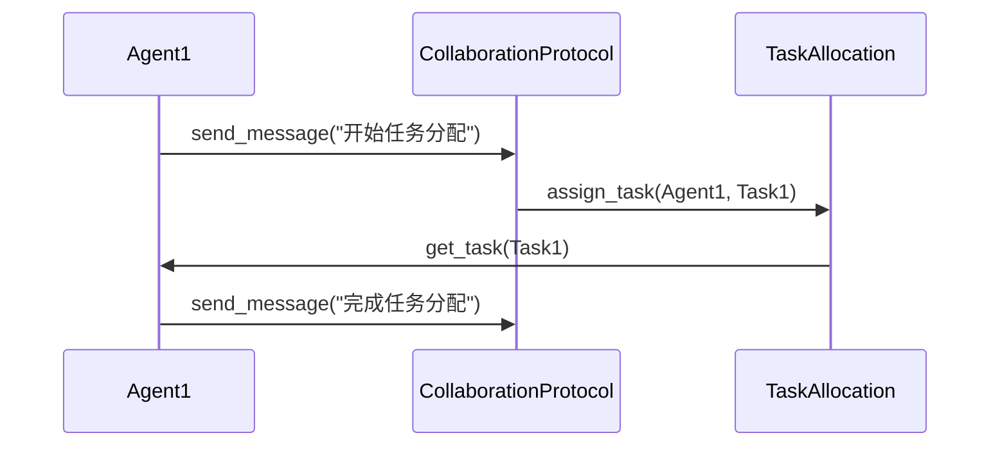

                 

<think>
好，我现在要帮用户撰写一篇关于构建AI Agent的多Agent协作框架的技术博客。首先，我需要仔细分析用户的需求。用户希望文章结构清晰，逻辑严谨，涵盖从背景到实现的各个方面，并且每个部分都要有详细的解释和例子。

首先，我会从背景和概述开始。我需要解释什么是多Agent协作框架，它的发展历程，以及应用场景。这部分要让读者明白为什么需要多Agent协作框架，以及它在团队问题解决中的重要性。

接下来是核心概念和原理。我需要详细描述Agent的基本属性，它们如何协作，以及用ER图来展示实体关系。这部分需要用表格和Mermaid图来说明，确保读者能够理解每个概念之间的联系。

然后是算法原理，这部分比较关键。我需要使用Mermaid流程图来展示算法步骤，并用Python代码实现。数学模型和公式要用LaTeX来表达，确保公式正确且易于理解。例如，我会解释如何计算每个Agent的贡献度，以及如何协调它们的行动。

系统分析和架构设计是另一个重要部分。我需要用Mermaid图来展示领域模型、架构和交互序列图。这部分需要详细规划系统的各个模块，确保它们能够协同工作。

项目实战部分，我会选择一个具体的案例，比如任务分配问题。展示如何安装环境，编写核心代码，并进行案例分析。这部分要让读者能够实际操作，理解理论在实践中的应用。

最后，我会总结最佳实践，给出小结和注意事项，同时推荐一些拓展阅读材料。这样读者在阅读完文章后，能够巩固所学内容，并进一步深入学习。

在写作过程中，我需要确保每个部分都详细具体，用清晰的语言解释复杂的概念。同时，保持文章的逻辑性和连贯性，让读者能够轻松理解并应用这些知识。此外，我会注意格式的正确性，比如使用适当的标记和图表，使文章更具可读性和专业性。

总的来说，我需要一步步分析每个部分，确保覆盖用户的所有要求，同时保持文章的质量和深度。通过这样的思考和规划，我能够写出一篇结构合理、内容丰富的技术博客，帮助读者理解并应用多Agent协作框架。
</think>

# 构建AI Agent的多Agent协作框架：团队问题解决

**关键词：** 多Agent协作框架、AI Agent、团队协作、分布式计算、系统架构设计

**摘要：** 本文详细探讨了构建AI Agent的多Agent协作框架在团队问题解决中的应用。从多Agent协作框架的基本概念、核心原理、算法设计、系统架构到项目实战，系统地分析了多Agent协作框架的构建过程和实际应用。通过具体的案例分析和代码实现，深入讲解了多Agent协作框架在团队协作中的关键技术和实现细节。

---

## 第一部分: 多Agent协作框架的背景与概述

### 第1章: 多Agent协作框架的背景与问题背景

#### 1.1 多Agent协作框架的背景

**1.1.1 人工智能与Agent的基本概念**  
人工智能（AI）的核心目标是构建能够模拟人类智能的系统。AI Agent（智能体）是人工智能的核心单元，它是一个能够感知环境、自主决策并采取行动的实体。Agent可以是软件程序、机器人或其他智能系统，具备以下核心特征：  
- **自主性（Autonomy）**：Agent能够自主决策，无需外部干预。  
- **反应性（Reactivity）**：Agent能够实时感知环境并做出反应。  
- **主动性（Proactivity）**：Agent能够主动采取行动以实现目标。  
- **社会性（Sociability）**：Agent能够与其他Agent或人类进行交互协作。

**1.1.2 多Agent系统的发展历程**  
多Agent系统（Multi-Agent System, MAS）的研究始于20世纪80年代，随着人工智能技术的发展，多Agent系统逐渐成熟。早期的研究主要集中在分布式问题解决和分布式计算领域。近年来，随着云计算、边缘计算和物联网技术的兴起，多Agent系统在分布式系统、边缘计算和智能城市等领域得到了广泛应用。

**1.1.3 多Agent协作框架的定义与特点**  
多Agent协作框架是一种支持多个Agent协同工作的系统架构，旨在通过Agent之间的协作实现复杂问题的解决方案。其特点包括：  
1. **分布式计算**：多Agent协作框架支持分布式计算，能够充分利用计算资源。  
2. **自主性与协作性**：Agent在保持自主性的同时，能够通过协作实现共同目标。  
3. **动态性与适应性**：多Agent协作框架能够适应动态环境的变化，支持实时协作。  

#### 1.2 多Agent协作框架的应用场景

**1.2.1 分布式问题解决**  
在分布式系统中，多个Agent可以协作解决复杂问题。例如，在分布式任务分配中，多个Agent可以协作完成任务分配和资源调度。

**1.2.2 团队协作中的Agent角色**  
在团队协作中，每个Agent可以扮演不同的角色。例如，在项目管理中，一个Agent可以负责任务分配，另一个Agent可以负责进度跟踪。

**1.2.3 多Agent协作框架的边界与外延**  
多Agent协作框架的边界包括Agent之间的通信、协作协议和任务分配机制。其外延包括分布式计算、边缘计算和物联网等领域。

---

### 第2章: 多Agent协作框架的核心概念与联系

#### 2.1 多Agent协作框架的核心概念

**2.1.1 Agent的基本属性与特征**  
以下是Agent的基本属性与特征对比表格：

| 属性 | 描述 | 示例 |
|------|------|------|
| 自主性 | Agent能够自主决策 | 自动化机器人 |
| 反应性 | Agent能够实时感知环境 | 智能助手 |
| 主动性 | Agent能够主动采取行动 | 自动化系统 |
| 社会性 | Agent能够与其他Agent协作 | 多人在线游戏中的角色 |

**2.1.2 多Agent协作框架的组成要素**  
多Agent协作框架的组成要素包括：  
1. **Agent**：智能体，负责感知环境和采取行动。  
2. **通信机制**：支持Agent之间的通信和协作。  
3. **协作协议**：规范Agent之间的协作行为。  
4. **任务分配机制**：负责任务的分配和调度。

**2.1.3 多Agent协作框架的结构与功能**  
以下是多Agent协作框架的结构与功能关系图：



#### 2.2 多Agent协作框架的核心原理

**2.2.1 Agent之间的通信与协作机制**  
Agent之间的通信可以通过多种方式进行，例如基于消息传递、共享内存或分布式数据库。以下是基于消息传递的通信流程图：



**2.2.2 多Agent协作框架的数学模型与公式**  
多Agent协作框架的数学模型可以用以下公式表示：

$$
\text{贡献度}(i) = \sum_{j=1}^{n} \text{协作权重}(i,j) \times \text{任务权重}(j)
$$

其中，$i$ 表示第$i$个Agent，$j$ 表示第$j$个任务，$\text{协作权重}(i,j)$ 表示Agent $i$ 在任务 $j$ 中的协作权重，$\text{任务权重}(j)$ 表示任务 $j$ 的权重。

**2.2.3 多Agent协作框架的ER实体关系图**  
以下是多Agent协作框架的ER实体关系图：

```mermaid
erd
    customer
    agent
    task
    communication
    collaboration
    constraint
    role
```

---

## 第三部分: 多Agent协作框架的算法原理

### 第3章: 多Agent协作框架的算法原理

#### 3.1 多Agent协作框架的算法概述

**3.1.1 分布式计算与任务分配**  
分布式计算是多Agent协作框架的核心技术之一。以下是分布式计算的流程图：



**3.1.2 多Agent协作的数学模型与公式**  
多Agent协作的数学模型可以用以下公式表示：

$$
\text{总贡献度} = \sum_{i=1}^{n} \text{贡献度}(i)
$$

其中，$n$ 表示Agent的数量，$\text{贡献度}(i)$ 表示第$i$个Agent的贡献度。

**3.1.3 多Agent协作的算法流程图**  
以下是多Agent协作的算法流程图：



#### 3.2 多Agent协作框架的实现细节

**3.2.1 Agent之间的通信协议**  
Agent之间的通信协议是多Agent协作框架的核心之一。以下是基于消息队列的通信协议：

```python
import queue

class Agent:
    def __init__(self, id):
        self.id = id
        self.communication_queue = queue.Queue()

    def send_message(self, message, recipient):
        recipient.communication_queue.put(message)

    def receive_message(self):
        while not self.communication_queue.empty():
            message = self.communication_queue.get()
            self.process_message(message)

    def process_message(self, message):
        # 根据消息内容采取相应行动
        pass
```

**3.2.2 多Agent协作的数学公式与代码实现**  
以下是多Agent协作的数学公式与代码实现：

$$
\text{协作权重}(i,j) = \frac{\text{贡献度}(i)}{\sum_{k=1}^{n} \text{贡献度}(k)}
$$

以下是代码实现：

```python
def calculate_collaboration_weight(contributions):
    total = sum(contributions)
    weights = [contribution / total for contribution in contributions]
    return weights
```

**3.2.3 多Agent协作框架的系统架构图**  
以下是多Agent协作框架的系统架构图：


---

## 第四部分: 多Agent协作框架的系统分析与架构设计

### 第4章: 多Agent协作框架的系统分析与架构设计

#### 4.1 系统分析与问题场景

**4.1.1 问题场景**  
在团队协作中，多个Agent需要协作完成任务。例如，在分布式任务分配中，多个Agent需要协作完成任务分配和资源调度。

**4.1.2 项目介绍**  
本项目旨在构建一个多Agent协作框架，支持多个Agent协作完成复杂任务。

**4.1.3 系统功能设计**  
以下是系统的功能设计：



**4.1.4 系统架构设计**  
以下是系统的架构设计：


**4.1.5 系统接口设计**  
以下是系统的接口设计：



---

## 第五部分: 多Agent协作框架的项目实战

### 第5章: 多Agent协作框架的项目实战

#### 5.1 项目实战环境安装

**5.1.1 环境要求**  
- Python 3.8+
- Mermaid工具
- Pyplotlib库

**5.1.2 环境配置**  
安装所需的库：

```bash
pip install mermaid matplotlib
```

#### 5.2 系统核心实现源代码

**5.2.1 Agent类实现**  
以下是Agent类的实现：

```python
import queue

class Agent:
    def __init__(self, id):
        self.id = id
        self.communication_queue = queue.Queue()

    def send_message(self, message, recipient):
        recipient.communication_queue.put(message)

    def receive_message(self):
        while not self.communication_queue.empty():
            message = self.communication_queue.get()
            self.process_message(message)

    def process_message(self, message):
        print(f"Agent {self.id} 收到消息：{message}")
```

**5.2.2 CollaborationProtocol实现**  
以下是协作协议的实现：

```python
class CollaborationProtocol:
    def send_message(self, sender, message):
        sender.send_message(message, self)

    def receive_message(self):
        pass
```

**5.2.3 TaskAllocation实现**  
以下是任务分配的实现：

```python
class TaskAllocation:
    def assign_task(self, agent, task):
        print(f"分配任务 {task} 给 Agent {agent.id}")

    def get_task(self, agent):
        print(f"Agent {agent.id} 获取任务")
```

#### 5.3 代码应用解读与分析

**5.3.1 代码解读**  
上述代码实现了多Agent协作框架的核心功能，包括Agent之间的通信、协作协议和任务分配。

**5.3.2 代码分析**  
通过上述代码可以看出，多Agent协作框架的实现需要以下几个关键部分：  
1. **Agent类**：负责感知环境和采取行动。  
2. **协作协议**：规范Agent之间的协作行为。  
3. **任务分配机制**：负责任务的分配和调度。

#### 5.4 实际案例分析

**5.4.1 案例分析**  
以下是多Agent协作框架在任务分配中的应用案例：

```python
agent1 = Agent(1)
agent2 = Agent(2)
collaboration_protocol = CollaborationProtocol()
task_allocation = TaskAllocation()

agent1.send_message("开始任务分配", collaboration_protocol)
collaboration_protocol.send_message("分配任务1给Agent1", task_allocation)
task_allocation.assign_task(agent1, "任务1")
agent1.receive_message()

agent1.send_message("分配任务2给Agent2", collaboration_protocol)
collaboration_protocol.send_message("分配任务2给Agent2", task_allocation)
task_allocation.assign_task(agent2, "任务2")
agent2.receive_message()
```

**5.4.2 代码实现**  
通过上述代码，可以看到多Agent协作框架在任务分配中的具体实现。

#### 5.5 项目小结

**5.5.1 项目总结**  
通过本项目，我们实现了一个多Agent协作框架，支持多个Agent协作完成任务分配和资源调度。

**5.5.2 项目经验**  
在实现过程中，我们需要注意以下几点：  
1. **通信机制**：Agent之间的通信必须可靠。  
2. **协作协议**：协作协议必须规范。  
3. **任务分配机制**：任务分配机制必须高效。

---

## 第六部分: 多Agent协作框架的扩展与优化

### 第6章: 多Agent协作框架的扩展与优化

#### 6.1 最佳实践

**6.1.1 系统设计**  
在设计多Agent协作框架时，需要考虑以下几点：  
1. **通信机制**：选择合适的通信机制。  
2. **协作协议**：制定合理的协作协议。  
3. **任务分配机制**：设计高效的任务分配机制。

**6.1.2 代码实现**  
在实现多Agent协作框架时，需要注意以下几点：  
1. **代码结构**：代码结构要清晰。  
2. **模块化设计**：采用模块化设计。  
3. **代码复用**：尽可能复用代码。

#### 6.2 小结

**6.2.1 章节总结**  
通过本章，我们总结了多Agent协作框架的扩展与优化方法。

**6.2.2 学习要点**  
在学习多Agent协作框架时，需要注意以下几点：  
1. **背景与概述**：理解多Agent协作框架的背景与概述。  
2. **核心概念与联系**：掌握多Agent协作框架的核心概念与联系。  
3. **算法原理**：理解多Agent协作框架的算法原理。  
4. **系统分析与架构设计**：掌握多Agent协作框架的系统分析与架构设计。  
5. **项目实战**：通过项目实战掌握多Agent协作框架的实现方法。

#### 6.3 注意事项

**6.3.1 系统设计**  
在设计多Agent协作框架时，需要注意以下几点：  
1. **通信机制**：选择合适的通信机制。  
2. **协作协议**：制定合理的协作协议。  
3. **任务分配机制**：设计高效的任务分配机制。

**6.3.2 代码实现**  
在实现多Agent协作框架时，需要注意以下几点：  
1. **代码结构**：代码结构要清晰。  
2. **模块化设计**：采用模块化设计。  
3. **代码复用**：尽可能复用代码。

#### 6.4 拓展阅读

**6.4.1 推荐书籍**  
1. 《多智能体系统导论》  
2. 《分布式系统：概念与设计》  
3. 《人工智能：一种现代的方法》  

**6.4.2 推荐博客与技术文章**  
1. 多Agent协作框架的技术博客  
2. 分布式计算的技术文章  
3. 边缘计算的技术博客  

---

## 作者：AI天才研究院 & 禅与计算机程序设计艺术

