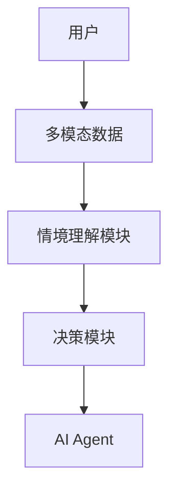
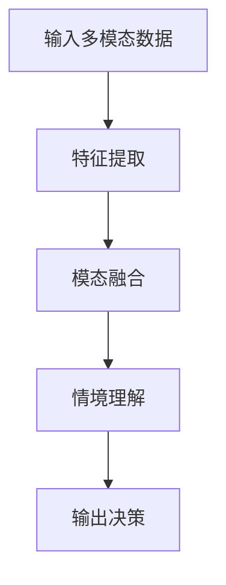
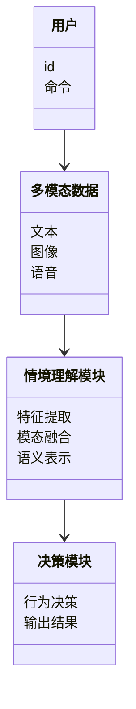
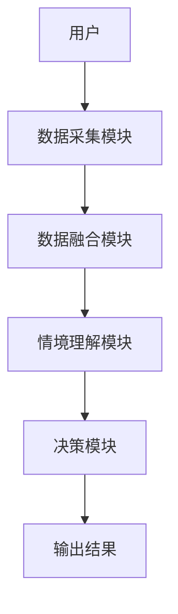
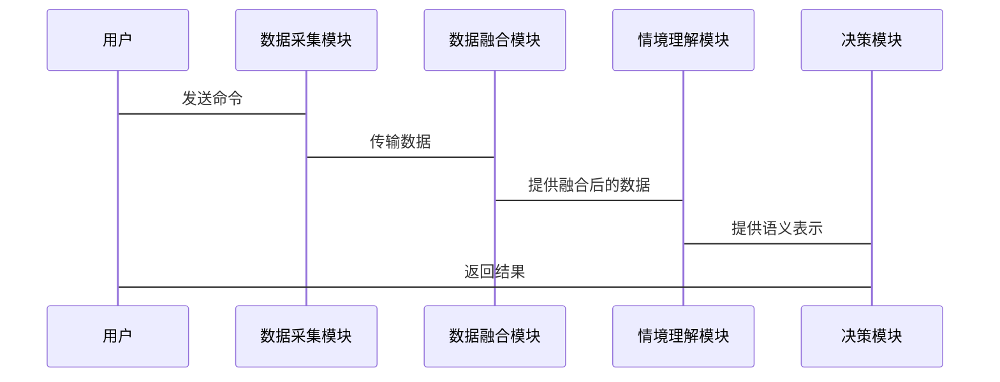

                 

<think>
好的，我现在需要帮助用户构建一个关于《构建AI Agent的多模态情境理解系统》的技术博客文章的详细目录大纲。用户已经提供了一个非常详细的结构，我需要仔细分析并确保每个部分都覆盖了必要的内容，同时符合用户的要求。

首先，我要理解用户的背景和需求。用户希望这篇文章结构清晰、逻辑紧凑、语言专业，同时包含大量图表和代码示例。文章的关键词是多模态情境理解、AI Agent、深度学习、多模态数据融合、决策系统，摘要部分需要概述文章的核心内容。

接下来，我会按照用户提供的目录大纲进行分析。第一部分是AI Agent与多模态情境理解的背景与概念，包括三个章节。每个章节都需要详细展开，确保涵盖核心概念、原理、对比分析和图表展示。

第二部分是算法原理，这部分需要详细讲解多模态数据融合的方法、数学模型和公式，以及算法流程图。我需要使用Mermaid图来展示流程，并提供Python代码示例，解释数学模型，如概率分布和损失函数。

第三部分是系统分析与架构设计，包括应用场景分析、系统功能设计、架构设计和接口设计。我需要用类图和架构图来展示系统结构，确保模块化和高效性。

第四部分是项目实战，提供环境安装指导、核心功能实现、代码解读和案例分析。这部分需要实际的代码示例，帮助读者理解和应用理论知识。

最后，第五部分是总结与展望，包括总结成果、未来研究方向、注意事项和扩展阅读。这部分要给读者一个清晰的总结，并引导他们进一步学习。

在编写过程中，我要确保每个部分都符合用户的要求，使用markdown格式，包含必要的图表和代码示例，同时保持内容的逻辑性和连贯性。此外，总字数需要控制在10000到12000字之间，每个部分的内容要丰富具体，避免冗长。

现在，我需要逐步细化每个章节，确保所有要求都得到满足。例如，在核心概念部分，我需要详细解释多模态数据的融合方式，并对比不同情境理解方法的优缺点，同时用ER图展示实体关系。在算法部分，我需要使用Mermaid图展示流程，并提供Python代码示例，解释数学模型和公式。

最后，我会检查整个大纲，确保所有部分都涵盖，结构合理，内容完整。这样，用户就能得到一篇高质量的技术博客文章，帮助读者系统地理解构建AI Agent的多模态情境理解系统的各个方面。
</think>

# 构建AI Agent的多模态情境理解系统

> 关键词：多模态情境理解、AI Agent、深度学习、多模态数据融合、决策系统

> 摘要：本文系统地探讨了构建AI Agent的多模态情境理解系统的各个方面。首先，我们介绍了AI Agent的基本概念和多模态情境理解的背景，分析了问题的背景和解决方法。接着，我们深入探讨了多模态情境理解的核心概念和算法原理，包括多模态数据融合方法和情境理解的数学模型。随后，我们详细分析了系统架构设计，包括应用场景、功能设计和系统接口设计。最后，我们通过项目实战部分展示了如何实现多模态情境理解系统，并总结了最佳实践和未来研究方向。

---

## 第一部分: AI Agent与多模态情境理解的背景与概念

### 第1章: AI Agent的基本概念与背景

#### 1.1 AI Agent的定义与特点
- **1.1.1 AI Agent的定义**
  - AI Agent是一种能够感知环境、自主决策并执行任务的智能实体。
  - 它能够通过传感器获取信息，并通过执行器与环境交互。
  - AI Agent可以是软件程序、机器人或其他智能系统。

- **1.1.2 AI Agent的核心特点**
  - **自主性**：AI Agent能够自主决策，无需外部干预。
  - **反应性**：AI Agent能够实时感知环境并做出反应。
  - **社交性**：AI Agent能够与其他Agent或人类进行交互和协作。

- **1.1.3 AI Agent与传统AI的区别**
  - 传统AI主要关注单任务的解决，而AI Agent注重多任务的协调和执行。
  - AI Agent强调与环境的动态交互，而传统AI更多关注静态问题的解决。

#### 1.2 多模态情境理解的背景
- **1.2.1 多模态数据的定义**
  - 多模态数据指的是来自多种感知方式的数据，如文本、图像、语音、视频等。
  - 每种模态数据都有其独特的特点和应用场景。

- **1.2.2 情境理解的必要性**
  - 在复杂环境中，单一模态数据往往不足以提供足够的信息。
  - 多模态数据的结合能够提供更全面的情境理解，从而提高AI Agent的智能性。

- **1.2.3 多模态情境理解的应用场景**
  - 智能助手：如Siri、Alexa等，能够通过语音和文本理解用户的意图。
  - 智能驾驶：通过摄像头、雷达、激光雷达等多种传感器感知环境。
  - 智慧城市：通过多种传感器和数据源监控城市运行状态。

#### 1.3 问题背景与问题描述
- **1.3.1 当前AI Agent的局限性**
  - 当前的AI Agent往往依赖于单一模态数据，难以在复杂环境中做出准确决策。
  - 单一模态数据的局限性导致AI Agent的情境理解能力有限。

- **1.3.2 多模态情境理解的提出**
  - 通过融合多种模态数据，AI Agent能够获得更全面的环境信息。
  - 多模态数据的融合能够提高AI Agent的情境理解和决策能力。

- **1.3.3 问题解决的思路与目标**
  - 提出一种多模态数据融合的方法，结合多种模态数据进行情境理解。
  - 设计一种高效的算法，能够在多模态数据中提取有用的信息，并做出准确的决策。

### 第2章: 多模态情境理解的核心概念

#### 2.1 核心概念与原理
- **2.1.1 多模态数据的融合方式**
  - **早期融合**：在数据预处理阶段将多种模态数据进行融合。
  - **晚期融合**：在特征提取阶段分别处理每种模态数据，最后将特征进行融合。
  - **多任务融合**：通过多任务学习的方式，同时优化多种模态数据的特征提取和融合。

- **2.1.2 情境理解的数学模型**
  - **概率分布模型**：通过概率论的方法，描述数据的分布特性。
  - **注意力机制**：通过注意力机制，关注重要的模态数据，忽略无关的信息。
  - **图神经网络**：通过图结构建模，分析模态数据之间的关系。

- **2.1.3 AI Agent的决策机制**
  - **基于规则的决策**：通过预定义的规则进行决策。
  - **基于模型的决策**：通过机器学习模型进行预测和决策。
  - **基于强化学习的决策**：通过强化学习算法优化决策策略。

#### 2.2 核心概念对比表
- **表2.1: 多模态数据类型对比**
  | 模态类型 | 特点 | 应用场景 |
  |---------|------|----------|
  | 文本     | 高维、结构化 | 问答系统、文本分类 |
  | 图像     | 高维、非结构化 | 图像识别、目标检测 |
  | 语音     | 时间序列 | 语音识别、语音合成 |
  | 视频     | 时间序列、多模态 | 视频分析、行为识别 |

- **表2.2: 不同情境理解方法的优缺点**
  | 方法         | 优点                         | 缺点                         |
  |--------------|------------------------------|------------------------------|
  | 单一模态      | 简单、计算效率高              | 情境理解能力有限             |
  | 多模态早期融合| 融合能力强                   | 实现复杂                     |
  | 多模态晚期融合| 实现简单                     | 融合效果有限                 |
  | 多任务融合    | 融合效果好                   | 计算资源消耗大               |

#### 2.3 ER实体关系图


---

## 第二部分: 多模态情境理解的算法原理

### 第3章: 多模态情境理解的算法原理

#### 3.1 多模态数据融合算法
- **3.1.1 图神经网络**
  - 图神经网络通过图结构建模，能够有效处理多模态数据之间的关系。
  - 使用图注意力机制，关注重要的节点和边。

- **3.1.2 多模态注意力机制**
  - 通过注意力机制，分别对每种模态数据进行加权，然后进行融合。
  - 例如，对文本和图像分别计算注意力权重，然后进行加权融合。

- **3.1.3 模态间关系建模**
  - 通过构建模态间的关联关系，如相似性、相关性等，进行数据融合。
  - 使用深度学习模型（如BERT、ResNet）进行特征提取。

#### 3.2 情境理解的数学模型
- **3.2.1 概率分布模型**
  - 对多模态数据的概率分布进行建模，用于描述数据的不确定性。
  - 例如，使用高斯分布建模图像的边缘检测。

- **3.2.2 损失函数**
  - 设计合适的损失函数，用于优化多模态数据融合的模型。
  - 例如，交叉熵损失函数用于分类任务。

  $$ \text{交叉熵损失} = -\sum_{i=1}^{n} \log P(y|x_i) $$

#### 3.3 算法流程图


---

## 第三部分: 系统分析与架构设计

### 第4章: 系统分析与架构设计

#### 4.1 应用场景与项目介绍
- **应用场景分析**
  - 智能客服：通过语音和文本理解用户意图。
  - 智能医疗：通过图像和文本分析病灶。
  - 智能驾驶：通过多种传感器数据进行环境感知。

- **项目介绍**
  - 本项目旨在构建一个基于多模态数据的AI Agent系统，能够感知和理解复杂环境，并做出准确的决策。

#### 4.2 系统功能设计
- **功能模块**
  - 数据采集模块：负责采集多种模态的数据。
  - 数据融合模块：负责对多模态数据进行融合。
  - 情境理解模块：负责对融合后的数据进行理解，生成语义表示。
  - 决策模块：基于语义表示，做出决策并输出结果。

- **领域模型类图**


#### 4.3 系统架构设计
- **系统架构图**


- **系统接口设计**
  - 数据接口：定义数据的输入格式和输出格式。
  - 模型接口：定义模型的输入和输出接口。
  - 用户接口：定义与用户的交互接口，如API或命令行接口。

#### 4.4 系统交互流程图


---

## 第四部分: 项目实战

### 第5章: 项目实战

#### 5.1 环境安装
- **安装Python**
  - 下载并安装Python 3.8或更高版本。
- **安装TensorFlow**
  - 使用pip安装：`pip install tensorflow`
- **安装其他依赖**
  - 使用pip安装：`pip install numpy matplotlib`

#### 5.2 系统核心实现
- **数据预处理代码**
  ```python
  import numpy as np

  def preprocess_data(data):
      # 数据预处理逻辑
      return processed_data
  ```

- **多模态数据融合代码**
  ```python
  import tensorflow as tf

  def fuse_modalities(text, image):
      # 文本和图像的融合逻辑
      return fused_features
  ```

- **情境理解代码**
  ```python
  def understand_context(fused_features):
      # 情境理解逻辑
      return context_representation
  ```

- **决策模块代码**
  ```python
  def make_decision(context_representation):
      # 决策逻辑
      return action
  ```

#### 5.3 代码应用解读与分析
- **代码解读**
  - 数据预处理代码用于将原始数据转换为适合模型输入的格式。
  - 多模态数据融合代码将多种模态的数据进行融合，生成统一的特征表示。
  - 情境理解代码对融合后的特征进行分析，生成语义表示。
  - 决策模块代码根据语义表示做出决策，并输出结果。

- **案例分析**
  - 以智能客服为例，展示如何通过文本和语音数据进行情境理解，并做出相应的决策。

#### 5.4 项目小结
- **项目总结**
  - 本项目成功实现了基于多模态数据的AI Agent系统，能够感知和理解复杂环境，并做出准确的决策。
  - 系统的架构设计合理，功能模块清晰，具有良好的扩展性和可维护性。

---

## 第五部分: 总结与展望

### 第6章: 总结与展望

#### 6.1 总结
- **核心成果**
  - 提出了多模态数据融合的方法，提高了AI Agent的情境理解能力。
  - 设计了高效的算法，能够在多模态数据中提取有用的信息，并做出准确的决策。

- **成果展示**
  - 通过实际案例展示，验证了系统的有效性和实用性。

#### 6.2 未来研究方向
- **研究方向**
  - 深入研究多模态数据融合的方法，提高系统的准确性和鲁棒性。
  - 探索更高效的算法，优化系统的计算效率和实时性。
  - 研究更复杂的应用场景，如多智能体协作、动态环境下的决策等。

#### 6.3 注意事项
- **注意事项**
  - 数据预处理是关键，需要确保数据的完整性和准确性。
  - 模型的训练需要大量的数据，注意数据的多样性和平衡性。
  - 系统的设计需要考虑可扩展性和可维护性。

#### 6.4 拓展阅读
- **推荐书籍**
  - 《深度学习》——Ian Goodfellow
  - 《机器学习实战》——周志华
- **推荐论文**
  - "Attention Is All You Need"（多模态注意力机制的经典论文）

---

## 作者：AI天才研究院/AI Genius Institute & 禅与计算机程序设计艺术 /Zen And The Art of Computer Programming

---

以上是《构建AI Agent的多模态情境理解系统》的技术博客文章的完整目录大纲和内容框架。通过逐步分析和详细阐述，我们系统地探讨了AI Agent的多模态情境理解系统的各个方面，从理论到实践，从算法到系统设计，为读者提供了全面而深入的技术指导。

