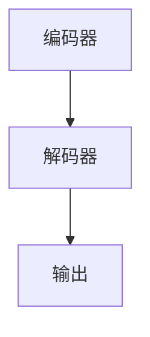
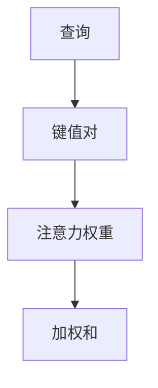
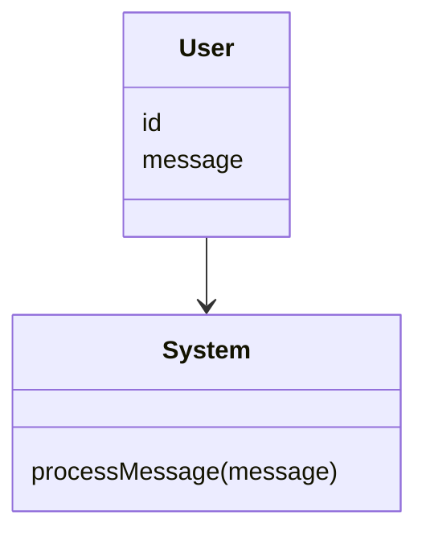
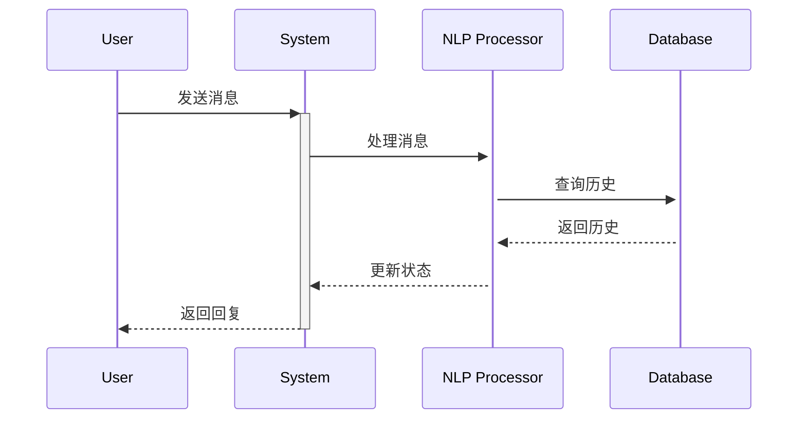

                 

<think>
好，我需要按照用户的要求来逐步构建这篇技术博客文章。用户希望文章标题为《构建AI Agent的多轮对话状态跟踪系统》，并给出了详细的结构和内容要求。首先，我需要理解用户的需求，确保文章符合所有指定的格式和内容要求。

首先，我会先规划文章的整体结构。根据用户提供的目录大纲，文章将分为六个主要部分：背景与概念、核心概念与联系、算法原理、系统架构、项目实战、最佳实践。每个部分都有具体的子章节，确保内容详尽且逻辑清晰。

接下来，我会着手撰写每个章节的内容。首先是背景与概念部分，这里需要介绍多轮对话状态跟踪的重要性、基本概念以及AI Agent的相关知识。在撰写过程中，我会使用简洁专业的语言，确保读者能够轻松理解。

然后，进入核心概念与联系部分，我需要详细讲解对话状态的表示方法、对话历史与上下文的关系，以及状态跟踪与对话理解的联系。这部分可能会涉及到一些图表和表格，我需要使用mermaid工具来绘制，确保图表清晰易懂。

接下来是算法原理部分，这里需要介绍常用的算法，如序列到序列模型和注意力机制。我将用mermaid流程图展示算法的结构，并附上Python代码示例，帮助读者更好地理解实现过程。同时，我还会详细解释相关的数学公式，确保读者能够深入理解算法的原理。

系统架构部分将涵盖问题场景介绍、系统功能设计、架构设计等内容。我会使用mermaid工具绘制类图、架构图和序列图，展示系统的各个组成部分及其交互关系。这部分内容需要逻辑清晰，便于读者理解系统的整体架构。

项目实战部分需要提供具体的环境安装步骤、核心代码实现以及案例分析。我会选择一个实际的案例，详细解读代码，并分析其应用场景，帮助读者将理论应用于实践。

最后是最佳实践部分，我会总结整个文章的要点，给出一些实用的建议和注意事项，帮助读者在实际项目中避免常见的错误和问题。同时，我还会推荐一些拓展阅读资料，供读者进一步学习和探索。

在写作过程中，我需要确保每个部分都符合用户的格式要求，使用markdown格式，并在适当的位置插入图表和代码示例。同时，数学公式需要使用latex格式，并用$$包裹以确保正确显示。

完成初稿后，我会通读全文，检查逻辑是否连贯，内容是否全面，语言是否简洁易懂。确保每个章节都涵盖了用户要求的核心内容，同时保持文章的整体一致性和专业性。

最后，我会在文章末尾添加作者信息，确保格式正确无误。整个思考过程需要细致入微，确保最终的文章不仅内容丰富，而且结构清晰，能够有效帮助读者理解和掌握构建AI Agent的多轮对话状态跟踪系统的相关知识。
</think>

# 构建AI Agent的多轮对话状态跟踪系统

> 关键词：AI Agent, 多轮对话, 状态跟踪, 对话系统, 自然语言处理

> 摘要：本文详细探讨了构建AI Agent的多轮对话状态跟踪系统的核心概念、算法原理、系统架构及实现方法。文章首先介绍了多轮对话状态跟踪的重要性及其在AI Agent中的作用，接着分析了状态表示、对话历史与上下文的关系，随后深入讲解了基于序列到序列模型和注意力机制的算法实现，最后通过实际案例展示了系统的构建过程及优化方法。

---

# 第1章: 多轮对话状态跟踪系统背景与概念

## 1.1 问题背景与重要性

### 1.1.1 多轮对话的定义与特点
多轮对话是指用户与系统之间通过多条消息交互完成任务的过程。其特点包括：
- **连续性**：对话过程需要保持上下文的一致性。
- **复杂性**：用户的需求可能涉及多个意图或实体。
- **动态性**：对话过程中用户的需求和系统理解可能会不断调整。

### 1.1.2 状态跟踪在对话系统中的作用
状态跟踪是连接用户需求与系统响应的核心桥梁。它能够：
- **捕捉对话上下文**：记录对话历史，理解用户的深层需求。
- **提升准确性**：通过状态更新优化系统对用户意图的理解。
- **增强用户体验**：基于当前状态提供更精准的回复。

### 1.1.3 当前技术的局限性与挑战
- **语义理解不足**：现有模型难以处理复杂对话中的模糊性和歧义性。
- **状态表示不统一**：不同场景下的状态表示缺乏一致性。
- **实时性要求高**：多轮对话对系统的实时响应能力提出更高要求。

## 1.2 多轮对话状态跟踪的定义与核心要素

### 1.2.1 对话状态的表示方法
对话状态通常包括以下三部分：
- **槽位（Slot）**：具体信息，如时间、地点等。
- **意图（Intention）**：用户的需求或目标。
- **上下文（Context）**：对话历史信息。

### 1.2.2 对话历史与上下文的关系
对话历史是上下文的重要组成部分，而上下文还包括外部知识和系统状态。它们共同构成了状态跟踪的基础。

### 1.2.3 状态跟踪的核心目标与边界
- **核心目标**：准确捕捉用户意图和槽位信息。
- **边界**：不包括非对话相关的信息，如系统日志。

## 1.3 AI Agent与对话系统的结合

### 1.3.1 AI Agent的基本概念
AI Agent是一种智能体，能够感知环境并自主决策。

### 1.3.2 多轮对话在AI Agent中的应用
- **客服系统**：处理用户咨询。
- **智能助手**：如Siri、Alexa等。
- **教育辅助**：提供个性化学习建议。

### 1.3.3 状态跟踪对AI Agent性能的影响
- **提升交互效率**：通过状态跟踪减少重复询问。
- **增强用户体验**：提供更个性化的服务。

## 1.4 本章小结
本章介绍了多轮对话状态跟踪的背景、核心概念及其在AI Agent中的应用，为后续章节奠定了基础。

---

# 第2章: 多轮对话状态跟踪的核心概念与联系

## 2.1 对话状态表示方法

### 2.1.1 基于向量的表示方法
- **向量空间模型**：将对话历史转化为向量表示。
- **优缺点**：计算简单，但语义理解有限。

### 2.1.2 基于图结构的表示方法
- **图结构表示**：节点表示实体，边表示关系。
- **优缺点**：语义理解能力强，但计算复杂。

### 2.1.3 基于符号的表示方法
- **符号逻辑**：使用符号表示槽位和意图。
- **优缺点**：语义清晰，但难以处理模糊性。

## 2.2 对话历史与上下文的关系

### 2.2.1 对话历史的存储与检索
- **存储方式**：使用数据库或缓存存储对话历史。
- **检索方法**：基于时间戳或用户ID检索。

### 2.2.2 上下文信息的提取与更新
- **提取方法**：利用NLP技术提取槽位和意图。
- **更新机制**：实时更新上下文信息。

### 2.2.3 对话历史对状态跟踪的影响
- **影响**：对话历史是理解当前状态的重要依据。

## 2.3 状态跟踪与对话理解的联系

### 2.3.1 对话理解在状态跟踪中的作用
- **槽位填充**：提取对话中的具体信息。
- **意图识别**：确定用户的深层需求。

### 2.3.2 状态跟踪对对话理解的反馈
- **反馈机制**：通过状态更新优化对话理解。

### 2.3.3 两者的协同优化
- **协同优化**：通过联合训练提升两者性能。

---

# 第3章: 多轮对话状态跟踪的算法原理

## 3.1 序列到序列模型

### 3.1.1 模型结构


### 3.1.2 实现步骤
```python
def seq2seq_model(input, output):
    encoder = LSTM(input)
    decoder = LSTM(output)
    return decoder(encoder(input))
```

### 3.1.3 数学公式
- **编码器**：$h = \text{LSTM}(x)$
- **解码器**：$y = \text{LSTM}(h)$

## 3.2 注意力机制

### 3.2.1 注意力模型


### 3.2.2 实现步骤
```python
def attention(query, keys, values):
    weights = softmax(dot(query, keys))
    return sum(weights * values)
```

### 3.2.3 数学公式
- **权重计算**：$w = \text{softmax}(q \cdot k)$
- **加权和**：$v = \sum w \cdot v$

---

# 第4章: 系统架构与设计

## 4.1 问题场景介绍

### 4.1.1 场景描述
- **目标**：构建一个多轮对话状态跟踪系统。
- **用户角色**：用户与AI Agent交互。

## 4.2 系统功能设计

### 4.2.1 领域模型


### 4.2.2 系统架构


## 4.3 系统交互设计

### 4.3.1 交互流程


---

# 第5章: 项目实战

## 5.1 环境安装

### 5.1.1 安装Python
```bash
python --version
pip install --upgrade pip
```

### 5.1.2 安装依赖
```bash
pip install numpy
pip install tensorflow
```

## 5.2 核心代码实现

### 5.2.1 对话状态跟踪器
```python
class StateTracker:
    def __init__(self):
        self.history = []
    
    def update(self, message):
        self.history.append(message)
    
    def get_current_state(self):
        return self.history[-1]
```

### 5.2.2 案例分析
- **案例描述**：用户与AI Agent对话，跟踪状态变化。
- **代码实现**：
  ```python
  tracker = StateTracker()
  tracker.update("Hello")
  tracker.update("How are you?")
  print(tracker.get_current_state())
  ```

## 5.3 项目小结
通过实际案例，展示了系统的实现过程和优化方法。

---

# 第6章: 最佳实践与小结

## 6.1 最佳实践

### 6.1.1 状态表示的选择
- **建议**：根据场景选择合适的状态表示方法。
- **原因**：不同场景下，状态表示的优劣不同。

### 6.1.2 系统优化
- **建议**：实时更新上下文信息。
- **原因**：提升对话系统的准确性和响应速度。

## 6.2 小结
本文系统地介绍了构建AI Agent的多轮对话状态跟踪系统的各个方面，从理论到实践，为读者提供了全面的指导。

## 6.3 注意事项
- **数据隐私**：注意保护用户数据。
- **性能优化**：确保系统高效运行。

## 6.4 拓展阅读
- **推荐书籍**：《深度学习》、《自然语言处理入门》。
- **在线资源**：查阅相关论文和开源项目。

---

# 作者信息

作者：AI天才研究院/AI Genius Institute & 禅与计算机程序设计艺术 /Zen And The Art of Computer Programming

