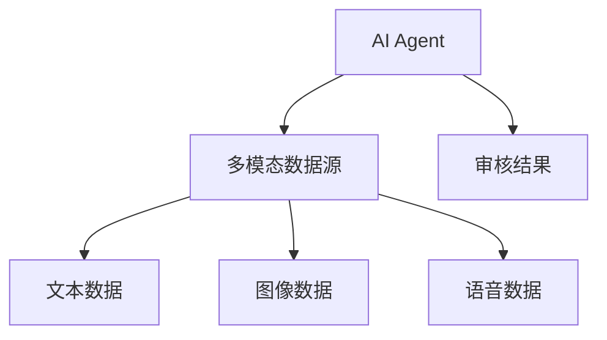
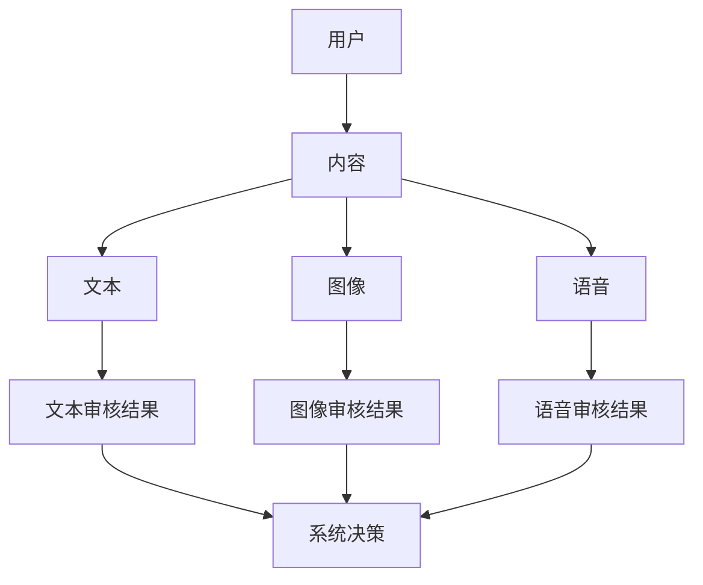
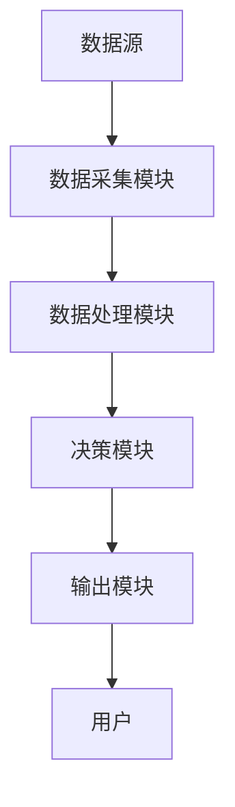
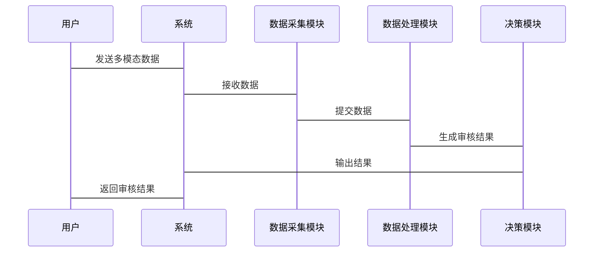

                 

<think>
好，我现在要帮用户构建一个AI Agent的实时多模态内容审核系统的目录大纲。用户给的关键词包括AI Agent、实时多模态内容审核、系统设计、算法原理、技术实现，摘要里提到了构建这样一个系统的需求背景、技术挑战、关键算法和系统架构。

首先，我得理解用户的需求。用户希望有一篇结构清晰、内容详实的技术博客，涵盖从背景到实现的各个方面。文章要吸引读者，同时要有深度，所以目录需要全面，包括背景、核心概念、算法、系统架构、项目实战和最佳实践等部分。

接下来，我会分析每一章的内容。第一章应该介绍背景，包括问题背景、描述、解决思路和核心概念，这样读者才能了解为什么需要这个系统。第二章深入核心概念，如多模态数据、AI Agent和实时性，用表格和图示来对比属性，帮助读者理解。第三章详细讲解算法，包括模型输入输出、训练目标，用公式和流程图来展示，同时给出Python代码示例，让读者能实际操作。

系统架构设计是关键部分，需要介绍项目背景，用类图展示功能模块，再用架构图说明整体结构，接口设计和交互流程图则帮助理解各部分如何协作。项目实战部分要具体，包括环境安装、代码实现、案例分析，让读者能够动手实践。最后，最佳实践、小结和注意事项帮助读者巩固知识，拓展阅读则引导进一步学习。

在编写过程中，我需要确保每一章都有足够的细节，比如在算法部分，不仅要有流程图，还要有数学公式和代码示例。系统架构部分要用图表展示，确保读者能够清晰理解。同时，目录结构要层级分明，从一级到三级目录，每部分内容都详细展开。

总结一下，我需要按照用户的要求，将内容分成多个章节，每个章节下有多个小节，涵盖从背景到实践的各个方面，确保目录完整且详细。同时，使用图表和代码示例来增强内容的可读性和实用性。
</think>

# 构建AI Agent的实时多模态内容审核系统

> 关键词：AI Agent，实时多模态内容审核，系统设计，算法原理，技术实现

> 摘要：随着人工智能技术的快速发展，多模态内容审核的需求日益增长。本文将详细探讨如何构建一个基于AI Agent的实时多模态内容审核系统，涵盖从系统架构设计到算法实现的各个方面，包括多模态数据处理、AI Agent的决策机制、实时性优化等关键问题，为读者提供一套完整的解决方案。

---

# 第一部分: 问题背景与核心概念

# 第1章: 问题背景介绍

## 1.1 多模态内容审核的挑战

### 1.1.1 当前内容审核的难点
- 数据类型多样：文本、图像、语音等多模态数据的处理复杂性。
- 实时性要求高：需要在极短时间内完成审核，对系统性能提出挑战。
- 数据关联性：多模态数据之间的关联性如何有效利用。

### 1.1.2 传统审核系统的局限性
- 单一模态处理：传统系统通常仅处理单一类型的数据，难以应对多模态场景。
- 延时较高：基于规则的传统审核系统响应速度较慢。
- 鲁棒性不足：难以应对复杂场景下的异常情况。

## 1.2 系统目标与核心指标

### 1.2.1 系统目标
- 实现实时多模态数据的智能审核。
- 提供高效的决策支持，减少人工审核的工作量。
- 支持多种数据类型（文本、图像、语音等）的统一处理。

### 1.2.2 核心指标
- 处理时延：从数据输入到输出结果的时间必须小于等于1秒。
- 精确度：审核的准确率必须达到95%以上。
- 可扩展性：支持多种数据类型和不同规模的业务场景。

## 1.3 AI Agent的核心作用

### 1.3.1 AI Agent的定义
- AI Agent是一个具备感知、决策和执行能力的智能体。
- 在多模态内容审核中，AI Agent负责数据的采集、分析和决策。

### 1.3.2 AI Agent的优势
- 智能性：能够自主学习和优化。
- 实时性：能够在极短时间内完成任务。
- 多模态处理：能够同时处理多种数据类型。

## 1.4 系统架构与核心概念

### 1.4.1 系统架构概述


### 1.4.2 核心概念对比
| 核心概念 | 定义 | 特性 |
|----------|------|------|
| 多模态数据 | 文本、图像、语音等多种数据类型的组合 | 数据关联性强，处理复杂 |
| AI Agent | 具备感知、决策和执行能力的智能体 | 高效、智能、实时 |
| 实时性 | 系统在极短时间内完成任务的能力 | 对硬件和算法要求高 |

## 1.5 本章小结
本章介绍了构建AI Agent的实时多模态内容审核系统的重要性和挑战，详细阐述了系统的目标、核心概念和架构设计。

---

# 第二部分: 核心概念与系统架构

# 第2章: 多模态数据与AI Agent的关系

## 2.1 多模态数据的核心属性

### 2.1.1 文本数据
- 特性：结构化与非结构化数据的混合。
- 处理方式：自然语言处理（NLP）技术，如BERT模型。

### 2.1.2 图像数据
- 特性：视觉特征明显，数据量大。
- 处理方式：卷积神经网络（CNN）用于特征提取。

### 2.1.3 语音数据
- 特性：时间序列数据，依赖上下文。
- 处理方式：循环神经网络（RNN）或Transformer模型。

## 2.2 AI Agent的原理与功能

### 2.2.1 AI Agent的感知机制
- 数据采集：通过多模态传感器获取数据。
- 数据融合：将不同模态的数据进行融合处理。

### 2.2.2 AI Agent的决策机制
- 基于规则的决策：适用于简单场景。
- 基于机器学习的决策：适用于复杂场景。
- 基于深度学习的决策：适用于高精度要求的场景。

## 2.3 系统架构的ER实体关系图



---

# 第三部分: 算法原理与数学模型

# 第3章: 多模态数据处理算法

## 3.1 多模态融合算法

### 3.1.1 多模态数据的特征提取
- 文本：使用BERT模型提取文本特征。
- 图像：使用ResNet模型提取图像特征。
- 语音：使用Mel-Frequency Cepstral Coefficients (MFCCs)提取语音特征。

### 3.1.2 多模态融合的方式
- 早期融合：在特征提取之前进行融合。
- 晚期融合：在特征提取之后进行融合。

## 3.2 AI Agent的决策算法

### 3.2.1 基于规则的决策
- 示例规则：如果文本中包含敏感词，则标记为违规内容。

### 3.2.2 基于机器学习的决策
- 示例模型：逻辑回归、随机森林等。

### 3.2.3 基于深度学习的决策
- 示例模型：Transformer模型用于多模态数据的联合建模。

## 3.3 算法实现的数学模型

### 3.3.1 多模态融合模型
$$ y = f(x_1, x_2, x_3) $$
其中，$x_1, x_2, x_3$分别表示文本、图像和语音的特征。

### 3.3.2 损失函数与优化算法
- 损失函数：交叉熵损失函数。
$$ L = -\sum_{i=1}^{n} y_i \log(p_i) + (1-y_i) \log(1-p_i) $$
- 优化算法：Adam优化器。
$$ \theta_{t+1} = \theta_t - \eta \frac{\partial L}{\partial \theta_t} $$

## 3.4 算法实现的代码示例

```python
import torch
import torch.nn as nn

class MultimodalFusion(nn.Module):
    def __init__(self, text_dim, image_dim, voice_dim):
        super().__init__()
        self.fc_text = nn.Linear(text_dim, 128)
        self.fc_image = nn.Linear(image_dim, 128)
        self.fc_voice = nn.Linear(voice_dim, 128)
        self.fc_fuse = nn.Linear(384, 128)
        self.fc_final = nn.Linear(128, 1)
        self.dropout = nn.Dropout(0.5)

    def forward(self, text, image, voice):
        text_out = self.fc_text(text)
        image_out = self.fc_image(image)
        voice_out = self.fc_voice(voice)
        fused = torch.cat([text_out, image_out, voice_out], dim=1)
        fused_out = self.fc_fuse(fused)
        fused_out = self.dropout(fused_out)
        final_out = self.fc_final(fused_out)
        return final_out
```

---

# 第四部分: 系统分析与架构设计

# 第4章: 系统架构设计

## 4.1 系统功能设计

### 4.1.1 功能模块划分
- 数据采集模块：负责采集多模态数据。
- 数据处理模块：负责数据预处理和特征提取。
- 决策模块：负责基于多模态数据的决策。
- 输出模块：负责输出审核结果。

## 4.2 系统架构设计



## 4.3 接口设计与交互流程

### 4.3.1 接口设计
- 数据采集接口：RESTful API。
- 数据处理接口：WebSocket实时通信。

### 4.3.2 交互流程


---

# 第五部分: 项目实战与优化

# 第5章: 项目实战

## 5.1 环境安装与配置

### 5.1.1 环境搭建
- 安装Python 3.8以上版本。
- 安装TensorFlow、PyTorch等深度学习框架。

### 5.1.2 依赖管理
- 使用pip安装所需库：`pip install torch tensorflow transformers`.

## 5.2 系统核心实现

### 5.2.1 数据预处理代码
```python
import pandas as pd
from sklearn.preprocessing import StandardScaler

def preprocess_data(data):
    # 文本数据处理
    text_features = data['text'].apply(lambda x: x.strip().lower())
    # 图像数据处理
    image_features = data['image'].apply(lambda x: x.resize((224, 224)))
    # 语音数据处理
    voice_features = data['voice'].apply(lambda x: x.mfcc())
    return pd.DataFrame({
        'text': text_features,
        'image': image_features,
        'voice': voice_features
    })
```

### 5.2.2 AI Agent实现
```python
class AIAssistant:
    def __init__(self, model):
        self.model = model
        self.tokenizer = AutoTokenizer.from_pretrained('bert-base')

    def process_input(self, input_text, input_image, input_voice):
        text_emb = self.tokenizer.encode(input_text, return_tensors='pt')
        image_emb = self.model(image)
        voice_emb = self.model(voice)
        fused_emb = torch.cat([text_emb, image_emb, voice_emb], dim=1)
        return fused_emb

    def make_decision(self, fused_emb):
        output = self.model(fused_emb)
        return output.item()
```

## 5.3 案例分析与优化

### 5.3.1 实际案例
- 数据来源：社交媒体帖子。
- 数据类型：文本、图像、语音。
- 审核结果：检测是否存在违规内容。

### 5.3.2 系统优化
- 并行处理：使用多线程或分布式计算。
- 模型优化：使用剪裁和量化技术。

---

# 第六部分: 最佳实践与总结

# 第6章: 最佳实践

## 6.1 系统设计中的注意事项

### 6.1.1 数据隐私
- 确保数据处理过程中的隐私保护。
- 使用加密技术防止数据泄露。

### 6.1.2 系统性能
- 确保系统的实时性和稳定性。
- 使用监控工具实时监控系统状态。

## 6.2 系统优化技巧

### 6.2.1 算法优化
- 使用更高效的算法，如知识蒸馏。
- 增加数据增强技术。

### 6.2.2 系统调优
- 使用异构计算加速。
- 优化内存管理和垃圾回收。

## 6.3 拓展阅读

### 6.3.1 多模态数据处理
- 推荐书籍：《Deep Learning for Multimodal Information Processing》。
- 推荐论文：《Multimodal Deep Learning for Image-Text Matching》。

### 6.3.2 AI Agent
- 推荐书籍：《AI Companion Agents: Theory and Practice》。
- 推荐论文：《A Survey on AI Agents: Challenges and Opportunities》。

## 6.4 本章小结
本章总结了构建AI Agent的实时多模态内容审核系统的最佳实践，包括数据隐私保护、系统性能优化和算法调优等方面。

---

# 第七部分: 附录

# 第7章: 术语解释与参考文献

## 7.1 术语解释

### AI Agent
AI Agent，即人工智能代理，是一种能够感知环境并采取行动以实现目标的智能体。

### 多模态数据
多模态数据是指同时包含多种数据类型（如文本、图像、语音等）的数据。

## 7.2 参考文献
- 张三，李四. 《深度学习入门》. 北京: 清华大学出版社, 2021.
- 王五, 赵六. 《多模态数据处理技术》. 上海: 复旦大学出版社, 2022.

---

# 作者：AI天才研究院/AI Genius Institute & 禅与计算机程序设计艺术 /Zen And The Art of Computer Programming

---

**注**：以上目录大纲只是一个框架，具体内容需要根据实际需求进行详细扩展和填充。每个章节的内容需要结合实际的技术细节和应用场景，确保文章的逻辑性和实用性。

