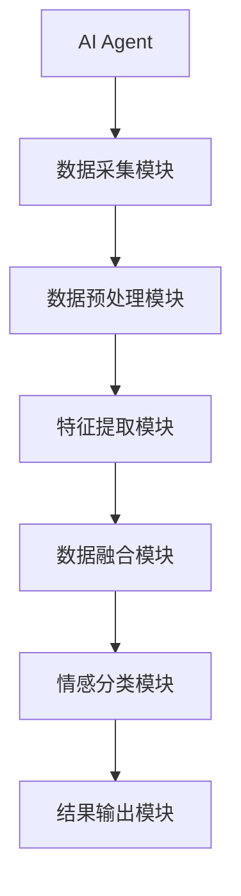
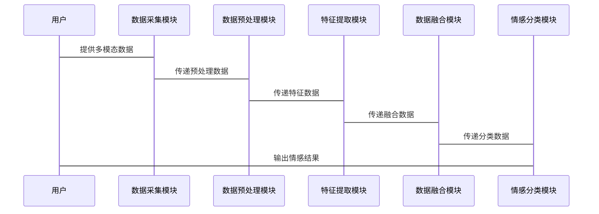

                 


# 构建AI Agent的实时多模态情感识别系统

> 关键词：AI Agent，多模态情感识别，实时处理，数据融合，系统架构

> 摘要：本文详细探讨了构建AI Agent的实时多模态情感识别系统的各个方面，从背景介绍到核心概念，从算法原理到系统架构，从项目实战到总结，为读者提供了一套完整的解决方案和实践指导。

---

## 第1章: 多模态情感识别系统背景介绍

### 1.1 多模态情感识别的定义与问题背景

#### 1.1.1 情感识别的核心概念
情感识别是指通过分析多模态数据（如文本、语音、图像等）来判断一个人的情感状态（如高兴、生气、悲伤等）。它是人机交互、智能助手、教育等领域的重要技术。

#### 1.1.2 多模态数据的定义与特点
多模态数据是指结合了多种数据形式（如文本、语音、图像）的数据。其特点包括：
1. **互补性**：不同模态的数据可以相互补充，提高识别的准确性。
2. **实时性**：需要在短时间内完成数据处理和情感识别。
3. **复杂性**：多模态数据的融合和处理具有较高的技术难度。

#### 1.1.3 实时情感识别的必要性与应用场景
实时情感识别在智能客服、教育辅助、医疗诊断等领域具有重要应用。例如，在智能客服中，实时情感识别可以帮助系统更好地理解用户需求，提供更个性化的服务。

### 1.2 多模态情感识别的问题描述

#### 1.2.1 情感识别的主要挑战
1. **数据异构性**：不同模态的数据格式和特征不同，难以直接融合。
2. **实时性要求**：需要在短时间内完成数据处理和情感识别，对系统性能要求高。
3. **数据质量**：采集的数据可能存在噪声，影响识别的准确性。

#### 1.2.2 多模态数据融合的难点
1. **数据对齐**：不同模态的数据时间同步问题。
2. **特征提取**：如何提取有效的特征并进行融合。
3. **模型选择**：选择合适的算法进行情感识别。

#### 1.2.3 实时性要求对系统设计的影响
实时性要求对系统设计的影响主要体现在硬件选择、算法优化和数据处理流程设计上。需要选择高性能的硬件和高效的算法，优化数据处理流程，以确保系统在规定时间内完成任务。

### 1.3 多模态情感识别的解决方案

#### 1.3.1 多模态数据融合方法
1. **特征级融合**：在特征提取阶段融合不同模态的特征。
2. **决策级融合**：在情感分类结果的基础上进行融合。

#### 1.3.2 实时处理的技术路线
1. **数据采集与预处理**：实时采集多模态数据并进行预处理。
2. **特征提取与融合**：提取特征并进行融合。
3. **情感分类与输出**：进行情感分类并输出结果。

#### 1.3.3 情感识别算法的选择与优化
选择合适的算法（如支持向量机、深度学习模型）并进行优化，以提高识别的准确性和实时性。

### 1.4 系统的边界与外延

#### 1.4.1 系统的功能边界
系统的主要功能包括数据采集、预处理、特征提取、数据融合、情感分类和结果输出。

#### 1.4.2 多模态数据的采集范围
包括文本、语音、图像等多种数据形式的采集。

#### 1.4.3 实时处理的性能指标
包括处理延迟、吞吐量、准确率等性能指标。

### 1.5 核心概念结构与组成要素

#### 1.5.1 多模态数据流的构成
多模态数据流包括文本流、语音流和图像流。

#### 1.5.2 情感识别模型的组成
情感识别模型包括特征提取模块、数据融合模块和情感分类模块。

#### 1.5.3 AI Agent的系统架构
AI Agent的系统架构包括数据采集模块、数据处理模块和决策模块。

---

## 第2章: 多模态情感识别的核心概念与联系

### 2.1 多模态数据的特征与属性对比

#### 2.1.1 文本数据的特征分析
文本数据的特征包括词汇、语法、情感倾向等。

#### 2.1.2 语音数据的特征分析
语音数据的特征包括音调、语速、音量等。

#### 2.1.3 图像数据的特征分析
图像数据的特征包括颜色、形状、纹理等。

#### 2.1.4 数据特征对比表格
| 数据类型 | 文本 | 语音 | 图像 |
|----------|------|-------|------|
| 特征     | 词汇、语法 | 音调、语速 | 颜色、形状 |

### 2.2 多模态数据的融合原理

#### 2.2.1 数据融合的层次模型
数据融合的层次模型包括特征级融合、决策级融合等层次。

#### 2.2.2 数据融合的数学模型
数据融合的数学模型可以表示为：
$$
F = w_1 x_1 + w_2 x_2 + \dots + w_n x_n
$$
其中，$w_i$ 是权重，$x_i$ 是特征。

#### 2.2.3 数据融合的实现流程
数据融合的实现流程包括特征提取、权重分配、融合计算等步骤。

### 2.3 ER实体关系图架构

```mermaid
er
actor: 用户
agent: AI Agent
emotion_data: 情感数据
text_data: 文本数据
audio_data: 语音数据
visual_data: 图像数据
```

---

## 第3章: AI Agent的基本概念与设计原则

### 3.1 AI Agent的定义与特点

#### 3.1.1 AI Agent的定义
AI Agent是一种能够感知环境并采取行动以实现目标的智能实体。

#### 3.1.2 AI Agent的核心特点
1. **自主性**：能够自主决策。
2. **反应性**：能够实时响应环境变化。
3. **学习能力**：能够通过学习提高性能。

### 3.2 AI Agent的设计原则

#### 3.2.1 模块化设计原则
将系统划分为多个模块，每个模块负责特定的功能。

#### 3.2.2 实时性设计原则
确保系统能够在规定时间内完成任务。

#### 3.2.3 可扩展性设计原则
确保系统能够方便地扩展功能。

---

## 第4章: 多模态数据采集与预处理

### 4.1 多模态数据采集技术

#### 4.1.1 文本数据采集
通过文本输入设备（如键盘）采集文本数据。

#### 4.1.2 语音数据采集
通过麦克风采集语音数据。

#### 4.1.3 图像数据采集
通过摄像头采集图像数据。

---

## 第5章: 多模态情感识别算法原理

### 5.1 多模态情感识别的算法选择

#### 5.1.1 支持向量机（SVM）
支持向量机是一种常用的分类算法。

#### 5.1.2 深度学习模型
深度学习模型（如卷积神经网络、循环神经网络）在情感识别中表现优异。

### 5.2 数据融合算法

#### 5.2.1 基于特征的融合算法
将不同模态的特征向量进行线性组合。

#### 5.2.2 基于概率的融合算法
使用概率模型进行特征融合。

### 5.3 情感分类算法

#### 5.3.1 支持向量机（SVM）分类
使用SVM进行情感分类。

#### 5.3.2 深度学习分类
使用深度学习模型（如LSTM）进行情感分类。

---

## 第6章: 系统架构设计与实现

### 6.1 系统架构设计

#### 6.1.1 系统功能设计
系统功能包括数据采集、预处理、特征提取、数据融合、情感分类和结果输出。

#### 6.1.2 系统架构图


### 6.2 系统接口设计

#### 6.2.1 数据采集接口
定义数据采集模块的接口。

#### 6.2.2 数据预处理接口
定义数据预处理模块的接口。

### 6.3 系统交互设计

#### 6.3.1 交互流程
用户输入数据，系统进行处理并输出结果。

#### 6.3.2 交互序列图


---

## 第7章: 项目实战与优化

### 7.1 环境搭建

#### 7.1.1 开发环境
安装Python、TensorFlow、Keras等工具。

#### 7.1.2 数据集准备
准备多模态数据集（如文本、语音、图像）。

### 7.2 系统核心实现

#### 7.2.1 数据采集与预处理代码
```python
import numpy as np
import librosa
import cv2

def extract_text_feature(text):
    # 文本特征提取
    return vectorizer.transform([text]).toarray()

def extract_audio_feature(audio_file):
    # 语音特征提取
    audio, sr = librosa.load(audio_file, sr=16000)
    mfccs = librosa.feature.mfcc(y=audio, sr=sr, n_mfcc=13)
    return mfccs.T

def extract_visual_feature(image_file):
    # 图像特征提取
    image = cv2.imread(image_file)
    features = cv2.cvtColor(image, cv2.COLOR_BGR2HSV)
    return features.reshape(-1, 3)
```

#### 7.2.2 数据融合与分类代码
```python
def fuse_features(text_feat, audio_feat, visual_feat):
    # 特征融合
    fused_feat = np.concatenate([text_feat, audio_feat, visual_feat], axis=1)
    return fused_feat

def classify_emotion(fused_feat, model):
    # 情感分类
    return model.predict(fused_feat)
```

### 7.3 系统优化与调优

#### 7.3.1 性能优化
优化算法复杂度，提高处理速度。

#### 7.3.2 模型调优
调整模型参数，提高分类准确率。

### 7.4 案例分析

#### 7.4.1 情感识别案例
分析一个具体案例，展示系统的工作流程。

#### 7.4.2 性能评估
评估系统在不同场景下的表现。

---

## 第8章: 总结与展望

### 8.1 总结
本文详细介绍了构建AI Agent的实时多模态情感识别系统的各个方面，包括背景、核心概念、算法原理、系统架构、项目实战等。

### 8.2 最佳实践 tips
1. 在数据采集阶段，确保数据质量。
2. 在特征提取阶段，选择合适的特征。
3. 在数据融合阶段，采用有效的融合方法。
4. 在情感分类阶段，选择合适的算法。

### 8.3 小结
构建AI Agent的实时多模态情感识别系统是一个复杂但极具挑战性的任务，需要综合考虑数据采集、预处理、特征提取、数据融合和情感分类等多个方面。

### 8.4 注意事项
1. 注意数据的实时性要求。
2. 注意系统的可扩展性设计。
3. 注意数据的安全性和隐私保护。

### 8.5 未来展望
随着人工智能技术的不断发展，多模态情感识别系统将更加智能化和精准化，应用领域也将更加广泛。

---

## 作者

作者：AI天才研究院/AI Genius Institute & 禅与计算机程序设计艺术 /Zen And The Art of Computer Programming

