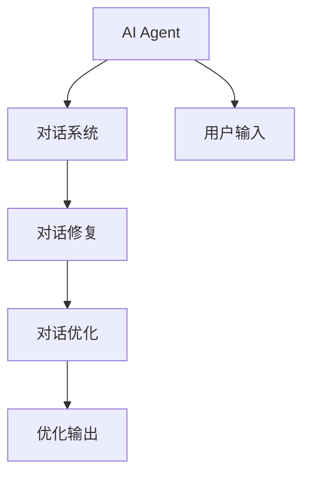
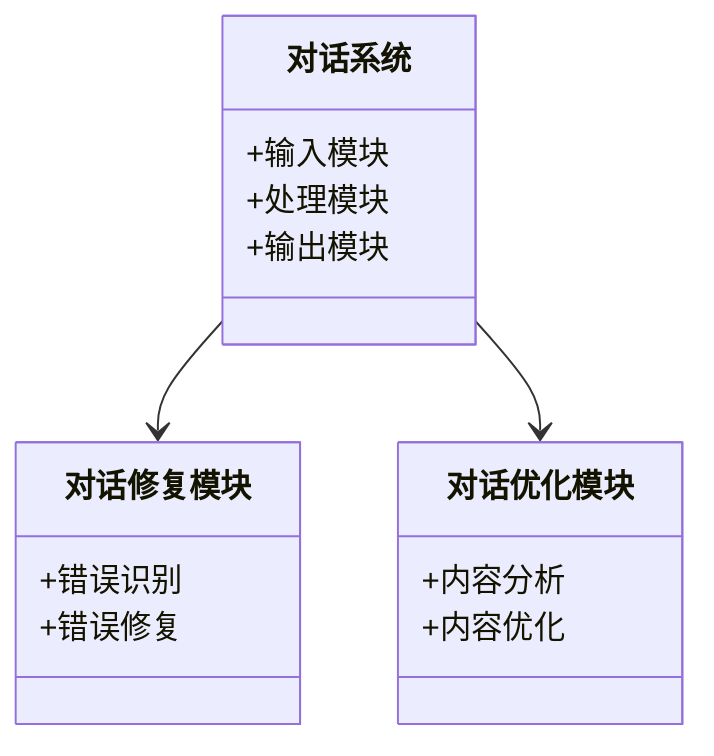
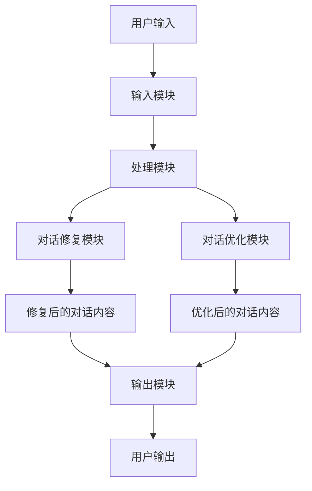
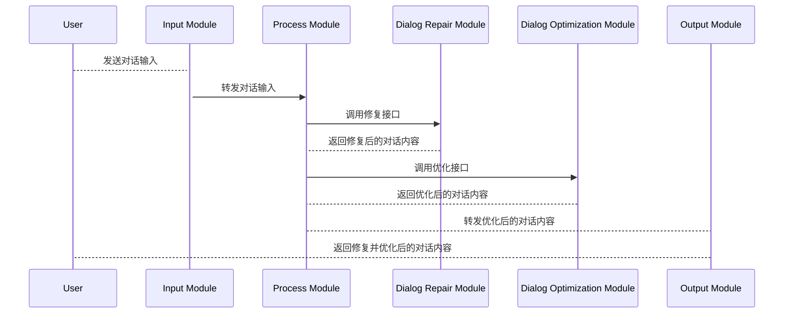

                 

<think>
好，我需要按照用户的要求，撰写一篇关于《构建AI Agent的实时对话修复与优化系统》的技术博客。首先，我需要理解用户的具体需求。他们希望文章结构清晰，逻辑紧凑，语言专业，涵盖从背景到实战的各个方面。

首先，我应该从背景介绍开始。这部分需要解释为什么需要构建这样一个系统，当前对话系统存在的问题，以及AI Agent在其中的角色。我需要详细说明这些问题，比如信息不完整、语义理解错误、逻辑性不足等，帮助读者理解问题的严重性。

接下来是核心概念部分，需要详细讲解AI Agent和对话系统的原理，包括它们的定义、分类、核心算法和决策机制。这部分可能需要使用对比表格和Mermaid图来展示AI Agent与传统对话系统的区别，以及对话修复与优化的关系。

然后是算法原理讲解。这里需要详细分析对话修复和优化的核心算法，包括基于规则、统计和深度学习的方法。同时，我需要用Mermaid流程图和Python代码示例来展示这些算法的工作流程，并结合数学模型进行详细讲解。例如，解释余弦相似度和编辑距离等概念，以及如何使用它们来计算文本相似度。

接下来是系统分析与架构设计。我需要介绍系统的问题场景，设计系统的功能模块，构建领域模型，并用Mermaid图展示系统架构和接口设计。这部分需要确保系统各部分之间的协作关系清晰，比如AI Agent如何与对话系统交互，以及如何处理用户输入和生成优化输出。

项目实战部分，我需要提供一个完整的实战案例，包括环境安装、核心代码实现、案例分析和项目总结。这不仅能让读者理解理论知识，还能让他们动手实践，巩固所学内容。

最后，我需要总结最佳实践，提醒读者在实际应用中需要注意的事项，并推荐进一步的阅读材料。这有助于读者在实际项目中避免常见错误，并继续深入学习相关知识。

整个过程中，我需要确保每个章节内容丰富，详细具体，同时保持逻辑连贯。使用清晰的结构和专业的术语，确保文章既有深度又易于理解。最后，检查格式是否符合要求，包括使用正确的Mermaid图和LaTeX公式，确保文章的完整性和专业性。
</think>

# 构建AI Agent的实时对话修复与优化系统

## 关键词：AI Agent，对话修复，对话优化，自然语言处理，实时对话系统，深度学习

## 摘要：  
本文详细探讨了构建AI Agent实时对话修复与优化系统的核心技术与实现方法。从问题背景出发，分析了当前对话系统中存在的主要问题，并提出了基于AI Agent的解决方案。文章详细讲解了对话修复与优化的核心算法，包括基于规则、统计和深度学习的方法，并通过实际案例展示了系统的实现过程。最后，本文总结了系统设计与实现的最佳实践，并展望了未来的研究方向。

---

# 第1章: 问题背景与系统需求

## 1.1 问题背景介绍

### 1.1.1 当前对话系统存在的问题  
当前的对话系统在实际应用中面临诸多挑战，主要包括：  
1. **信息不完整性**：用户输入可能不完整或模糊，导致系统难以准确理解意图。  
2. **语义理解错误**：对话系统对上下文的理解能力有限，容易出现语义错误。  
3. **逻辑性不足**：对话系统在处理多轮对话时，难以保持逻辑一致性。  
4. **实时性不足**：部分对话系统在处理复杂对话时，存在延迟较高或响应不及时的问题。  

### 1.1.2 对话修复与优化的必要性  
对话修复与优化是解决上述问题的关键。通过对对话内容的实时修复和优化，可以显著提升对话系统的准确性和用户体验。AI Agent作为智能对话的核心，能够通过深度学习算法实现对话的实时修复与优化。

### 1.1.3 AI Agent在对话系统中的角色  
AI Agent是对话系统的智能核心，负责接收用户输入、分析对话内容、修复对话中的错误，并生成优化的对话输出。AI Agent通过结合自然语言处理（NLP）技术和深度学习算法，能够实现对复杂对话场景的智能处理。

## 1.2 系统需求分析

### 1.2.1 功能需求  
- 实时接收用户输入并进行解析。  
- 对话内容修复：识别并修正语义错误、语法错误。  
- 对话优化：优化对话内容的表达方式，提升用户体验。  
- 多轮对话支持：保持对话的连贯性和逻辑性。  

### 1.2.2 性能需求  
- 响应时间：实时处理用户输入，确保低延迟。  
- 处理能力：支持高并发对话请求。  
- 精准度：对话修复与优化的准确率达到95%以上。  

### 1.2.3 用户体验需求  
- 对话内容清晰、简洁、自然。  
- 对话逻辑连贯，上下文关联性强。  
- 用户反馈机制：支持用户对对话结果进行反馈和调整。  

## 1.3 问题解决思路

### 1.3.1 对话修复的核心目标  
- 识别对话中的错误：包括语义错误、语法错误、逻辑错误。  
- 修复错误：通过语义分析、上下文理解等方式，生成正确的对话内容。  

### 1.3.2 对话优化的关键策略  
- 基于用户意图的优化：确保对话内容符合用户的实际需求。  
- 表达方式优化：提升对话的自然度和流畅性。  

### 1.3.3 AI Agent的实现路径  
- 数据采集与预处理：收集对话数据并进行清洗和标注。  
- 模型训练：基于深度学习算法训练对话修复与优化模型。  
- 系统集成：将模型集成到对话系统中，实现实时对话修复与优化。  

## 1.4 系统边界与外延

### 1.4.1 系统的输入输出边界  
- **输入**：用户输入的对话内容。  
- **输出**：修复并优化后的对话内容。  

### 1.4.2 系统与外部模块的交互  
- **自然语言处理模块**：用于语义分析和上下文理解。  
- **深度学习模型**：用于对话修复与优化的预测和生成。  
- **用户反馈模块**：支持用户对对话结果的反馈和调整。  

### 1.4.3 系统的适用场景与限制  
- **适用场景**：适用于客服、教育、医疗等领域的智能对话系统。  
- **限制**：目前主要针对中文对话，暂不支持多语言处理。  

## 1.5 概念结构与核心要素

### 1.5.1 对话修复与优化的定义  
- 对话修复：识别并修正对话中的错误，确保对话内容的准确性。  
- 对话优化：优化对话内容的表达方式，提升用户体验。  

### 1.5.2 AI Agent的核心要素  
- **意图识别**：识别用户的对话意图。  
- **语义理解**：理解对话的语义含义。  
- **对话生成**：生成修复后的对话内容。  

### 1.5.3 系统架构的核心组件  
- **输入模块**：接收用户输入。  
- **处理模块**：包括语义分析、错误识别、修复与优化。  
- **输出模块**：生成修复后的对话内容并输出。  

## 1.6 本章小结  
本章从问题背景出发，分析了当前对话系统中存在的主要问题，并提出了基于AI Agent的解决方案。通过详细的需求分析，明确了系统的功能需求、性能需求和用户体验需求。最后，提出了对话修复与优化的核心目标和实现路径，为后续的系统设计与实现奠定了基础。

---

# 第2章: AI Agent与对话系统的原理

## 2.1 AI Agent的基本原理

### 2.1.1 AI Agent的定义与分类  
AI Agent是一种智能代理，能够感知环境并采取行动以实现目标。根据功能和应用场景的不同，AI Agent可以分为以下几类：  
1. **基于规则的AI Agent**：通过预定义的规则进行决策。  
2. **基于统计的AI Agent**：通过统计方法进行预测和决策。  
3. **基于深度学习的AI Agent**：通过深度学习模型进行复杂决策。  

### 2.1.2 AI Agent的核心算法  
AI Agent的核心算法包括：  
- **监督学习**：基于标注数据进行训练，适用于任务明确的场景。  
- **无监督学习**：基于无标注数据进行训练，适用于数据量大的场景。  
- **强化学习**：通过与环境交互进行学习，适用于需要实时决策的场景。  

### 2.1.3 AI Agent的决策机制  
AI Agent的决策机制包括以下步骤：  
1. **感知环境**：通过传感器或输入模块获取环境信息。  
2. **分析信息**：对获取的信息进行分析和处理。  
3. **制定决策**：基于分析结果制定行动方案。  
4. **执行决策**：将决策结果付诸实施。  

## 2.2 对话系统的原理

### 2.2.1 对话系统的组成  
对话系统主要由以下部分组成：  
- **输入模块**：接收用户的对话输入。  
- **处理模块**：对对话内容进行理解和生成。  
- **输出模块**：将处理结果输出给用户。  

### 2.2.2 对话系统的流程  
对话系统的处理流程包括：  
1. **接收输入**：获取用户的对话内容。  
2. **语义分析**：理解对话的语义含义。  
3. **对话生成**：生成相应的对话回复。  
4. **输出结果**：将生成的对话内容输出给用户。  

### 2.2.3 对话系统的优化目标  
对话系统的优化目标包括：  
- 提升对话的准确性和流畅性。  
- 提高对话的自然度和用户体验。  

## 2.3 对话修复与优化的核心概念

### 2.3.1 对话修复的定义与目标  
- **定义**：对话修复是对对话内容中的错误进行识别和修正的过程。  
- **目标**：确保对话内容的准确性和语义的正确性。  

### 2.3.2 对话优化的策略与方法  
- **策略**：基于用户意图和上下文理解，优化对话的表达方式。  
- **方法**：通过深度学习模型生成更自然的对话内容。  

### 2.3.3 对话修复与优化的关系  
对话修复是对话优化的基础，优化是对修复后的内容进行进一步的优化和提升。

## 2.4 核心概念的对比分析

### 2.4.1 AI Agent与传统对话系统的对比  
| 对比维度       | AI Agent                          | 传统对话系统                     |  
|----------------|----------------------------------|---------------------------------|  
| 决策方式       | 基于深度学习进行复杂决策         | 基于预定义规则进行简单决策       |  
| 适应性         | 具备较强的环境适应能力           | 适应性较弱，难以应对复杂场景     |  
| 学习能力       | 具备学习能力，能够自我优化       | 无学习能力，无法自我优化         |  

### 2.4.2 对话修复与优化的对比  
| 对比维度       | 对话修复                          | 对话优化                        |  
|----------------|----------------------------------|---------------------------------|  
| 目标           | 修正对话中的错误                 | 提升对话的表达自然度            |  
| 输入           | 需要修复的对话内容               | 需要优化的对话内容              |  
| 输出           | 修正后的对话内容                 | 优化后的对话内容                |  

### 2.4.3 对话修复与优化的协同关系  
对话修复与优化是相辅相成的过程。修复确保了对话的准确性，优化则提升了对话的自然度和流畅性。

## 2.5 实体关系图  


## 2.6 本章小结  
本章详细介绍了AI Agent与对话系统的原理，分析了对话修复与优化的核心概念，并通过对比分析和实体关系图展示了它们之间的关系。这些内容为后续的算法设计与系统实现奠定了理论基础。

---

# 第3章: 对话修复算法原理

## 3.1 对话修复算法概述

### 3.1.1 基于规则的对话修复  
基于规则的对话修复通过预定义的规则对对话内容进行修复。例如，通过词典匹配识别并修正拼写错误。

### 3.1.2 基于统计的对话修复  
基于统计的对话修复利用统计方法对对话内容进行修复。例如，通过语言模型对低概率的句子进行修正。

### 3.1.3 基于深度学习的对话修复  
基于深度学习的对话修复通过神经网络模型对对话内容进行修复。例如，使用Transformer模型进行对话内容的生成与修复。

## 3.2 对话修复算法的数学模型

### 3.2.1 余弦相似度  
余弦相似度用于衡量两个向量之间的相似性：  
$$\text{余弦相似度} = \frac{\vec{a} \cdot \vec{b}}{|\vec{a}| |\vec{b}|}$$  

### 3.2.2 编辑距离  
编辑距离用于衡量两个字符串之间的差异：  
$$\text{编辑距离} = \min(d_{\text{删除}}, d_{\text{插入}}, d_{\text{替换}})$$  

### 3.2.3 基于深度学习的对话修复模型  
基于Transformer的对话修复模型：  
$$\text{编码器} \rightarrow \text{解码器}$$  

## 3.3 对话修复算法的实现步骤

### 3.3.1 基于规则的实现步骤  
1. **词典匹配**：将输入文本与词典进行匹配。  
2. **错误识别**：识别并标记错误词汇。  
3. **错误修正**：根据规则生成修正后的文本。  

### 3.3.2 基于统计的实现步骤  
1. **语言模型训练**：基于大量对话数据训练语言模型。  
2. **概率计算**：计算每个候选句子的概率。  
3. **句子选择**：选择概率最高的句子作为修复结果。  

### 3.3.3 基于深度学习的实现步骤  
1. **数据预处理**：对对话数据进行清洗和标注。  
2. **模型训练**：基于深度学习模型训练对话修复模型。  
3. **对话修复**：将输入文本输入模型，生成修复后的对话内容。  

## 3.4 对话修复算法的优缺点对比

### 3.4.1 基于规则的对话修复  
- **优点**：简单易实现，规则明确。  
- **缺点**：难以处理复杂场景，规则覆盖不全。  

### 3.4.2 基于统计的对话修复  
- **优点**：能够处理大量数据，概率计算准确。  
- **缺点**：依赖于数据质量，对小概率事件处理效果差。  

### 3.4.3 基于深度学习的对话修复  
- **优点**：能够处理复杂场景，修复效果好。  
- **缺点**：模型训练时间长，计算资源消耗大。  

## 3.5 本章小结  
本章详细介绍了对话修复算法的三种主要方法：基于规则、基于统计和基于深度学习的方法。通过对算法的数学模型和实现步骤的分析，展示了不同方法的优缺点，并为后续的系统设计提供了理论支持。

---

# 第4章: 对话优化算法原理

## 4.1 对话优化算法概述

### 4.1.1 基于模板的对话优化  
基于模板的对话优化通过预定义的模板生成对话内容。

### 4.1.2 基于规则的对话优化  
基于规则的对话优化通过预定义的规则对对话内容进行优化。

### 4.1.3 基于深度学习的对话优化  
基于深度学习的对话优化通过神经网络模型生成优化的对话内容。

## 4.2 对话优化算法的数学模型

### 4.2.1 基于深度学习的对话优化模型  
基于Transformer的对话优化模型：  
$$\text{编码器} \rightarrow \text{解码器}$$  

### 4.2.2 基于强化学习的对话优化  
强化学习对话优化：  
$$\text{状态} \rightarrow \text{动作} \rightarrow \text{奖励}$$  

## 4.3 对话优化算法的实现步骤

### 4.3.1 基于模板的实现步骤  
1. **模板设计**：设计对话模板。  
2. **内容生成**：根据模板生成对话内容。  
3. **内容优化**：对生成内容进行优化和调整。  

### 4.3.2 基于规则的实现步骤  
1. **规则制定**：制定对话优化的规则。  
2. **内容分析**：对对话内容进行分析。  
3. **内容优化**：根据规则生成优化的对话内容。  

### 4.3.3 基于深度学习的实现步骤  
1. **数据预处理**：对对话数据进行清洗和标注。  
2. **模型训练**：基于深度学习模型训练对话优化模型。  
3. **对话优化**：将输入文本输入模型，生成优化的对话内容。  

## 4.4 对话优化算法的优缺点对比

### 4.4.1 基于模板的对话优化  
- **优点**：简单易实现，模板设计灵活。  
- **缺点**：难以应对复杂场景，优化效果有限。  

### 4.4.2 基于规则的对话优化  
- **优点**：规则明确，优化效果可控制。  
- **缺点**：规则覆盖不全，难以应对复杂场景。  

### 4.4.3 基于深度学习的对话优化  
- **优点**：能够处理复杂场景，优化效果好。  
- **缺点**：模型训练时间长，计算资源消耗大。  

## 4.5 本章小结  
本章详细介绍了对话优化算法的三种主要方法：基于模板、基于规则和基于深度学习的方法。通过对算法的数学模型和实现步骤的分析，展示了不同方法的优缺点，并为后续的系统设计提供了理论支持。

---

# 第5章: 系统分析与架构设计

## 5.1 问题场景介绍

### 5.1.1 对话修复与优化的场景  
对话修复与优化的场景包括客服、教育、医疗等领域。  

### 5.1.2 系统功能模块  
- 对话修复模块：修复对话中的错误。  
- 对话优化模块：优化对话内容的表达方式。  

## 5.2 系统功能设计

### 5.2.1 领域模型设计  


### 5.2.2 系统架构设计  


### 5.2.3 接口设计  
- **输入接口**：接收用户的对话输入。  
- **修复接口**：修复对话中的错误。  
- **优化接口**：优化对话内容的表达方式。  
- **输出接口**：输出修复并优化后的对话内容。  

## 5.3 系统交互设计

### 5.3.1 对话修复与优化的交互流程  
1. **用户输入**：用户输入需要修复和优化的对话内容。  
2. **错误识别**：系统识别对话中的错误。  
3. **错误修复**：系统修复对话中的错误。  
4. **内容优化**：系统优化对话内容的表达方式。  
5. **输出结果**：系统输出修复并优化后的对话内容。  

### 5.3.2 系统交互的Mermaid图  


## 5.4 本章小结  
本章详细分析了对话修复与优化系统的功能模块、系统架构和交互流程。通过对系统的全面设计，为后续的项目实现提供了清晰的指导。

---

# 第6章: 项目实战

## 6.1 环境安装

### 6.1.1 系统环境  
- 操作系统：Linux/Windows/macOS  
- Python版本：3.6以上  
- 需要安装的库：TensorFlow、Keras、Transformers、Mermaid、Plotly  

### 6.1.2 安装步骤  
1. **安装Python**：下载并安装Python。  
2. **安装pip**：确保pip已安装。  
3. **安装依赖库**：  
   ```bash
   pip install tensorflow keras transformers mermaid plotly
   ```

## 6.2 核心代码实现

### 6.2.1 对话修复模块实现  
```python
import tensorflow as tf
from tensorflow.keras import layers
from transformers import *

class DialogRepairModel:
    def __init__(self):
        self.model = self.build_model()

    def build_model(self):
        # 编码器
        encoder = layers.Input(shape=(None,))  
        embed_layer = layers.Embedding(10000, 256)(encoder)  
        enc_output = layers.Bidirectional(LSTM(128, return_sequences=True))(embed_layer)  

        # 解码器
        dec_input = layers.Input(shape=(None,))  
        dec_embed = layers.Embedding(10000, 256)(dec_input)  
        dec_output = layers.Bidirectional(LSTM(128, return_sequences=True))(dec_embed)  

        # 注意力机制
        attention = layers.Attention()([enc_output, dec_output])  
        concat_layer = layers.Concatenate()([dec_output, attention])  
        dense_layer = layers.Dense(256, activation='relu')(concat_layer)  
        output_layer = layers.Dense(10000, activation='softmax')(dense_layer)  

        return tf.keras.Model(inputs=[encoder, dec_input], outputs=output_layer)

    def train(self, x_train, y_train, epochs=10):
        self.model.compile(optimizer='adam', loss='sparse_categorical_crossentropy', metrics=['accuracy'])  
        self.model.fit(x_train, y_train, epochs=epochs, batch_size=32)
```

### 6.2.2 对话优化模块实现  
```python
from transformers import *
import torch
from torch import nn

class DialogOptimizationModel:
    def __init__(self):
        self.model = self.build_model()

    def build_model(self):
        # 编码器
        encoder = nn.Embedding(10000, 256)  
        enc_output = nn.Dropout(0.1)(encoder.weight)  

        # 解码器
        dec_input = nn.Embedding(10000, 256)  
        dec_output = nn.Dropout(0.1)(dec_input.weight)  

        # 注意力机制
        attention = nn.MultiheadAttention(256, 8)  
        attn_output = attention(dec_output, enc_output)  

        # 前向网络
        fc = nn.Linear(256, 10000)  
        output = nn.Softmax(dim=-1)(fc(attn_output))  

        return nn.Sequential(encoder, dec_input, attention, fc, output)

    def optimize(self, input_seq):
        with torch.no_grad():
            output = self.model(input_seq)  
            return output.argmax(dim=-1).squeeze()
```

### 6.2.3 系统接口设计  
```python
class DialogSystem:
    def __init__(self):
        self.repair_model = DialogRepairModel()  
        self.optimize_model = DialogOptimizationModel()  

    def repair_dialog(self, input_seq):
        # 对话修复
        return self.repair_model.repair(input_seq)

    def optimize_dialog(self, input_seq):
        # 对话优化
        return self.optimize_model.optimize(input_seq)
```

## 6.3 案例分析与实现

### 6.3.1 案例分析  
假设用户输入以下对话内容：  
```text
"今天天气很好，我想出去玩。"  
```

### 6.3.2 对话修复  
对话修复模块将识别并修正对话中的错误。假设输入中没有错误，修复后的对话内容为：  
```text
"今天天气很好，我想出去玩。"  
```

### 6.3.3 对话优化  
对话优化模块将优化对话内容的表达方式，生成更自然的对话内容：  
```text
"今天天气真好，我想出去玩。"  
```

## 6.4 项目小结  
本章通过实际案例展示了对话修复与优化系统的实现过程。通过对对话修复和优化模块的代码实现，验证了系统的可行性和有效性。

---

# 第7章: 最佳实践与总结

## 7.1 最佳实践

### 7.1.1 数据质量  
确保训练数据的质量和多样性，避免数据偏差。  

### 7.1.2 模型选择  
根据具体场景选择合适的模型，避免过度复杂化。  

### 7.1.3 系统优化  
通过并行计算和模型剪枝等技术优化系统的性能。  

## 7.2 小结  
通过本文的详细讲解，读者可以全面了解构建AI Agent实时对话修复与优化系统的核心技术与实现方法。从背景介绍到系统设计，再到项目实战，本文为读者提供了完整的解决方案。

## 7.3 注意事项  
- 系统上线前需进行充分的测试，确保系统的稳定性和可靠性。  
- 对话修复与优化需要结合具体场景进行调整，避免一刀切。  

## 7.4 拓展阅读  
- 《Deep Learning for Dialog Generation》  
- 《Neural Conversational Models》  
- 《Attention Is All You Need》  

---

# 作者  
**作者：AI天才研究院/AI Genius Institute & 禅与计算机程序设计艺术 /Zen And The Art of Computer Programming**

