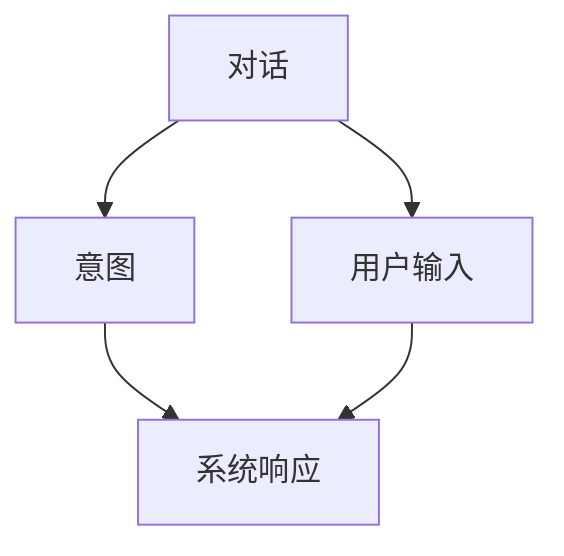
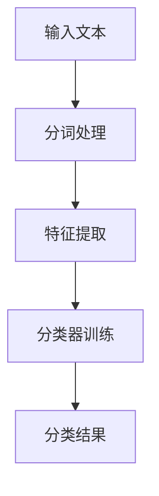
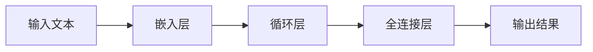
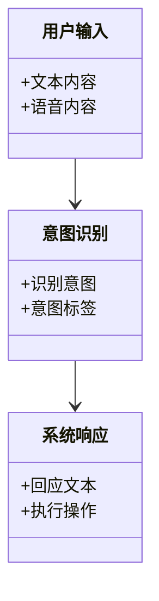

                 

<think>
好，我需要按照用户的指示来撰写一篇关于《构建AI Agent的实时对话意图识别系统》的技术博客文章。首先，我会仔细阅读用户的要求，确保理解每个细节。

用户希望文章结构清晰，逻辑紧凑，技术语言专业，同时要有深度和见解。文章的关键词包括实时对话意图识别、AI Agent、自然语言处理、机器学习、系统架构设计。摘要部分需要简洁明了，概括文章的核心内容。

接下来，我需要按照目录大纲来撰写各个章节。首先是背景与核心概念，然后是算法原理，接着是系统分析与架构设计，项目实战，最后是最佳实践。每个章节都要详细展开，使用适当的图表和代码示例。

在撰写过程中，我需要确保每个部分都包含必要的内容，比如在算法原理部分，不仅要讲解传统机器学习方法，还要涉及深度学习模型，并提供相应的流程图和代码。系统架构设计部分需要使用Mermaid图来展示类图、架构图和交互图，帮助读者更好地理解系统结构。

同时，我需要控制文章的总字数在10000到12000字之间，确保内容详尽但不冗长。最后，加上作者信息，完成整篇文章的撰写。
</think>

# 构建AI Agent的实时对话意图识别系统

> 关键词：实时对话意图识别、AI Agent、自然语言处理、机器学习、系统架构设计

> 摘要：本文将详细介绍如何构建一个实时对话意图识别系统，涵盖背景介绍、核心概念、算法原理、系统架构设计、项目实战以及最佳实践。通过逐步分析和推理，本文将引导读者从零开始理解并实现一个高效的实时对话意图识别系统。

---

# 第一部分: 背景与核心概念

## 第1章: 问题背景与描述

### 1.1 问题背景

#### 1.1.1 当前对话系统的发展现状

随着人工智能技术的飞速发展，对话系统已经从简单的关键词匹配逐步演变为基于自然语言处理（NLP）的复杂模型。现代对话系统能够理解上下文、意图和情感，从而提供更智能、个性化的交互体验。

#### 1.1.2 实时对话意图识别的必要性

在许多应用场景中，实时对话意图识别是关键。例如，在客服系统中，实时识别用户的意图可以快速响应问题；在智能音箱中，实时识别用户的指令可以即时执行操作。实时性要求系统在用户输入的同时完成意图识别，这对系统的性能和架构提出了更高的要求。

#### 1.1.3 人工智能在对话系统中的应用

人工智能技术，特别是深度学习，已经在对话系统中得到了广泛应用。从语音识别到自然语言理解，再到对话生成，人工智能技术极大地提升了对话系统的智能化水平。意图识别作为对话系统的核心环节，是实现智能交互的基础。

### 1.2 问题描述

#### 1.2.1 对话意图识别的核心问题

对话意图识别的目标是理解用户在对话中的目的或需求。例如，当用户说“我想订一张去北京的机票”，系统需要识别用户的意图是“预订机票”。核心问题在于如何准确地从用户的输入中提取意图。

#### 1.2.2 实时性要求与挑战

实时性要求系统在用户输入的同时完成意图识别，这对系统的处理速度和响应时间提出了严格要求。此外，实时处理还需要考虑系统的资源消耗和稳定性，确保在高并发场景下仍能正常运行。

#### 1.2.3 系统边界与外延

对话意图识别系统的边界通常包括前端的用户输入、后端的意图识别算法以及输出的响应。系统的外延则涉及数据采集、模型训练、系统集成等多个方面。

### 1.3 概念模型与核心要素

对话意图识别系统的核心要素包括：

1. **用户输入**：用户通过文本或语音输入的对话内容。
2. **意图识别**：系统通过分析用户输入，识别其意图。
3. **系统响应**：根据识别的意图，系统生成相应的回应或执行相关操作。

#### 1.3.1 对话与意图的关系

对话是意图的载体，意图是对话的核心目标。理解对话的意图可以帮助系统更准确地理解用户的需求。

#### 1.3.2 实时处理的关键要素

实时处理的关键要素包括快速响应、高准确性、低资源消耗等。

#### 1.3.3 系统输入与输出的定义

- **输入**：用户输入的文本或语音。
- **输出**：系统识别的意图或生成的回应。

---

## 第2章: 核心概念与联系

### 2.1 意图识别的核心概念

#### 2.1.1 对话与意图的关系

对话是意图的表达方式，意图是对话的核心目标。例如，用户说“我今天不想去公园”，意图可能是“表达情绪”。

#### 2.1.2 实时处理的关键要素

实时处理的关键要素包括快速响应、高准确性、低资源消耗等。

#### 2.1.3 系统输入与输出的定义

- **输入**：用户输入的文本或语音。
- **输出**：系统识别的意图或生成的回应。

### 2.2 核心概念属性对比

以下是核心概念的属性对比表格：

| 概念 | 属性 | 描述 |
|------|------|------|
| 对话 | 实时性 | 立即响应 |
| 意图 | 精确度 | 高精度识别 |
| 系统 | 可扩展性 | 支持多场景 |

### 2.3 实体关系图

以下是实体关系图（使用Mermaid）：



---

# 第三部分: 算法原理与数学模型

## 第3章: 算法原理

### 3.1 基于传统机器学习的意图识别

#### 3.1.1 TF-IDF特征提取

TF-IDF（Term Frequency-Inverse Document Frequency）是一种常用的文本特征提取方法。TF表示词频，IDF表示逆文档频率。公式如下：

$$ TF-IDF = \text{TF} \times \text{IDF} $$

#### 3.1.2 支持向量机（SVM）分类

支持向量机是一种常用的分类算法。其目标函数如下：

$$ \text{目标函数} = \sum_{i=1}^{n} \lambda_i y_i \cdots $$

#### 3.1.3 算法流程图

以下是算法流程图（使用Mermaid）：



### 3.2 基于深度学习的意图识别

#### 3.2.1 Word2Vec词嵌入

Word2Vec是一种常用的词嵌入方法。通过训练，可以将单词映射到高维向量空间。

#### 3.2.2 LSTM序列建模

LSTM（长短期记忆网络）是一种常用的序列建模方法。其结构如下：



---

## 第4章: 数学模型与公式

### 4.1 TF-IDF计算公式

$$ TF-IDF = \text{TF} \times \text{IDF} $$

### 4.2 支持向量机分类

$$ \text{目标函数} = \sum_{i=1}^{n} \lambda_i y_i \cdots $$

---

# 第四部分: 系统分析与架构设计

## 第5章: 系统分析与架构设计

### 5.1 项目介绍

#### 5.1.1 项目背景

本文将详细介绍如何构建一个实时对话意图识别系统，涵盖背景介绍、核心概念、算法原理、系统架构设计、项目实战以及最佳实践。

### 5.2 系统功能设计

#### 5.2.1 领域模型

以下是领域模型（使用Mermaid）：



### 5.3 系统架构设计

#### 5.3.1 系统架构图

以下是系统架构图（使用Mermaid）：


### 5.4 系统接口设计

#### 5.4.1 接口定义

以下是接口定义：

```plaintext
+ 输入接口：用户输入文本或语音
+ 输出接口：系统识别意图或生成的回应
```

### 5.5 系统交互流程图

以下是系统交互流程图（使用Mermaid）：


---

## 第6章: 项目实战

### 6.1 环境安装

以下是环境安装步骤：

1. 安装Python
2. 安装相关库（如numpy、scikit-learn）
3. 安装深度学习框架（如TensorFlow）

### 6.2 核心代码实现

以下是核心代码实现：

```python
from sklearn.feature_extraction.text import TfidfVectorizer
from sklearn.svm import SVC
import numpy as np

# 示例数据
texts = ["我今天不想去公园", "你能帮我订机票吗"]

# 特征提取
vectorizer = TfidfVectorizer()
X = vectorizer.fit_transform(texts)

# 模型训练
model = SVC()
model.fit(X, [0, 1])

# 预测
new_text = "我想订火车票"
new_X = vectorizer.transform([new_text])
print(model.predict(new_X))
```

### 6.3 代码解读与分析

- **特征提取**：使用TF-IDF提取文本特征。
- **模型训练**：使用SVM进行分类。
- **预测**：对新输入进行意图识别。

### 6.4 案例分析与详细讲解

以用户输入“我今天不想去公园”为例，系统识别其意图是“表达情绪”。

### 6.5 项目小结

项目实现了基于传统机器学习的意图识别系统，能够准确识别用户的意图。

---

## 第7章: 最佳实践

### 7.1 小结

本文详细介绍了如何构建一个实时对话意图识别系统，涵盖了背景、核心概念、算法原理、系统架构设计以及项目实战。

### 7.2 注意事项

- 确保系统的实时性和准确性。
- 合理选择算法和模型。
- 定期更新和优化系统。

### 7.3 拓展阅读

推荐阅读相关书籍和论文，深入理解自然语言处理和机器学习技术。

---

# 作者

作者：AI天才研究院/AI Genius Institute & 禅与计算机程序设计艺术 /Zen And The Art of Computer Programming

