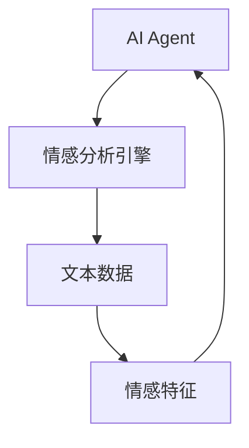
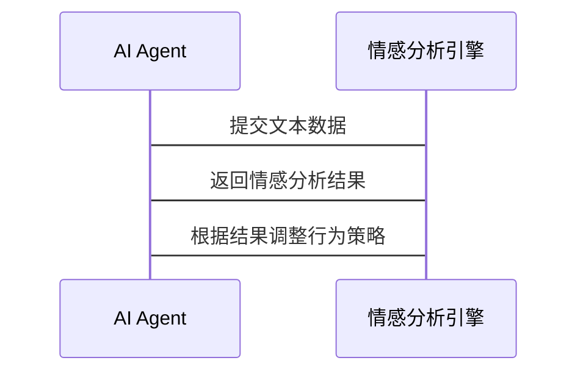
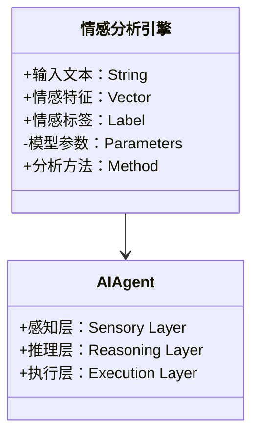
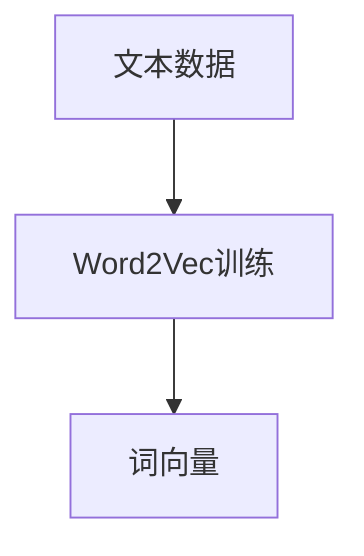
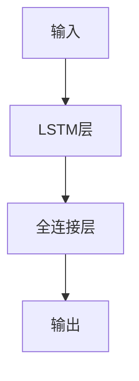
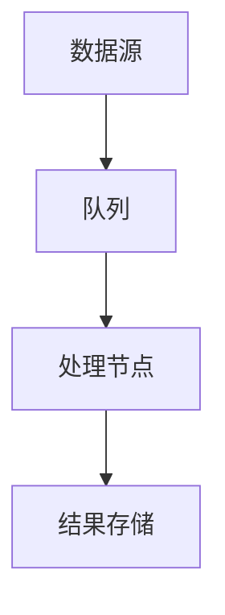
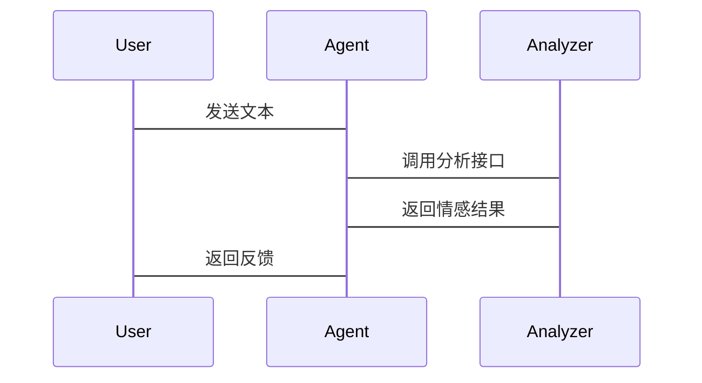
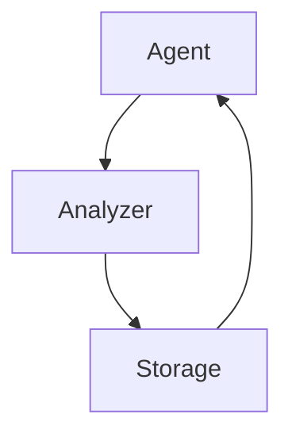

                 


# 构建AI Agent的实时情感分析引擎

> 关键词：AI Agent，实时情感分析，自然语言处理，深度学习，系统架构

> 摘要：本文详细探讨了构建AI Agent的实时情感分析引擎的关键技术与实现方案。从情感分析的核心原理到AI Agent的智能决策机制，从算法优化到系统架构设计，结合实际案例，系统地分析了如何实现一个高效、准确的实时情感分析引擎。

---

# 第1章: 情感分析与AI Agent概述

## 1.1 情感分析的背景与意义
### 1.1.1 情感分析的定义与应用领域
情感分析（Sentiment Analysis）是自然语言处理（NLP）领域的重要研究方向，旨在通过计算机技术分析文本中的情感倾向，判断文本是正面、负面还是中性。情感分析广泛应用于社交媒体监控、客户反馈分析、舆情监测等领域。随着AI Agent技术的快速发展，情感分析在实时交互中的应用需求日益增长。

### 1.1.2 AI Agent的基本概念与特点
AI Agent（人工智能代理）是一种智能实体，能够感知环境、执行任务并做出决策。AI Agent的核心特点包括自主性、反应性、目标导向和社会能力。AI Agent可以通过情感分析理解用户意图和情感倾向，从而提供更智能、更个性化的服务。

### 1.1.3 实时情感分析引擎的必要性
在实时交互场景中，AI Agent需要快速理解用户输入的情感倾向，以便做出及时的反馈。实时情感分析引擎是实现这一目标的关键技术，它能够快速处理海量数据，保证分析的实时性和准确性。

## 1.2 情感分析的核心问题
### 1.2.1 文本数据的特征提取
情感分析的关键在于从文本中提取有用的特征。常用的特征包括词袋模型、TF-IDF特征和词嵌入（如Word2Vec、GloVe）。

### 1.2.2 情感极性分类的挑战
情感分析的核心任务是将文本分为正面、负面或中性。然而，情感分析面临以下挑战：
- **数据稀疏性**：某些情感类别数据不足，导致模型泛化能力差。
- **语境依赖性**：情感倾向可能依赖于上下文，如否定词的反转作用。
- **歧义性**：某些词汇在不同语境下具有不同的情感倾向。

### 1.2.3 实时性与效率的平衡
实时情感分析需要在毫秒级别完成处理，这对算法的复杂度和系统的优化提出了更高的要求。

## 1.3 AI Agent在情感分析中的作用
### 1.3.1 AI Agent的基本功能与架构
AI Agent通常由感知层、推理层和执行层组成。感知层负责接收输入并进行初步处理，推理层基于情感分析结果做出决策，执行层根据决策结果执行操作。

### 1.3.2 情感分析在AI Agent中的应用场景
- **智能客服**：通过情感分析理解客户情绪，提供更贴心的服务。
- **社交媒体监控**：实时监控社交媒体上的情感倾向，帮助企业进行舆情管理。
- **游戏AI**：通过情感分析与玩家互动，提升游戏体验。

### 1.3.3 实时情感分析引擎的设计目标
实时情感分析引擎需要满足以下目标：
- **高效性**：快速处理输入数据，保证实时性。
- **准确性**：准确识别情感倾向，降低误判率。
- **可扩展性**：支持大规模数据处理和高并发场景。

## 1.4 本章小结
本章介绍了情感分析和AI Agent的基本概念，分析了情感分析的核心问题和实时情感分析引擎的必要性。为后续章节奠定了理论基础。

---

# 第2章: 情感分析与AI Agent的核心概念

## 2.1 情感分析的核心原理
### 2.1.1 基于规则的情感分析
基于规则的情感分析通过预定义的情感词典和规则库，对文本中的情感词汇进行匹配，从而判断情感倾向。这种方法简单易实现，但难以应对复杂的语境和模糊表达。

### 2.1.2 统计学习方法在情感分析中的应用
统计学习方法（如朴素贝叶斯、支持向量机）通过训练数据学习情感特征，能够较好地处理数据稀疏性问题。然而，统计方法对特征工程的依赖较高，且难以捕捉复杂的语义信息。

### 2.1.3 深度学习模型的优势
深度学习模型（如LSTM、Transformer）通过端到端的训练方式，能够自动提取文本的语义特征，显著提高了情感分析的准确率。然而，深度学习模型的计算复杂度较高，需要大量的计算资源。

## 2.2 AI Agent的智能决策机制
### 2.2.1 知识表示与推理
AI Agent通过知识图谱或逻辑推理对情感分析结果进行进一步处理，结合上下文信息做出更智能的决策。

### 2.2.2 情感分析结果的决策依据
AI Agent可以根据情感分析结果调整其行为策略，例如在用户情绪低落时提供更关怀的回应。

### 2.2.3 多模态数据的融合与处理
AI Agent可以通过融合语音、图像等多种模态数据，进一步提升情感分析的准确性和鲁棒性。

## 2.3 情感分析与AI Agent的实体关系
### 2.3.1 实体关系图的构建
通过Mermaid图，我们可以清晰地展示情感分析引擎与AI Agent之间的实体关系：



### 2.3.2 情感分析引擎与AI Agent的交互流程
以下是一个简单的交互流程：



### 2.3.3 系统架构的模块划分
以下是情感分析系统的模块划分：



## 2.4 本章小结
本章详细探讨了情感分析与AI Agent的核心概念，分析了情感分析的多种方法及其在AI Agent中的应用。通过Mermaid图展示了实体关系和交互流程，为后续章节的系统设计奠定了基础。

---

# 第3章: 情感分析算法原理与实现

## 3.1 情感分析的算法原理
### 3.1.1 基于词袋模型的简单实现
词袋模型是一种简单的文本表示方法，通过统计文本中各个词的出现频率，将其转换为向量形式。以下是词袋模型的简单实现：

```python
from collections import Counter

def bag_of_words(text, vocabulary):
    vector = [0] * len(vocabulary)
    word_counts = Counter(text.split())
    for i, word in enumerate(vocabulary):
        vector[i] = word_counts.get(word, 0)
    return vector
```

### 3.1.2 基于词嵌入的改进方法
词嵌入（如Word2Vec）通过将词表示为低维向量，捕捉词义的语义信息。以下是Word2Vec的训练流程：



### 3.1.3 神经网络模型的深度学习方法
深度学习模型（如LSTM和Transformer）通过多层神经网络提取文本的语义特征。以下是LSTM的结构图：



## 3.2 实时情感分析的算法优化
### 3.2.1 算法的时间复杂度分析
以下是情感分析算法的时间复杂度对比：

| 算法         | 时间复杂度 |
|--------------|------------|
| 朴素贝叶斯   | O(n)       |
| LSTM         | O(n * d)   |
| Transformer   | O(n * d * h) |

其中，n为序列长度，d为词向量维度，h为注意力头数。

### 3.2.2 并行计算与分布式处理
通过并行计算（如多线程、多进程）和分布式处理（如Spark、TensorFlow分布式训练），可以显著提升情感分析的处理效率。

### 3.2.3 模型压缩与轻量化设计
模型压缩技术（如剪枝、量化）可以减少模型的计算量，提升实时处理能力。

## 3.3 情感分析的数学模型与公式
### 3.3.1 朴素贝叶斯分类器的公式推导
朴素贝叶斯分类器的后验概率公式为：

$$ P(y|X) = \frac{P(X|y)P(y)}{P(X)} $$

其中，$X$ 是输入文本，$y$ 是情感标签。

### 3.3.2 LSTM网络的结构与训练公式
LSTM的细胞状态更新公式为：

$$ c_t = \gamma \cdot c_{t-1} + \beta \cdot f(x_t) $$

其中，$\gamma$ 和 $\beta$ 是遗忘门和输入门的权重，$f(x_t)$ 是输入的变换函数。

### 3.3.3 注意力机制的实现原理
注意力机制的核心公式为：

$$ \alpha_i = \frac{\exp(s_i)}{\sum_{j} \exp(s_j)} $$

其中，$s_i$ 是第i个词的注意力得分。

## 3.4 本章小结
本章详细探讨了情感分析的多种算法及其优化方法，分析了不同算法的时间复杂度和实现原理。通过数学公式和代码示例，帮助读者更好地理解情感分析的核心技术。

---

# 第4章: AI Agent的系统架构与设计

## 4.1 系统功能设计
### 4.1.1 情感分析模块的功能需求
情感分析模块需要实现以下功能：
- 文本预处理（分词、去停用词）
- 特征提取（词袋模型、词嵌入）
- 情感分类（基于机器学习或深度学习）

### 4.1.2 AI Agent的决策模块设计
决策模块需要根据情感分析结果调整AI Agent的行为策略，例如：
- 根据用户情绪调整回复语气
- 根据情感倾向优化推荐内容

## 4.2 系统架构设计
### 4.2.1 分层架构的设计思路
分层架构将系统划分为数据层、业务逻辑层和表现层，便于模块化开发和维护。

### 4.2.2 微服务架构的实现方案
微服务架构通过将系统划分为多个独立的服务（如文本处理服务、情感分类服务），提升系统的可扩展性和灵活性。

### 4.2.3 实时数据流的处理流程
实时数据流的处理流程如下：



## 4.3 系统接口设计
### 4.3.1 API接口的定义与调用方式
以下是情感分析API的示例：

```python
class SentimentAnalyzer:
    def __init__(self, model):
        self.model = model

    def analyze(self, text):
        return self.model.predict(text)
```

### 4.3.2 数据格式与传输协议的选择
推荐使用JSON格式和HTTP协议进行数据传输。

### 4.3.3 接口的版本控制与兼容性
通过版本号（如v1.0、v2.0）实现接口的版本控制和兼容性管理。

## 4.4 系统交互流程
### 4.4.1 用户输入的处理流程
以下是用户输入的处理流程：



### 4.4.2 系统内部的协同工作流程
以下是系统内部的协同工作流程：



### 4.4.3 输出结果的反馈机制
反馈机制需要根据情感分析结果调整后续的交互策略。

## 4.5 本章小结
本章详细探讨了AI Agent的系统架构与设计，分析了系统的功能模块、架构方案和交互流程。通过Mermaid图展示了系统的整体结构和各部分的协同工作方式。

---

# 第5章: 项目实战——构建实时情感分析引擎

## 5.1 环境安装与配置
### 5.1.1 安装Python与相关库
以下是Python环境的安装与配置示例：

```bash
pip install numpy
pip install pandas
pip install scikit-learn
pip install tensorflow
pip install transformers
```

### 5.1.2 安装与配置开发环境
推荐使用Jupyter Notebook或VS Code进行开发。

## 5.2 核心代码实现
### 5.2.1 情感分析模型的实现
以下是基于BERT的情感分析模型实现：

```python
from transformers import BertTokenizer, BertModel
import torch

class SentimentClassifier(torch.nn.Module):
    def __init__(self, bert_model, num_classes):
        super().__init__()
        self.bert = bert_model
        self.dropout = torch.nn.Dropout(0.1)
        self.classifier = torch.nn.Linear(bert_model.config.hidden_size, num_classes)

    def forward(self, input_ids, attention_mask):
        outputs = self.bert(input_ids=input_ids, attention_mask=attention_mask)
        pooled_output = outputs.last_hidden_state[:, 0, :]
        pooled_output = self.dropout(pooled_output)
        logits = self.classifier(pooled_output)
        return logits
```

### 5.2.2 AI Agent的实现
以下是AI Agent的简单实现：

```python
class AI_Agent:
    def __init__(self, analyzer):
        self.analyzer = analyzer

    def process_input(self, text):
        emotion = self.analyzer.analyze(text)
        self.response(emotion)

    def response(self, emotion):
        if emotion == 'positive':
            print("感谢您的支持！")
        elif emotion == 'negative':
            print("抱歉给您带来不便！")
        else:
            print("您的反馈对我们非常重要！")
```

### 5.2.3 系统接口的实现
以下是RESTful API的实现：

```python
from flask import Flask, request, jsonify

app = Flask(__name__)

@app.route('/analyze', methods=['POST'])
def analyze():
    text = request.json['text']
    emotion = analyzer.analyze(text)
    return jsonify({'emotion': emotion})

if __name__ == '__main__':
    app.run()
```

## 5.3 实际案例分析
### 5.3.1 案例1：智能客服
用户输入：“我对你们的服务非常满意！”
情感分析结果：正面
AI Agent反馈：“感谢您的支持！”

### 5.3.2 案例2：社交媒体监控
用户输入：“这个产品真的太差了！”
情感分析结果：负面
AI Agent反馈：“抱歉给您带来不便！”

## 5.4 项目小结
本章通过实际案例展示了如何构建实时情感分析引擎，并通过Python代码详细说明了系统的实现过程。通过这些代码和案例，读者可以更好地理解和应用情感分析技术。

---

# 第6章: 最佳实践与注意事项

## 6.1 最佳实践
### 6.1.1 情感分析模型的优化
- 使用更复杂的模型（如BERT、RoBERTa）提升准确率。
- 通过数据增强技术（如同义词替换、句式变化）提高模型的泛化能力。

### 6.1.2 AI Agent的优化
- 使用多线程或多进程技术提高处理效率。
- 通过缓存技术减少重复计算，提升性能。

## 6.2 注意事项
### 6.2.1 数据隐私问题
在处理用户数据时，需要注意数据隐私和合规性。

### 6.2.2 系统的可扩展性
在设计系统时，需要充分考虑系统的可扩展性，避免因为数据量的增加导致系统崩溃。

### 6.2.3 算法的实时性
在实时场景中，需要权衡算法的准确率和处理速度，确保系统的实时性。

## 6.3 拓展阅读
- **《Deep Learning》** - Ian Goodfellow
- **《Natural Language Processing with PyTorch》** - Delip Rao
- **《Software Architecture Patterns》** - Martin Fowler

## 6.4 本章小结
本章总结了情感分析和AI Agent开发中的最佳实践和注意事项，为读者在实际项目中提供了宝贵的参考。

---

# 作者：AI天才研究院 & 禅与计算机程序设计艺术

---

以上是《构建AI Agent的实时情感分析引擎》的完整目录和内容框架，涵盖了从理论到实践的各个方面，结合实际案例和代码实现，帮助读者系统地理解和掌握实时情感分析引擎的构建技术。

