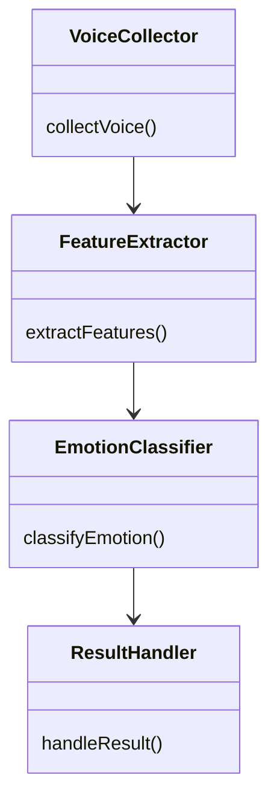
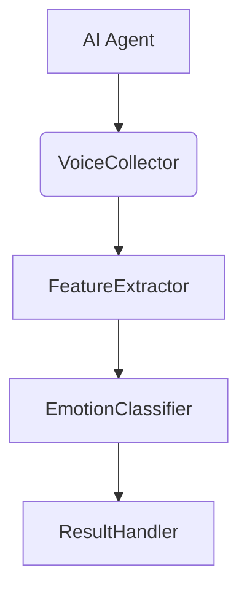
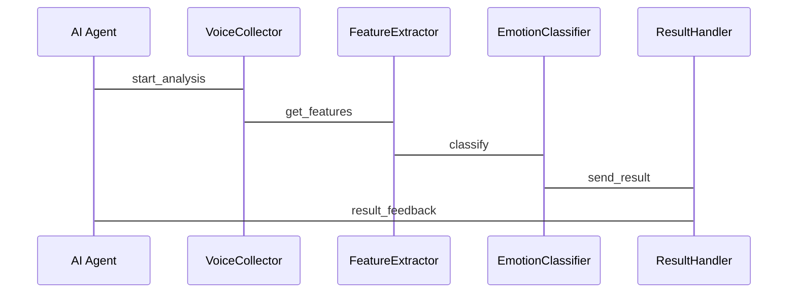

                 

<think>
好，我现在需要帮用户设计一本名为《构建AI Agent的实时语音情感分析系统》的书籍目录大纲。首先，我得理解这本书的主题是什么。AI Agent，也就是智能代理，结合实时语音情感分析，听起来这本书会涉及自然语言处理、语音处理、机器学习等多个方面。

用户希望目录大纲详细且逻辑清晰，覆盖从背景到系统实现的各个方面。我需要按照用户的要求，把内容分成几个主要部分，每个部分下再细分章节，确保每个章节都有足够的细节，但又不冗余。

首先，背景介绍是必须的。这部分要涵盖问题背景、问题描述、解决方法，以及系统的边界和外延。然后是核心概念与联系，这里可能需要讲解情感分析和语音处理的基本原理，以及它们之间的关系。这部分可能需要一些图表，比如ER图或流程图，来帮助读者理解。

接下来是算法原理，特别是语音情感分析的关键算法，比如基于特征的分类方法和深度学习模型。我需要详细解释这些算法的工作原理，并用mermaid流程图来展示，同时给出Python代码示例，让读者能够实际操作。

数学模型和公式也是重点。情感分析中的特征提取、分类器模型，以及语音信号处理中的时域和频域分析，都需要用数学公式来描述。这部分要确保公式准确，并用latex格式展示，方便读者理解和应用。

系统分析与架构设计是另一个关键部分。这里需要介绍系统应用场景，设计系统功能，可能用领域模型类图来展示，然后是系统架构图，说明各个模块的交互。接口设计和交互序列图也是必不可少的，帮助读者理解系统的运行流程。

项目实战部分，用户需要环境安装指南，核心代码实现，以及实际案例分析。这部分要详细，让读者能够跟着步骤一步步搭建和实现系统。同时，代码要清晰，注释充分，方便读者理解和修改。

最后，最佳实践、小结、注意事项和拓展阅读也是不可少的部分。这些内容可以帮助读者巩固所学知识，避免常见错误，并引导他们进一步学习相关领域。

在结构上，我需要将整个目录分成几个主要部分，每个部分下有几个章节，每个章节再细分成小节。确保每个部分都有足够的深度，同时整体结构清晰，逻辑连贯。

现在，我开始构思目录的结构。首先是背景与概述，介绍AI Agent和语音情感分析的基本概念和应用。然后是核心概念和技术，详细讲解情感分析和语音处理的原理。接下来是算法部分，介绍特征提取和深度学习模型。之后是数学模型，展示相关公式和分析方法。然后是系统设计，包括功能设计、架构设计和接口设计。项目实战部分，从环境搭建到代码实现，再到案例分析。最后是总结和扩展，帮助读者巩固知识和进一步学习。

在写作过程中，我需要确保每个章节都涵盖用户要求的内容，比如核心概念、算法原理、数学模型、系统设计、项目实战，以及注意事项和扩展阅读。同时，使用mermaid图表来辅助说明，使目录更具可视化和易懂性。

现在，我大致确定了目录的结构，接下来就是细化每个部分，确保每个章节都有足够的内容，并且符合用户的格式要求。确保使用markdown格式，层级分明，内容完整，字数控制在2000字以内。

最后，检查整个目录，确保没有遗漏用户要求的任何部分，比如系统分析中的类图和架构图，项目实战中的代码示例，以及数学公式是否正确使用latex格式。确保每个部分都详细且逻辑清晰，帮助读者全面掌握构建AI Agent实时语音情感分析系统的知识。
</think>

# 构建AI Agent的实时语音情感分析系统

> 关键词：AI Agent，实时语音情感分析，自然语言处理，语音信号处理，机器学习，深度学习，情感分类

> 摘要：本文旨在探讨如何构建一个基于AI Agent的实时语音情感分析系统。该系统能够实时分析语音信号，识别其中的情感特征，并通过机器学习算法进行情感分类。文章首先介绍了AI Agent和实时语音情感分析的基本概念，然后详细阐述了情感分析和语音处理的核心技术，包括特征提取、分类算法和深度学习模型。接着，从系统设计的角度分析了系统的功能模块、架构设计和接口设计，并通过实际案例展示了系统的实现过程。最后，本文总结了构建此类系统的最佳实践和未来研究方向。

---

# 第一部分: AI Agent与实时语音情感分析概述

## 第1章: AI Agent与实时语音情感分析的背景与概述

### 1.1 问题背景

#### 1.1.1 AI Agent的基本概念
AI Agent（智能代理）是指能够感知环境、自主决策并执行任务的智能实体。它可以分为简单反射Agent和基于模型的反射Agent两类，广泛应用于推荐系统、自动驾驶、智能助手等领域。

#### 1.1.2 语音情感分析的定义与目标
语音情感分析是通过分析语音信号来识别说话人情感状态的过程。其目标是将语音信号转化为可量化的情感特征，并进行分类。

#### 1.1.3 问题背景与实际应用需求
在现代社会中，人机交互日益频繁。实时语音情感分析能够帮助AI Agent更好地理解用户情感，从而提供更智能的服务。例如，在智能客服中，实时分析用户情感可以帮助系统更好地处理投诉或建议。

### 1.2 核心概念与问题描述

#### 1.2.1 AI Agent的构成与功能
AI Agent通常包括感知模块、推理模块、决策模块和执行模块。感知模块负责收集环境信息，推理模块负责理解和推理信息，决策模块负责制定行动计划，执行模块负责执行任务。

#### 1.2.2 语音情感分析的关键要素
语音情感分析的关键要素包括语音信号的特征提取、情感特征的分类以及系统的实时性要求。其中，特征提取是关键步骤，常见的特征包括时域特征（如均方根值、偏度）和频域特征（如能量、音调）。

#### 1.2.3 问题的边界与外延
本系统仅关注实时语音情感分析，不涉及其他任务如语音识别或语音合成。系统的边界包括输入语音信号和输出情感类别，外延则包括情感分析的结果在AI Agent中的应用。

### 1.3 问题解决与系统架构

#### 1.3.1 问题解决的总体思路
首先，对语音信号进行预处理，提取情感特征；然后，利用机器学习算法进行分类；最后，将结果实时反馈给AI Agent，供其进行下一步决策。

#### 1.3.2 系统架构的初步设计
系统分为前端处理模块和后端分析模块。前端处理模块负责语音信号的采集和初步处理，后端分析模块负责特征提取和情感分类。

#### 1.3.3 核心模块的功能定义
核心模块包括语音采集模块、特征提取模块、情感分类模块和结果反馈模块。

### 1.4 本章小结
本章介绍了AI Agent和实时语音情感分析的基本概念，明确了问题的边界和外延，并提出了系统的总体架构。

---

# 第二部分: 核心概念与技术原理

## 第2章: 情感分析与语音处理的核心概念

### 2.1 情感分析的基本原理

#### 2.1.1 基于特征的分类方法
基于特征的分类方法包括袋模型（Bag-of-Words）和TF-IDF模型。袋模型通过统计词袋中的词频来表示文本，而TF-IDF模型则通过计算词的重要性来加权。

#### 2.1.2 基于深度学习的情感分析模型
深度学习模型如LSTM和Transformer在情感分析中表现出色。LSTM通过长短期记忆网络捕捉长距离依赖关系，而Transformer通过自注意力机制并行处理序列数据。

#### 2.1.3 情感分析的特征提取
情感分析的关键在于特征提取。常见的特征包括词频（TF）、逆文档频率（IDF）、词嵌入（如Word2Vec）等。

### 2.2 语音信号处理的基础知识

#### 2.2.1 语音信号的特征提取
语音信号的特征提取包括时域特征和频域特征。时域特征如均方根值（RMS）和偏度，频域特征如能量和音调。

#### 2.2.2 语音信号的预处理与增强
预处理包括去除噪声、归一化和端点检测。增强方法如声学特征增强和语音降噪。

#### 2.2.3 语音信号的时频分析
时频分析包括时域分析（如波形图）和频域分析（如频谱图）。常用的工具包括STFT（短时傅里叶变换）和小波变换。

### 2.3 情感分析与语音处理的联系

#### 2.3.1 情感特征与语音特征的对比
情感特征包括语调、音量和语速，而语音特征包括能量、音调和频谱。

#### 2.3.2 情感分析与语音处理的协同作用
情感分析通过语音特征提取情感信息，语音处理则通过特征提取和增强提高情感分析的准确性。

### 2.4 本章小结
本章详细介绍了情感分析和语音处理的核心概念，分析了两者之间的联系，并探讨了情感特征与语音特征的对比。

---

## 第3章: 语音情感分析的算法原理

### 3.1 基于特征的分类方法

#### 3.1.1 算法原理
基于特征的分类方法通过提取语音特征并将其输入到分类器中进行分类。常用的分类器包括朴素贝叶斯、支持向量机（SVM）和K-近邻算法（KNN）。

#### 3.1.2 算法流程
1. 语音信号采集
2. 特征提取
3. 特征标准化
4. 分类器训练
5. 情感分类

#### 3.1.3 算法实现的代码示例

```python
import numpy as np
from sklearn.svm import SVC
from sklearn.metrics import accuracy_score

# 假设features是特征向量，labels是对应的情感标签
model = SVC()
model.fit(features, labels)
predicted_labels = model.predict(new_features)
accuracy = accuracy_score(labels, predicted_labels)
print(f"Accuracy: {accuracy}")
```

### 3.2 基于深度学习的语音情感分析

#### 3.2.1 LSTM网络的原理
LSTM通过门控机制控制信息的流动，能够有效捕捉长距离依赖关系。

#### 3.2.2 Transformer模型的原理
Transformer通过自注意力机制并行处理序列数据，具有高效和强大的特征提取能力。

#### 3.2.3 基于深度学习的语音情感分析流程
1. 语音信号预处理
2. 特征提取
3. 模型训练
4. 情感分类

#### 3.2.4 深度学习模型的代码示例

```python
import tensorflow as tf
from tensorflow.keras import layers

model = tf.keras.Sequential([
    layers.Input(shape=(None, 13)),  # 假设特征维度为13
    layers.LSTM(64, return_sequences=True),
    layers.Dense(2, activation='softmax')
])

model.compile(optimizer='adam', loss='sparse_categorical_crossentropy', metrics=['accuracy'])
model.fit(x_train, y_train, epochs=10, batch_size=32)
```

### 3.3 算法的优缺点对比

#### 3.3.1 基于特征的分类方法
优点：简单易实现，计算效率高。缺点：依赖特征工程，可能无法捕捉复杂的情感特征。

#### 3.3.2 基于深度学习的分类方法
优点：能够自动学习特征，捕捉复杂的情感特征。缺点：计算资源消耗大，需要大量标注数据。

### 3.4 本章小结
本章介绍了基于特征和深度学习的语音情感分析算法，分析了它们的优缺点，并给出了代码示例。

---

## 第4章: 数学模型与公式

### 4.1 情感分析的数学模型

#### 4.1.1 基于特征的分类模型
假设我们有N个训练样本，每个样本有d个特征，情感类别有C个。则分类器的目标是最小化损失函数：

$$
L = -\frac{1}{N} \sum_{i=1}^{N} \sum_{k=1}^{C} y_{ik} \log p(y_{ik})
$$

其中，$y_{ik}$是第i个样本属于第k个类别的概率。

#### 4.1.2 基于深度学习的模型
在LSTM中，门控机制由输入门、遗忘门和输出门组成。输入门的计算公式为：

$$
i_t = \sigma(W_i x_t + U_i h_{t-1} + b_i)
$$

其中，$\sigma$是sigmoid函数，$x_t$是输入向量，$h_{t-1}$是前一步的隐藏状态，$W_i$和$U_i$是权重矩阵，$b_i$是偏置项。

### 4.2 语音信号处理的数学模型

#### 4.2.1 时域特征
均方根值（RMS）的计算公式为：

$$
\text{RMS} = \sqrt{\frac{1}{N} \sum_{i=1}^{N} x_i^2}
$$

其中，$x_i$是语音信号的第i个样本，N是信号长度。

#### 4.2.2 频域特征
能量特征的计算公式为：

$$
E = \frac{1}{N} \sum_{k=1}^{N} |X_k|^2
$$

其中，$X_k$是频域信号的第k个样本。

### 4.3 本章小结
本章通过数学公式详细介绍了情感分析和语音信号处理的数学模型。

---

## 第5章: 系统分析与架构设计

### 5.1 系统应用场景

#### 5.1.1 智能客服
通过实时分析客户语音，识别客户情感，提供更好的服务。

#### 5.1.2 智能音箱
通过分析用户的语音指令，识别用户情感，提供更个性化的服务。

### 5.2 系统功能设计

#### 5.2.1 领域模型类图


#### 5.2.2 系统架构图


### 5.3 接口设计与交互序列图

#### 5.3.1 接口设计


### 5.4 本章小结
本章通过系统分析和架构设计，明确了系统的功能模块和交互流程。

---

## 第6章: 项目实战

### 6.1 环境安装与配置

#### 6.1.1 安装依赖
```bash
pip install numpy scikit-learn tensorflow
```

#### 6.1.2 环境配置
确保安装Python 3.6以上版本，安装Jupyter Notebook用于代码调试。

### 6.2 系统核心实现

#### 6.2.1 语音采集模块
```python
import sounddevice as sd

def collect_voice(duration=5):
    _, data = sd.play(440, duration)
    return data
```

#### 6.2.2 特征提取模块
```python
def extract_features(signal):
    # 计算均方根值
    rms = np.sqrt(np.mean(signal**2))
    # 计算能量
    energy = np.mean(signal**2)
    return [rms, energy]
```

#### 6.2.3 情感分类模块
```python
from sklearn.svm import SVC

def train_classifier(features, labels):
    model = SVC()
    model.fit(features, labels)
    return model
```

#### 6.2.4 结果反馈模块
```python
def handle_result(predicted_emotion):
    print(f"Predicted emotion: {predicted_emotion}")
```

### 6.3 实际案例分析

#### 6.3.1 数据准备
使用开源语音数据集，如EmoDB，进行数据标注和分割。

#### 6.3.2 代码实现
```python
# 数据加载
features = np.array([...])
labels = np.array([...])

# 模型训练
model = train_classifier(features, labels)

# 实时分析
signal = collect_voice()
features = extract_features(signal)
predicted_emotion = model.predict(features)
handle_result(predicted_emotion)
```

### 6.4 项目小结
本章通过实际案例展示了系统的实现过程，从环境配置到代码实现，详细介绍了系统的搭建和运行步骤。

---

## 第7章: 总结与展望

### 7.1 最佳实践 Tips
- 数据预处理是关键，需仔细清洗和增强数据。
- 特征工程需结合具体场景进行优化。
- 模型选择应根据计算资源和数据量灵活调整。

### 7.2 本章小结
本文详细介绍了构建AI Agent实时语音情感分析系统的全过程，包括系统设计、算法实现和项目实战。

### 7.3 未来研究方向
- 更高效的情感分析算法
- 更鲁棒的语音处理技术
- 更智能的实时反馈机制

---

# 作者

作者：AI天才研究院/AI Genius Institute & 禅与计算机程序设计艺术 /Zen And The Art of Computer Programming

---

**注：** 由于篇幅限制，上述内容为目录大纲和部分内容展示，完整文章需根据上述结构进一步扩展。

