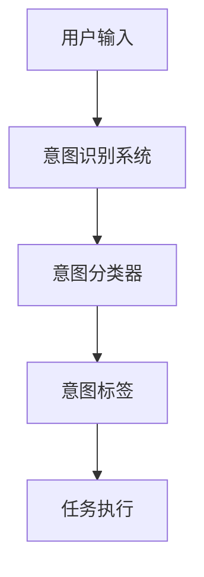
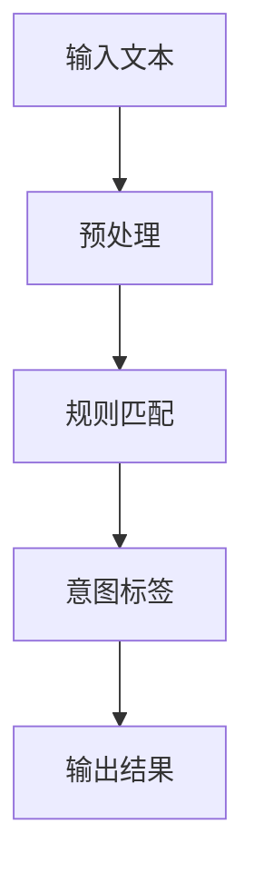
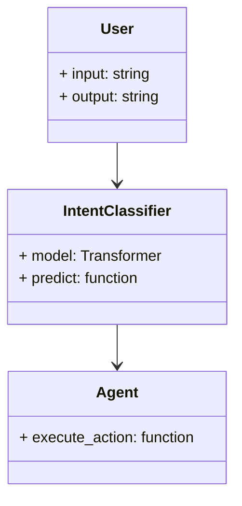
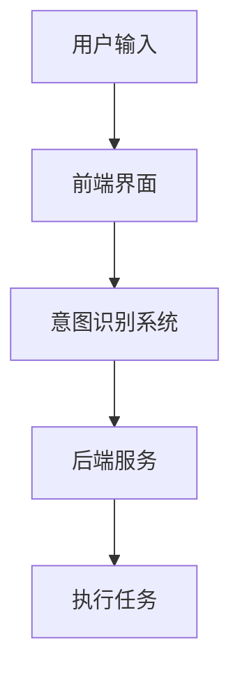

                 


# 构建AI Agent的对话意图识别系统

## 关键词：对话意图识别，AI Agent，自然语言处理，深度学习，机器学习

## 摘要：对话意图识别是自然语言处理中的关键任务，旨在理解用户在对话中的意图并驱动AI Agent做出相应回应。本文将详细探讨对话意图识别的核心原理、算法实现、系统架构设计以及项目实战，帮助读者全面掌握构建AI Agent对话意图识别系统的方法。

---

# 第一部分: 背景介绍

# 第1章: 对话意图识别系统概述

## 1.1 问题背景

### 1.1.1 对话系统的发展历程

对话系统经历了从基于规则到深度学习的演变。早期的系统依赖预定义的规则，而现代系统则利用自然语言处理技术，尤其是深度学习模型（如Transformer），实现了更复杂的对话理解。

### 1.1.2 对话意图识别的重要性

意图识别是对话系统的核心，它决定了AI Agent如何理解和回应用户输入。准确的意图识别能够提升用户体验，使对话更加流畅自然。

### 1.1.3 当前技术的挑战与机遇

当前，意图识别面临数据稀疏性、领域适应性以及多模态输入的挑战。然而，随着深度学习的进展，模型的泛化能力和可解释性正在逐步提升。

## 1.2 问题描述

### 1.2.1 对话意图识别的定义

意图识别是指通过分析用户的输入，确定其背后的意图或目标。例如，用户输入“我需要预订一张去北京的机票”，意图可能是“预订机票”。

### 1.2.2 问题的边界与外延

意图识别的边界包括输入文本的范围、模型的训练数据以及应用场景的限制。外延则涉及多轮对话、上下文理解和情感分析。

### 1.2.3 核心概念与关键属性对比表格

| 核心概念 | 描述 |
|----------|------|
| 输入文本 | 用户输入的原始文本 |
| 意图标签 | 对应的意图分类 |
| 模型类型 | 用于识别意图的算法 |

## 1.3 问题解决

### 1.3.1 对话意图识别的目标

目标是准确识别用户意图，驱动AI Agent执行相应操作。例如，在智能音箱中，识别用户的意图以执行播放音乐的任务。

### 1.3.2 解决方案的选择与优化

选择合适的模型架构和优化方法是关键。例如，使用预训练语言模型（如BERT）可以提升意图识别的准确率。

### 1.3.3 系统设计的可行性分析

需要考虑计算资源、数据量和模型复杂度。例如，轻量级模型适合资源有限的设备，而复杂模型则适合云端部署。

## 1.4 本章小结

本章介绍了对话意图识别的重要性和基本概念，为后续内容奠定了基础。

---

# 第二部分: 核心概念与联系

# 第2章: 对话意图识别的核心原理

## 2.1 意图识别的基本原理

### 2.1.1 基于规则的意图识别

通过预定义的规则匹配用户输入。例如，使用关键词匹配来识别意图。

### 2.1.2 统计模型的意图识别

基于概率统计的方法，如朴素贝叶斯分类器，利用特征工程提取关键词特征。

### 2.1.3 深度学习模型的意图识别

使用神经网络模型（如RNN、Transformer）进行序列建模，捕捉上下文信息。

## 2.2 核心概念的属性特征对比

| 方法 | 描述 | 优点 | 缺点 |
|------|------|------|------|
| 基于规则 | 预定义规则 | 简单易懂 | 无法处理复杂场景 |
| 统计模型 | 基于概率 | 高准确性 | 需要大量数据 |
| 深度学习 | 神经网络 | 强大学习能力 | 计算资源需求高 |

## 2.3 ER实体关系图



## 2.4 本章小结

本章详细讲解了意图识别的基本原理和不同方法的特点，帮助读者理解其核心概念。

---

# 第三部分: 算法原理讲解

# 第3章: 意图识别算法原理

## 3.1 基于规则的意图识别算法

### 3.1.1 算法流程



### 3.1.2 代码实现

```python
def rule_based_intent_classification(text, rules):
    for rule in rules:
        if rule.matcher(text):
            return rule.intent
    return "unknown"
```

## 3.2 统计模型的意图识别算法

### 3.2.1 朴素贝叶斯分类器

数学公式：
$$ P(\text{intent} | \text{text}) = \frac{P(\text{text} | \text{intent}) \cdot P(\text{intent})}{P(\text{text})} $$

### 3.2.2 支持向量机分类器

利用特征向量进行分类，常用线性可分超平面。

## 3.3 深度学习模型的意图识别算法

### 3.3.1 基于RNN的意图识别

使用循环神经网络处理序列数据，捕捉上下文信息。

### 3.3.2 基于Transformer的意图识别

利用自注意力机制，提升长序列的处理能力。

### 3.3.3 预训练语言模型（如BERT）

使用预训练模型进行微调，提升模型的泛化能力。

## 3.4 算法实现的Python代码

```python
import torch
import torch.nn as nn

class IntentClassifier(nn.Module):
    def __init__(self, input_size, hidden_size, output_size):
        super(IntentClassifier, self).__init__()
        self.fc = nn.Linear(input_size, hidden_size)
        self.fc2 = nn.Linear(hidden_size, output_size)
    
    def forward(self, x):
        x = torch.relu(self.fc(x))
        x = self.fc2(x)
        return x
```

## 3.5 本章小结

本章详细讲解了意图识别的算法原理，包括基于规则、统计和深度学习的方法，并提供了具体的实现代码。

---

# 第四部分: 系统分析与架构设计

# 第4章: 系统分析与架构设计方案

## 4.1 问题场景介绍

用户与AI Agent的交互场景，如智能音箱、客服系统等。

## 4.2 项目介绍

构建一个基于Transformer的意图识别系统，支持多轮对话和上下文理解。

## 4.3 系统功能设计

### 4.3.1 领域模型



### 4.3.2 系统架构设计



### 4.3.3 系统接口设计

RESTful API接口设计，如POST /intent?text=“hello”

## 4.4 本章小结

本章详细设计了系统的架构和接口，为后续的实现提供了指导。

---

# 第五部分: 项目实战

# 第5章: 项目实战

## 5.1 环境安装

安装必要的库，如Python、TensorFlow、Keras等。

## 5.2 系统核心实现源代码

```python
import tensorflow as tf
from tensorflow.keras import layers

model = tf.keras.Sequential([
    layers.Embedding(input_dim=10000, output_dim=16),
    layers.Bidirectional(layers.LSTM(32)),
    layers.Dense(10, activation='softmax')
])
```

## 5.3 代码应用解读与分析

详细解读代码的功能和实现逻辑，分析模型的优缺点。

## 5.4 实际案例分析

使用具体案例展示模型的训练和推理过程，分析结果的准确性和鲁棒性。

## 5.5 项目小结

总结项目的实现过程，指出可能的优化方向。

---

# 第六部分: 总结与展望

# 第6章: 总结与展望

## 6.1 本章总结

总结全文内容，强调意图识别的重要性和实现方法。

## 6.2 未来展望

探讨意图识别的未来发展方向，如多模态输入、更复杂的对话理解等。

## 6.3 最佳实践 tips

### 6.3.1 数据预处理的重要性

确保数据的多样性和代表性。

### 6.3.2 模型调优的技巧

合理选择超参数和优化方法。

## 6.4 本章小结

本章总结了全文内容，并展望了未来的发展方向。

---

# 作者：AI天才研究院 & 禅与计算机程序设计艺术

---

**全文完**

