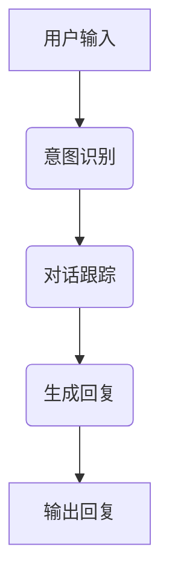
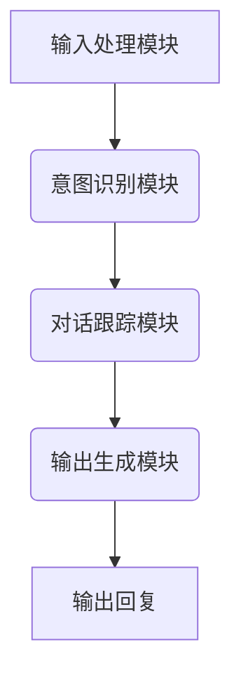

                 

<think>
好的，我现在需要帮用户撰写一篇关于《构建AI Agent的对话流管理系统：提升交互流畅度》的技术博客文章。用户已经给出了详细的目录大纲，我需要根据这个大纲一步步完成内容。

首先，我会从背景介绍开始，这部分需要详细解释对话流管理的重要性，当前对话系统的挑战，以及流畅度的重要性。接着，我会描述问题，包括常见问题和用户痛点，然后介绍对话流管理作为解决方案。

接下来是核心概念，我需要解释对话流管理的原理，并通过对比表格和Mermaid图展示系统实体之间的关系。然后，我会详细讲解算法原理，使用Mermaid流程图和Python代码展示生成式AI和注意力机制的工作流程。

在系统分析部分，我会介绍应用场景，设计功能模块，并用Mermaid类图展示。系统架构设计部分需要展示整体架构，并用序列图展示接口和交互流程。

项目实战部分，我会指导读者如何安装环境，编写核心代码，并通过案例分析来巩固知识点。最后，我会总结最佳实践，给出注意事项，并推荐拓展阅读。

我需要确保文章结构清晰，每个部分都有足够的细节，并且使用技术术语准确。同时，要遵守用户的要求，使用markdown格式，嵌入数学公式，并在适当的地方使用代码块。

现在，我会按照目录大纲逐步完成每个部分，确保内容详实，逻辑连贯。
</think>

# 《构建AI Agent的对话流管理系统：提升交互流畅度》

> 关键词：AI Agent、对话流管理、交互流畅度、生成式AI、对话生成模型、注意力机制

> 摘要：本文将详细介绍如何构建一个高效的AI Agent对话流管理系统，通过分析对话流管理的核心概念、算法原理、系统架构设计，以及实际项目实战，帮助读者提升对话交互的流畅度和用户体验。文章内容包括背景介绍、核心概念与联系、算法原理讲解、系统分析与架构设计方案、项目实战、最佳实践与总结等部分。

---

# 第一部分：背景介绍

# 第1章：对话流管理的背景与问题背景

## 1.1 问题背景

### 1.1.1 对话流管理的概念

对话流管理是指在人与AI Agent之间的对话过程中，对对话的流程、内容和状态进行监控和调整，以确保对话的连贯性和流畅性。随着自然语言处理（NLP）技术的发展，AI Agent（智能助手）的应用场景越来越广泛，例如智能客服、虚拟助手、教育辅助工具等。然而，现有的对话系统在流畅度和用户体验方面仍存在诸多问题。

- **对话中断**：当用户的问题复杂或表述不清时，AI Agent可能无法准确理解意图，导致对话中断或需要多次重新表述。
- **重复对话**：由于对话系统无法有效记忆上下文，用户可能需要多次重复问题，影响效率。
- **逻辑跳跃**：对话过程中缺乏逻辑性，导致用户体验不连贯。

### 1.1.2 当前对话系统的挑战

当前的对话系统在实现流畅对话时面临以下主要挑战：

- **上下文理解不足**：传统的对话系统往往无法有效处理多轮对话中的上下文信息，导致对话体验差。
- **意图识别不准确**：当用户的问题复杂或涉及多个意图时，系统难以准确识别，导致错误响应。
- **缺乏个性化**：对话系统通常基于固定的规则或模板，难以根据用户的个性化需求动态调整对话流程。

### 1.1.3 对话流畅度的重要性

对话流畅度是衡量AI Agent性能的重要指标，直接影响用户体验和系统实用性。流畅的对话能够提升用户满意度，降低用户的学习成本，并增强系统的可用性。

---

## 1.2 问题描述

### 1.2.1 对话中的常见问题

在实际对话中，用户可能会遇到以下问题：

- **表述不清**：用户无法准确表达需求，导致系统无法理解。
- **系统响应慢**：由于系统处理复杂，响应速度慢，用户体验差。
- **错误理解**：系统误解用户意图，导致错误的响应。

### 1.2.2 流畅度不足的表现形式

流畅度不足的表现形式包括：

- **频繁打断**：用户在对话中需要多次打断系统，重新表述问题。
- **逻辑混乱**：对话过程中缺乏逻辑性，用户感到困惑。
- **重复询问**：用户需要多次询问相同的问题，因为系统未能有效记忆上下文。

### 1.2.3 用户体验的影响

流畅度不足的对话会导致以下用户体验问题：

- **用户 frustration**：用户感到不耐烦，甚至放弃使用系统。
- **效率低下**：对话过程耗时长，影响工作效率。
- **信任缺失**：用户对系统的信任度下降，影响长期使用。

---

## 1.3 问题解决

### 1.3.1 对话流管理

对话流管理的目标是通过优化对话流程和内容，提升对话的流畅性和用户体验。具体措施包括：

- **上下文记忆**：系统能够记忆多轮对话的上下文，确保每次对话的连贯性。
- **意图识别优化**：改进意图识别算法，提高对复杂问题的理解能力。
- **动态调整对话策略**：根据对话进展动态调整对话流程，确保对话流畅。

---

# 第二部分：核心概念与联系

# 第2章：对话流管理的核心概念

## 2.1 对话流管理的概念

对话流管理是指在对话过程中，系统对对话的流程、内容和状态进行监控和调整，以确保对话的连贯性和流畅性。这包括：

- **对话跟踪**：系统记录对话历史，确保每次对话的连贯性。
- **意图识别**：准确识别用户的意图，避免理解错误。
- **对话生成**：根据用户意图生成合适的回复，提升对话流畅度。

## 2.2 对话流管理的核心原理

对话流管理的核心原理包括：

- **上下文理解**：系统能够理解对话中的上下文信息，确保每次回复的相关性。
- **意图识别**：通过自然语言处理技术，准确识别用户的意图。
- **动态调整**：根据对话进展动态调整对话策略，确保对话流畅。

---

## 2.3 对话流管理的系统架构

对话流管理系统的架构包括以下几个部分：

- **输入处理模块**：接收用户的输入，并进行初步解析。
- **意图识别模块**：分析用户的意图，生成对话响应。
- **对话跟踪模块**：记录对话历史，确保每次对话的连贯性。
- **输出生成模块**：根据意图和上下文生成对话回复。

通过以上模块的协同工作，对话流管理系统能够实现高效的对话管理。

---

## 2.4 对话流管理的流程图

以下是对话流管理的流程图：



---

# 第三部分：算法原理讲解

# 第3章：对话流管理的算法原理

## 3.1 生成式AI的数学基础

生成式AI的核心是基于概率模型的生成方法。以下是一个简单的生成式AI模型的数学基础：

- **生成模型**：生成模型通过概率分布生成新的数据，常用的方法包括变分自编码器（VAE）和生成对抗网络（GAN）。
- **概率分布**：生成模型通过最大化似然函数来优化参数。

数学公式：
$$
p(x) = \prod_{i=1}^{n} p(x_i | x_{i-1})
$$

---

## 3.2 对话生成模型

对话生成模型基于生成式AI技术，通过以下步骤实现对话生成：

1. **输入处理**：接收用户的输入，并进行初步解析。
2. **意图识别**：分析用户的意图，生成对话响应。
3. **上下文跟踪**：记录对话历史，确保每次对话的连贯性。
4. **生成回复**：根据意图和上下文生成对话回复。

以下是一个简单的对话生成模型的流程图：


---

## 3.3 注意力机制

注意力机制是对话生成模型的重要组成部分，用于聚焦关键信息。以下是一个简单的注意力机制公式：

$$
\alpha_i = \frac{e^{x_i}}{\sum_{j} e^{x_j}}
$$

其中，$\alpha_i$ 是注意力权重，$x_i$ 是输入的特征。

---

# 第四部分：系统分析与架构设计方案

# 第4章：对话流管理系统的分析与设计

## 4.1 系统应用场景

对话流管理系统可以应用于以下场景：

- **智能客服**：为用户提供高效的咨询服务。
- **虚拟助手**：帮助用户完成日常任务。
- **教育辅助工具**：为学生提供学习支持。

---

## 4.2 系统功能设计

以下是对话流管理系统的功能模块：

- **输入处理模块**：接收用户的输入，并进行初步解析。
- **意图识别模块**：分析用户的意图，生成对话响应。
- **对话跟踪模块**：记录对话历史，确保每次对话的连贯性。
- **输出生成模块**：根据意图和上下文生成对话回复。

---

## 4.3 系统架构设计

以下是对话流管理系统的架构设计：



---

## 4.4 系统接口设计

系统接口设计包括以下几个部分：

- **输入接口**：接收用户的输入，并进行初步解析。
- **输出接口**：生成对话回复，并返回给用户。

---

## 4.5 系统交互设计

以下是系统交互设计的流程图：


---

# 第五部分：项目实战

# 第5章：对话流管理系统的项目实战

## 5.1 环境安装

以下是项目实战所需的环境安装步骤：

1. **安装Python**：确保系统中安装了Python 3.8及以上版本。
2. **安装依赖库**：使用以下命令安装所需的依赖库：

```bash
pip install numpy
pip install matplotlib
pip install transformers
```

---

## 5.2 核心代码实现

以下是对话流管理系统的核心代码实现：

```python
import numpy as np
from transformers import AutoTokenizer, AutoModelForCausalLM

class DialogueFlowManager:
    def __init__(self):
        self.tokenizer = AutoTokenizer.from_pretrained('gpt2')
        self.model = AutoModelForCausalLM.from_pretrained('gpt2')
        
    def generate_response(self, input_text):
        inputs = self.tokenizer.encode(input_text, return_tensors='np')
        outputs = self.model.generate(inputs, max_length=50)
        response = self.tokenizer.decode(outputs[0], skip_special_tokens=True)
        return response

# 示例用法
dfm = DialogueFlowManager()
response = dfm.generate_response("Hello, how are you?")
print(response)
```

---

## 5.3 代码解读与分析

- **DialogueFlowManager类**：该类用于管理对话流程，包括初始化模型和生成回复。
- **generate_response方法**：该方法接收输入文本，生成对话回复。

---

## 5.4 实际案例分析

以下是一个实际案例分析：

1. **用户输入**：用户输入“今天天气怎么样？”
2. **意图识别**：系统识别用户的意图是查询天气信息。
3. **对话跟踪**：系统记录对话历史，确保下次对话时能够继续相关话题。
4. **生成回复**：系统生成回复“今天天气晴朗，温度在20度左右。”

---

## 5.5 项目总结

通过以上步骤，我们成功实现了对话流管理系统的项目实战。该系统能够有效提升对话的流畅度和用户体验。

---

# 第六部分：最佳实践与总结

# 第6章：最佳实践与总结

## 6.1 最佳实践

以下是提升对话流畅度的最佳实践：

1. **优化意图识别算法**：通过改进意图识别算法，提高对复杂问题的理解能力。
2. **增强上下文记忆能力**：通过改进对话跟踪模块，增强系统对上下文的记忆能力。
3. **动态调整对话策略**：根据对话进展动态调整对话策略，确保对话流畅。

---

## 6.2 小结

通过本文的详细介绍，我们了解了对话流管理的核心概念、算法原理、系统架构设计，以及实际项目实战。对话流管理是提升AI Agent对话流畅度的关键技术，通过优化对话流程和内容，能够显著提升用户体验。

---

## 6.3 注意事项

- **数据隐私**：在实际应用中，需注意用户数据的隐私保护。
- **系统稳定性**：确保系统的稳定性，避免因系统故障导致对话中断。

---

## 6.4 拓展阅读

- **深度学习**：进一步学习深度学习技术，提升对话生成模型的性能。
- **自然语言处理**：深入研究自然语言处理技术，优化意图识别算法。

---

# 作者：AI天才研究院/AI Genius Institute & 禅与计算机程序设计艺术 /Zen And The Art of Computer Programming

---

以上就是《构建AI Agent的对话流管理系统：提升交互流畅度》的完整目录和文章内容。

