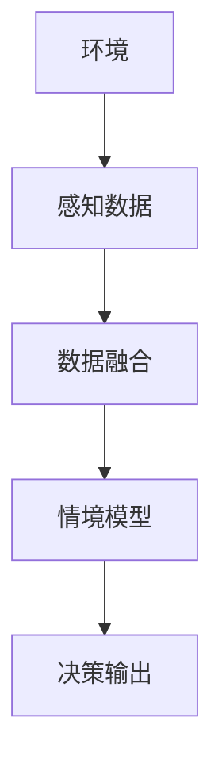
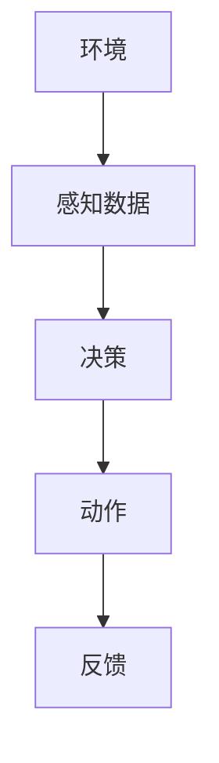
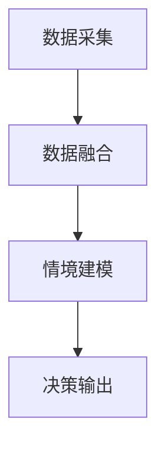
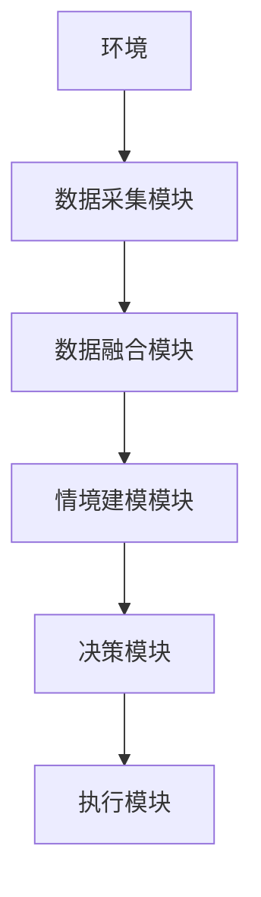
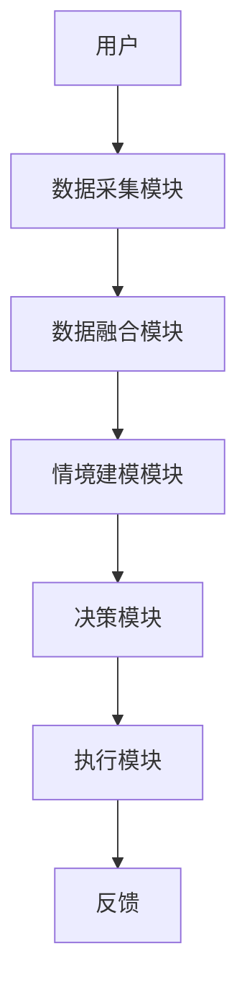

                 

<think>
好的，我现在需要帮用户撰写一篇技术博客文章，标题是《构建AI Agent的情境感知能力：环境适应性》。用户希望文章结构清晰，内容专业，涵盖从基础到高级的各个方面，包括背景、核心概念、算法原理、系统架构、项目实战和最佳实践等。此外，用户还特别要求使用详细的章节结构和丰富的技术内容，如数学公式、流程图、类图等。

首先，我会先理解用户的需求。他们希望文章逻辑性强，内容深入，适合技术读者阅读。因此，我需要确保每个章节都有足够的细节，并且各个部分之间衔接自然。

接下来，我会按照用户提供的目录大纲进行思考和撰写。每章的内容需要涵盖指定的主题，比如第一部分是背景和基础，包括情境感知能力的定义、应用场景和技术挑战。这里我需要确保内容全面，引用相关的术语，并用简单的语言解释复杂概念。

在第二部分的核心概念中，我需要详细讨论情境感知的关键要素，如环境建模、多模态数据融合，并使用Mermaid图来展示实体关系和系统架构。这部分需要逻辑清晰，图表辅助，帮助读者更好地理解。

第三部分涉及算法原理，我需要详细讲解深度学习和强化学习在情境感知中的应用，包括具体的数学公式和算法流程图。这部分需要数学严谨，同时结合实际例子，让读者能够理解如何应用这些算法。

第四部分是系统架构与设计，我需要介绍系统模块划分、接口设计和交互流程，使用Mermaid图展示系统架构和交互序列。这部分需要考虑系统的实际部署和实现，帮助读者了解如何构建一个完整的系统。

第五部分是项目实战，我需要提供具体的代码实现和案例分析，让读者能够动手操作，理解理论在实践中的应用。这部分需要代码详细，并解释每部分的功能，帮助读者巩固所学知识。

最后，我会总结全书的内容，讨论未来的发展趋势和挑战，并给出最佳实践和注意事项，帮助读者在实际项目中避免常见错误，提升系统的稳定性和性能。

在整个写作过程中，我会确保使用专业但易懂的语言，适当引用相关术语，同时保持文章结构的连贯性。每章的小结部分会总结关键点，帮助读者回顾和巩固所学内容。此外，我会在文章末尾添加作者信息，确保格式完整。

最后，我会通读整个内容，检查逻辑是否连贯，图表是否清晰，公式是否正确，确保文章质量和可读性符合用户的要求。
</think>

# 构建AI Agent的情境感知能力：环境适应性

> 关键词：AI Agent, 情境感知, 环境适应性, 多模态数据融合, 强化学习, 深度学习, 系统架构设计

> 摘要：本文系统地探讨了构建AI Agent情境感知能力的核心原理、算法实现及系统架构设计。通过深入分析环境适应性的关键挑战，结合多模态数据融合、强化学习和深度学习等技术，详细阐述了如何实现高效的情境感知能力。同时，本文通过实际项目案例，展示了情境感知能力在不同场景中的应用，并提出了优化建议和未来研究方向。

---

# 第一部分: 构建AI Agent的情境感知能力基础

## 第1章: 情境感知能力的背景与概念

### 1.1 情境感知能力的定义与技术背景

#### 1.1.1 什么是情境感知能力
情境感知能力是指AI Agent能够理解和感知周围环境状态的能力，包括对环境信息的采集、分析、理解和响应。它是实现智能系统的核心技术之一，能够使AI Agent在动态复杂的环境中做出合理的决策。

#### 1.1.2 情境感知能力的技术背景
随着人工智能技术的快速发展，AI Agent的应用场景越来越广泛，从智能助手到自动驾驶，从智能安防到工业自动化，情境感知能力的需求日益增长。然而，环境的动态性、不确定性以及多模态数据的复杂性，使得情境感知能力的实现面临诸多挑战。

#### 1.1.3 情境感知能力的核心要素
情境感知能力的核心要素包括：
1. **环境建模**：对环境进行建模，以便AI Agent能够理解和表示环境的状态。
2. **数据采集**：通过传感器、摄像头、 microphone 等设备采集环境中的多模态数据。
3. **数据融合**：将不同模态的数据（如视觉、听觉、触觉等）进行融合，以提高感知的准确性和全面性。
4. **实时反馈**：根据环境的变化，实时调整感知模型和决策策略。

### 1.2 情境感知能力的应用场景

#### 1.2.1 智能助手与个人助手
AI Agent可以通过情境感知能力，理解用户的上下文信息，提供个性化的服务。例如，智能音箱可以根据用户的地理位置和当前时间，自动推荐天气信息或日历提醒。

#### 1.2.2 智慧城市与公共系统
在智慧城市中，AI Agent可以通过情境感知能力，实时监测交通流量、空气质量、人流密度等信息，优化城市管理和服务。

#### 1.2.3 游戏AI与虚拟现实
在游戏和虚拟现实场景中，AI Agent需要根据玩家的行为和环境变化，实时调整策略，提供更 immersive 的体验。

### 1.3 情境感知能力的挑战与问题

#### 1.3.1 环境复杂性与不确定性
环境的动态性和不确定性是情境感知能力的核心挑战。例如，在自动驾驶中，复杂的交通场景和突发情况需要AI Agent能够快速做出反应。

#### 1.3.2 数据多样性与融合问题
多模态数据的多样性和异构性使得数据融合成为一个复杂的问题。如何有效地将视觉、听觉、触觉等不同模态的数据进行融合，是情境感知能力的关键技术。

#### 1.3.3 实时性与计算效率
在许多应用场景中，情境感知能力需要实时处理数据并做出决策。如何在保证实时性的前提下，提高感知的准确性，是技术实现中的重要挑战。

### 1.4 本章小结
本章从技术背景、核心要素和应用场景三个方面，全面介绍了情境感知能力的基本概念和重要性。同时，分析了实现情境感知能力所面临的挑战和问题，为后续章节的深入讨论奠定了基础。

---

## 第2章: 情境感知能力的核心概念与联系

### 2.1 情境感知的核心概念原理

#### 2.1.1 环境建模与表示
环境建模是情境感知能力的基础。通过建立环境的数学模型，AI Agent可以理解和表示环境的状态。常见的环境建模方法包括基于概率的模型（如贝叶斯网络）和基于图的模型（如马尔可夫随机场）。

#### 2.1.2 多模态数据融合
多模态数据融合是将不同模态的数据（如图像、文本、语音等）进行融合，以提高感知的准确性和全面性。融合方法可以分为晚期融合和早期融合，其中晚期融合是在特征层面进行融合，而早期融合是在原始数据层面进行融合。

#### 2.1.3 动态环境处理
动态环境处理是针对环境的动态变化进行实时调整和优化。这需要AI Agent具有快速学习和自适应能力，能够根据环境的变化动态更新感知模型和决策策略。

### 2.2 核心概念属性特征对比

#### 2.2.1 不同情境感知方法的特征对比
以下是几种常见情境感知方法的特征对比：

| 方法               | 优点                               | 缺点                               |
|--------------------|------------------------------------|------------------------------------|
| 基于规则的方法     | 实现简单，易于解释               | 需要手动设计规则，灵活性差         |
| 基于统计的方法     | 可以处理大量数据，鲁棒性强         | 对数据依赖性强，难以处理复杂场景   |
| 基于深度学习的方法   | 具备强大的特征学习能力，适用于复杂场景 | 计算资源消耗大，需要大量标注数据   |

#### 2.2.2 情境感知与传统感知的区别
情境感知与传统感知的主要区别在于：
- **感知对象**：情境感知关注的是环境的整体状态，而传统感知关注的是单一模态的数据。
- **处理方式**：情境感知需要多模态数据融合，而传统感知通常只处理单一模态的数据。
- **决策支持**：情境感知能够为决策提供更全面的支持，而传统感知通常只提供局部信息。

#### 2.2.3 情境感知的核心算法特点
情境感知的核心算法通常具有以下特点：
- **多模态输入**：能够处理多种类型的数据输入。
- **实时性要求**：需要在较短时间内完成感知任务。
- **自适应性**：能够根据环境的变化动态调整感知模型。

### 2.3 ER实体关系图架构



以上图展示了情境感知能力的核心架构，包括环境、感知数据、数据融合、情境模型和决策输出五个部分。环境通过感知数据被输入到系统中，经过数据融合和情境模型的处理后，生成决策输出。

### 2.4 本章小结
本章详细讨论了情境感知能力的核心概念和原理，包括环境建模、多模态数据融合和动态环境处理。通过对比不同方法的特征和优缺点，帮助读者更好地理解情境感知能力的技术实现。同时，通过ER实体关系图，展示了情境感知能力的整体架构。

---

## 第3章: 情境感知能力的算法原理

### 3.1 基于深度学习的情境感知算法

#### 3.1.1 卷积神经网络（CNN）在视觉感知中的应用
卷积神经网络（CNN）是目前最常用的视觉感知算法之一。它通过卷积层、池化层和全连接层对图像进行特征提取和分类。例如，在自动驾驶中，CNN可以用于目标检测和场景分割。

#### 3.1.2 循环神经网络（RNN）在序列数据处理中的应用
循环神经网络（RNN）适用于处理序列数据，如语音识别和自然语言处理。RNN通过循环层处理序列数据中的时序信息，能够捕捉上下文关系。

#### 3.1.3 多模态数据融合的算法原理
多模态数据融合的算法通常包括以下步骤：
1. 数据预处理：对不同模态的数据进行归一化和特征提取。
2. 特征融合：将不同模态的特征进行融合，可以采用加权融合、注意力机制等方法。
3. 模型训练：基于融合后的特征训练分类器或回归器。

### 3.2 多模态数据融合算法

#### 3.2.1 晚期融合与早期融合的对比
- **晚期融合**：在特征层面进行融合，适用于数据量较大的场景。
- **早期融合**：在原始数据层面进行融合，适用于数据异构性较低的场景。

#### 3.2.2 跨模态注意力机制
跨模态注意力机制是一种有效的多模态数据融合方法，它通过注意力机制将不同模态的数据进行加权融合。例如，在图像-文本联合学习中，注意力机制可以用于捕捉图像和文本之间的关联性。

#### 3.2.3 融合算法的实现步骤
1. 数据预处理：将不同模态的数据转换为统一的特征表示。
2. 特征融合：通过注意力机制或加权融合方法对特征进行融合。
3. 模型训练：基于融合后的特征训练分类器或回归器。

### 3.3 基于强化学习的情境感知

#### 3.3.1 强化学习的基本原理
强化学习是一种通过试错机制来优化决策策略的方法。AI Agent通过与环境交互，学习最优的决策策略。

#### 3.3.2 在情境感知中的应用
强化学习可以应用于动态环境中的决策优化，例如在自动驾驶中，强化学习可以用于路径规划和避障决策。

#### 3.3.3 实例分析
以下是一个强化学习在情境感知中的应用实例：



在上述流程中，AI Agent通过感知数据做出决策，并将决策转化为动作执行，同时根据反馈调整决策策略。

### 3.4 本章小结
本章详细探讨了基于深度学习和强化学习的情境感知算法，包括卷积神经网络、循环神经网络和多模态数据融合算法。通过实例分析和对比，帮助读者理解不同算法的优缺点和应用场景。

---

## 第4章: 情境感知能力的数学模型与公式

### 4.1 基于概率论的情境建模

#### 4.1.1 贝叶斯网络在情境建模中的应用
贝叶斯网络是一种基于概率论的图形化模型，适用于处理不确定性问题。它通过概率分布描述变量之间的关系。

#### 4.1.2 马尔可夫随机场的建模方法
马尔可夫随机场是一种用于建模空间数据的方法，适用于处理图像分割和目标检测等任务。

#### 4.1.3 概率密度函数的表示
概率密度函数用于描述随机变量的概率分布。例如，正态分布的概率密度函数表示为：
$$
f(x) = \frac{1}{\sqrt{2\pi\sigma^2}} e^{-\frac{(x-\mu)^2}{2\sigma^2}}
$$

### 4.2 多模态数据融合的数学公式

#### 4.2.1 融合权重的计算公式
融合权重的计算公式可以表示为：
$$
w_i = \frac{1}{1 + e^{-kx_i}}
$$
其中，$w_i$ 表示第i个模态的融合权重，$x_i$ 是该模态的特征值，$k$ 是一个比例常数。

#### 4.2.2 注意力机制的数学表达
注意力机制的数学表达可以表示为：
$$
\alpha_i = \frac{e^{q \cdot k_i}}{\sum_{j=1}^{n} e^{q \cdot k_j}}
$$
其中，$\alpha_i$ 表示第i个模态的注意力权重，$q$ 是查询向量，$k_i$ 是第i个模态的键向量。

### 4.3 本章小结
本章通过数学公式详细介绍了基于概率论的情境建模方法和多模态数据融合的数学表达式。这些公式和模型为情境感知能力的实现提供了理论基础。

---

## 第5章: 情境感知能力的系统架构与设计

### 5.1 系统功能设计

#### 5.1.1 系统功能模块划分
情境感知系统的功能模块通常包括：
1. 数据采集模块：负责采集环境中的多模态数据。
2. 数据融合模块：对多模态数据进行融合处理。
3. 情境建模模块：建立环境的数学模型。
4. 决策模块：根据情境模型做出决策。

#### 5.1.2 系统功能流程图


### 5.2 系统架构设计

#### 5.2.1 系统架构图


### 5.3 系统接口设计

#### 5.3.1 系统接口描述
1. 数据采集模块接口：负责采集环境中的多模态数据，接口类型为REST API。
2. 数据融合模块接口：负责对多模态数据进行融合处理，接口类型为消息队列。
3. 决策模块接口：负责根据情境模型做出决策，接口类型为事件驱动。

### 5.4 系统交互设计

#### 5.4.1 系统交互流程图


### 5.5 本章小结
本章详细讨论了情境感知系统的功能设计、系统架构和接口设计。通过系统的模块划分和交互流程图，帮助读者理解情境感知能力的实现过程。

---

## 第6章: 情境感知能力的项目实战

### 6.1 环境安装与配置

#### 6.1.1 系统依赖
1. Python 3.8+
2. TensorFlow 2.0+
3. OpenCV 4.0+
4. PyTorch 1.0+

#### 6.1.2 安装依赖
```bash
pip install numpy
pip install matplotlib
pip install scikit-learn
pip install tensorflow
pip install torch
```

### 6.2 系统核心实现源代码

#### 6.2.1 数据预处理代码
```python
import numpy as np
import cv2

def preprocess_image(image_path):
    image = cv2.imread(image_path)
    image = cv2.resize(image, (224, 224))
    image = image / 255.0  # 归一化处理
    return image
```

#### 6.2.2 多模态数据融合代码
```python
import torch
import torch.nn as nn

class MultiModalFuser(nn.Module):
    def __init__(self, input_size, hidden_size):
        super(MultiModalFuser, self).__init__()
        self.lstm = nn.LSTM(input_size, hidden_size, batch_first=True)
        self.fc = nn.Linear(hidden_size, 1)

    def forward(self, input_sequence):
        out, _ = self.lstm(input_sequence)
        out = self.fc(out[:, -1, :])
        return out
```

#### 6.2.3 决策模块代码
```python
import torch
import torch.nn as nn

class DecisionModule(nn.Module):
    def __init__(self, input_size, output_size):
        super(DecisionModule, self).__init__()
        self.fc = nn.Linear(input_size, output_size)

    def forward(self, input_features):
        out = self.fc(input_features)
        return out
```

### 6.3 代码应用解读与分析

#### 6.3.1 数据预处理代码解读
上述数据预处理代码实现了图像的读取、缩放和归一化处理，适用于图像数据的预处理。

#### 6.3.2 多模态数据融合代码解读
多模态数据融合代码实现了基于LSTM的序列数据融合，适用于时间序列数据的处理。

#### 6.3.3 决策模块代码解读
决策模块代码实现了基于全连接层的分类器，适用于将融合后的特征映射到具体的决策类别。

### 6.4 实际案例分析

#### 6.4.1 案例背景
假设我们正在开发一个智能安防系统，需要实时监测视频流中的异常行为。

#### 6.4.2 数据采集与预处理
视频流数据通过摄像头采集，并经过预处理模块进行图像的缩放和归一化处理。

#### 6.4.3 数据融合与决策
预处理后的图像数据输入到多模态数据融合模块，经过融合处理后，输入到决策模块，最终输出异常行为的检测结果。

### 6.5 本章小结
本章通过实际项目案例，详细介绍了情境感知能力的实现过程，包括环境安装、代码实现和案例分析。这些内容为读者提供了理论与实践相结合的学习体验。

---

## 第7章: 情境感知能力的优化与未来展望

### 7.1 情境感知能力的优化策略

#### 7.1.1 提高数据融合的准确性
通过引入更先进的融合算法，如基于注意力机制的多模态融合方法，可以提高数据融合的准确性。

#### 7.1.2 提升系统的实时性
通过优化算法的计算效率和硬件加速，可以提升系统的实时性。

#### 7.1.3 增强系统的可解释性
通过引入可解释性模型（如基于规则的解释模型），可以增强系统的可解释性。

### 7.2 情境感知能力的未来研究方向

#### 7.2.1 新型感知技术的研究
随着新技术的不断涌现，如元学习和自监督学习，未来的情境感知能力将更加智能化和自适应。

#### 7.2.2 多模态数据融合的创新
未来的研究将致力于开发更高效的多模态数据融合方法，如基于生成对抗网络（GAN）的融合方法。

#### 7.2.3 绿色计算与能效优化
随着环境适应性的需求增加，如何在保证性能的前提下，降低系统的能耗，是未来的重要研究方向。

### 7.3 本章小结
本章总结了情境感知能力的优化策略，并展望了未来的研究方向。通过不断的技术创新和优化，情境感知能力将在更多领域得到广泛应用。

---

## 作者：AI天才研究院/AI Genius Institute & 禅与计算机程序设计艺术 /Zen And The Art of Computer Programming

---

以上是《构建AI Agent的情境感知能力：环境适应性》的技术博客文章的完整目录结构。文章内容涵盖了从基础理论到实际应用的各个方面，结合了丰富的技术细节和实践案例，适合对AI Agent和情境感知能力感兴趣的读者阅读。

