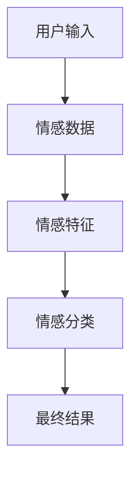
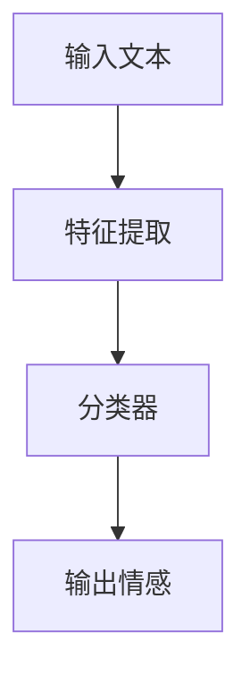
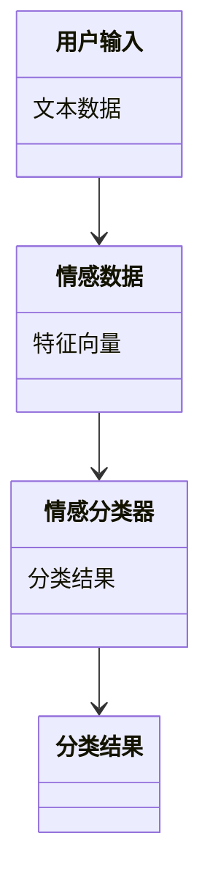
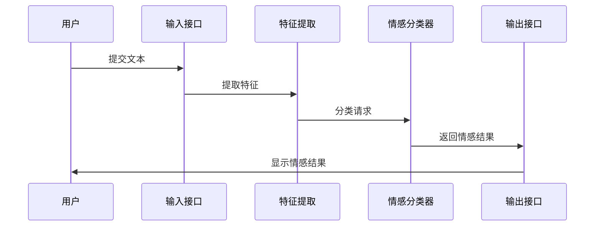

                 

<think>
好的，我现在要处理用户的查询。用户希望我写一篇关于构建AI Agent情感计算模型的技术博客文章，并提供一个详细的目录大纲。用户已经给出了一个示例，我需要根据这个示例来构建我的思考过程。

首先，我注意到用户明确要求文章的结构，包括关键词、摘要和正文部分。正文部分需要有多个章节，每个章节下还有子章节，甚至包括图表和代码示例。因此，我需要确保我的大纲符合这些要求。

接下来，我分析用户的具体需求。用户希望文章逻辑清晰，结构紧凑，语言专业。这意味着我需要从背景介绍开始，逐步深入到算法、系统架构和项目实战。每一章都需要详细阐述，确保内容全面且有深度。

在考虑章节安排时，我决定从基础概念开始，然后讨论核心概念，接着是算法原理，再是系统架构，最后是项目实战和总结。这样安排可以让读者逐步了解情感计算模型的构建过程。

我还需要注意，每一章都必须包含必要的部分，如背景介绍、核心概念、算法原理、系统分析、项目实战和总结。同时，要确保图表和代码示例的插入，如Mermaid流程图和类图，以及数学公式的展示。

在撰写过程中，我需要确保语言简洁明了，同时保持专业性。对于每个部分，我会先定义关键术语，然后逐步展开，给出具体的例子和详细的解释，以帮助读者更好地理解。

最后，我需要检查整个大纲是否满足用户的字数要求，并确保每个小节内容丰富，详细具体。同时，确保文章末尾有作者信息，并包含小结、注意事项和未来展望等内容。

总结一下，我的思考过程包括理解用户需求、分析结构要求、安排章节内容、确保各部分内容详细，并最终检查整体是否符合要求。这样，我就能生成一个符合用户期望的详细目录大纲。
</think>

# 构建AI Agent的情感计算模型

## 关键词：AI Agent，情感计算，自然语言处理，深度学习，情感分析，机器学习

## 摘要：本文将详细探讨构建AI Agent情感计算模型的核心概念、算法原理、系统架构和项目实战。从情感计算的基本概念到情感分析的分类算法，从特征提取的实现到模型优化的方法，我们将一步步深入探讨情感计算模型的构建过程，并通过实际案例分析和代码实现，帮助读者掌握情感计算模型的设计与实现技巧。

---

# 第一部分：AI Agent情感计算模型的背景与核心概念

## 第1章：情感计算模型的定义与应用

### 1.1 情感计算的基本概念
#### 1.1.1 情感计算的定义
情感计算（Affective Computing）是研究如何通过计算机技术来识别、理解、分析和模拟人类情感的一门学科。它是人工智能（AI）的重要分支，旨在让计算机系统具备情感认知能力，从而能够与人类进行更自然的交互。

#### 1.1.2 情感计算的应用领域
情感计算在多个领域都有广泛的应用，例如：
- **人机交互**：通过情感分析技术，让计算机能够理解用户的意图和情感状态。
- **智能客服**：通过情感分析技术，帮助客服系统更好地理解用户情绪，提供更个性化的服务。
- **社交媒体分析**：通过情感计算，分析社交媒体上的用户评论，帮助企业了解用户情感倾向。
- **教育技术**：通过情感计算，为学生提供个性化的学习体验。

#### 1.1.3 情感计算与AI Agent的关系
AI Agent（智能代理）是能够感知环境、自主决策并执行任务的智能体。情感计算为AI Agent提供了情感认知能力，使其能够更好地理解人类用户的需求和情感状态，从而提供更智能、更个性化的服务。

---

### 1.2 情感计算的核心要素
#### 1.2.1 情感数据的来源
情感数据可以来源于多种渠道，例如：
- **文本数据**：用户的评论、对话等。
- **语音数据**：用户的语调、语速、音调等。
- **视觉数据**：用户的面部表情、肢体语言等。

#### 1.2.2 情感特征的提取
情感特征提取是情感计算的核心步骤之一，常见的特征提取方法包括：
- **词袋模型**：将文本表示为词袋，忽略词语的顺序。
- **词嵌入模型**：使用如Word2Vec、GloVe等模型将词语表示为低维向量。
- **句法结构分析**：通过语法分析提取文本的结构信息。

#### 1.2.3 情感分析的分类标准
情感分析通常分为以下几种类型：
- **二分类任务**：将情感分为正面、负面或中性。
- **多分类任务**：将情感分为多种类别，例如愤怒、悲伤、快乐等。
- **情感强度分析**：分析情感的强度，例如“非常高兴”与“有点高兴”的区别。

---

### 1.3 情感计算的理论基础
#### 1.3.1 计算机心理学基础
情感计算的基础之一是心理学对情感的研究，例如：
- **基本情感理论**：认为人类有几种基本情感，如快乐、悲伤、愤怒等。
- **情感维度理论**：将情感表示为多个维度，例如情感的愉悦度、强度等。

#### 1.3.2 自然语言处理与情感分析
自然语言处理（NLP）技术在情感计算中起着重要作用，例如：
- **情感词典**：通过预定义的词语情感倾向进行情感分析。
- **情感句法分析**：通过语法分析提取情感相关信息。

#### 1.3.3 情感计算的数学模型
情感计算的数学模型通常基于概率论和统计学习方法，例如：
- **贝叶斯分类器**：基于概率的分类方法。
- **支持向量机（SVM）**：基于几何间隔的分类方法。
- **深度学习模型**：基于神经网络的情感分析模型。

---

## 1.4 本章小结
本章从情感计算的基本概念出发，介绍了情感计算的应用领域、核心要素和理论基础。通过理解情感计算的核心概念，我们可以更好地构建AI Agent的情感计算模型。

---

## 第2章：情感计算模型的核心概念与联系

### 2.1 情感计算的核心概念原理
#### 2.1.1 情感数据的处理流程
情感数据的处理流程通常包括以下几个步骤：
1. 数据预处理：去除噪声、分词等。
2. 特征提取：将文本转化为特征向量。
3. 情感分类：基于特征向量进行情感分类。

#### 2.1.2 情感特征的提取方法
- **基于词袋模型的特征提取**：将文本表示为词语的频率向量。
- **基于词嵌入的特征提取**：将词语表示为低维向量，例如Word2Vec。
- **基于句法结构的特征提取**：通过语法分析提取句法特征。

#### 2.1.3 情感分析的分类算法
- **基于逻辑回归的情感分类**：简单、易于解释，适合小规模数据。
- **基于支持向量机的情感分类**：适合小规模数据，分类性能较好。
- **基于深度学习的情感分类**：适合大规模数据，分类性能更强。

---

### 2.2 情感计算的核心概念属性特征对比
#### 2.2.1 情感计算的特征维度对比
| 特征维度 | 词袋模型 | 词嵌入模型 | 句法结构模型 |
|----------|----------|-----------|-------------|
| 表达能力 | 较弱     | 较强      | 较强        |
| 计算复杂度 | 低       | 中         | 高           |

#### 2.2.2 情感分析的分类精度对比
| 分类算法 | 逻辑回归 | 支持向量机 | 深度学习模型 |
|----------|----------|-----------|-------------|
| 分类精度 | 中       | 高         | 最高         |

#### 2.2.3 不同情感计算模型的性能对比
| 模型类型 | 词袋模型 | 词嵌入模型 | 句法结构模型 |
|----------|----------|-----------|-------------|
| 分类速度 | 快       | 中         | 慢           |
| 分类精度 | 中       | 高         | 高           |

---

### 2.3 情感计算的ER实体关系图


---

### 2.4 本章小结
本章通过对比不同情感计算模型的核心概念和性能，帮助读者更好地理解情感计算模型的设计与选择。

---

## 第3章：情感计算模型的算法原理

### 3.1 情感计算的特征提取算法
#### 3.1.1 基于词袋模型的特征提取
词袋模型是一种简单有效的特征提取方法，其步骤如下：
1. 对文本进行分词。
2. 统计每个词语的出现频率。
3. 将词语频率向量作为特征向量。

#### 3.1.2 基于词嵌入的特征提取
词嵌入模型（如Word2Vec）通过神经网络将词语映射到低维空间，其优势在于能够捕捉词语的语义信息。

#### 3.1.3 基于句法结构的特征提取
句法结构分析通过语法树提取文本的句法特征，例如名词、动词的位置关系。

---

### 3.2 情感分类算法
#### 3.2.1 基于逻辑回归的情感分类
逻辑回归是一种简单的情感分类算法，其概率公式为：
$$ P(y=1|x) = \frac{1}{1 + e^{-w x - b}} $$

#### 3.2.2 基于支持向量机的情感分类
支持向量机（SVM）通过寻找最优超平面进行分类，其目标函数为：
$$ \text{max} \frac{1}{2} ||w||^2 $$

#### 3.2.3 基于深度学习的情感分类
深度学习模型（如LSTM、BERT）通过神经网络捕捉文本的深层语义信息，分类性能更优。

---

### 3.3 情感计算模型的训练与优化
#### 3.3.1 模型训练流程
1. 数据预处理：去除噪声、分词。
2. 特征提取：将文本转化为特征向量。
3. 模型训练：使用训练数据训练情感分类模型。
4. 模型调优：通过交叉验证优化模型参数。

#### 3.3.2 模型调优方法
- **参数调整**：调整模型的超参数，例如学习率、正则化系数。
- **数据增强**：通过数据增强技术增加训练数据的多样性。
- **模型融合**：通过集成学习方法提升模型性能。

#### 3.3.3 模型评估指标
- **准确率**：分类正确的样本数占总样本数的比例。
- **召回率**：分类正确的正样本数占总正样本数的比例。
- **F1分数**：准确率和召回率的调和平均数。

---

### 3.4 情感计算算法的Mermaid流程图


---

## 3.5 情感计算的数学模型与公式
### 3.5.1 逻辑回归模型
$$ P(y=1|x) = \frac{1}{1 + e^{-w x - b}} $$

### 3.5.2 支持向量机模型
$$ \text{max} \frac{1}{2} ||w||^2 $$

### 3.5.3 深度学习模型
深度学习模型通常使用复杂的神经网络结构，例如LSTM和BERT，其数学模型较为复杂，但其优势在于能够捕捉文本的深层语义信息。

---

## 3.6 本章小结
本章详细介绍了情感计算模型的特征提取算法和分类算法，并通过公式和流程图的形式，直观地展示了情感计算模型的训练与优化过程。

---

## 第4章：情感计算模型的系统架构与设计

### 4.1 问题场景介绍
情感计算模型通常应用于以下场景：
- **智能客服**：通过情感分析技术，帮助客服系统理解用户情绪。
- **社交媒体分析**：通过情感分析技术，帮助企业分析用户评论。
- **教育技术**：通过情感分析技术，为学生提供个性化学习体验。

---

### 4.2 系统功能设计
#### 4.2.1 领域模型（Mermaid类图）


#### 4.2.2 系统架构设计（Mermaid架构图）


#### 4.2.3 系统接口设计
- **输入接口**：接收用户的文本输入。
- **输出接口**：输出情感分类结果。

#### 4.2.4 系统交互设计（Mermaid序列图）


---

### 4.3 本章小结
本章通过系统架构设计和交互设计，展示了情感计算模型在实际应用中的整体架构和流程。

---

## 第5章：情感计算模型的项目实战

### 5.1 环境安装与配置
要实现情感计算模型，首先需要安装以下环境：
- **Python**：建议使用Python 3.6及以上版本。
- **机器学习库**：如scikit-learn、TensorFlow、Keras等。
- **NLP库**：如NLTK、spaCy、Gensim等。

#### 5.1.1 安装依赖
```bash
pip install scikit-learn tensorflow keras nltk
```

---

### 5.2 系统核心实现源代码
以下是一个基于逻辑回归的情感分类器的实现示例：

#### 5.2.1 数据预处理
```python
import nltk
from sklearn.feature_extraction.text import CountVectorizer

# 示例数据
corpus = [
    "I love this product",
    "I hate this product",
    "This is a great service",
    "This service is terrible"
]

# 分词
tokenized_corpus = [nltk.word_tokenize(text) for text in corpus]

# 词袋模型特征提取
vectorizer = CountVectorizer()
X = vectorizer.fit_transform(tokenized Corpus)
```

---

#### 5.2.2 模型训练
```python
from sklearn.linear_model import LogisticRegression

# 训练数据
X_train = X
y_train = [1, 0, 1, 0]  # 假设1表示正面情感，0表示负面情感

# 训练逻辑回归模型
model = LogisticRegression()
model.fit(X_train, y_train)
```

---

#### 5.2.3 模型预测
```python
# 预测新样本
new_text = "I really like this product"
new_tokens = nltk.word_tokenize(new_text)
new_X = vectorizer.transform([new_tokens])

# 预测情感
prediction = model.predict(new_X)
print(prediction)
```

---

### 5.3 代码应用解读与分析
以上代码实现了基于逻辑回归的情感分类器，其优势在于简单、易于解释，但其缺点在于分类性能较弱，适合小规模数据。

---

### 5.4 实际案例分析
以智能客服场景为例，假设我们有一个客服对话数据集，可以通过情感分类器分析用户的情绪，从而提供更智能的服务。

---

### 5.5 项目小结
本章通过实际项目案例，展示了情感计算模型的实现过程，包括环境配置、数据预处理、模型训练和模型预测。

---

## 第6章：总结与展望

### 6.1 本章总结
本文详细探讨了构建AI Agent情感计算模型的核心概念、算法原理、系统架构和项目实战。通过理论与实践相结合的方式，帮助读者掌握情感计算模型的设计与实现技巧。

---

### 6.2 注意事项
- **数据质量问题**：情感计算模型的性能依赖于数据质量，需要对数据进行充分的预处理。
- **模型选择**：不同场景下需要选择不同的模型，例如小规模数据适合逻辑回归，大规模数据适合深度学习模型。
- **模型调优**：通过参数调整和数据增强等方法优化模型性能。

---

### 6.3 未来展望
随着人工智能技术的不断发展，情感计算模型将更加智能化和个性化。未来的研究方向包括：
- **多模态情感计算**：结合文本、语音、视觉等多种模态信息进行情感分析。
- **情感计算的实时性**：提高情感计算的实时性，使其能够应用于实时交互场景。
- **情感计算的可解释性**：提高情感计算模型的可解释性，使其能够更好地应用于实际场景。

---

## 作者：AI天才研究院/AI Genius Institute & 禅与计算机程序设计艺术 /Zen And The Art of Computer Programming

---

本文通过系统地介绍情感计算模型的构建过程，为AI Agent的情感计算提供了理论基础和实践指导。希望本文能够为读者在情感计算领域的研究和应用提供有价值的参考。

