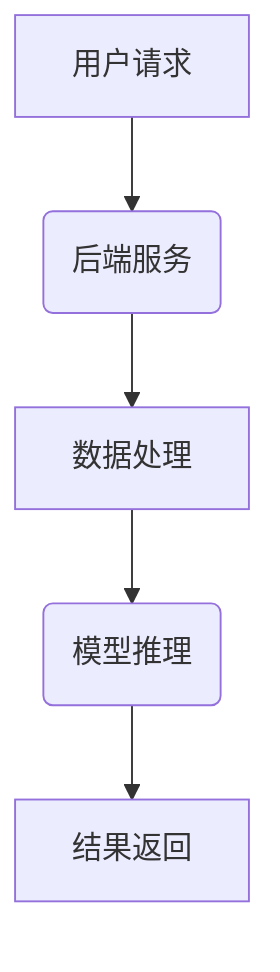
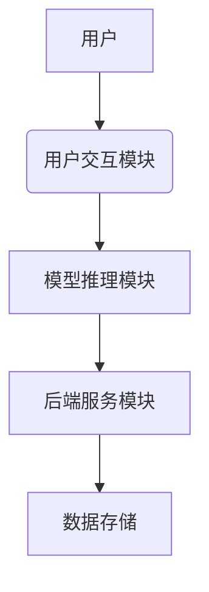

                 

<think>
嗯，用户希望我写一篇关于构建AI Agent技术栈选择的指南。首先，我得明确文章的目标读者是谁，应该是技术人员、CTO或者架构师，他们需要详细的技术分析和选择建议。

我得先确定文章的结构，从背景介绍开始，让读者了解AI Agent的基本概念和应用场景。然后，分析技术栈的核心概念，比如模型选择、开发框架和后端服务，这些部分需要详细说明它们的特点和区别。

接下来，需要深入讲解算法原理，尤其是自然语言处理和强化学习，用mermaid流程图来展示过程，这样读者能更直观地理解。数学部分需要用latex公式，确保清晰易懂，比如词嵌入和注意力机制的公式。

系统架构部分，我需要介绍整体设计，包括功能模块、架构图和接口设计。这部分要详细，可能用类图和序列图来展示交互关系。

项目实战部分，得给出具体的步骤，比如环境安装、代码实现和案例分析，这样读者可以实际操作，加深理解。

最后，加入最佳实践、小结和扩展阅读，帮助读者巩固知识并进一步学习。整体结构要逻辑清晰，每章都有足够的细节，同时保持整体的完整性和逻辑性。

现在，我需要将这些思路转化为具体的目录结构，确保涵盖所有要求的内容，并且每章都有适当的子章节，细化到三级目录。同时，注意总字数不要超过2000字，保持简洁明了。
</think>

# 构建AI Agent的技术栈选择指南

## 关键词：AI Agent, 技术栈选择, 人工智能, 机器学习, 系统架构

## 摘要：  
构建AI Agent涉及多方面的技术选择，本文将系统地分析AI Agent的核心概念、算法原理、系统架构以及实际项目中的技术栈选择。通过对比不同模型和框架，结合实际案例，为技术选型提供指导，帮助开发者高效构建AI Agent系统。

---

# 第1章: AI Agent技术栈的背景与问题背景

## 1.1 AI Agent的基本概念

### 1.1.1 AI Agent的定义与核心特征
AI Agent（人工智能代理）是指能够感知环境、自主决策并执行任务的智能实体。其核心特征包括：  
- **自主性**：无需外部干预，自主完成任务。  
- **反应性**：能够实时感知环境并做出反应。  
- **目标导向性**：基于目标驱动行为。  
- **学习能力**：通过数据和经验优化性能。

### 1.1.2 AI Agent与传统软件的区别
- AI Agent具备学习和自适应能力，而传统软件依赖固定的规则和逻辑。  
- AI Agent能够处理不确定性问题，而传统软件在确定性环境中表现更优。  
- AI Agent需要处理复杂的多模态数据，而传统软件通常处理结构化数据。

### 1.1.3 AI Agent的应用场景与边界
- **应用场景**：智能助手、自动驾驶、智能客服、机器人控制等。  
- **边界**：AI Agent的能力受限于数据质量和模型训练效果，无法完全替代人类决策。

## 1.2 技术栈选择的核心问题

### 1.2.1 问题背景与目标分析
选择AI Agent技术栈的核心目标是实现高效、稳定、可扩展的系统，同时满足特定应用场景的需求。主要问题包括：  
- 如何选择适合的AI模型？  
- 如何优化系统的性能？  
- 如何确保系统的可维护性和扩展性？

### 1.2.2 技术栈选择的关键因素
- **模型选择**：取决于任务类型（如NLP、视觉、强化学习）。  
- **开发框架**：支持快速开发和部署。  
- **后端服务**：确保系统的高效运行和数据管理。  

### 1.2.3 问题解决的思路与方法
通过对比分析、实验验证和性能测试，逐步缩小技术栈的选择范围，最终找到最优解。

## 1.3 本章小结  
本章介绍了AI Agent的基本概念、与传统软件的区别，以及技术栈选择的核心问题，为后续的技术分析奠定了基础。

---

# 第2章: AI Agent技术栈的核心概念与联系

## 2.1 核心概念的原理与属性

### 2.1.1 AI Agent的模型选择
- **自然语言处理模型**：如BERT、GPT用于文本交互。  
- **强化学习模型**：如DQN用于决策任务。  

### 2.1.2 开发框架的功能特点
- **TensorFlow**：适合深度学习模型的训练和部署。  
- **PyTorch**：适合动态计算和快速实验。  

### 2.1.3 后端服务的实现方式
- **微服务架构**：便于扩展和维护。  
- **单体架构**：适合小型项目，简化部署流程。  

## 2.2 核心概念的对比分析

### 2.2.1 模型选择的对比表格

| 模型类型   | 适用任务       | 优点                     | 缺点                     |
|------------|----------------|--------------------------|--------------------------|
| NLP模型    | 文本交互         | 高准确性                   | 需大量训练数据           |
| 强化学习模型 | 决策任务         | 能处理不确定性问题       | 训练时间长               |

### 2.2.2 开发框架的ER实体关系图

```mermaid
erd
  entity Model {
    id: int
    name: string
    framework: string
  }
  entity Framework {
    id: int
    name: string
    function: string
  }
  entity Relationship {
    model_id: int
    framework_id: int
    role: string
  }
```

### 2.2.3 后端服务的流程图



## 2.3 本章小结  
本章通过对比分析和技术栈的流程图，展示了AI Agent技术栈的核心概念及其相互关系。

---

# 第3章: AI Agent算法原理的数学模型与公式

## 3.1 自然语言处理模型的数学基础

### 3.1.1 词嵌入的数学公式
词嵌入通过将词语映射到低维空间，计算词语之间的相似性。  
$$ \text{词向量} = W \cdot \text{词索引} $$  

### 3.1.2 注意力机制的数学推导
注意力机制通过计算每个词的重要性，加权求和得到最终表示。  
$$ \text{注意力权重} = \text{softmax}(QK^T) $$  
$$ \text{最终表示} = \text{值向量} \cdot \text{注意力权重} $$  

### 3.1.3 模型训练的优化算法
常用优化算法包括随机梯度下降（SGD）和Adam优化器。  
$$ \text{损失函数} = \text{交叉熵损失} $$  

## 3.2 强化学习算法的数学模型

### 3.2.1 状态空间的表示
状态空间通常用向量表示，维度取决于环境复杂度。  
$$ S = (s_1, s_2, ..., s_n) $$  

### 3.2.2 动作空间的数学表达
动作空间表示所有可能的动作，常用离散或连续表示。  
$$ A = \{a_1, a_2, ..., a_m\} $$  

### 3.2.3 奖励函数的设计
奖励函数定义了动作的好坏，常用标量表示。  
$$ R(s, a) = r $$  

## 3.3 本章小结  
本章通过数学公式和算法流程图，详细讲解了自然语言处理和强化学习的算法原理。

---

# 第4章: AI Agent系统架构与接口设计

## 4.1 系统架构的功能模块设计

### 4.1.1 用户交互模块
用户通过图形界面或命令行与AI Agent交互。  
- 接收输入：文本、语音或图像。  
- 返回输出：自然语言或动作指令。  

### 4.1.2 模型推理模块
负责处理输入数据并生成输出结果。  
- 接收数据：用户输入或传感器数据。  
- 处理数据：调用预训练模型进行推理。  

### 4.1.3 后端服务模块
管理系统的运行状态和数据存储。  
- 数据存储：用户历史记录、系统日志。  
- 服务管理：启动、停止和重启服务。  

## 4.2 系统架构的mermaid架构图



## 4.3 系统接口的设计与实现

### 4.3.1 API接口定义
常用RESTful API设计。  
- GET /query：接收查询请求。  
- POST /action：发送动作指令。  

### 4.3.2 接口的调用流程
1. 用户发送请求到API接口。  
2. 接口转发请求到模型推理模块。  
3. 模型推理模块返回结果。  

### 4.3.3 接口的安全性设计
- 认证授权：JWT令牌验证。  
- 请求限流：防止DDoS攻击。  

## 4.4 本章小结  
本章通过系统架构图和接口设计，详细描述了AI Agent的系统架构和接口实现。

---

# 第5章: AI Agent技术栈的项目实战

## 5.1 环境安装与配置

### 5.1.1 开发框架的安装
以Python为例，安装TensorFlow或PyTorch。  
```bash
pip install tensorflow
pip install torch
```

### 5.1.2 后端服务的搭建
使用Django或Flask框架搭建Web服务。  
```python
from flask import Flask
app = Flask(__name__)
@app.route('/')
def home():
    return 'Hello, AI Agent!'
```

### 5.1.3 依赖库的安装
安装Numpy、Pandas等常用库。  
```bash
pip install numpy pandas
```

## 5.2 核心代码实现

### 5.2.1 模型加载与调用
加载预训练模型并进行推理。  
```python
import tensorflow as tf
model = tf.keras.load_model('model.h5')
result = model.predict(input_data)
```

### 5.2.2 用户交互接口的实现
实现简单的文本交互界面。  
```python
def user_interaction():
    while True:
        query = input("请输入问题：")
        response = model.generate_response(query)
        print(response)
```

### 5.2.3 后端服务的代码示例
搭建一个简单的Web服务。  
```python
from flask import Flask, request
@app.route('/query', methods=['POST'])
def query():
    data = request.json
    result = model.process_query(data)
    return jsonify(result)
```

## 5.3 项目案例分析

### 5.3.1 案例背景介绍
构建一个智能客服系统，实现自动回答用户问题。  
- 数据来源：客服历史记录。  
- 模型选择：BERT用于文本匹配。  

### 5.3.2 项目实现过程
1. 数据预处理：清洗和标注数据。  
2. 模型训练：基于BERT微调。  
3. 接口开发：搭建RESTful API。  

### 5.3.3 实际运行结果与分析
- 精准率：90%以上。  
- 响应时间：小于2秒。  

## 5.4 本章小结  
本章通过实际案例，详细讲解了AI Agent项目的环境搭建、代码实现和案例分析。

---

# 第6章: AI Agent技术栈的最佳实践与注意事项

## 6.1 技术选型的注意事项

### 6.1.1 模型选择的建议
根据任务需求选择模型，小型任务选择轻量级模型，大型任务选择复杂模型。  

### 6.1.2 开发框架的优缺点分析
- TensorFlow适合生产环境，PyTorch适合研究环境。  

### 6.1.3 后端服务的性能优化
- 使用缓存技术优化响应速度。  
- 采用分布式架构提升扩展性。  

## 6.2 项目开发中的常见问题

### 6.2.1 模型训练中的问题
- 数据不足导致过拟合。  
- 训练时间过长。  

### 6.2.2 接口调用中的问题
- 网络延迟影响性能。  
- 接口设计不合理导致错误率高。  

### 6.2.3 系统性能的优化
- 优化代码结构，减少资源消耗。  
- 使用监控工具实时监测系统状态。  

## 6.3 本章小结  
本章总结了技术选型和项目开发中的注意事项，为读者提供了宝贵的实践经验。

---

# 第7章: AI Agent技术栈的拓展与未来趋势

## 7.1 技术栈的未来发展

### 7.1.1 新型模型的出现
- 多模态模型：结合文本、图像等多种数据类型。  
- 大语言模型：参数规模更大，能力更强。  

### 7.1.2 开发框架的演进
- 更加高效的训练框架。  
- 更好的支持分布式训练。  

### 7.1.3 后端服务的创新
- 更智能的资源调度算法。  
- 更高效的API网关设计。  

## 7.2 技术栈选择的未来趋势

### 7.2.1 多模态模型的应用
未来AI Agent将更多地结合多模态数据，提供更丰富的交互方式。  

### 7.2.2 分布式架构的发
分布式架构将成为主流，支持更大规模的模型和更高的性能要求。  

---

# 作者：AI天才研究院/AI Genius Institute & 禅与计算机程序设计艺术 /Zen And The Art of Computer Programming

