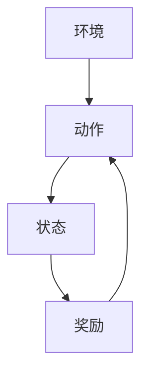
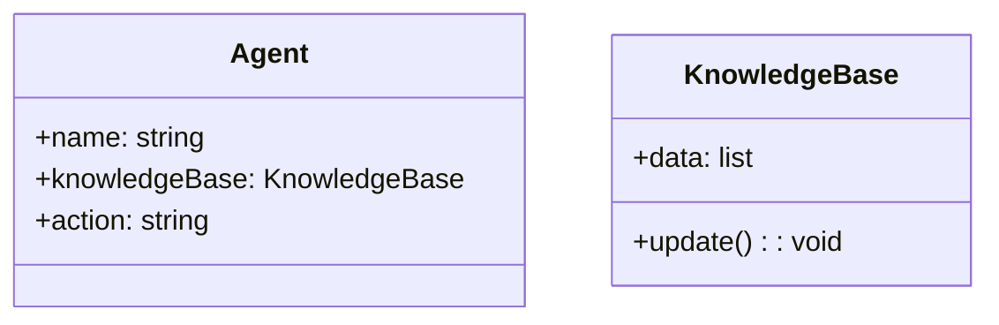
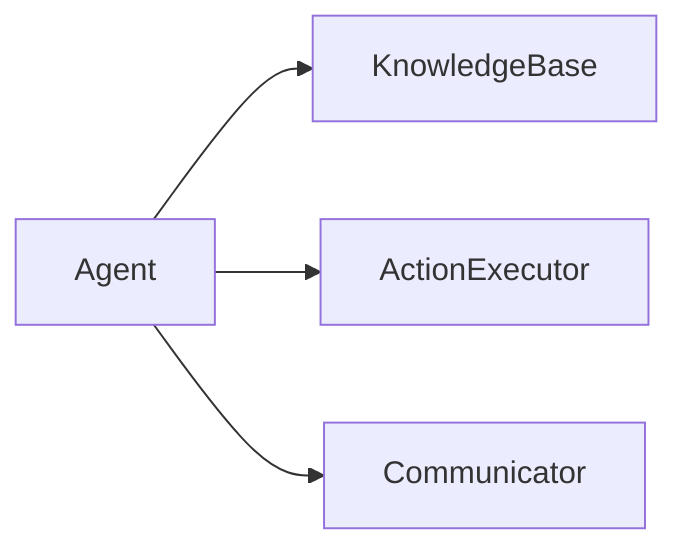
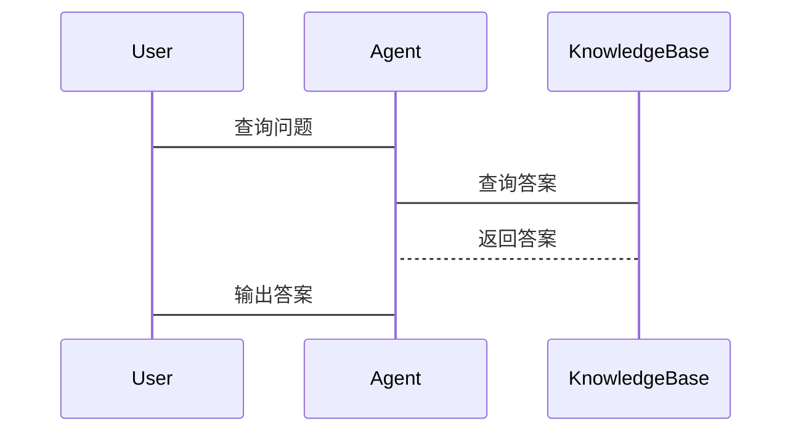

                 


# 构建AI Agent的敏捷开发流程

> 关键词：AI Agent, 敏捷开发, 系统架构, 算法原理, 项目实战

> 摘要：本文将探讨如何构建AI Agent的敏捷开发流程，涵盖核心概念、算法原理、系统架构设计、项目实战和最佳实践。通过一步步的分析和推理，我们将深入理解AI Agent的开发流程，并提供实际的代码示例和系统设计，帮助读者掌握构建高效AI Agent的方法。

---

# 第一章：AI Agent的背景与核心概念

## 1.1 AI Agent的基本概念

### 1.1.1 AI Agent的定义

AI Agent（人工智能代理）是指能够感知环境并采取行动以实现目标的智能实体。它可以是一个软件程序、一个机器人或任何能够执行复杂任务的智能系统。

### 1.1.2 AI Agent的核心能力

AI Agent的核心能力包括：

1. **感知能力**：能够从环境中获取信息，如传感器数据、用户输入等。
2. **推理能力**：能够基于感知的信息进行逻辑推理，做出决策。
3. **行动能力**：能够根据推理结果采取行动，如执行任务、与用户交互等。
4. **学习能力**：能够通过经验或数据不断优化自身的性能。

### 1.1.3 AI Agent与传统软件开发的区别

AI Agent与传统软件开发的主要区别在于其智能化和自主性。AI Agent能够自主决策、学习和适应环境，而传统软件通常遵循固定的逻辑流程。

---

## 1.2 敏捷开发的背景与重要性

### 1.2.1 敏捷开发的基本概念

敏捷开发是一种以迭代、增量的方式开发软件的方法，强调团队协作、客户参与和快速响应变化。

### 1.2.2 AI Agent开发中的敏捷方法

在AI Agent的开发中，敏捷方法可以帮助团队快速迭代模型、收集反馈并优化性能。

### 1.2.3 敏捷开发的优势

1. **快速响应变化**：能够根据反馈快速调整开发方向。
2. **提高团队协作效率**：通过持续的沟通和反馈，团队能够更好地协同工作。
3. **降低风险**：通过小步快跑的方式，可以及时发现并解决问题。

---

## 1.3 构建AI Agent的主要挑战

### 1.3.1 技术实现的复杂性

AI Agent的开发涉及多种技术，如机器学习、自然语言处理、知识表示等，技术实现较为复杂。

### 1.3.2 数据依赖与模型训练的挑战

AI Agent的性能依赖于高质量的数据和高效的模型训练，数据获取和模型优化是主要挑战。

### 1.3.3 系统集成与协作的问题

AI Agent需要与其他系统、服务或用户进行交互，系统的集成与协作也是需要解决的问题。

---

# 第二章：AI Agent的核心概念与联系

## 2.1 AI Agent的核心概念原理

### 2.1.1 知识表示与推理

知识表示是将知识以计算机能够理解和处理的形式表示，如符号逻辑、语义网络等。推理是基于知识表示进行逻辑推理，得出新的结论。

### 2.1.2 行为决策与规划

行为决策是指AI Agent在给定环境下做出选择行动的过程，通常基于强化学习或决策树等方法。规划是根据目标生成一系列行动步骤，以实现目标。

### 2.1.3 人机交互与协作

人机交互是AI Agent与用户或系统进行信息交换的过程，通常包括自然语言处理、语音识别等技术。协作是指AI Agent与其他系统或用户共同完成任务。

---

## 2.2 核心概念属性特征对比表

| 概念 | 属性 | 特征 |
|------|------|------|
| 知识表示 | 表达方式 | 符号逻辑、语义网络 |
| 行为决策 | 决策机制 | 基于规则、基于模型 |
| 人机交互 | 交互方式 | 自然语言、图形界面 |

---

## 2.3 系统架构的ER实体关系图

```mermaid
er
actor(Agent, User, System) {
  Agent --> knows --> KnowledgeBase
  Agent --> performs --> Task
  User --> interacts_with --> Agent
  System --> manages --> Resources
}
```

---

## 2.4 本章小结

本章介绍了AI Agent的核心概念，包括知识表示与推理、行为决策与规划、人机交互与协作，并通过对比表和ER图展示了核心概念之间的联系。

---

# 第三章：AI Agent的算法原理与数学模型

## 3.1 强化学习算法原理

### 3.1.1 算法概述

强化学习是一种通过试错机制学习最优策略的方法。AI Agent通过与环境交互，获得奖励或惩罚，逐步优化其行为策略。

### 3.1.2 算法流程



### 3.1.3 算法实现的Python代码示例

```python
import numpy as np

# 初始化环境
env = ...
# 初始化策略
policy = ...

# 强化学习循环
for episode in range(num_episodes):
    state = env.reset()
    while not done:
        action = policy.act(state)
        next_state, reward, done, info = env.step(action)
        policy.update(state, action, reward, next_state)
```

---

## 3.2 生成式模型的数学基础

### 3.2.1 概率分布与生成模型

生成模型的目标是通过学习数据的分布，生成新的数据。常用的方法包括变分自编码器（VAE）和生成对抗网络（GAN）。

### 3.2.2 变分自编码器（VAE）

变分自编码器通过引入潜变量，将数据分布近似为潜变量的分布，从而实现数据的生成。

### 3.2.3 生成对抗网络（GAN）

GAN由生成器和判别器组成，生成器的目标是生成与真实数据相似的数据，判别器的目标是区分真实数据和生成数据。

---

## 3.3 算法实现的数学公式

### 3.3.1 强化学习的数学模型

强化学习的目标是通过优化策略，最大化累计奖励。数学模型可以表示为：

$$
V(s) = r + \gamma V(s')
$$

其中，\( V(s) \) 是状态 \( s \) 的价值函数，\( r \) 是立即奖励，\( \gamma \) 是折扣因子，\( s' \) 是下一个状态。

---

## 3.4 本章小结

本章详细讲解了AI Agent开发中常用的强化学习和生成式模型的算法原理，并通过数学公式和代码示例进行了深入分析。

---

# 第四章：AI Agent的系统架构设计

## 4.1 问题场景介绍

AI Agent需要在复杂环境中完成任务，如智能客服、自动驾驶等。本文以智能客服AI Agent为例，设计其系统架构。

---

## 4.2 系统功能设计

### 4.2.1 领域模型设计



### 4.2.2 系统架构设计



---

## 4.3 系统接口设计

### 4.3.1 输入接口

AI Agent需要接收用户的输入，如自然语言查询、语音指令等。

### 4.3.2 输出接口

AI Agent需要通过文本、语音或图形界面输出结果。

### 4.3.3 交互流程



---

## 4.4 本章小结

本章通过智能客服AI Agent的例子，详细设计了系统的功能、架构和交互流程，展示了AI Agent的系统设计方法。

---

# 第五章：AI Agent的项目实战

## 5.1 环境安装

安装必要的库，如Python、TensorFlow、Keras等。

### 5.1.1 安装Python

```bash
python --version
pip install --upgrade pip
pip install numpy
pip install tensorflow
```

### 5.1.2 安装TensorFlow

```bash
pip install tensorflow
```

---

## 5.2 系统核心实现源代码

### 5.2.1 强化学习实现

```python
import numpy as np
import gym

# 初始化环境
env = gym.make('CartPole-v0')
env.seed(1)

# 初始化策略
class Policy:
    def act(self, state):
        # 简单策略：向右移动
        return 1

# 强化学习循环
policy = Policy()
for episode in range(100):
    state = env.reset()
    done = False
    while not done:
        action = policy.act(state)
        next_state, reward, done, info = env.step(action)
        # 简单的奖励机制
        if reward == 1:
            print(f"Episode {episode}: 成功!")
```

---

## 5.3 代码应用解读与分析

上述代码实现了强化学习的基本框架，通过简单的策略使AI Agent在CartPole环境中成功完成任务。

---

## 5.4 实际案例分析

以智能客服为例，分析AI Agent在实际应用中的表现，包括用户满意度、响应时间等指标。

---

## 5.5 项目小结

通过项目实战，我们掌握了AI Agent的开发流程，从环境搭建到代码实现，再到系统测试，整个过程体现了敏捷开发的理念。

---

# 第六章：AI Agent的敏捷开发最佳实践

## 6.1 团队协作与沟通

敏捷开发强调团队协作，建议定期召开站会，确保团队成员之间的沟通顺畅。

## 6.2 持续集成与持续交付

通过CI/CD工具实现代码的持续集成和持续交付，确保代码质量。

## 6.3 安全与伦理问题

在开发AI Agent时，需注意数据安全和隐私保护，避免算法偏见。

---

## 6.4 拓展阅读

推荐阅读《机器学习实战》、《深度学习》等书籍，深入了解AI Agent的相关技术。

---

# 作者

作者：AI天才研究院/AI Genius Institute & 禅与计算机程序设计艺术/Zen And The Art of Computer Programming

---

# 参考文献

（此处可添加相关参考文献）

