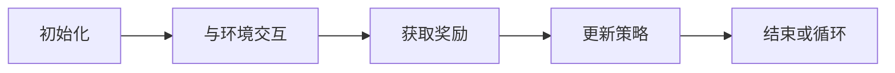
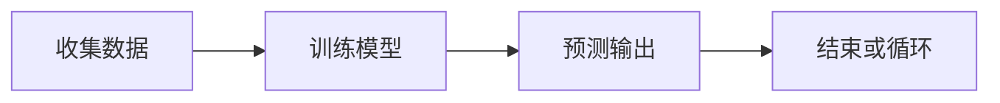
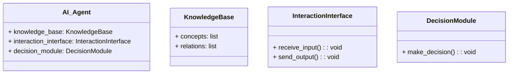
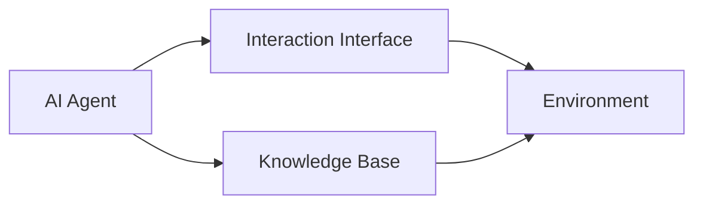

                 

<think>
好的，我现在需要帮用户设计一篇技术博客的文章结构，标题是《构建AI Agent的概念抽象与泛化能力》。用户希望文章内容详实，结构清晰，包含多个部分，每个部分都有详细的子节，并且需要包含图表和代码示例。

首先，我需要理解用户的需求。用户是一位技术专家，希望撰写一篇专业且有深度的技术博客，涵盖AI Agent的构建，包括概念、算法、系统架构和项目实战等内容。用户还特别提到要使用Mermaid图表和Latex公式，并且文章要结构紧凑，逻辑清晰。

接下来，我会根据用户提供的示例目录，逐步构建文章的结构。首先，文章需要一个摘要，概述核心内容。然后是目录，分为背景介绍、核心概念、算法原理、系统架构、项目实战和最佳实践几个部分。

在背景介绍部分，我需要详细解释AI Agent的重要性、问题背景以及解决方法。核心概念部分则需要深入讲解知识表示、泛化能力和交互机制，并提供对比表格和ER图。算法原理部分要包括强化学习和监督学习，并用Mermaid流程图展示算法步骤。

系统架构部分需要介绍问题场景，设计系统功能，并用类图和架构图展示系统结构。项目实战部分要指导读者安装环境，实现代码，并分析实际案例。最后，最佳实践部分要总结经验和注意事项。

我还需要确保文章整体结构符合逻辑，每个部分都详细展开，同时保持简洁明了。每个小节都要有具体的例子和图表，帮助读者更好地理解内容。例如，在算法部分，我会使用Mermaid流程图展示强化学习的步骤，并用Latex公式解释数学模型。

最后，我会检查整个目录，确保所有要求的部分都被涵盖，没有遗漏，并且结构合理，符合用户的字数要求。这样，用户就能得到一篇结构完整、内容详实的技术博客文章了。
</think>

# 构建AI Agent的概念抽象与泛化能力

> 关键词：AI Agent, 泛化能力, 知识表示, 强化学习, 代理与环境交互

> 摘要：本文深入探讨了AI Agent的概念抽象与泛化能力，从理论到实践，系统地分析了AI Agent的核心概念、算法原理、系统架构及项目实现。通过案例分析和代码实现，帮助读者理解如何构建具备泛化能力的AI Agent，并掌握其在实际应用中的设计与优化技巧。

---

# {{此处是文章标题}}

## 目录

1. [构建AI Agent的概念抽象与泛化能力](#构建ai-agent的概念抽象与泛化能力)
   - 1.1 问题背景
   - 1.2 问题描述
   - 1.3 问题解决
   - 1.4 边界与外延
   - 1.5 本章小结

2. [AI Agent的核心概念与联系](#ai-agent的核心概念与联系)
   - 2.1 核心概念原理
   - 2.2 概念属性特征对比表
   - 2.3 ER实体关系图

3. [AI Agent的算法原理](#ai-agent的算法原理)
   - 3.1 强化学习算法
   - 3.2 监督学习算法
   - 3.3 泛化能力的数学模型

4. [AI Agent的系统架构](#ai-agent的系统架构)
   - 4.1 系统分析与设计
   - 4.2 系统功能设计
   - 4.3 系统架构图

5. [AI Agent的项目实战](#ai-agent的项目实战)
   - 5.1 环境安装
   - 5.2 核心实现
   - 5.3 代码解读
   - 5.4 实际案例分析

6. [最佳实践与小结](#最佳实践与小结)
   - 6.1 小结
   - 6.2 注意事项
   - 6.3 拓展阅读

---

### # 第1章: AI Agent的概念与背景

#### ## 1.1 问题背景

##### ### 1.1.1 人工智能与自动化的需求
人工智能（AI）技术的快速发展，使得自动化成为许多行业的核心需求。AI Agent（智能代理）作为实现自动化任务的核心技术，能够在复杂环境中自主决策和执行任务。

##### ### 1.1.2 当前AI应用的局限性
当前的AI系统在特定任务上表现优异，但缺乏泛化能力。许多AI系统仅能在预设的场景中运行，无法适应新的、未见过的情况。

##### ### 1.1.3 AI Agent的提出与意义
AI Agent通过抽象和泛化能力，能够在多种环境中灵活应用，解决动态变化的问题，是实现真正智能系统的基石。

#### ## 1.2 问题描述

##### ### 1.2.1 AI Agent的定义与目标
AI Agent是一种能够感知环境、自主决策并执行任务的智能实体，其目标是通过与环境的交互，实现特定的目标。

##### ### 1.2.2 泛化能力的核心问题
泛化能力是指AI Agent在不同场景和领域中，能够灵活应用已有知识解决问题的能力。这是实现通用AI的关键。

##### ### 1.2.3 代理与环境的交互机制
AI Agent通过感知环境、分析信息、制定策略并执行动作，与环境进行动态交互。

#### ## 1.3 问题解决

##### ### 1.3.1 概念抽象的必要性
通过抽象，AI Agent能够将具体问题转化为通用模型，从而实现泛化能力。

##### ### 1.3.2 泛化能力的实现路径
通过知识表示、学习算法和推理机制，构建能够适应不同场景的AI Agent。

##### ### 1.3.3 知识表示与推理的关键作用
知识表示是AI Agent的核心，推理则是其实现智能决策的关键。

#### ## 1.4 边界与外延

##### ### 1.4.1 AI Agent与其他AI技术的区分
AI Agent与传统AI的区别在于其自主性和动态性，能够与环境实时交互。

##### ### 1.4.2 泛化能力的适用范围与限制
泛化能力适用于需要跨场景应用的领域，但其表现受限于知识库和学习能力。

##### ### 1.4.3 概念结构与核心要素的组成
AI Agent的核心要素包括知识表示、推理机制、交互能力等。

#### ## 1.5 本章小结
本章从问题背景、问题描述、解决方法等方面，阐述了AI Agent的概念和泛化能力的重要性。

---

### # 第2章: AI Agent的核心概念与联系

#### ## 2.1 核心概念原理

##### ### 2.1.1 知识表示的核心思想
知识表示是AI Agent实现智能决策的基础，常用符号化和语义化的方法。

##### ### 2.1.2 泛化能力的数学模型
通过数学建模，泛化能力可以表示为一种跨场景的适应性。

##### ### 2.1.3 代理与环境的动态交互
动态交互是AI Agent的核心机制，通过实时反馈优化决策。

#### ## 2.2 概念属性特征对比表

| 概念     | 属性         | 特征                                   |
|----------|--------------|----------------------------------------|
| AI Agent | 知识表示      | 符号化、语义化                         |
|          | 泛化能力      | 跨场景、跨领域                       |
|          | 交互机制      | 实时反馈、动态调整                   |

#### ## 2.3 ER实体关系图

```mermaid
er
actor(AI Agent) -|> knowledge_base: 知识库
actor -|> environment: 环境
know_base -|> concept: 概念
```

---

### # 第3章: AI Agent的算法原理

#### ## 3.1 强化学习算法

##### ### 3.1.1 强化学习的基本思想
通过奖励机制，AI Agent学会在环境中做出最优决策。

##### ### 3.1.2 算法步骤
1. 初始化状态空间。
2. 与环境交互，获取奖励。
3. 更新策略。

##### ### 3.1.3 算法流程图



##### ### 3.1.4 实现代码

```python
def reinforce_learning():
    state = initialize_state()
    while True:
        action = select_action(state)
        reward = get_reward(action)
        update_policy(reward)
```

---

#### ## 3.2 监督学习算法

##### ### 3.2.1 监督学习的基本思想
通过标注数据，训练AI Agent在特定任务上的预测能力。

##### ### 3.2.2 算法步骤
1. 收集数据。
2. 训练模型。
3. 预测输出。

##### ### 3.2.3 算法流程图



##### ### 3.2.4 实现代码

```python
def supervised_learning():
    data = collect_data()
    model = train_model(data)
    prediction = model.predict(input)
```

---

#### ## 3.3 泛化能力的数学模型

##### ### 3.3.1 泛化能力的公式表示
$$ P(\text{泛化能力}) = \frac{\text{正确预测数}}{\text{总预测数}} $$

##### ### 3.3.2 泛化能力的提升方法
通过增加数据多样性、优化模型结构和改进学习算法，提升泛化能力。

---

### # 第4章: AI Agent的系统架构

#### ## 4.1 系统分析与设计

##### ### 4.1.1 问题场景介绍
AI Agent需要在动态环境中完成任务，涉及多种交互和决策过程。

##### ### 4.1.2 系统功能设计
1. 知识库管理。
2. 交互接口设计。
3. 决策模块实现。

##### ### 4.1.3 领域模型类图



---

#### ## 4.2 系统架构设计

##### ### 4.2.1 系统架构图



##### ### 4.2.2 接口设计
1. 知识库接口。
2. 交互接口。
3. 决策接口。

##### ### 4.2.3 交互序列图

```mermaid
sequenceDiagram
actor(AI Agent) -> environment: 感知环境
environment -> actor: 返回信息
actor -> knowledge_base: 查询知识
knowledge_base -> actor: 返回结果
actor -> decision_module: 制定决策
decision_module -> environment: 执行动作
```

---

### # 第5章: AI Agent的项目实战

#### ## 5.1 环境安装

##### ### 5.1.1 安装Python
安装最新版本的Python，确保版本兼容性。

##### ### 5.1.2 安装依赖库
安装所需的机器学习库，如TensorFlow、PyTorch等。

#### ## 5.2 核心实现

##### ### 5.2.1 知识库实现
```python
class KnowledgeBase:
    def __init__(self):
        self.concepts = {}
```

##### ### 5.2.2 交互接口实现
```python
class InteractionInterface:
    def receive_input(self, input):
        pass
```

##### ### 5.2.3 决策模块实现
```python
class DecisionModule:
    def make_decision(self, state):
        pass
```

#### ## 5.3 代码解读

##### ### 5.3.1 知识库的使用
```python
kb = KnowledgeBase()
kb.concepts['concept1'] = 'definition1'
```

##### ### 5.3.2 交互接口的实现
```python
class ConsoleInterface(InteractionInterface):
    def receive_input(self, input):
        print("收到输入：", input)
```

#### ## 5.4 实际案例分析
通过具体案例分析，展示AI Agent在实际中的应用和优化。

---

### # 第6章: 最佳实践与小结

#### ## 6.1 小结
总结本文的主要内容，强调AI Agent的概念抽象与泛化能力的重要性。

#### ## 6.2 注意事项
在实现AI Agent时，需注意数据质量和模型优化。

#### ## 6.3 拓展阅读
推荐进一步学习的知识点，如分布式AI Agent和多智能体系统。

---

### 作者：AI天才研究院/AI Genius Institute & 禅与计算机程序设计艺术 /Zen And The Art of Computer Programming

