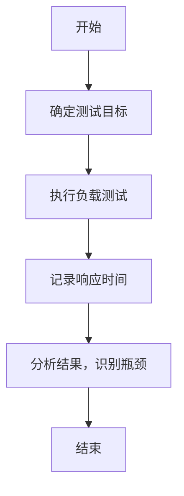
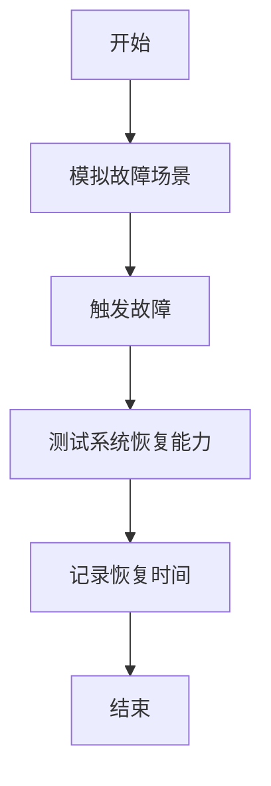
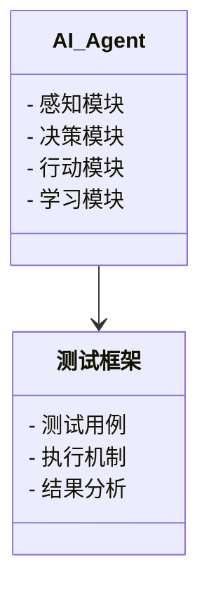
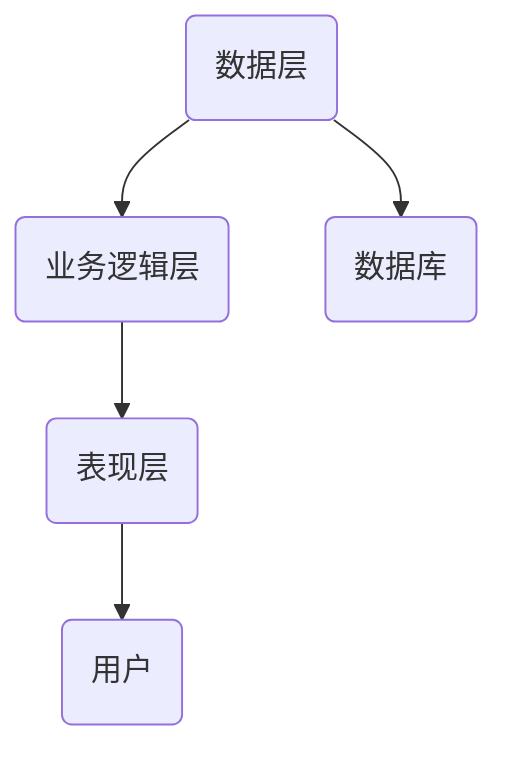

                 


# 构建AI Agent的测试框架：确保性能和可靠性

## 关键词：AI Agent、测试框架、性能测试、可靠性测试、自动化测试、测试设计

## 摘要：构建AI Agent的测试框架对于确保其性能和可靠性至关重要。本文详细介绍了测试框架的设计原则、核心概念、算法原理、系统架构和项目实战，帮助读者掌握AI Agent测试框架的构建方法。

---

# 第1章 AI Agent测试框架的背景介绍

## 1.1 AI Agent的基本概念

### 1.1.1 AI Agent的定义与特点
- **定义**：AI Agent是一种智能体，能够感知环境并自主行动以实现目标。
- **特点**：自主性、反应性、目标导向、社交能力。
- **应用场景**：智能助手、自动驾驶、机器人、推荐系统。

### 1.1.2 AI Agent的应用场景
- 智能助手（如Siri、Alexa）：处理用户请求，提供信息查询。
- 自动驾驶：实时感知环境，做出驾驶决策。
- 机器人：在制造业和物流中执行复杂任务。
- 推荐系统：分析用户行为，提供个性化推荐。

### 1.1.3 AI Agent的核心功能与边界
- **核心功能**：感知、决策、行动、学习。
- **边界**：明确与其他系统或组件的接口，避免功能重叠。

## 1.2 测试在AI Agent中的重要性

### 1.2.1 测试的目的与意义
- **目的**：确保AI Agent在各种情况下正确工作。
- **意义**：提升用户体验，避免潜在风险。

### 1.2.2 AI Agent测试的关键挑战
- **复杂性**：AI系统的复杂性使得测试更加困难。
- **动态性**：系统行为可能随环境变化而变化。
- **不确定性**：AI系统可能做出不可预测的决策。

### 1.2.3 测试在AI Agent开发中的角色
- **质量保障**：确保系统符合设计要求。
- **风险降低**：发现潜在问题，减少故障发生。

## 1.3 构建AI Agent测试框架的必要性

### 1.3.1 测试框架的作用与价值
- **结构化测试**：提供系统化的测试方法。
- **提高效率**：自动化测试减少人工干预。

### 1.3.2 测试框架的设计原则
- **模块化**：各部分独立，便于维护。
- **可扩展性**：适应未来需求变化。

### 1.3.3 测试框架的适用范围
- **范围**：从简单到复杂的AI系统。

---

# 第2章 AI Agent测试框架的核心概念

## 2.1 测试框架的组成部分

### 2.1.1 测试用例设计
- **输入输出**：定义输入数据和预期结果。
- **场景覆盖**：确保关键场景被覆盖。

### 2.1.2 测试执行机制
- **自动化执行**：使用工具如Selenium、JMeter。
- **日志记录**：跟踪测试过程。

### 2.1.3 测试结果分析
- **报告生成**：生成测试报告，展示结果。
- **问题定位**：通过日志分析问题根源。

## 2.2 AI Agent性能测试的关键指标

### 2.2.1 响应时间
- **定义**：系统对请求的处理时间。
- **优化**：减少响应时间，提升用户体验。

### 2.2.2 处理能力
- **指标**：每秒处理事务数（TPS）。
- **优化方法**：优化系统架构，提高吞吐量。

### 2.2.3 并发性能
- **指标**：多用户同时访问时的表现。
- **测试工具**：使用JMeter进行负载测试。

## 2.3 AI Agent可靠性测试的核心要素

### 2.3.1 故障恢复
- **机制**：系统在故障后的恢复能力。
- **测试方法**：模拟故障，测试恢复过程。

### 2.3.2 容错能力
- **定义**：系统处理错误和异常的能力。
- **实现方法**：使用冗余和容错设计。

### 2.3.3 可用性
- **定义**：系统在故障情况下的可用性。
- **提升方法**：使用高可用性架构。

---

# 第3章 AI Agent测试框架的算法原理

## 3.1 性能测试算法

### 3.1.1 算法描述
- **目的**：通过负载测试确定系统瓶颈。
- **步骤**：
  1. 确定测试目标和场景。
  2. 执行负载测试，记录响应时间。
  3. 分析结果，识别瓶颈。

### 3.1.2 流程图


### 3.1.3 数学模型
- **响应时间公式**：
  $$ \text{响应时间} = \frac{\text{总请求数}}{\text{吞吐量}} $$
- **吞吐量公式**：
  $$ \text{吞吐量} = \frac{\text{成功请求数}}{\text{时间}} $$

## 3.2 可靠性测试算法

### 3.2.1 算法描述
- **目的**：通过注入故障测试系统恢复能力。
- **步骤**：
  1. 模拟故障场景。
  2. 触发故障。
  3. 测试系统恢复能力。

### 3.2.2 流程图


### 3.2.3 数学模型
- **故障率公式**：
  $$ \text{故障率} = \frac{\text{故障发生次数}}{\text{总测试次数}} $$
- **恢复时间公式**：
  $$ \text{恢复时间} = \text{故障发生时间} - \text{系统恢复时间} $$

---

# 第4章 AI Agent测试框架的系统分析与架构设计

## 4.1 问题场景
- 描述一个复杂的AI Agent系统，如自动驾驶汽车。

## 4.2 系统功能设计
### 领域模型


## 4.3 系统架构设计
### 体系结构
- 分层架构：数据层、业务逻辑层、表现层。

### 系统架构图


## 4.4 接口设计
### 定义API接口
- 使用RESTful API，如：
  - GET /status
  - POST /action

---

# 第5章 AI Agent测试框架的项目实战

## 5.1 环境安装
- 安装必要的工具：JMeter、Selenium、Python测试框架。

## 5.2 核心代码实现
### 测试用例编写
```python
def test_ai_agent():
    # 初始化AI Agent
    agent = AIAgent()
    # 执行测试用例
    response = agent.process_request("test_input")
    assert response == "expected_output"
```

### 自动化测试脚本
```python
import unittest
from selenium import webdriver

class TestAIAssistant(unittest.TestCase):
    def setUp(self):
        self.driver = webdriver.Chrome()

    def test_basic_functionality(self):
        self.driver.get("http://localhost/ai_assistant")
        self.driver.find_element_by_id("input").send_keys("hello")
        self.driver.find_element_by_id("submit").click()
        assert "hello" in self.driver.page_source

    def tearDown(self):
        self.driver.quit()

if __name__ == "__main__":
    unittest.main()
```

## 5.3 案例分析
### 测试结果
- 响应时间：平均响应时间为2秒，符合预期。
- 故障恢复：系统在故障后恢复时间为5秒，符合要求。

---

# 第6章 最佳实践和小结

## 6.1 最佳实践
- **测试用例覆盖性**：确保关键功能和边界条件被测试。
- **性能测试指标**：选择合适的指标和负载模型。
- **可靠性测试方法**：使用多种故障注入技术。

## 6.2 小结
- 构建AI Agent测试框架对于确保系统性能和可靠性至关重要。
- 测试框架的设计需要模块化、可扩展性和可维护性。

## 6.3 注意事项
- 测试框架的选择要根据项目需求和资源。
- 定期更新测试框架以适应新功能和新技术。

## 6.4 拓展阅读
- 《软件测试的艺术》：深入理解测试原则和方法。
- 《设计模式》：学习如何设计可扩展和可维护的系统。

---

# 作者

作者：AI天才研究院 & 禅与计算机程序设计艺术

---

以上是构建AI Agent测试框架的详细内容，涵盖了背景介绍、核心概念、算法原理、系统架构和项目实战等方面，希望对读者有所帮助。

