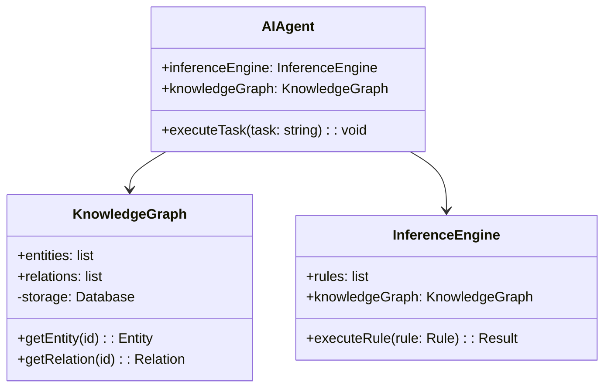
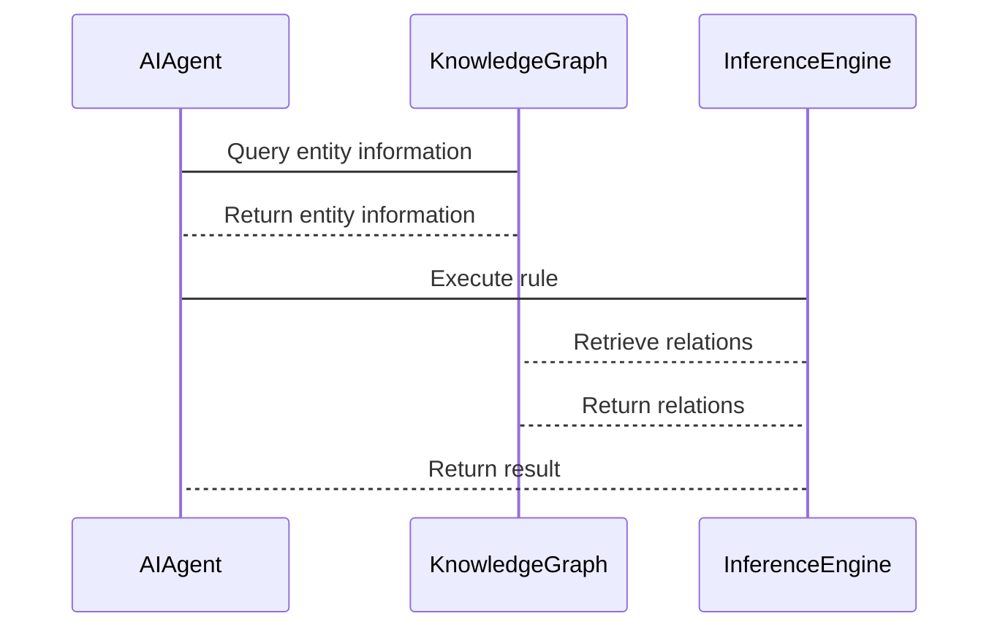

                 


# 构建AI Agent的知识图谱推理系统：增强逻辑分析

**关键词**：AI Agent, 知识图谱, 推理系统, 逻辑分析, 系统架构

**摘要**：本文详细探讨了构建AI Agent的知识图谱推理系统的核心概念、算法原理、系统架构及实现方法。通过分析知识图谱的表示与推理机制，结合AI Agent的逻辑推理能力，提出了一种增强逻辑分析的知识图谱推理系统设计方案，并通过实际案例展示了系统的实现与应用。

---

## 第1章: 知识图谱与AI Agent概述

### 1.1 知识图谱的定义与作用
知识图谱是一种以三元组形式表示的知识网络，由实体（node）和关系（edge）构成，能够表示复杂的语义信息。知识图谱的核心作用是为AI系统提供可计算的知识基础，支持复杂的推理任务。

### 1.2 AI Agent的核心概念
AI Agent是一种具有感知、推理、规划和执行能力的智能实体，能够与环境交互并完成特定任务。知识图谱为AI Agent提供了丰富的知识表示和推理能力，增强了其逻辑分析能力。

### 1.3 知识图谱推理的必要性
在AI Agent中，知识图谱推理是连接知识表示与任务执行的关键桥梁。通过推理系统，AI Agent能够基于知识图谱中的信息进行逻辑推理，解决复杂问题。

---

## 第2章: 知识图谱推理系统的算法原理

### 2.1 符号逻辑推理
符号逻辑推理是一种基于形式逻辑的推理方法，通过规则和逻辑操作符（如合取、析取、蕴含）进行推理。符号逻辑推理的优点是可解释性强，但其缺点是难以处理复杂的语义信息。

### 2.2 深度学习推理
深度学习推理基于神经网络模型，能够从大规模数据中学习复杂的模式和关系。与符号逻辑推理相比，深度学习推理具有更强的语义理解和非结构化数据处理能力。

### 2.3 知识图谱推理的数学模型
知识图谱推理的数学模型可以通过逻辑公式和概率模型表示。例如，基于概率的推理模型可以表示为：
$$P(A|B) = \frac{P(B|A)P(A)}{P(B)}$$

---

## 第3章: 系统架构设计

### 3.1 系统功能设计
系统功能包括知识图谱的构建、推理规则的定义、推理过程的执行以及结果的输出。以下是系统功能的类图：



### 3.2 系统交互流程
以下是系统交互的序列图：



---

## 第4章: 项目实战

### 4.1 环境安装
需要安装的知识图谱存储库（如Neo4j）和深度学习框架（如TensorFlow或PyTorch）。

### 4.2 知识图谱构建代码
以下是使用Python构建知识图谱的示例代码：

```python
from neo4j import GraphDatabase
from neo4j.exceptions import ServiceUnavailable

class KnowledgeGraph:
    def __init__(self, uri, user, password):
        self.driver = GraphDatabase.driver(uri, auth=(user, password))
    
    def add_entity(self, entity):
        with self.driver.session() as session:
            session.run("CREATE (:Entity {name: $name})", entity)
    
    def add_relation(self, entity1, relation, entity2):
        with self.driver.session() as session:
            session.run("MATCH (a {name: $a}), (b {name: $b}) CREATE (a)-[r:$relation]->(b)", 
                        a=entity1, b=entity2, relation=relation)
```

### 4.3 推理系统实现
以下是基于符号逻辑推理的实现代码：

```python
class InferenceEngine:
    def __init__(self, knowledge_graph):
        self.knowledge_graph = knowledge_graph
    
    def execute_rule(self, rule):
        # 示例规则：如果A是B的父亲，且B是C的父亲，则A是C的祖父。
        if rule.antecedent:
            result = self.knowledge_graph.getEntity(rule.antecedent['entity1'])
            relation = self.knowledge_graph.getRelation(rule.antecedent['relation'])
            result = self.knowledge_graph.getEntity(rule.antecedent['entity2'])
            return result
        return None
```

---

## 第5章: 总结与展望

### 5.1 系统总结
本文提出了构建AI Agent的知识图谱推理系统，详细分析了知识图谱表示、推理算法和系统架构设计。通过实际案例展示了系统的实现与应用。

### 5.2 未来展望
未来的研究方向包括更高效的推理算法、知识图谱的动态更新以及多模态数据的融合。此外，如何将知识图谱推理与强化学习结合，进一步增强AI Agent的智能性，也是一个重要的研究方向。

---

**作者**：AI天才研究院 & 禅与计算机程序设计艺术

