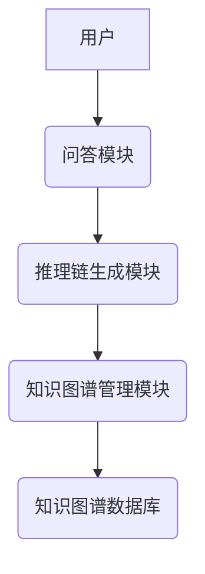

                 

<think>
好的，我现在需要根据用户的要求，构建一个关于“构建AI Agent的知识图谱推理链生成器”的技术博客文章。用户已经提供了详细的要求，包括标题、关键词、摘要，以及目录大纲。我需要按照这些要求，逐步分析和撰写文章。

首先，我会先阅读用户提供的需求，确保我完全理解每个部分的要求。文章需要有清晰的结构，每个章节要有详细的解释，包括背景介绍、核心概念、算法原理、系统架构、项目实战、最佳实践等部分。此外，还需要使用Markdown格式，包含数学公式和图表，如Mermaid流程图。

接下来，我将按照目录大纲逐步撰写每个部分的内容。从摘要开始，简要介绍文章的核心内容和主题思想。然后是关键词部分，列出5-7个核心关键词。接下来是正文部分，每个章节需要详细展开，确保每个小节都有丰富的解释和具体的例子。

在撰写过程中，我需要确保逻辑清晰，结构紧凑，语言专业且易懂。数学公式要用LaTeX表示，算法流程图和系统架构图使用Mermaid语法。同时，代码示例要用Python编写，并进行详细解读。

我还需要注意文章的总字数在10000到12000字之间，每个部分的内容要详尽，但避免冗余。在完成每个章节后，我会检查是否符合用户的要求，确保没有遗漏任何关键点。

最后，我会在文章末尾添加作者信息，确保格式正确。整个过程需要一步步来，确保每个部分都达到用户的期望。
</think>

# 构建AI Agent的知识图谱推理链生成器

> 关键词：知识图谱，AI Agent，推理链生成器，自然语言处理，深度学习，图神经网络

> 摘要：  
本文将详细介绍如何构建一个基于知识图谱的AI Agent推理链生成器。通过逐步分析知识图谱的构建、推理链的生成原理以及生成器的设计，我们将探讨如何利用这些技术来提升AI Agent的智能水平。文章从背景介绍、核心概念、算法原理、系统架构到项目实战，全面覆盖了构建知识图谱推理链生成器的各个方面，最后总结了最佳实践和未来研究方向。

---

# 第1章 知识图谱的基本概念

## 1.1 知识图谱的定义与特点

### 1.1.1 知识图谱的定义  
知识图谱是一种以图结构表示知识的形式，节点表示实体或概念，边表示实体之间的关系。知识图谱能够帮助AI系统理解和推理复杂的语义信息。

### 1.1.2 知识图谱的核心特点  
- **结构化**：知识以实体和关系的形式组织，便于计算机处理。  
- **可扩展性**：支持大规模数据的存储和查询。  
- **语义丰富性**：通过复杂的实体关系，提供更深层次的语义理解。

### 1.1.3 知识图谱与传统数据库的区别  
传统数据库主要存储结构化或非结构化数据，而知识图谱通过语义网络的形式，将数据之间的关系显式化，能够支持复杂的语义推理。

## 1.2 AI Agent的定义与作用

### 1.2.1 AI Agent的定义  
AI Agent是一种智能体，能够感知环境、自主决策并执行任务。它可以基于知识图谱进行推理，提供更智能的服务。

### 1.2.2 AI Agent的核心功能  
- **感知**：通过传感器或接口获取环境信息。  
- **推理**：基于知识图谱进行逻辑推理，生成决策。  
- **决策**：根据推理结果选择最优行动方案。  
- **执行**：通过执行器完成任务。

### 1.2.3 AI Agent在实际场景中的应用  
例如，在智能客服系统中，AI Agent可以通过知识图谱理解用户需求，并基于推理结果提供解决方案。

## 1.3 推理链生成器的背景与意义

### 1.3.1 推理链的定义  
推理链是指从已知事实出发，通过一系列推理步骤，最终得到目标结论的路径。

### 1.3.2 推理链生成器的作用  
推理链生成器能够自动生成推理路径，帮助AI Agent高效地解决问题。

### 1.3.3 知识图谱推理链生成器的必要性  
知识图谱提供了丰富的语义信息，但如何高效地生成推理链是构建智能系统的关键。

---

# 第2章 知识图谱、推理链与生成器的核心概念

## 2.1 知识图谱的构建原理

### 2.1.1 知识抽取与表示  
知识抽取是从文本中提取实体和关系的过程，常用的技术包括信息抽取和实体链接。知识表示通常使用RDF（资源描述框架）或图结构。

### 2.1.2 知识图谱的存储与管理  
知识图谱的存储可以采用图数据库（如Neo4j）或关系型数据库。为了高效查询，通常需要构建索引。

### 2.1.3 知识图谱的更新与维护  
知识图谱需要定期更新以保持准确性，常用的技术包括基于规则的更新和机器学习模型的自动更新。

## 2.2 推理链的生成原理

### 2.2.1 推理规则的定义  
推理规则是基于逻辑的规则，例如一阶逻辑规则或描述逻辑规则。这些规则定义了如何从已知事实推导出新的事实。

### 2.2.2 推理链的构建过程  
推理链的构建通常包括以下步骤：  
1. 分析目标问题，确定起点和终点。  
2. 在知识图谱中找到连接起点和终点的所有可能路径。  
3. 根据推理规则，筛选出符合逻辑的路径。

### 2.2.3 推理链的优化与评估  
推理链的优化可以通过剪枝算法减少不必要的路径，评估指标包括路径长度和准确性。

## 2.3 生成器的工作原理

### 2.3.1 生成器的输入与输出  
生成器的输入通常是知识图谱和目标问题，输出是推理链。

### 2.3.2 生成器的训练与优化  
生成器通常基于深度学习模型进行训练，优化目标是最小化生成的推理链与实际推理路径的差异。

### 2.3.3 生成器的评估与测试  
评估指标包括准确率、召回率和F1值。

## 2.4 核心概念的联系与对比

### 2.4.1 知识图谱与推理链的联系  
知识图谱提供了推理链的基础，推理链则利用知识图谱进行逻辑推理。

### 2.4.2 推理链与生成器的联系  
生成器负责根据知识图谱和目标问题生成推理链。

### 2.4.3 三者关系的对比表格  
以下是一个对比表格：

| 概念   | 定义                                                                 | 作用                                   |
|--------|----------------------------------------------------------------------|----------------------------------------|
| 知识图谱| 以图结构表示实体及其关系的数据库                                     | 提供语义信息，支持推理                 |
| 推理链  | 从起点到终点的推理路径                                               | 连接知识图谱中的实体，支持智能决策     |
| 生成器  | 自动生成推理链的算法或模型                                           | 高效生成推理链，提升AI Agent的智能性   |

---

# 第3章 知识图谱构建算法

## 3.1 知识抽取算法

### 3.1.1 基于规则的抽取算法  
基于规则的算法通过预定义的规则从文本中提取实体和关系。例如，使用正则表达式提取日期和地点。

### 3.1.2 基于模式匹配的抽取算法  
模式匹配算法通过预定义的模式匹配文本，提取实体和关系。

### 3.1.3 基于深度学习的抽取算法  
深度学习算法（如LSTM和BERT）通过训练模型自动学习实体和关系的特征，提取能力更强。

## 3.2 知识融合算法

### 3.2.1 实体对齐  
实体对齐是将不同数据源中的实体进行匹配，通常使用字符串相似度或语义相似度进行判断。

### 3.2.2 知识合并  
知识合并是将多个数据源中的知识进行整合，避免重复和矛盾。

## 3.3 知识表示算法

### 3.3.1 基于图的表示方法  
图表示方法将实体和关系表示为图中的节点和边。

### 3.3.2 基于向量的表示方法  
向量表示方法（如Word2Vec）将实体和关系表示为向量，便于计算语义相似度。

---

# 第4章 推理链生成算法

## 4.1 基于规则的推理算法

### 4.1.1 基于逻辑推理的规则  
基于逻辑推理的规则通常采用一阶逻辑，通过谓词逻辑进行推理。

### 4.1.2 基于规则的推理过程  
例如，如果A是B的父亲，B是C的父亲，那么A是C的祖父。

## 4.2 基于深度学习的推理算法

### 4.2.1 基于图神经网络的推理  
图神经网络（GNN）通过节点之间的关系进行推理，适合处理复杂的关系网络。

### 4.2.2 基于注意力机制的推理  
注意力机制通过关注重要的节点和边，提升推理的准确性。

---

# 第5章 知识图谱推理链生成器的系统架构

## 5.1 问题场景介绍

### 5.1.1 问题背景  
假设我们需要构建一个智能问答系统，用户提出问题，系统基于知识图谱生成推理链，提供准确的答案。

### 5.1.2 问题描述  
系统需要能够理解用户的问题，从知识图谱中找到相关实体和关系，生成推理链，并返回答案。

## 5.2 系统功能设计

### 5.2.1 知识图谱管理模块  
负责知识图谱的构建、存储和管理。

### 5.2.2 推理链生成模块  
负责根据用户问题生成推理链。

### 5.2.3 问答模块  
根据推理链生成最终答案。

## 5.3 系统架构设计

### 5.3.1 系统架构图  
以下是一个系统架构的Mermaid图：



### 5.3.2 接口设计  
- 用户通过API提交问题。  
- 推理链生成模块调用知识图谱管理模块的接口获取知识图谱数据。

### 5.3.3 交互流程  
用户提交问题 → 问答模块解析问题 → 推理链生成模块生成推理链 → 知识图谱管理模块查询数据 → 返回答案。

---

# 第6章 项目实战

## 6.1 环境安装

### 6.1.1 安装Python  
确保安装了Python 3.8及以上版本。

### 6.1.2 安装依赖库  
安装以下库：  
- `networkx`：用于图数据处理。  
- `neo4j`：用于连接Neo4j图数据库。  
- `tensorflow`：用于深度学习模型训练。

## 6.2 核心代码实现

### 6.2.1 知识图谱构建代码

```python
import neo4j
from neo4j.exceptions import ServiceUnavailable

def create知识图谱():
    driver = neo4j.Driver("bolt://localhost:7687", auth=("neo4j", "password"))
    try:
        with driver.session() as session:
            session.run("CREATE (a:Person {name: 'Alice'})")
            session.run("CREATE (b:Person {name: 'Bob'})")
            session.run("CREATE (a)-[:KNOWS]->(b)")
    finally:
        driver.close()
```

### 6.2.2 推理链生成代码

```python
def generate推理链(起点, 终点):
    # 假设知识图谱数据库中存在起点和终点的关系
    # 返回推理链列表
    pass
```

## 6.3 实际案例分析

### 6.3.1 案例背景  
假设知识图谱包含公司、职位和员工之间的关系。

### 6.3.2 案例分析  
用户查询：“谁是公司的CEO？”  
推理链生成器会找到所有可能的路径，例如：“公司 → 高级管理层 → CEO”。

### 6.3.3 代码实现  
在Python中实现路径搜索算法，基于深度优先搜索或广度优先搜索。

## 6.4 项目小结

---

# 第7章 最佳实践与总结

## 7.1 最佳实践

### 7.1.1 知识图谱的设计  
确保知识图谱的设计合理，避免冗余和复杂性。

### 7.1.2 模型的优化  
通过交叉验证和超参数调优，提升模型的性能。

### 7.1.3 系统的可扩展性  
设计系统的可扩展性，方便未来的功能扩展和数据增长。

## 7.2 小结

## 7.3 注意事项  
- 确保数据的准确性和完整性。  
- 定期更新知识图谱，保持信息的时效性。  
- 注意推理链的生成效率，避免性能瓶颈。

## 7.4 拓展阅读  
推荐阅读《图神经网络》和《知识图谱构建与应用》。

---

# 作者信息

作者：AI天才研究院/AI Genius Institute & 禅与计算机程序设计艺术 /Zen And The Art of Computer Programming

---

以上是《构建AI Agent的知识图谱推理链生成器》的技术博客文章的完整目录大纲和内容概述。希望这篇文章能够为读者提供清晰的思路和实用的技术指导。

