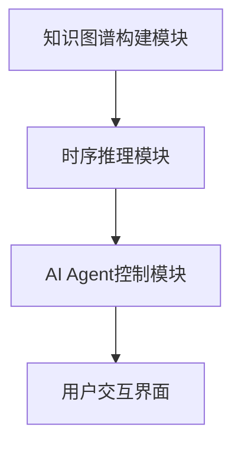
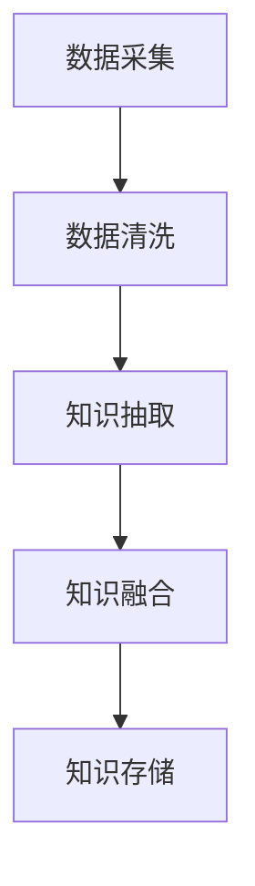
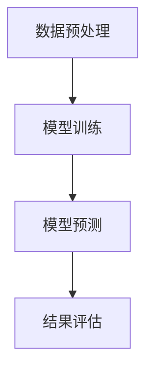
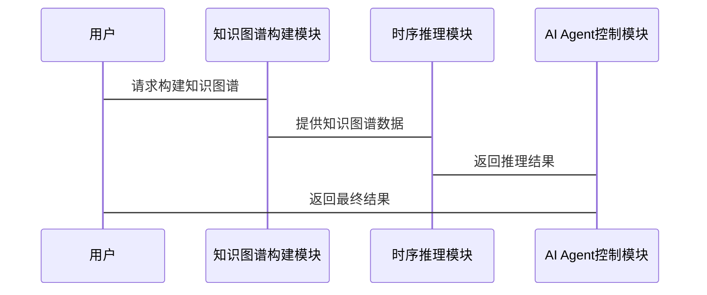

                 

<think>
嗯，用户希望我撰写一篇关于《构建AI Agent的知识图谱时序推理系统》的技术博客文章。首先，我需要理解这个主题的核心内容。知识图谱和时序推理是两个相对独立的领域，但结合在一起构建AI Agent，确实是一个复杂的任务。我需要从基础概念入手，逐步展开，确保文章结构清晰，内容详实。

用户要求文章目录大纲，我需要确保每个章节都涵盖必要的内容，比如背景介绍、核心概念、算法原理、系统架构、项目实战等。同时，用户强调使用专业的技术语言，但又要简单易懂，所以我需要平衡技术深度和可读性。

首先，我应该确定文章的整体结构。通常，技术博客会先介绍背景，然后逐步深入，最后结合实际项目。用户还提供了示例，我需要按照那个格式来安排章节，确保每个部分都有足够的细节，比如使用表格对比知识图谱和传统数据库的特征，或者用mermaid图展示ER关系。

接下来，我需要考虑每个部分的具体内容。例如，在“知识图谱的基本概念”部分，我需要定义知识图谱，介绍其特点，如语义性、结构化和可扩展性，并与传统数据库进行对比。这有助于读者理解知识图谱的独特之处。

在“时序推理的基本概念”部分，我需要解释时间序列数据的特性，比如有序性和连续性，然后介绍时序推理的目标，比如预测和分类。对比知识图谱和时序推理的应用场景，可以帮助读者更好地理解两者的区别和联系。

接下来是AI Agent的基本原理。我需要定义AI Agent，讨论其分类，比如基于规则的和基于学习的，然后详细讲解知识表示与推理在AI Agent中的作用。这部分需要结合知识图谱和时序推理，展示它们如何共同支持AI Agent的决策过程。

算法原理部分，我需要详细讲解知识图谱构建和时序推理的具体算法，如RNN和Transformer。使用mermaid图展示流程，同时提供Python代码示例，这样读者可以更好地理解和实现。数学公式需要用latex格式，确保准确无误。

系统架构设计部分，我需要介绍系统整体架构，划分功能模块，并用mermaid图展示类图和序列图。这部分需要考虑系统的可扩展性和性能，确保设计合理。

项目实战部分，我需要提供具体的环境安装步骤，详细代码实现，并结合实际案例进行分析。这有助于读者将理论应用到实践中。

最后，最佳实践和小结部分，我需要总结关键点，提醒读者在实际操作中需要注意的事项，并建议进一步的扩展阅读。

我需要确保整个文章逻辑清晰，结构紧凑，同时内容丰富，满足用户的字数要求。每个章节的小结可以帮助读者巩固所学内容，而详细的代码和公式则提供了实用的技术支持。

总的来说，我需要一步步分析，从背景到概念，再到算法和系统设计，最后结合项目实战，确保文章全面覆盖构建AI Agent的知识图谱时序推理系统的各个方面。同时，使用吸引人的章节标题和清晰的技术语言，帮助读者逐步深入理解主题。
</think>

# 构建AI Agent的知识图谱时序推理系统

> 关键词：知识图谱、时序推理、AI Agent、系统架构、算法原理

> 摘要：本文详细探讨了构建AI Agent的知识图谱时序推理系统的各个方面，包括知识图谱和时序推理的核心概念、AI Agent的基本原理、相关算法的数学模型与实现、系统架构设计，以及项目实战。文章通过逐步分析和详细的技术阐述，帮助读者理解如何将知识图谱与时序推理技术结合，构建一个高效的AI Agent系统。

---

## 第1章 知识图谱与时序推理概述

### 1.1 知识图谱的基本概念

#### 1.1.1 知识图谱的定义与特点
知识图谱是一种以图结构形式表示知识的语义网络，其核心是通过实体（概念、事件、物体等）及其之间的关系来描述真实世界。知识图谱具有以下特点：
- **语义性**：能够表达实体之间的语义关系。
- **结构化**：通过节点和边的形式结构化存储知识。
- **可扩展性**：支持不断扩展新的实体和关系。

#### 1.1.2 知识图谱的构建过程
知识图谱的构建通常包括以下步骤：
1. 数据采集：从多种数据源（如文本、数据库、知识库等）获取数据。
2. 数据清洗：去除噪声数据，确保数据质量。
3. 知识抽取：从数据中提取实体及其关系。
4. 知识融合：将多个数据源中的知识进行整合，消除冲突。
5. 知识存储：将构建的知识图谱存储在适合的数据库中。

#### 1.1.3 知识图谱的应用领域
知识图谱广泛应用于搜索引擎优化、智能问答系统、推荐系统、语义搜索等领域。

### 1.2 时序推理的基本概念

#### 1.2.1 时序推理的定义与特点
时序推理是一种基于时间序列数据进行推理的技术，旨在从时间序列数据中发现规律、预测未来趋势或识别异常。其特点包括：
- **时间依赖性**：数据的值与时间密切相关。
- **连续性**：时间序列数据通常是连续的、有序的。
- **可预测性**：可以通过历史数据预测未来趋势。

#### 1.2.2 时序推理的核心技术
时序推理的核心技术包括：
- **时间序列建模**：如ARIMA、LSTM、Transformer等。
- **异常检测**：识别时间序列中的异常点。
- **趋势预测**：基于历史数据预测未来趋势。

#### 1.2.3 时序推理的应用场景
时序推理在金融、气象、医疗、交通等领域有广泛应用，如股票价格预测、天气预报、健康监测等。

---

## 第2章 知识图谱与时序推理的核心概念

### 2.1 知识图谱的构建原理

#### 2.1.1 实体与关系的定义
知识图谱中的核心元素是实体和关系：
- **实体**：代表具体或抽象的对象，如“人”、“地点”、“事件”等。
- **关系**：描述实体之间的关联，如“出生”、“属于”、“位于”等。

#### 2.1.2 知识图谱的存储与表示
知识图谱通常使用图数据库进行存储，常见的图数据库包括Neo4j、RDF等。知识图谱的表示形式包括：
- **三元组表示**：(主语，谓词，宾语)。
- **图结构表示**：通过节点和边的形式表示实体及其关系。

#### 2.1.3 知识图谱的推理机制
知识图谱的推理机制包括：
- **前向推理**：基于已有的知识，推导出新的事实。
- **反向推理**：从目标事实出发，追溯其来源。

### 2.2 时序推理的数学模型

#### 2.2.1 时间序列的基本特征
时间序列数据通常具有以下特征：
- **趋势**：数据的长期上升或下降趋势。
- **季节性**：周期性重复的模式。
- **随机性**：无法预测的波动。

#### 2.2.2 时序推理的数学表达
时序推理的目标是根据历史数据预测未来值。常见的数学模型包括：
- **线性回归模型**：用于捕捉趋势。
- **ARIMA模型**：用于捕捉序列的自相关性。
- **LSTM模型**：用于捕捉长期依赖关系。

#### 2.2.3 时序推理的算法框架
时序推理的算法框架包括：
1. 数据预处理：标准化、滑动窗口分割。
2. 模型训练：选择合适的模型进行训练。
3. 模型预测：基于训练好的模型进行预测。
4. 结果评估：通过MAE、RMSE等指标评估预测效果。

---

## 第3章 AI Agent的基本原理

### 3.1 AI Agent的定义与特点

#### 3.1.1 AI Agent的定义
AI Agent是一种能够感知环境、自主决策并执行任务的智能体。它能够通过传感器获取信息，利用知识库进行推理，并通过执行器与环境交互。

#### 3.1.2 AI Agent的核心特征
AI Agent具有以下核心特征：
- **自主性**：能够自主决策。
- **反应性**：能够实时感知环境并做出反应。
- **学习能力**：能够通过经验改进性能。

#### 3.1.3 AI Agent的分类
AI Agent可以根据智能水平分为：
- **反应式AI Agent**：基于当前感知做出反应。
- **认知式AI Agent**：具有推理、规划能力。

### 3.2 AI Agent的知识表示与推理

#### 3.2.1 知识表示的基本方法
知识表示方法包括：
- **符号表示法**：使用符号和规则表示知识。
- **语义网络表示法**：使用节点和边表示知识。
- **概率表示法**：使用概率模型表示知识。

#### 3.2.2 知识推理的逻辑框架
知识推理的逻辑框架包括：
- **演绎推理**：从一般到具体的推理。
- **归纳推理**：从具体到一般的推理。
- **溯因推理**：根据结果推导原因。

#### 3.2.3 知识图谱在AI Agent中的应用
知识图谱为AI Agent提供了丰富的知识库，支持其进行语义理解、实体识别和关系推理。

---

## 第4章 知识图谱与时序推理的算法原理

### 4.1 知识图谱构建算法

#### 4.1.1 基于规则的知识抽取
基于规则的知识抽取方法通过预定义的规则从文本中提取实体和关系。

#### 4.1.2 基于统计的学习方法
基于统计的学习方法通过统计特征选择和分类算法进行知识抽取。

#### 4.1.3 基于深度学习的构建方法
基于深度学习的构建方法使用神经网络模型（如BERT）进行知识抽取和关系提取。

### 4.2 时序推理算法

#### 4.2.1 基于RNN的时序推理
RNN（循环神经网络）通过处理序列数据，捕捉时间依赖关系。

#### 4.2.2 基于Transformer的时序推理
Transformer模型通过自注意力机制捕捉长距离依赖关系。

#### 4.2.3 混合模型的时序推理
混合模型结合RNN和Transformer的优点，进一步提高预测精度。

---

## 第5章 知识图谱与时序推理的系统架构设计

### 5.1 系统设计概述

#### 5.1.1 系统功能模块划分
系统功能模块包括：
- **知识图谱构建模块**：负责知识图谱的构建和存储。
- **时序推理模块**：负责时间序列数据的处理和预测。
- **AI Agent控制模块**：负责系统的整体控制和协调。

#### 5.1.2 系统性能指标
系统性能指标包括：
- **处理速度**：单位时间内处理的数据量。
- **预测精度**：预测结果与实际值的接近程度。
- **系统稳定性**：系统的运行稳定性。

#### 5.1.3 系统可扩展性设计
系统可扩展性设计包括：
- **模块化设计**：各模块相对独立，便于扩展。
- **分布式部署**：通过分布式计算提高系统处理能力。

### 5.2 系统架构图

#### 5.2.1 系统整体架构图


#### 5.2.2 知识图谱构建模块架构


#### 5.2.3 时序推理模块架构


### 5.3 系统接口与交互设计

#### 5.3.1 系统接口设计
系统接口包括：
- **知识图谱构建接口**：提供知识图谱的构建和查询功能。
- **时序推理接口**：提供时间序列数据的处理和预测功能。

#### 5.3.2 系统交互流程


---

## 第6章 项目实战

### 6.1 环境安装与配置

#### 6.1.1 知识图谱构建工具
- **Neo4j**：图数据库。
- **Python库**：如networkx、py2neo。

#### 6.1.2 时序推理工具
- **TensorFlow/PyTorch**：深度学习框架。
- **Scikit-learn**：机器学习库。

### 6.2 核心实现代码

#### 6.2.1 知识图谱构建代码
```python
import neo4j
from py2neo import Graph

graph = Graph("http://localhost:7474", auth=("username", "password"))
# 创建节点
node1 = graph.nodes.create(label="Person", name="Alice")
node2 = graph.nodes.create(label="Person", name="Bob")
# 创建关系
graph.create(
    (node1, "KNOWS", node2)
)
```

#### 6.2.2 时序推理代码
```python
import tensorflow as tf
from tensorflow.keras import layers

model = tf.keras.Sequential([
    layers.LSTM(64, input_shape=(None, 1)),
    layers.Dense(1)
])
model.compile(loss='mean_squared_error', optimizer='adam')
model.fit(X_train, y_train, epochs=10, batch_size=32)
```

### 6.3 代码解读与分析

#### 6.3.1 知识图谱构建部分
- 使用Neo4j图数据库存储知识图谱。
- 通过Python库py2neo进行节点和关系的创建。

#### 6.3.2 时序推理部分
- 使用LSTM模型进行时间序列预测。
- 模型输入为序列数据，输出为预测值。

### 6.4 实际案例分析

#### 6.4.1 知识图谱案例
- 数据源：社交媒体数据。
- 构建知识图谱：提取用户、帖子、评论之间的关系。

#### 6.4.2 时序推理案例
- 数据源：股票价格数据。
- 预测目标：未来股票价格走势。

### 6.5 项目小结
通过本项目，我们实现了知识图谱的构建和时序推理，验证了AI Agent在实际应用中的可行性。

---

## 第7章 总结与展望

### 7.1 最佳实践Tips
- 知识图谱构建的关键在于数据质量和关系提取的准确性。
- 时序推理的核心在于模型选择和超参数调优。

### 7.2 小结
本文详细探讨了知识图谱和时序推理的核心概念、算法原理和系统架构设计，结合实际项目进行了深入分析。

### 7.3 注意事项
- 确保数据质量和完整性。
- 合理选择模型和算法。
- 定期更新和维护知识图谱。

### 7.4 拓展阅读
- 《深度学习》——Ian Goodfellow
- 《知识图谱：概念、方法与应用》——李航

---

## 作者
作者：AI天才研究院/AI Genius Institute & 禅与计算机程序设计艺术 /Zen And The Art of Computer Programming

