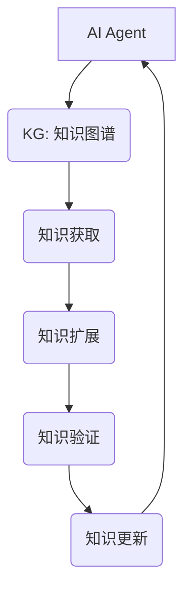
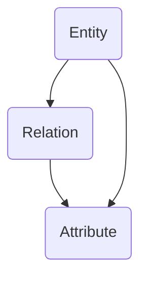
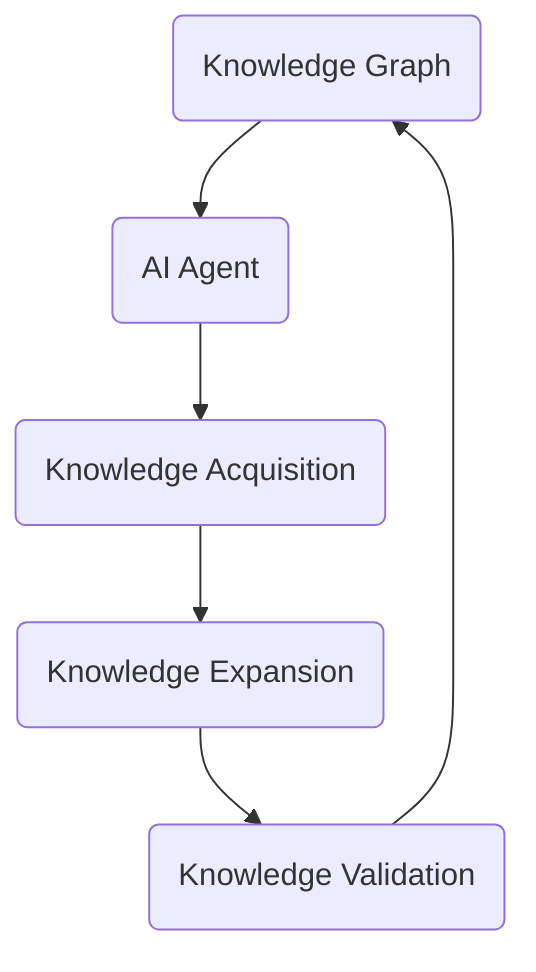
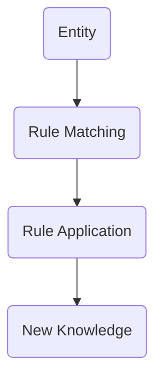
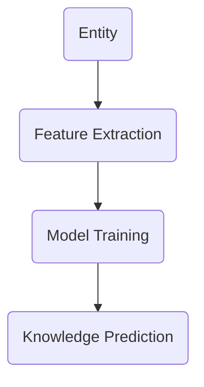
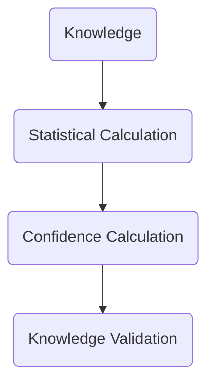
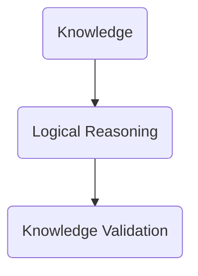
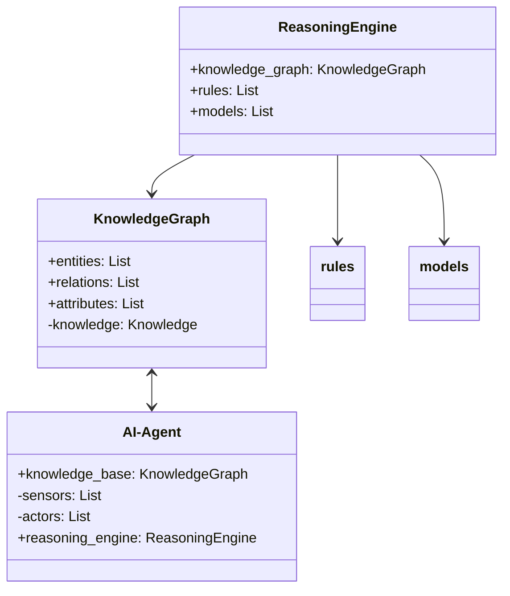
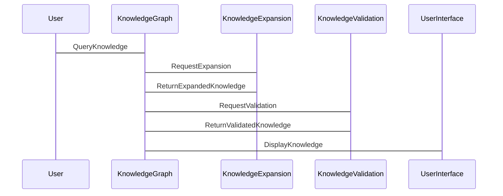

                 


# 《构建AI Agent的知识图谱自动扩展与验证框架》

> 关键词：AI Agent, 知识图谱, 自动扩展, 验证框架, 知识推理, 系统架构, 机器学习

> 摘要：本文详细探讨了构建AI Agent的知识图谱自动扩展与验证框架的关键技术。首先，介绍了知识图谱与AI Agent的核心概念及其关系。接着，深入分析了知识图谱自动扩展的算法原理，包括基于规则和基于机器学习的扩展方法。随后，详细阐述了知识图谱验证的策略与算法，包括基于统计和基于逻辑推理的验证方法。最后，结合实际案例，展示了如何设计和实现一个完整的知识图谱扩展与验证系统，并提供了系统的架构设计、接口设计和交互流程图。本文旨在为AI Agent的知识图谱构建提供理论基础和实践指导。

---

## # 第一部分: 知识图谱与AI Agent的背景介绍

### ## 第1章: 问题背景与核心概念

#### ### 1.1 问题背景
知识图谱（Knowledge Graph）作为一种结构化的数据表示方式，近年来在人工智能领域得到了广泛应用。它通过实体（Entity）、关系（Relation）和属性（Attribute）的组织，能够有效地表示和推理复杂知识。然而，知识图谱的构建和维护是一个动态且复杂的过程，尤其在AI Agent的应用场景下，知识图谱需要实时扩展和验证以满足Agent的动态知识需求。

AI Agent（智能体）是一种能够感知环境、自主决策并执行任务的智能系统。它依赖于知识图谱提供的知识来进行推理、规划和决策。然而，现有的知识图谱构建方法往往依赖于人工标注或静态数据，难以满足AI Agent对实时、动态知识的需求。因此，构建一个能够自动扩展和验证的知识图谱框架，是实现高效AI Agent的关键。

#### ### 1.2 问题描述
知识图谱的构建和维护存在以下主要问题：
1. **知识覆盖不足**：现有的知识图谱通常基于静态数据构建，难以覆盖动态变化的知识。
2. **知识更新困难**：知识图谱的更新需要人工干预，难以满足AI Agent对实时知识的需求。
3. **知识准确性问题**：知识图谱的扩展和更新可能引入错误或不一致的知识，影响AI Agent的决策能力。

AI Agent的知识需求具有动态性、实时性和准确性要求高的特点，传统的知识图谱构建方法难以满足这些需求。因此，如何构建一个能够自动扩展和验证的知识图谱框架，是当前研究的热点问题。

#### ### 1.3 问题解决
本文提出了一种基于规则和机器学习的双重机制的知识图谱自动扩展方法，并结合基于统计和逻辑推理的验证方法，构建了一个完整的知识图谱自动扩展与验证框架。该框架能够动态地扩展知识图谱，并确保知识的准确性和一致性，从而满足AI Agent的知识需求。

#### ### 1.4 边界与外延
本文研究的知识图谱自动扩展与验证框架主要针对AI Agent的知识需求，其边界包括：
1. 知识图谱的实体、关系和属性的扩展与验证。
2. AI Agent的知识获取和应用范围。
3. 知识图谱扩展与验证的动态性和实时性要求。

#### ### 1.5 核心要素与概念结构
知识图谱的核心要素包括：
- **实体（Entity）**：知识图谱中的基本单元，表示具体事物或概念。
- **关系（Relation）**：实体之间的关联，描述实体之间的联系。
- **属性（Attribute）**：实体的特征或描述，通常以键值对的形式存在。

AI Agent的核心能力包括：
- **感知能力**：感知环境并获取知识的能力。
- **推理能力**：基于知识图谱进行逻辑推理的能力。
- **执行能力**：根据推理结果执行任务的能力。

知识图谱与AI Agent的关系可以用以下表格描述：

| 核心要素 | 知识图谱 | AI Agent |
|----------|----------|----------|
| 实体      | 表示具体事物 | 作为知识基础 |
| 关系      | 描述实体间联系 | 用于推理和决策 |
| 属性      | 描述实体特征 | 用于细化知识 |

知识图谱与AI Agent的交互流程可以用以下Mermaid流程图表示：



---

## # 第二部分: 核心概念与联系

### ## 第2章: 知识图谱与AI Agent的核心概念

#### ### 2.1 知识图谱的定义与属性
知识图谱是一种以结构化形式表示知识的数据模型，通常以图的形式组织实体、关系和属性。其主要属性包括：
- **实体**：具体事物或概念的表示。
- **关系**：实体之间的联系，通常具有方向性和权重。
- **属性**：实体的特征或描述，通常以键值对的形式存在。

知识图谱的结构可以用以下Mermaid图表示：



#### ### 2.2 AI Agent的定义与属性
AI Agent是一种能够感知环境、自主决策并执行任务的智能系统。其主要属性包括：
- **感知能力**：获取环境信息的能力。
- **推理能力**：基于知识进行逻辑推理的能力。
- **执行能力**：根据推理结果执行任务的能力。

AI Agent的知识需求可以用以下表格描述：

| 知识类型 | 描述 |
|----------|------|
| 实体知识 | 知识图谱中的实体信息 |
| 关系知识 | 实体之间的关系信息 |
| 属性知识 | 实体的特征描述 |

#### ### 2.3 知识图谱与AI Agent的关系
知识图谱与AI Agent的关系可以用以下Mermaid图表示：



---

## # 第三部分: 知识图谱自动扩展算法原理

### ## 第3章: 知识图谱扩展算法

#### ### 3.1 基于规则的扩展算法
基于规则的扩展算法是一种通过预定义规则来自动扩展知识图谱的方法。其核心步骤包括：
1. **规则定义**：定义知识扩展的规则，例如“如果A是B的子类，则A具有B的所有属性”。
2. **规则匹配**：在知识图谱中匹配符合条件的实体。
3. **知识扩展**：根据匹配结果扩展新的知识。

基于规则的扩展算法可以用以下Mermaid图表示：



以下是一个简单的基于规则的扩展算法的Python代码示例：

```python
def expand_knowledge(kg, rules):
    new_kg = kg.copy()
    for rule in rules:
        for entity in kg.entities:
            if rule.matches(entity):
                new_kg.add_attribute(rule.apply(entity))
    return new_kg
```

#### ### 3.2 基于机器学习的扩展算法
基于机器学习的扩展算法是一种通过训练模型来自动发现新的知识的方法。其核心步骤包括：
1. **特征提取**：从知识图谱中提取特征向量。
2. **模型训练**：训练分类器或回归器。
3. **知识预测**：根据模型预测新的知识。

基于机器学习的扩展算法可以用以下Mermaid图表示：



以下是一个简单的基于机器学习的扩展算法的Python代码示例：

```python
from sklearn.feature_extraction.text import TfidfVectorizer
from sklearn.svm import SVC

def train_classifier(X_train, y_train):
    vectorizer = TfidfVectorizer()
    X_train_vec = vectorizer.fit_transform(X_train)
    clf = SVC()
    clf.fit(X_train_vec, y_train)
    return clf, vectorizer

def predict_knowledge(clf, vectorizer, X_test):
    X_test_vec = vectorizer.transform(X_test)
    y_pred = clf.predict(X_test_vec)
    return y_pred
```

---

## # 第四部分: 知识图谱验证算法

### ## 第4章: 知识图谱验证算法

#### ### 4.1 基于统计的验证算法
基于统计的验证算法是一种通过统计方法来验证知识图谱中知识的准确性。其核心步骤包括：
1. **知识抽取**：从知识图谱中抽取待验证的知识。
2. **统计计算**：计算知识的置信度或概率。
3. **知识验证**：根据置信度判断知识的准确性。

基于统计的验证算法可以用以下Mermaid图表示：



以下是一个简单的基于统计的验证算法的Python代码示例：

```python
def calculate_confidence(kg, entity):
    count = 0
    for relation in kg.relations:
        if relation.source == entity and relation.confidence > 0.5:
            count += 1
    return count / len(kg.relations)
```

#### ### 4.2 基于逻辑推理的验证算法
基于逻辑推理的验证算法是一种通过逻辑推理来验证知识图谱中知识的准确性。其核心步骤包括：
1. **知识抽取**：从知识图谱中抽取待验证的知识。
2. **逻辑推理**：根据知识图谱中的逻辑规则进行推理。
3. **知识验证**：根据推理结果判断知识的准确性。

基于逻辑推理的验证算法可以用以下Mermaid图表示：



以下是一个简单的基于逻辑推理的验证算法的Python代码示例：

```python
from logicnetworks import LogicNetwork

def validate_knowledge(kg, logic_network):
    valid = True
    for relation in kg.relations:
        if not logic_network.check_relation(relation):
            valid = False
            break
    return valid
```

---

## # 第五部分: 系统分析与架构设计

### ## 第5章: 问题场景与系统介绍

#### ### 5.1 问题场景
本文构建的知识图谱自动扩展与验证框架的目标是为AI Agent提供动态、实时的知识支持。主要解决以下问题：
1. 知识图谱的自动扩展问题。
2. 知识图谱的验证与准确性问题。
3. 知识图谱与AI Agent的交互问题。

#### ### 5.2 系统介绍
本文设计的系统包括以下功能模块：
- **知识图谱管理模块**：负责知识图谱的存储、查询和更新。
- **知识扩展模块**：基于规则和机器学习的双重机制进行知识扩展。
- **知识验证模块**：基于统计和逻辑推理的双重机制进行知识验证。
- **用户界面模块**：提供友好的用户界面，方便用户与系统交互。

---

### ## 第6章: 系统功能设计

#### ### 6.1 领域模型设计
知识图谱与AI Agent的交互流程可以用以下Mermaid类图表示：



#### ### 6.2 系统架构设计
本文设计的系统架构可以用以下Mermaid架构图表示：

```mermaid
rectangle Database {
    KnowledgeGraph
}
rectangle KnowledgeExpansion {
    RuleBasedExpansion
    MLBasedExpansion
}
rectangle KnowledgeValidation {
    StatisticalValidation
    LogicalReasoning
}
rectangle UserInterface {
    Query
    Update
    Display
}
Database -- KnowledgeExpansion
Database -- KnowledgeValidation
KnowledgeExpansion -- UserInterface
KnowledgeValidation -- UserInterface
```

#### ### 6.3 接口设计与交互流程
系统的接口设计可以用以下Mermaid序列图表示：



---

## # 第六部分: 项目实战

### ## 第7章: 环境安装与系统实现

#### ### 7.1 环境安装
本文的实现基于Python 3.8及以上版本，并需要安装以下依赖库：
- `networkx`：用于知识图谱的表示和操作。
- `scikit-learn`：用于机器学习算法的实现。
- `mermaid`：用于绘制流程图和类图。

安装命令如下：
```bash
pip install networkx scikit-learn mermaid
```

#### ### 7.2 系统核心实现
以下是知识图谱自动扩展与验证框架的核心代码实现：

```python
import networkx as nx
from sklearn.feature_extraction.text import TfidfVectorizer
from sklearn.svm import SVC

class KnowledgeGraph:
    def __init__(self):
        self.graph = nx.Graph()
        self.entities = []
        self.relations = []
        self.attributes = []

    def add_entity(self, entity):
        self.entities.append(entity)
        self.graph.add_node(entity)

    def add_relation(self, relation):
        self.relations.append(relation)
        self.graph.add_edge(relation.source, relation.target)

class RuleBasedExpansion:
    def matches(self, entity, rule):
        # 实现具体的匹配逻辑
        pass

    def apply(self, entity, rule):
        # 实现具体的扩展逻辑
        pass

class MLBasedExpansion:
    def train(self, X_train, y_train):
        vectorizer = TfidfVectorizer()
        X_train_vec = vectorizer.fit_transform(X_train)
        self clf = SVC()
        self.clf.fit(X_train_vec, y_train)
        self.vectorizer = vectorizer

    def predict(self, X_test):
        X_test_vec = self.vectorizer.transform(X_test)
        y_pred = self.clf.predict(X_test_vec)
        return y_pred

class StatisticalValidation:
    def calculate_confidence(self, kg, entity):
        count = 0
        for relation in kg.relations:
            if relation.source == entity and relation.confidence > 0.5:
                count += 1
        return count / len(kg.relations)

class LogicalReasoning:
    def check_relation(self, relation, kg):
        # 实现具体的逻辑推理逻辑
        pass

# 示例代码
kg = KnowledgeGraph()
kg.add_entity("A")
kg.add_entity("B")
kg.add_relation(Relation("A", "B", "related"))

rule_based_expansion = RuleBasedExpansion()
ml_based_expansion = MLBasedExpansion()
statistical_validation = StatisticalValidation()
logical_reasoning = LogicalReasoning()

# 知识扩展
rule_based_expansion.apply("A", rule1)
ml_based_expansion.train(X_train, y_train)
ml_based_expansion.predict(X_test)

# 知识验证
confidence = statistical_validation.calculate_confidence(kg, "A")
logical_reasoning.check_relation(relation1, kg)
```

---

## # 第七部分: 最佳实践与小结

### ## 第8章: 小结与注意事项

#### ### 8.1 小结
本文提出了一种基于规则和机器学习的双重机制的知识图谱自动扩展与验证框架。该框架能够动态地扩展知识图谱，并通过统计和逻辑推理的方法验证知识的准确性，从而满足AI Agent的知识需求。

#### ### 8.2 注意事项
1. **数据质量**：知识图谱的扩展和验证依赖于高质量的数据，数据的噪声可能会影响结果。
2. **规则设计**：基于规则的扩展方法需要设计合理的规则，否则可能导致错误的扩展。
3. **模型选择**：基于机器学习的扩展方法需要选择合适的模型和特征，以提高扩展的准确性。
4. **计算效率**：知识图谱的扩展和验证可能需要大量的计算资源，需要注意计算效率。

#### ### 8.3 拓展阅读
- 知识图谱相关书籍：《Knowledge Graph: Concepts, Methods and Applications》
- 机器学习相关书籍：《Hands-On Machine Learning with Scikit-Learn, Keras, and TensorFlow》

---

## # 第八部分: 作者信息

作者：AI天才研究院/AI Genius Institute & 禅与计算机程序设计艺术 /Zen And The Art of Computer Programming

