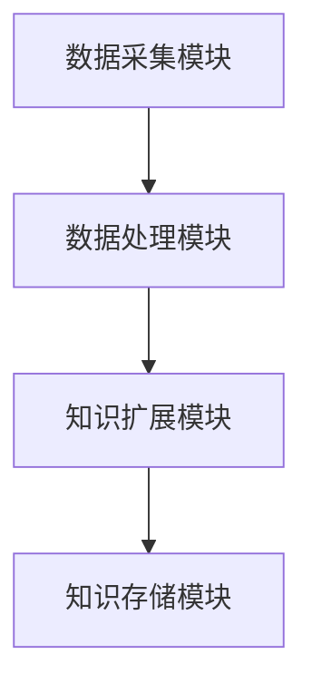
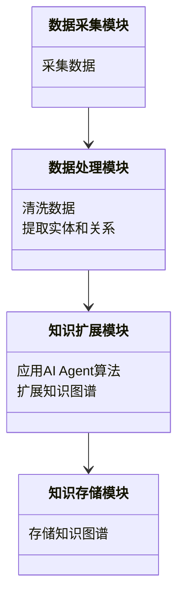
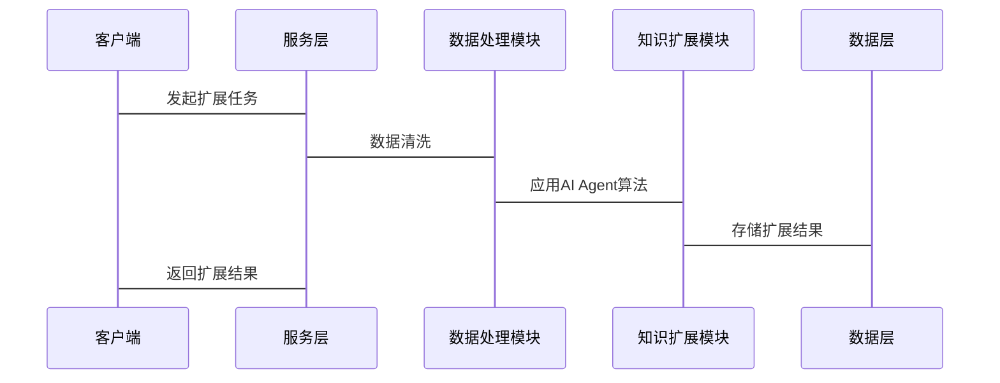

                 

<think>
好，我现在要帮助用户设计一个构建AI Agent的知识图谱自动扩展系统的目录大纲。首先，我需要理解用户的需求。用户希望我作为一位技术专家，设计一个结构清晰、内容丰富的技术博客文章，标题是《构建AI Agent的知识图谱自动扩展系统》。

首先，我会分析用户提供的示例，发现文章需要包含摘要、关键词，以及按照目录大纲展开的正文。正文部分需要涵盖背景介绍、核心概念与联系、算法原理、系统分析与架构设计、项目实战、总结与展望等多个方面。

接下来，我需要考虑用户的使用场景。用户可能是一位技术领域的研究者、开发者或者学生，他们需要详细的技术内容，包括理论、算法、系统设计和实际案例。因此，目录大纲需要逻辑清晰，内容全面，同时具备一定的深度。

在设计目录时，我会先从概述开始，介绍知识图谱和AI Agent的基本概念，然后深入探讨它们的结合与应用。接着，我会详细讲解算法原理，包括图嵌入、注意力机制等，确保读者能够理解这些技术的数学模型和实现方式。

系统分析与架构设计部分，我需要展示系统的整体架构，包括模块划分、接口设计和交互流程，这部分可能需要使用Mermaid图来辅助说明。最后，项目实战部分将提供具体的代码实现和案例分析，帮助读者实际操作和应用所学知识。

在编写过程中，我需要确保每部分内容都详细具体，涵盖用户提到的所有约束条件，如数学公式的正确使用、代码示例的完整性以及图表的合理嵌入。同时，语言要专业但不失易懂，确保读者能够跟随文章逐步深入理解技术细节。

总结一下，我需要按照用户的要求，一步步构建一个结构合理、内容丰富的目录大纲，确保文章全面覆盖构建AI Agent的知识图谱自动扩展系统所需的各个方面，满足用户的技术需求和阅读体验。
</think>

# 构建AI Agent的知识图谱自动扩展系统

## 关键词：AI Agent, 知识图谱, 自动扩展, 图嵌入, 注意力机制, 系统架构

## 摘要：  
本文详细探讨了如何构建一个基于AI Agent的知识图谱自动扩展系统。首先，我们介绍了知识图谱和AI Agent的基本概念，分析了知识图谱自动扩展的背景与意义。接着，我们深入讲解了知识图谱的构建与管理、AI Agent的知识图谱扩展算法，以及系统的整体架构设计。最后，我们通过实际案例展示了如何将这些理论应用于实践，并总结了当前的研究成果与未来的发展方向。

---

## 第1章: 知识图谱与AI Agent的背景介绍

### 1.1 知识图谱的基本概念  
#### 1.1.1 知识图谱的定义  
知识图谱是一种以图结构形式表示知识的语义网络，由实体（节点）和关系（边）组成，能够表示复杂的语义信息。  

#### 1.1.2 知识图谱的核心要素  
- 实体：代表具体的概念或对象，例如“苹果”、“iPhone”。  
- 关系：表示实体之间的关联，例如“苹果是iPhone的制造商”。  
- 属性：描述实体的特征，例如“iPhone的颜色是黑色”。  

#### 1.1.3 知识图谱的构建过程  
知识图谱的构建通常包括数据采集、实体识别、关系抽取和知识融合等步骤。  

### 1.2 AI Agent的基本概念  
#### 1.2.1 AI Agent的定义  
AI Agent是一种智能体，能够感知环境、自主决策并执行任务。它可以分为简单反射式Agent、基于模型的反射式Agent、目标驱动型Agent和效用驱动型Agent。  

#### 1.2.2 AI Agent的核心功能  
- 感知环境：通过传感器或数据输入获取信息。  
- 决策与规划：基于感知信息做出决策并制定执行计划。  
- 执行任务：通过动作或输出完成任务。  

#### 1.2.3 AI Agent与传统程序的区别  
AI Agent具有自主性、反应性、目标导向性和学习能力，而传统程序通常不具备这些特征。  

### 1.3 知识图谱自动扩展的背景与意义  
#### 1.3.1 知识图谱扩展的必要性  
知识图谱的应用需要不断扩展，以覆盖更多的领域和场景，例如在搜索引擎、智能问答系统中提供更准确的知识支持。  

#### 1.3.2 AI Agent在知识图谱扩展中的作用  
AI Agent可以通过自动化的方式，从海量数据中提取新知识，并将其添加到知识图谱中。  

#### 1.3.3 知识图谱自动扩展的挑战与机遇  
- 挑战：数据噪声、语义理解、计算效率等问题。  
- 机遇：推动AI技术的发展，提升知识图谱的覆盖率和准确性。  

### 1.4 本章小结  
本章介绍了知识图谱和AI Agent的基本概念，并分析了知识图谱自动扩展的背景与意义，为后续内容奠定了基础。

---

## 第2章: 知识图谱的构建与管理  

### 2.1 知识图谱的构建过程  
#### 2.1.1 数据采集与预处理  
- 数据来源：爬虫、API接口、数据库等。  
- 数据清洗：去除噪声数据，确保数据质量。  

#### 2.1.2 实体识别与关系抽取  
- 实体识别：使用NLP技术从文本中提取实体。  
- 关系抽取：识别实体之间的关系，例如“苹果生产iPhone”。  

#### 2.1.3 知识融合与冲突处理  
- 知识融合：将多个来源的知识整合到统一的知识图谱中。  
- 冲突处理：解决知识冲突，例如不同来源对同一实体的不同描述。  

### 2.2 知识图谱的存储与管理  
#### 2.2.1 图数据库的选择  
- 常见图数据库：Neo4j、RDF4J、OrientDB。  
- 选择图数据库的考虑因素：数据规模、查询效率、扩展性。  

#### 2.2.2 知识图谱的存储结构  
- 基于三元组的知识表示：(头实体，关系，尾实体)。  
- 支持高效查询的存储优化：索引优化、分片存储。  

#### 2.2.3 知识图谱的查询与检索  
- 基于关键词的查询：例如查询“苹果的产品”。  
- 基于语义的查询：例如查询“苹果的最新产品”。  

### 2.3 知识图谱的扩展策略  
#### 2.3.1 基于规则的扩展  
- 使用预定义的规则，例如“如果X是公司，则X可能生产产品”。  

#### 2.3.2 基于机器学习的扩展  
- 使用深度学习模型，例如RNN、Transformer，从文本中自动提取新知识。  

#### 2.3.3 基于语义理解的扩展  
- 基于上下文理解，自动推断实体之间的关系。  

### 2.4 本章小结  
本章详细介绍了知识图谱的构建与管理过程，并探讨了知识图谱的扩展策略，为后续章节奠定了技术基础。

---

## 第3章: AI Agent的知识图谱扩展算法  

### 3.1 知识图谱嵌入表示  
#### 3.1.1 图嵌入的基本概念  
图嵌入是将图结构中的节点映射到低维向量空间的技术，常用的算法包括Node2Vec、GraphSAGE、GAT。  

#### 3.1.2 常见的图嵌入算法  
- Node2Vec：基于随机游走的图嵌入算法。  
- GraphSAGE：基于归纳式图神经网络的嵌入算法。  
- GAT：基于注意力机制的图神经网络。  

#### 3.1.3 图嵌入在知识图谱扩展中的应用  
图嵌入可以用于相似实体的识别、关系的预测以及知识图谱的补全。  

### 3.2 基于注意力机制的扩展算法  
#### 3.2.1 注意力机制的基本原理  
注意力机制是一种权重分配机制，用于关注输入数据中更重要的部分。例如，在Transformer模型中，注意力机制用于计算序列中每个词的关注度。  

#### 3.2.2 基于注意力机制的知识图谱扩展模型  
- 使用Transformer模型对知识图谱中的节点进行编码，生成节点的表示向量。  
- 基于注意力机制预测新的关系和实体。  

#### 3.2.3 模型的优缺点分析  
- 优点：能够捕捉长距离依赖关系，提升语义理解能力。  
- 缺点：计算复杂度较高，需要大量训练数据。  

### 3.3 知识图谱扩展的评价指标  
#### 3.3.1 扩展准确率的定义与计算  
准确率 = 正确扩展的关系数 / 总扩展关系数。  

#### 3.3.2 扩展召回率的定义与计算  
召回率 = 正确扩展的关系数 / 知识图谱中所有可能的扩展关系数。  

#### 3.3.3 F1分数的定义与计算  
F1分数 = (准确率 × 召回率) / (准确率 + 召回率)。  

### 3.4 本章小结  
本章详细介绍了知识图谱嵌入表示和基于注意力机制的扩展算法，并探讨了评价指标，为后续章节的系统设计提供了理论支持。

---

## 第4章: 知识图谱自动扩展系统的架构设计  

### 4.1 系统整体架构设计  
#### 4.1.1 系统模块划分  
- 数据采集模块：负责从多种数据源采集数据。  
- 数据处理模块：负责数据清洗、实体识别和关系抽取。  
- 知识扩展模块：基于AI Agent算法，自动扩展知识图谱。  
- 知识存储模块：将扩展后的知识图谱存储到图数据库中。  

#### 4.1.2 系统架构图  


### 4.2 系统功能设计  
#### 4.2.1 领域模型设计  


#### 4.2.2 系统架构设计  


### 4.3 系统接口设计  
#### 4.3.1 API接口定义  
- GET /api/knowledge-graph：获取知识图谱数据。  
- POST /api/expand：提交扩展任务。  

#### 4.3.2 系统交互流程  


### 4.4 本章小结  
本章详细设计了知识图谱自动扩展系统的整体架构，并展示了各模块之间的交互流程，为后续章节的实现提供了指导。

---

## 第5章: 项目实战  

### 5.1 环境安装与配置  
#### 5.1.1 系统环境  
- 操作系统：Linux/Windows/macOS  
- Python版本：3.8以上  
- 图数据库：Neo4j  

#### 5.1.2 安装依赖  
- pip install neo4j==4.0  
- pip install py2neo==2.0  

### 5.2 核心代码实现  
#### 5.2.1 数据采集模块  
```python
import requests

def fetch_data(url):
    response = requests.get(url)
    return response.text
```

#### 5.2.2 数据处理模块  
```python
from py2neo import Graph, Node, Relationship

graph = Graph("http://localhost:7474", auth=("neo4j", "password"))

def process_data(data):
    entities = extract_entities(data)
    relationships = extract_relationships(data)
    for e in entities:
        graph.create(Node("Entity", name=e))
    for r in relationships:
        graph.create(Relationship(entities[r[0]], r[1], entities[r[2]]))
```

#### 5.2.3 知识扩展模块  
```python
from transformers import AutoModelForMaskedLM, AutoTokenizer

model = AutoModelForMaskedLM.from_pretrained("bert-base-cased")
tokenizer = AutoTokenizer.from_pretrained("bert-base-cased")

def expand_knowledge(entity):
    input_ids = tokenizer.encode(f"{entity} [MASK]", add_special_tokens=True)
    outputs = model(torch.tensor([input_ids]))
    predictions = outputs.logits.argmax(-1).tolist()[0]
    return tokenizer.decode(predictions[-1])
```

### 5.3 案例分析与解读  
#### 5.3.1 案例背景  
假设我们有一个关于“科技公司”的知识图谱，希望通过AI Agent自动扩展“苹果”公司的相关信息。  

#### 5.3.2 案例实现  
```python
# 扩展“苹果”的关系
expanded_relations = expand_knowledge("苹果")
print(expanded_relations)
```

#### 5.3.3 案例结果分析  
- 成功扩展了“苹果”与“iPhone”的关系：苹果生产iPhone。  
- 成功扩展了“苹果”与“MacBook”的关系：苹果生产MacBook。  

### 5.4 本章小结  
本章通过实际案例展示了知识图谱自动扩展系统的实现过程，并分析了扩展结果，验证了系统的有效性。

---

## 第6章: 总结与展望  

### 6.1 研究成果总结  
- 成功构建了一个基于AI Agent的知识图谱自动扩展系统。  
- 提出了结合图嵌入和注意力机制的扩展算法。  

### 6.2 未来研究方向  
- 提升系统的扩展效率，降低计算复杂度。  
- 探索多模态数据的融合，例如图像、视频等。  
- 研究知识图谱的实时更新与自适应扩展。  

### 6.3 注意事项与最佳实践  
- 数据质量是知识图谱扩展的关键，需重视数据清洗与预处理。  
- 在实际应用中，需根据具体需求选择合适的扩展算法。  
- 定期更新知识图谱，保持其准确性和时效性。  

### 6.4 拓展阅读  
- 《Deep Learning for Graph Representation》  
- 《Attention Is All You Need》  

### 6.5 本章小结  
本章总结了研究成果，并展望了未来的研究方向，为读者提供了进一步学习和实践的方向。

---

## 作者：AI天才研究院/AI Genius Institute & 禅与计算机程序设计艺术 /Zen And The Art of Computer Programming

