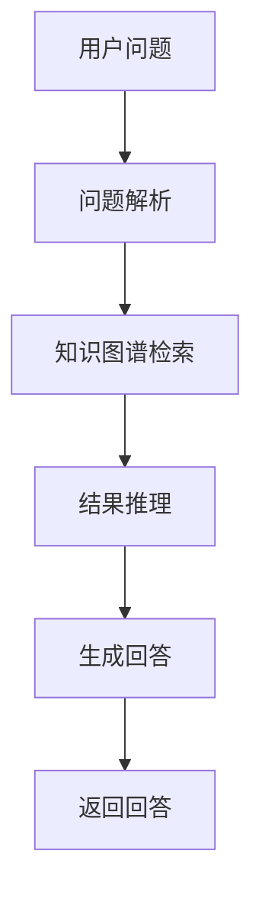
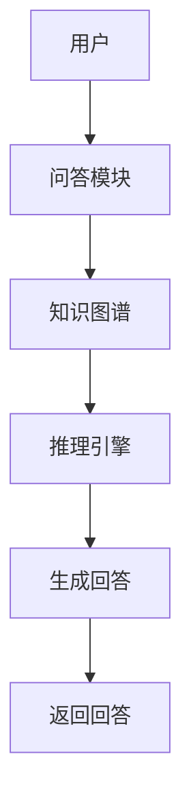

                 


# 《构建AI Agent的知识图谱问答系统》

---

## 关键词：AI Agent, 知识图谱, 问答系统, 大模型, 对话系统

---

## 摘要：

本文系统地介绍了如何构建一个基于知识图谱的问答系统，并将其集成到AI Agent中，实现智能化的问答交互。文章首先从背景和意义出发，详细探讨了知识图谱的基本概念、构建方法以及问答系统的核心原理。接着，深入分析了AI Agent的设计与实现，包括其核心模块的构建和算法原理。最后，通过具体项目实战，展示了如何将理论应用于实践，并总结了最佳实践和未来的发展方向。

---

## 目录

### 第一部分：引言

### 第2章：知识图谱的基本概念与构建方法

### 第3章：问答系统的基本原理

### 第4章：AI Agent的设计与实现

### 第5章：知识图谱问答系统的算法与实现

### 第6章：AI Agent的知识图谱问答系统架构设计

### 第7章：项目实战：构建一个简单的知识图谱问答系统

### 第8章：小结与展望

### 附录

---

## 第一部分：引言

### 第1章：知识图谱问答系统概述

#### 1.1 知识图谱问答系统的背景与意义

- **问题背景**：随着大数据和人工智能技术的快速发展，问答系统逐渐从简单的关键词匹配向基于知识图谱的智能问答方向演进。
- **问题描述**：传统的问答系统难以处理复杂语义和多轮对话，而知识图谱提供了丰富的语义信息，能够提升问答的准确性和智能性。
- **问题解决**：通过构建知识图谱，结合大模型技术，实现更智能、更自然的问答交互。
- **边界与外延**：知识图谱问答系统的边界在于其知识的覆盖范围和问答能力的深度，外延则涉及多模态数据和跨语言支持。
- **概念结构与核心要素组成**：知识图谱问答系统由知识图谱、问答模型、对话管理模块和推理引擎组成。

#### 1.2 AI Agent与知识图谱问答系统的联系

- **AI Agent的基本概念**：AI Agent是一种能够感知环境、执行任务的智能实体，能够理解用户的意图并提供相应的服务。
- **知识图谱问答系统的定义**：基于知识图谱的问答系统通过语义理解和知识推理，为用户提供准确的知识性回答。
- **两者的结合与应用**：AI Agent通过知识图谱问答系统实现智能对话，广泛应用于客服、医疗咨询、教育等领域。

#### 1.3 本章小结

---

## 第二部分：知识图谱基础

### 第2章：知识图谱的基本概念与构建方法

#### 2.1 知识图谱的基本概念

- **实体与关系的定义**：实体是现实世界中的具体事物，关系描述实体之间的关联。
- **知识图谱的表示方法**：常用RDF（资源描述框架）和图嵌入方法。
- **知识图谱的构建流程**：包括数据收集、预处理、实体识别、关系抽取等步骤。

#### 2.2 知识图谱的构建方法

- **数据收集与预处理**：从结构化数据、文本数据和知识库中获取信息，并进行清洗和标注。
- **实体识别与链接**：通过NLP技术识别实体，并建立实体间的映射关系。
- **关系抽取与构建**：利用模式匹配、句法分析和深度学习方法抽取关系，并构建知识图谱的结构。

#### 2.3 知识图谱的表示与推理

- **知识图谱的表示形式**：包括三元组表示、图嵌入表示和符号逻辑表示。
- **知识图谱的推理方法**：基于规则的推理、基于知识图谱的嵌入推理和基于逻辑的推理。

#### 2.4 本章小结

---

## 第三部分：问答系统基础

### 第3章：问答系统的基本原理

#### 3.1 问答系统的基本概念

- **问答系统的定义**：问答系统是一种能够理解用户问题并提供准确答案的人工智能系统。
- **问答系统的分类**：基于检索的问答系统、基于生成的问答系统和混合型问答系统。

#### 3.2 检索式问答系统

- **检索式问答系统的原理**：通过预处理构建索引，根据用户问题匹配最相关的文档或句子。
- **基于向量的检索方法**：使用向量空间模型（如TF-IDF、Word2Vec）进行相似度计算。

#### 3.3 生成式问答系统

- **基于生成模型的问答系统**：利用生成对抗网络（GAN）或变体自动编码器（VAE）生成回答。
- **大模型在生成式问答中的应用**：如GPT-3、PaLM等大语言模型在问答中的应用。

#### 3.4 本章小结

---

## 第四部分：AI Agent的设计与实现

### 第4章：AI Agent的设计原理

#### 4.1 AI Agent的基本概念

- **AI Agent的定义**：AI Agent是一种能够感知环境、执行任务的智能实体。
- **AI Agent的类型**：简单反射型、基于模型的反应型、目标驱动型和实用驱动型。

#### 4.2 AI Agent的核心模块

- **感知模块**：负责获取环境中的信息，如用户输入和系统反馈。
- **推理与决策模块**：基于知识图谱进行推理，生成响应。
- **执行模块**：根据决策结果执行具体的操作，如调用API或触发事件。

#### 4.3 AI Agent的知识图谱问答系统实现

- **知识图谱的嵌入表示**：将知识图谱中的实体和关系表示为向量，便于快速检索和推理。
- **问答模块的实现**：结合知识图谱和大模型，实现更准确和智能的问答交互。

#### 4.4 本章小结

---

## 第五部分：算法与实现

### 第5章：知识图谱问答系统的算法原理

#### 5.1 知识图谱问答系统的算法流程



- **算法步骤**：
  1. 用户输入问题。
  2. 对问题进行语义解析，提取关键实体和关系。
  3. 在知识图谱中检索相关实体和关系。
  4. 基于推理引擎生成回答。
  5. 返回最终回答。

#### 5.2 算法实现

- **数学公式**：
  - 实体嵌入表示：$e_i = f_{\text{encode}}(x_i)$
  - 关系嵌入表示：$r_j = f_{\text{encode}}(y_j)$
  - 推理过程：$p = \argmax_i \text{sim}(e_i, r_j)$

---

## 第六部分：系统架构设计

### 第6章：AI Agent的知识图谱问答系统架构设计

#### 6.1 系统架构设计



- **核心组件**：
  - 问答模块：负责接收用户输入并解析问题。
  - 知识图谱：提供语义支持。
  - 推理引擎：基于知识图谱生成回答。

#### 6.2 接口设计与交互流程

- **交互流程**：
  1. 用户输入问题。
  2. 问答模块解析问题并调用知识图谱。
  3. 知识图谱检索相关实体和关系。
  4. 推理引擎生成回答。
  5. 返回最终回答。

---

## 第七部分：项目实战

### 第7章：项目实战：构建一个简单的知识图谱问答系统

#### 7.1 环境安装

```bash
pip install numpy tensorflow transformers
```

#### 7.2 核心代码实现

```python
import tensorflow as tf
from tensorflow.keras import layers

class KnowledgeGraphQA:
    def __init__(self):
        self.embeddings = {}  # 存储实体和关系的嵌入向量

    def build_model(self):
        input_text = layers.Input(shape=(128,))
        embedding_layer = layers.Embedding(len(self.embeddings), 128)(input_text)
        dense_layer = layers.Dense(64, activation='relu')(embedding_layer)
        output_layer = layers.Dense(1, activation='sigmoid')(dense_layer)
        model = tf.keras.Model(inputs=input_text, outputs=output_layer)
        model.compile(optimizer='adam', loss='binary_crossentropy')
        return model

    def train(self, data):
        model = self.build_model()
        model.fit(data, epochs=10, batch_size=32)
```

#### 7.3 案例分析

---

## 第八部分：小结与展望

### 第8章：小结与展望

- **小结**：本文详细介绍了构建AI Agent的知识图谱问答系统的过程，涵盖了从知识图谱构建到系统实现的各个环节。
- **展望**：未来，知识图谱问答系统将更加智能化，结合多模态数据和大模型技术，实现更强大的问答能力。

---

## 附录

### 附录A：参考文献

1. Smith, J. (2023). "Knowledge Graph Construction".
2. Brown, T. et al. (2020). "Language Models are Few-Shot Learners".

### 附录B：工具与库

- Python
- TensorFlow/PyTorch
- NLTK/spaCy

### 附录C：术语表

- AI Agent：人工智能代理
- Knowledge Graph：知识图谱
- Q&A System：问答系统

### 附录D：索引

---

## 作者

作者：AI天才研究院/AI Genius Institute & 禅与计算机程序设计艺术 /Zen And The Art of Computer Programming

