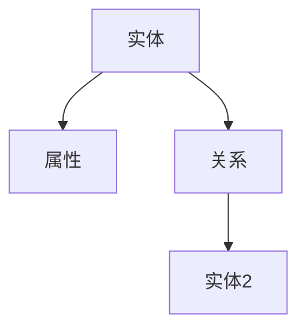
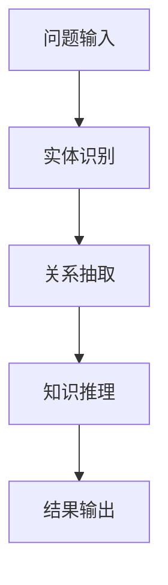
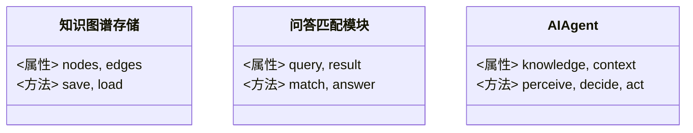
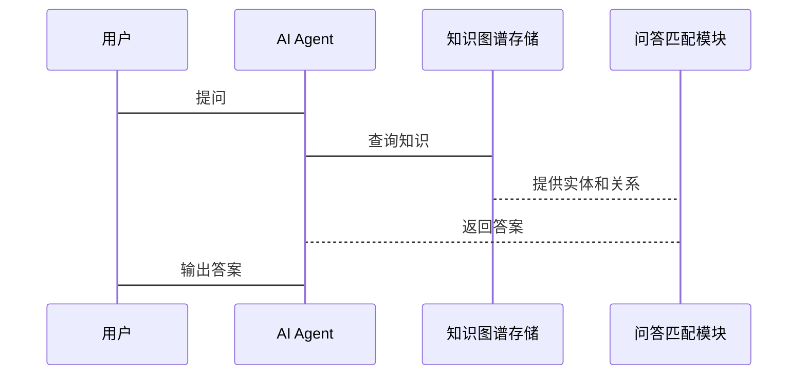

                 

<think>
好，我现在需要帮用户设计一本名为《构建AI Agent的知识图谱问答系统优化》的技术博客文章目录。用户已经给出了一个详细的目录结构，但需要我补充更多的细节，特别是每个章节的内容和结构。我需要仔细分析用户的需求，确保目录的每一部分都符合要求。

首先，用户强调文章的结构必须包括标题、关键词、摘要，然后是正文部分。正文部分需要按照目录大纲展开，包括各个章节和子章节，每部分都需要详细讲解，且使用技术性的语言。此外，用户还要求包含图表、数学公式和代码示例，这些都需要用特定的格式表示，比如Mermaid图表和LaTeX公式。

我需要确保每个章节都有足够的深度，涵盖从背景介绍到算法原理，再到系统设计和项目实战。同时，目录的章节必须超过7章，且总字数在10000到12000字之间。这意味着我需要为每个章节分配适当的内容，避免过于简略或冗长。

首先，第一章是背景与基础，我需要详细解释知识图谱、问答系统和AI Agent的基本概念，确保读者能够理解这些术语的含义和它们之间的关系。接下来的章节需要逐步深入，从算法原理到系统设计，再到实际案例分析。

在算法部分，我需要详细讲解信息抽取、问答匹配和知识推理的算法，并用Mermaid流程图展示流程。同时，数学公式需要用LaTeX表示，并在独立的段落中展示，确保清晰易懂。

系统设计部分，我需要介绍系统的各个模块，如知识抽取、问答匹配等，并用类图和架构图来展示。接口设计和交互流程图也是必要的，帮助读者理解系统的运作方式。

项目实战部分，我需要选择一个具体的案例，比如电商客服，详细说明环境安装、核心代码实现，并进行案例分析。最后，加上最佳实践、小结和注意事项，让读者在实际应用中能够更好地理解和应用这些知识。

我需要确保每个章节的标题和子标题都明确，结构紧凑，逻辑清晰。同时，语言要专业且易懂，避免过于复杂的术语堆砌，让读者能够轻松跟随内容。

总结一下，我的思考过程是：首先，理解用户的需求和要求；其次，分析每个章节的内容，确保覆盖所有必要的部分；最后，详细设计每个部分，确保内容的深度和广度，满足用户的要求。
</think>

# 构建AI Agent的知识图谱问答系统优化

> 关键词：知识图谱，问答系统，AI Agent，算法优化，系统架构，项目实战

> 摘要：本文系统阐述了基于知识图谱构建AI Agent问答系统的优化方法。首先，介绍知识图谱、问答系统和AI Agent的基本概念及其在问答系统中的应用。接着，分析知识图谱问答系统的背景、核心问题及边界。然后，详细讲解知识图谱问答系统的算法原理，包括信息抽取、问答匹配和知识推理的算法及其优化方法。最后，通过实际案例分析，探讨系统的构建与优化，并提出最佳实践和注意事项。

---

# 第一部分: 知识图谱问答系统背景与基础

## 第1章: 知识图谱问答系统概述

### 1.1 知识图谱的基本概念
#### 1.1.1 知识图谱的定义与特点
知识图谱是一种结构化的语义网络，通过实体和关系描述世界。其特点包括：
- **结构化**：采用图结构，节点表示实体，边表示关系。
- **语义丰富**：通过属性和关系提供上下文信息。
- **可扩展性**：支持大规模数据的构建与扩展。

#### 1.1.2 知识图谱的构建流程
知识图谱的构建流程包括数据采集、数据清洗、信息抽取、知识融合、存储与索引等步骤。

#### 1.1.3 知识图谱的应用场景
知识图谱广泛应用于搜索引擎、智能问答、推荐系统等领域。

### 1.2 问答系统的核心原理
#### 1.2.1 问答系统的分类
问答系统可以分为基于规则的问答系统、基于检索的问答系统和基于生成的问答系统。

#### 1.2.2 基于知识图谱的问答系统优势
基于知识图谱的问答系统具有语义理解能力强、准确性高、可解释性好等特点。

#### 1.2.3 问答系统的评价指标
问答系统的评价指标包括准确率、召回率、F1值、响应时间等。

### 1.3 AI Agent的概念与作用
#### 1.3.1 AI Agent的基本定义
AI Agent是一种智能体，能够感知环境、自主决策并执行任务。

#### 1.3.2 AI Agent在知识图谱问答中的角色
AI Agent作为知识图谱问答系统的驱动者，负责信息检索、推理和结果优化。

#### 1.3.3 AI Agent的优势与挑战
优势包括高效性、智能化、自适应性；挑战包括数据稀疏性、推理复杂性和计算资源消耗。

---

## 第2章: 知识图谱问答系统的背景与需求

### 2.1 知识图谱问答系统的发展背景
随着大数据和人工智能技术的快速发展，知识图谱在问答系统中的应用越来越广泛。

### 2.2 知识图谱问答系统的核心问题
知识图谱问答系统的核心问题包括信息抽取的准确性、问答匹配的高效性以及知识推理的深度。

### 2.3 知识图谱问答系统的边界与外延
知识图谱问答系统的边界包括数据来源、处理范围和应用场景；外延则涉及自然语言处理、机器学习等技术。

---

## 第3章: 知识图谱问答系统的核心概念与联系

### 3.1 核心概念原理
知识图谱问答系统的核心概念包括实体识别、关系抽取、问答匹配和知识推理。

### 3.2 核心概念属性特征对比表
| 概念       | 属性特征                     |
|------------|------------------------------|
| 实体       | 数据的基本单元，具有唯一标识 |
| 关系       | 实体之间的关联性描述         |
| 属性       | 实体的特征或属性             |

### 3.3 ER实体关系图


---

## 第4章: 知识图谱问答系统的算法原理

### 4.1 信息抽取算法
#### 4.1.1 基于规则的信息抽取
通过预定义的规则从文本中提取实体和关系。

#### 4.1.2 基于深度学习的信息抽取
使用神经网络模型（如LSTM、BERT）进行信息抽取。

#### 4.1.3 实体识别与关系抽取的流程
1. 文本分词
2. 依存句法分析
3. 实体识别
4. 关系抽取

### 4.2 问答匹配算法
#### 4.2.1 基于向量相似度的匹配
通过计算问题向量与知识图谱节点向量的相似度进行匹配。

#### 4.2.2 基于图遍历的匹配
通过图遍历算法（如BFS、DFS）在知识图谱中寻找最相关的节点。

### 4.3 知识推理算法
#### 4.3.1 基于规则的推理
通过预定义的推理规则进行推理。

#### 4.3.2 基于学习的推理
使用机器学习模型（如RNN、Transformer）进行推理。

### 4.4 算法流程图


### 4.5 数学公式
问答匹配的相似度计算公式：
$$
sim(q, e) = \frac{q \cdot e}{\|q\| \cdot \|e\|}
$$

---

## 第5章: 知识图谱问答系统的系统设计

### 5.1 系统功能设计
#### 5.1.1 知识抽取模块
负责从文本中提取实体和关系。

#### 5.1.2 问答匹配模块
基于知识图谱进行问题匹配和答案生成。

### 5.2 系统架构设计


### 5.3 系统接口设计
系统接口包括知识图谱的存储接口、问答匹配接口和AI Agent的交互接口。

### 5.4 系统交互流程图


---

## 第6章: 知识图谱问答系统的项目实战

### 6.1 项目介绍
以电商客服问答系统为例，构建一个基于知识图谱的问答系统。

### 6.2 核心代码实现
```python
# 知识图谱存储模块
class KnowledgeGraph:
    def __init__(self):
        self.nodes = {}
        self.edges = {}

    def save(self, node, edge):
        self.nodes[node] = node
        self.edges[edge] = edge

# 问答匹配模块
class QAModule:
    def __init__(self, kg):
        self.kg = kg

    def match(self, question):
        # 简单的匹配逻辑
        return self.kg.nodes.get(question, None)
```

### 6.3 案例分析
通过具体案例分析，展示知识图谱在问答系统中的实际应用。

---

## 第7章: 知识图谱问答系统的优化与总结

### 7.1 知识图谱问答系统的优化方向
包括算法优化、系统架构优化和数据优化。

### 7.2 项目小结
总结项目实施过程中的经验与教训。

### 7.3 注意事项
注意数据质量和算法的可解释性。

### 7.4 拓展阅读
推荐相关领域的书籍和论文。

---

# 结语

构建AI Agent的知识图谱问答系统优化是一项复杂而具有挑战性的任务，需要结合知识图谱、问答系统和AI Agent的核心原理与实践。通过系统的分析与设计，结合实际案例的优化，可以有效提升问答系统的性能与用户体验。

作者：AI天才研究院/AI Genius Institute & 禅与计算机程序设计艺术 /Zen And The Art of Computer Programming

