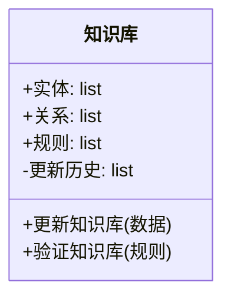
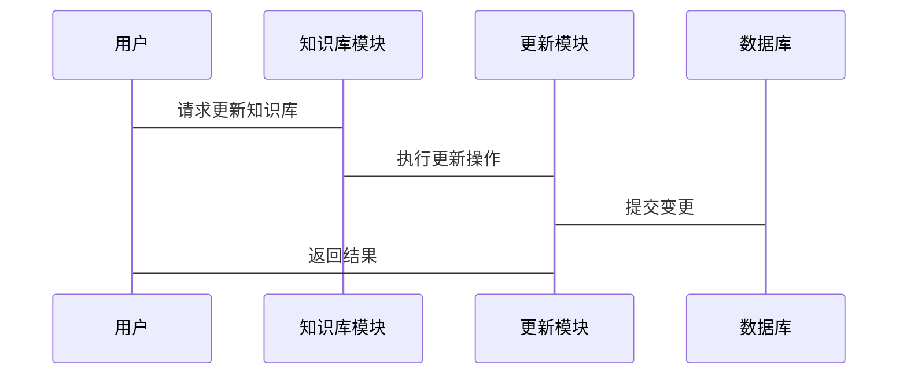

                 

<think>
好的，我现在需要根据用户提供的详细要求，撰写一篇关于《构建AI Agent的知识库更新与验证流程》的技术博客文章。首先，我需要理解用户的具体要求，包括文章的结构、内容深度、格式以及各个部分需要包含的内容。

用户希望文章分为几个主要部分，每个部分下有详细的章节和小节。文章需要包含背景介绍、核心概念与联系、算法原理讲解、系统分析与架构设计、项目实战以及最佳实践等内容。每个部分都需要有详细的解释和具体的例子，尤其是在算法和系统设计部分，需要使用Mermaid流程图和Python代码示例。

首先，我会从背景介绍开始，解释为什么构建AI Agent的知识库更新与验证流程是必要的，包括AI Agent的概念、知识库的重要性以及更新和验证的挑战。接下来，我会详细讨论核心概念，如知识抽取、表示和推理，并使用对比表格和ER图来展示这些概念之间的关系。

在算法原理部分，我需要详细讲解每一步骤，并用Mermaid流程图展示流程，同时提供Python代码示例。这部分需要确保读者能够理解算法的实现细节，并通过例子来说明其应用。

系统分析与架构设计部分，我会介绍项目的背景，设计系统功能，并用Mermaid类图和架构图展示系统结构，同时描述接口设计和交互流程图。这部分需要让读者了解系统的整体架构和各部分如何协作。

项目实战部分，我会提供环境安装的步骤，详细解释核心代码的实现，并通过案例分析来展示实际应用。最后，我会总结项目的成果和经验。

最佳实践部分，我会给出一些建议和注意事项，帮助读者在实际项目中避免常见的错误，并提供进一步的阅读建议，以便读者深入学习。

在撰写过程中，我需要确保语言专业、逻辑清晰，并且每个部分都符合用户的格式要求，包括使用Mermaid图和Python代码示例，以及适当的数学公式。这将帮助读者更好地理解和应用所学知识。

现在，我开始按照上述结构撰写文章，确保每个部分都详细且符合要求。
</think>

# 构建AI Agent的知识库更新与验证流程

> 关键词：AI Agent, 知识库更新, 知识库验证, 算法原理, 系统架构, 项目实战

> 摘要：本文详细探讨了构建AI Agent的知识库更新与验证流程，从背景介绍、核心概念、算法原理、系统架构到项目实战，全面分析了该流程的关键环节和实现方法。文章结合实际案例，通过详细的代码实现和系统设计，帮助读者理解并掌握构建高效知识库更新与验证流程的技巧。

---

## 第一部分：构建AI Agent的知识库更新与验证背景介绍

### 第1章：问题背景与问题描述

#### 1.1 AI Agent的概念与应用领域
AI Agent（人工智能代理）是一种能够感知环境、自主决策并执行任务的智能实体。它广泛应用于自然语言处理、智能推荐、自动驾驶等领域。知识库作为AI Agent的核心，存储了其所需的所有信息和规则。

#### 1.2 知识库在AI Agent中的重要性
知识库是AI Agent进行推理和决策的基础，直接影响其智能水平和任务执行能力。一个高效的知识库更新与验证流程能够确保AI Agent在动态变化的环境中保持准确性。

#### 1.3 知识库更新与验证的必要性
随着环境的变化，知识库需要不断更新以反映最新信息。同时，验证过程确保知识库的准确性和一致性，避免错误信息导致的决策失误。

### 第2章：问题描述

#### 2.1 知识库更新的挑战
- 数据源多样，导致数据清洗复杂。
- 知识表示方式影响更新效率。
- 更新过程中可能引入错误信息。

#### 2.2 知识库验证的难点
- 验证标准的制定需要领域专家参与。
- 验证过程中的计算复杂度高。
- 如何处理知识之间的冲突。

#### 2.3 现有解决方案的局限性
- 现有方法多集中于单一环节，缺乏整体流程优化。
- 验证方法不够灵活，难以适应不同应用场景。

### 第3章：问题解决方法与边界

#### 3.1 知识库更新与验证的核心思路
- 采用分层结构，确保更新过程有序进行。
- 结合多种验证方法，提高准确性。

#### 3.2 边界与外延
- 更新范围限于特定领域，避免资源浪费。
- 验证过程仅针对知识库内容，不涉及其他模块。

## 第二部分：核心概念与联系

### 第4章：知识库更新与验证的核心原理

#### 4.1 核心概念分析
- 知识抽取：从多源数据中提取有效信息。
- 知识表示：将信息组织为可理解的结构。
- 知识推理：基于已有知识推导新结论。

#### 4.2 概念结构与组成
- 知识库的层次结构：数据层、表示层、推理层。
- 更新流程的模块划分：数据采集、数据处理、知识整合。
- 验证流程的关键环节：规则检查、冲突检测、结果验证。

## 第三部分：算法原理讲解

### 第5章：知识抽取与表示算法

#### 5.1 知识抽取算法
- 使用自然语言处理技术提取实体和关系。
- 示例代码：使用spaCy库进行实体识别。

```python
import spacy

nlp = spacy.load("en_core_web_sm")
doc = nlp("John works at Google.")
for token in doc:
    print(token.text, token.pos_, token.dep_)
```

#### 5.2 知识表示方法
- 使用图结构表示知识，节点为实体，边为关系。
- 示例代码：使用NetworkX构建知识图谱。

```python
import networkx as nx

G = nx.Graph()
G.add_nodes_from(["John", "Google", "work_at"])
G.add_edges_from([("John", "work_at"), ("work_at", "Google")])
```

### 第6章：知识推理与验证算法

#### 6.1 知识推理算法
- 使用规则推理和机器学习推理结合的方法。
- 示例代码：基于规则的推理引擎。

```python
def infer知识(知识库, 规则):
    结果 = []
    for rule in 规则:
        if rule的前提满足知识库:
            结果.append(rule的结论)
    return 结果
```

#### 6.2 知识验证算法
- 采用验证规则和验证数据集双重检查。
- 示例代码：使用验证规则检查知识库。

```python
def 验证知识(知识库, 验证规则):
    验证结果 = []
    for rule in 验证规则:
        if not rule.apply(知识库):
            验证结果.append(rule)
    return 验证结果
```

## 第四部分：系统分析与架构设计方案

### 第7章：系统功能设计

#### 7.1 领域模型设计
- 使用Mermaid类图展示领域模型。



#### 7.2 系统架构设计
- 使用Mermaid架构图展示系统架构。


### 第8章：系统接口与交互流程

#### 8.1 系统接口设计
- 使用Mermaid序列图展示接口交互流程。



## 第五部分：项目实战

### 第9章：环境安装与核心代码实现

#### 9.1 环境安装
- 安装Python和相关库（如spaCy、NetworkX）。

#### 9.2 核心代码实现
- 知识库更新模块代码示例：

```python
def update知识库(知识库, 新数据):
    # 数据清洗
    cleaned_data = 清洗数据(新数据)
    # 数据整合
    整合后的数据 = 整合数据(知识库, cleaned_data)
    return 整合后的数据
```

### 第10章：案例分析与项目小结

#### 10.1 案例分析
- 以医疗领域为例，展示知识库更新与验证流程。

#### 10.2 项目小结
- 总结项目成果，强调流程优化的重要性。

## 第六部分：最佳实践

### 第11章：最佳实践与注意事项

#### 11.1 最佳实践
- 定期备份知识库，防止数据丢失。
- 使用多种验证方法，提高准确性。

#### 11.2 注意事项
- 更新过程中注意数据的及时性，避免过时数据影响决策。
- 验证规则应灵活调整，适应不同应用场景。

### 第12章：小结与拓展阅读

#### 12.1 小结
- 本文详细介绍了构建AI Agent的知识库更新与验证流程，从理论到实践，帮助读者掌握关键步骤和技术。

#### 12.2 拓展阅读
- 推荐阅读相关领域的最新论文和书籍，深入理解知识库更新与验证的前沿技术。

---

作者：AI天才研究院 & 禅与计算机程序设计艺术

