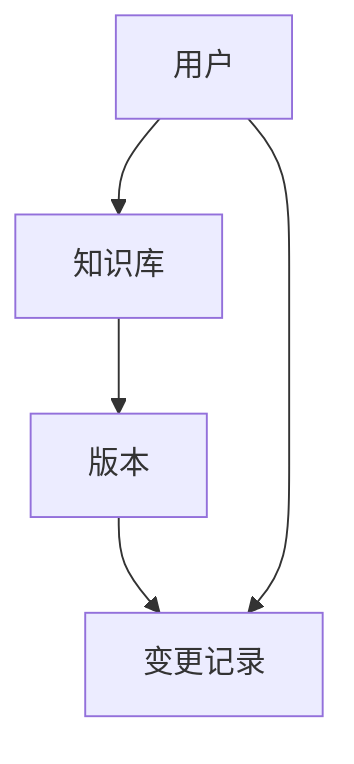
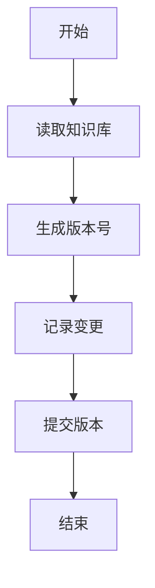
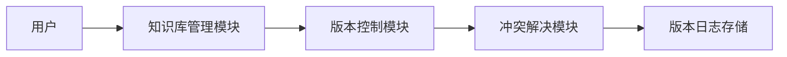

                 

<think>
好的，我现在需要帮助用户构建一个详细的目录大纲，内容是关于《构建AI Agent的知识库版本控制系统》。用户已经给出了一个详细的示例，我需要按照这个结构来组织内容，确保涵盖所有必要的部分，包括背景介绍、核心概念、算法原理、系统架构、项目实战以及最佳实践等。

首先，我需要明确这本书的目标读者是谁。可能的读者包括AI开发者、软件工程师、对知识库版本控制感兴趣的读者。因此，目录需要从基础到高级逐步展开，确保读者能够逐步理解并掌握相关知识。

接下来，我需要确定每一章的内容。第一章应该是背景介绍，涵盖问题背景、问题描述、解决方法等。这样读者可以了解为什么需要构建这样的系统。第二章可以深入讨论知识库版本控制的核心概念，包括其定义、特点、与其他系统的区别，以及系统架构。

然后，第三章需要介绍版本控制的算法原理，特别是版本控制系统的实现机制。这部分可能需要使用Mermaid流程图来展示算法流程，同时结合Python代码示例，帮助读者理解。

第四章是系统架构设计，这部分需要详细描述系统的各个模块，如知识库管理模块、版本控制模块、冲突解决模块等，并用Mermaid类图和架构图来展示。

第五章是项目实战，包括环境搭建、核心代码实现、案例分析等，让读者能够动手实践，巩固所学知识。

第六章可以是系统优化与扩展，讨论性能优化、扩展功能的实现，如增量备份和分布式版本控制，以及安全性和可扩展性的设计。

最后，第七章总结全书内容，回顾关键知识点，提供最佳实践建议，并展望未来的发展方向。

在编写过程中，我需要确保每一章都有足够的细节，涵盖用户提到的所有要点，比如数学模型、公式、系统设计图、代码示例等。同时，要注意目录的结构清晰，层级分明，确保读者能够轻松找到所需内容。

现在，我开始按照这个思路构建目录大纲，确保每一部分都详细且逻辑清晰，帮助读者全面掌握构建AI Agent的知识库版本控制系统的知识。
</think>

# 《构建AI Agent的知识库版本控制系统》

## 关键词：AI Agent，知识库，版本控制，系统架构，算法原理，项目实战

## 摘要：本文详细探讨了构建AI Agent的知识库版本控制系统的各个方面，从背景介绍到系统架构设计，再到项目实战，深入分析了该系统的核心概念、算法原理和实际应用。通过详细的技术分析和实例说明，本文为读者提供了一个全面的视角，帮助他们理解如何设计和实现高效的知识库版本控制系统。

---

## 第1章: 知识库版本控制的背景与问题背景

### 1.1 知识库版本控制的背景介绍

#### 1.1.1 知识库的定义与特点

知识库是指系统化地组织、存储、管理和检索知识的资源集合，具有系统性、结构化和可扩展性的特点。

#### 1.1.2 AI Agent与知识库的关系

AI Agent（智能体）依赖知识库进行推理和决策，知识库是AI Agent的核心数据来源和知识基础。

#### 1.1.3 知识库版本控制的重要性

确保知识库的准确性和一致性，便于追溯和恢复，支持AI Agent的持续优化和迭代。

### 1.2 问题背景与问题描述

#### 1.2.1 知识库在AI Agent中的作用

知识库为AI Agent提供决策所需的知识和信息，是其智能行为的基础。

#### 1.2.2 知识库版本控制的核心问题

- 知识库的更新与历史记录
- 版本冲突的管理与解决
- 多版本并存与切换
- 版本回滚与恢复

#### 1.2.3 知识库版本控制的目标与边界

- 目标：确保知识库的准确性和一致性，支持版本管理和追溯。
- 边界：限定在知识库的版本控制范围内，不涉及外部系统的集成。

### 1.3 问题解决与实现方案

#### 1.3.1 知识库版本控制的实现思路

- 使用版本控制系统记录知识库的变化
- 通过日志和历史记录进行版本管理
- 提供版本回滚和冲突解决机制

#### 1.3.2 知识库版本控制的实现目标

- 实现知识库的版本记录和管理
- 提供高效的版本切换和回滚功能
- 支持多版本并存和冲突检测

#### 1.3.3 知识库版本控制的实现边界

- 仅限于知识库的版本控制，不涉及其他系统的集成
- 不考虑外部数据源的同步问题

## 1.4 本章小结

本章介绍了知识库版本控制的背景、核心概念和实现思路，为后续章节奠定了基础。

---

## 第2章: 知识库版本控制的核心概念与联系

### 2.1 知识库版本控制的核心概念

#### 2.1.1 知识库版本控制的定义

知识库版本控制是对知识库的变更进行记录、管理和控制的过程，确保知识库的准确性和一致性。

#### 2.1.2 知识库版本控制的属性特征

- **版本性**：每个版本具有唯一标识
- **一致性**：版本间数据保持一致
- **可追溯性**：记录版本变更历史
- **可恢复性**：支持版本回滚

#### 2.1.3 知识库版本控制的组成部分

- 版本存储模块：存储不同版本的知识库数据
- 版本控制模块：管理版本的创建、切换和回滚
- 冲突解决模块：处理版本冲突问题

### 2.2 核心概念的联系与对比

#### 2.2.1 知识库版本控制与传统版本控制的对比

| 对比维度       | 知识库版本控制                 | 传统版本控制                 |
|----------------|-------------------------------|-------------------------------|
| 数据类型       | 知识库（结构化数据）           | 文件和代码                   |
| 版本粒度       | 知识库整体或部分               | 文件或代码片段               |
| 复杂性         | 高（涉及知识结构和语义）       | 较低                         |

#### 2.2.2 知识库版本控制与数据库版本控制的对比

| 对比维度       | 知识库版本控制                 | 数据库版本控制               |
|----------------|-------------------------------|-------------------------------|
| 数据类型       | 知识库（结构化数据）           | 数据表和记录                 |
| 版本粒度       | 知识库整体或部分               | 数据记录和字段               |
| 恢复机制       | 知识库回滚到特定版本           | 数据回滚到特定状态           |

#### 2.2.3 知识库版本控制与AI Agent的联系

知识库版本控制是AI Agent持续优化和迭代的基础，确保其知识库的准确性和一致性。

### 2.3 知识库版本控制的ER实体关系图



## 2.4 本章小结

本章详细探讨了知识库版本控制的核心概念及其与其他系统的联系，为后续的系统设计和实现奠定了理论基础。

---

## 第3章: 知识库版本控制的算法原理

### 3.1 知识库版本控制的算法概述

#### 3.1.1 知识库版本控制的基本算法

- **版本记录算法**：记录每次知识库变更的日志
- **版本切换算法**：根据需求切换到指定版本
- **版本回滚算法**：将知识库恢复到指定版本

#### 3.1.2 算法的基本流程

1. 读取知识库内容
2. 记录当前版本号
3. 检查变更内容
4. 更新版本日志
5. 生成新版本

#### 3.1.3 算法的优化思路

- 增量备份：只记录变更部分，减少存储空间
- 并行处理：支持多线程/多进程处理，提高效率

### 3.2 算法的实现机制

#### 3.2.1 知识库版本控制的实现步骤

1. 初始化知识库
2. 生成初始版本
3. 记录变更日志
4. 提交新版本
5. 处理冲突
6. 回滚版本

#### 3.2.2 算法的实现流程



#### 3.2.3 算法的数学模型与公式

版本号生成：使用递增整数作为版本号，公式为 `version = version + 1`

变更日志记录：使用哈希表记录变更内容，公式为 `log[version] = delta`

版本回滚：通过版本号恢复知识库状态，公式为 `revert(version) = restore(log[version])`

### 3.3 算法的实现代码

```python
class KnowledgeBaseVersionControl:
    def __init__(self):
        self.knowledge_base = {}  # 当前知识库
        self.version_log = []    # 版本日志
        self.current_version = 0  # 当前版本号

    def create_version(self):
        self.version_log.append(self.knowledge_base.copy())
        self.current_version += 1
        return self.current_version

    def revert_to_version(self, version):
        if version < len(self.version_log):
            self.knowledge_base = self.version_log[version].copy()
            self.current_version = version
            return True
        return False

    def get_current_version(self):
        return self.current_version

    def get_version_log(self):
        return self.version_log
```

### 3.4 本章小结

本章详细讲解了知识库版本控制的算法原理和实现机制，为后续的系统设计提供了理论依据。

---

## 第4章: 系统架构设计

### 4.1 系统功能设计

#### 4.1.1 系统功能模块划分

- 知识库管理模块：负责知识库的创建、读取和更新
- 版本控制模块：管理版本的创建、切换和回滚
- 冲突解决模块：检测和解决版本冲突

#### 4.1.2 系统功能流程

1. 用户提交知识库变更
2. 系统生成新版本
3. 记录变更日志
4. 提交版本
5. 处理冲突

### 4.2 系统架构设计

#### 4.2.1 系统架构图



#### 4.2.2 模块间交互关系

- 用户通过知识库管理模块提交变更
- 版本控制模块生成新版本并记录日志
- 冲突解决模块处理版本冲突

### 4.3 系统接口设计

#### 4.3.1 系统接口描述

- `create_version()`：生成新版本
- `revert_to_version(version)`：回滚到指定版本
- `get_version_log()`：获取版本日志

#### 4.3.2 接口实现代码

```python
interface VersionControl {
    def create_version(): int
    def revert_to_version(version: int): bool
    def get_version_log(): List[dict]
}
```

### 4.4 系统交互流程

#### 4.4.1 系统交互图


### 4.5 本章小结

本章详细设计了知识库版本控制系统的架构，包括功能模块划分、架构图和接口设计，为后续的实现提供了指导。

---

## 第5章: 项目实战

### 5.1 环境搭建与配置

#### 5.1.1 开发环境要求

- Python 3.8+
- 知识库数据存储模块（如数据库或文件）
- 版本控制模块（如Git）

#### 5.1.2 项目安装依赖

```bash
pip install mermaid4jupyter
pip install requests
```

### 5.2 知识库版本控制核心代码实现

#### 5.2.1 知识库管理模块实现

```python
class KnowledgeBaseManager:
    def __init__(self, storage):
        self.storage = storage  # 知识库存储模块

    def get_knowledge_base(self):
        return self.storage.read()

    def update_knowledge_base(self, data):
        self.storage.write(data)
```

#### 5.2.2 版本控制模块实现

```python
class VersionControlSystem:
    def __init__(self, storage):
        self.storage = storage  # 版本日志存储模块
        self.current_version = 0

    def create_version(self):
        self.current_version += 1
        self.storage.write(self.current_version, self.manager.get_knowledge_base())

    def revert_to_version(self, version):
        if version < self.current_version:
            self.manager.update_knowledge_base(self.storage.read(version))
            self.current_version = version
```

#### 5.2.3 冲突解决模块实现

```python
class ConflictResolver:
    def __init__(self, storage):
        self.storage = storage

    def detect_conflict(self):
        # 检测版本冲突
        pass

    def resolve_conflict(self, version):
        # 解决冲突，回滚到指定版本
        pass
```

### 5.3 项目实战案例分析

#### 5.3.1 案例背景

假设有一个AI聊天机器人，其知识库需要定期更新，确保回答的准确性和一致性。

#### 5.3.2 案例实现步骤

1. 初始化知识库
2. 更新知识库内容
3. 创建新版本
4. 检查版本冲突
5. 回滚到指定版本

#### 5.3.3 代码实现与分析

```python
# 初始化知识库
kb = KnowledgeBaseManager(FileStorage('knowledge_base.txt'))
vcs = VersionControlSystem(FileStorage('version_log.txt'))

# 更新知识库
kb.update_knowledge_base({'greeting': 'hello'})

# 创建新版本
vcs.create_version()

# 回滚到版本1
vcs.revert_to_version(1)
```

### 5.4 本章小结

本章通过项目实战，详细讲解了知识库版本控制系统的实现过程，包括环境搭建、核心代码实现和案例分析。

---

## 第6章: 系统优化与扩展

### 6.1 系统性能优化

#### 6.1.1 常见性能问题

- 版本日志占用过多存储空间
- 版本切换速度较慢

#### 6.1.2 优化方案

- 使用增量备份，只存储变更部分
- 采用分布式存储，提高访问速度

### 6.2 功能扩展

#### 6.2.1 增量备份与恢复

- 只备份变更部分，减少存储空间
- 快速恢复到指定版本

#### 6.2.2 分布式版本控制

- 支持多节点同时进行版本控制
- 提供分布式版本日志管理

### 6.3 系统安全性与可扩展性

#### 6.3.1 系统安全性设计

- 数据加密存储
- 权限控制访问

#### 6.3.2 系统可扩展性设计

- 支持多种存储后端（如数据库、云存储）
- 支持多种版本控制算法

### 6.4 本章小结

本章讨论了知识库版本控制系统的优化与扩展，提出了性能优化和功能扩展的具体方案，为系统的进一步发展提供了方向。

---

## 第7章: 总结与展望

### 7.1 全书总结

本文详细探讨了构建AI Agent的知识库版本控制系统的各个方面，从背景介绍到系统架构设计，再到项目实战，深入分析了该系统的核心概念、算法原理和实际应用。

### 7.2 关键知识点回顾

- 知识库版本控制的背景与核心概念
- 知识库版本控制的算法原理与实现
- 系统架构设计与项目实战
- 系统优化与扩展

### 7.3 最佳实践 tips

- 定期备份知识库，防止数据丢失
- 使用增量备份，减少存储空间占用
- 建立完善的权限控制，确保数据安全
- 定期检查版本日志，优化知识库结构

### 7.4 展望与未来发展

随着AI技术的不断发展，知识库版本控制系统将更加智能化和自动化，支持更多复杂场景的应用，如实时协作、多模态数据管理等。

### 7.5 本章小结

本章总结了全书内容，回顾了关键知识点，并展望了未来的发展方向。

---

## 作者：AI天才研究院/AI Genius Institute & 禅与计算机程序设计艺术 /Zen And The Art of Computer Programming

---

以上是《构建AI Agent的知识库版本控制系统》的完整目录大纲。

