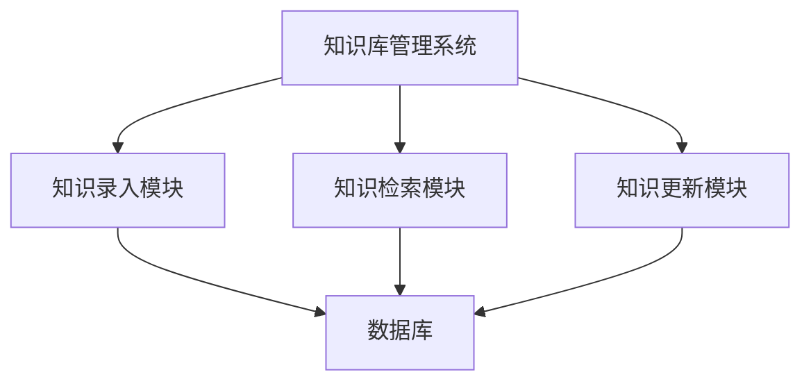
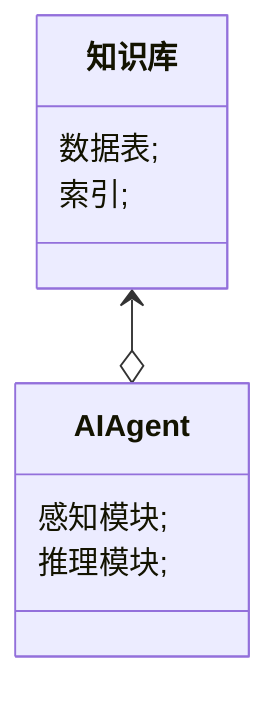
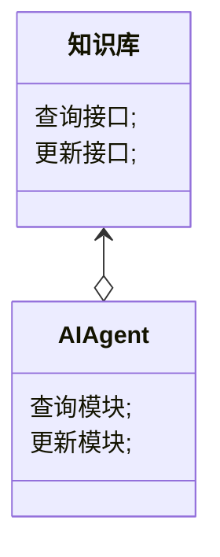
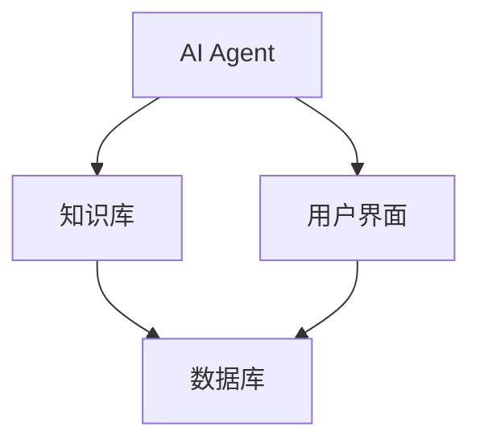
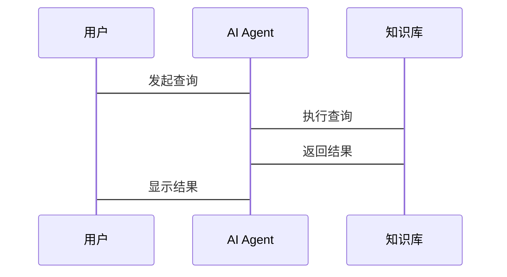

                 


# 构建AI Agent的知识库管理系统

## 关键词：
- AI Agent
- 知识库管理
- 系统架构
- 算法实现
- 项目实战

## 摘要：
本文详细探讨构建AI Agent的知识库管理系统的各个方面。从背景介绍到系统设计，再到项目实战，系统阐述了知识库管理在AI Agent中的重要性。通过核心概念、算法原理、系统架构设计和项目案例的深入分析，帮助读者全面理解并掌握构建高效知识库管理系统的技能。

---

# 第一章: AI Agent与知识库管理的背景介绍

## 1.1 问题背景
### 1.1.1 当前AI Agent的发展现状
AI Agent作为人工智能的核心技术，广泛应用于智能助手、自动化系统等领域，但其性能受限于知识库的有效管理。

### 1.1.2 知识库管理的重要性
知识库是AI Agent的“大脑”，决定了其理解和决策能力。有效的知识库管理能提升AI Agent的效率和准确性。

### 1.1.3 AI Agent与知识库管理的结合
AI Agent通过知识库获取信息，知识库则依赖AI Agent进行动态更新，两者相辅相成。

## 1.2 问题描述
### 1.2.1 知识库管理的核心问题
知识表示、存储和检索的优化，确保快速准确地获取所需信息。

### 1.2.2 AI Agent在知识库管理中的作用
AI Agent通过自然语言处理和推理能力，辅助知识库的构建和维护。

## 1.3 问题解决
### 1.3.1 知识库管理的解决方案
采用先进的数据结构和算法，优化知识存储和检索效率。

### 1.3.2 AI Agent在知识库管理中的应用
利用AI Agent的智能特性，实现知识库的动态更新和自适应优化。

## 1.4 边界与外延
### 1.4.1 知识库管理的边界
明确知识库的范围和功能，避免信息冗余和不相关数据的干扰。

### 1.4.2 AI Agent的应用范围
AI Agent不仅限于知识库管理，还可应用于任务执行、决策支持等多个领域。

### 1.4.3 相关概念的对比
对比知识库管理与传统数据库管理，突出AI Agent的独特优势。

## 1.5 概念结构与核心要素
### 1.5.1 知识库管理的核心要素
包括知识表示、存储、检索和更新机制。

### 1.5.2 AI Agent的关键组成部分
感知模块、推理模块和执行模块，确保AI Agent高效运作。

### 1.5.3 两者的相互关系
知识库为AI Agent提供数据支持，AI Agent则优化知识库的结构和内容。

---

# 第二章: 核心概念与联系

## 2.1 知识库管理的核心原理
### 2.1.1 知识表示方法
使用符号逻辑、语义网络等方法，将知识以结构化形式存储。

### 2.1.2 知识存储与检索机制
采用向量数据库和知识图谱技术，提升知识存储和检索的效率。

## 2.2 AI Agent的原理
### 2.2.1 AI Agent的感知与决策
通过传感器或接口获取信息，结合内部知识库进行推理和决策。

### 2.2.2 AI Agent的知识处理能力
支持自然语言处理和机器学习，增强知识理解与应用能力。

## 2.3 知识库与AI Agent的联系
### 2.3.1 知识库作为AI Agent的知识基础
知识库为AI Agent提供决策所需的信息和上下文。

### 2.3.2 AI Agent对知识库的动态更新
AI Agent通过与用户的交互，实时更新知识库，保持信息的准确性。

---

# 第三章: 知识库管理系统的架构设计

## 3.1 系统功能模块划分
### 3.1.1 知识录入模块
负责知识的输入和结构化处理，确保知识的准确性和一致性。

### 3.1.2 知识检索模块
提供高效的查询接口，支持多种检索方式，满足不同用户需求。

### 3.1.3 知识更新模块
根据反馈和新信息，动态更新知识库，保持知识的最新性。

## 3.2 系统架构图


## 3.3 系统功能设计
### 3.3.1 领域模型图


---

# 第四章: AI Agent的知识库交互机制

## 4.1 AI Agent与知识库的交互流程
### 4.1.1 信息查询流程
AI Agent接收查询请求，通过知识库检索相关信息，返回结果。

### 4.1.2 信息更新流程
根据用户反馈或新数据，AI Agent触发知识库的更新机制，保持知识的准确性。

## 4.2 知识库的动态更新机制
### 4.2.1 基于反馈的更新
根据用户反馈，调整知识库内容，优化信息质量。

### 4.2.2 基于规则的自动更新
设定规则，定期自动更新知识库，确保信息的及时性。

---

# 第五章: 知识库管理系统的算法实现

## 5.1 知识表示与存储算法
### 5.1.1 基于向量的表示方法
使用向量空间模型，将知识转化为向量形式，便于检索和计算相似度。

### 5.1.2 知识图谱构建算法
通过图嵌入技术，构建知识图谱，提升知识关联性和推理能力。

## 5.2 知识检索算法
### 5.2.1 基于向量的检索
利用余弦相似度，计算查询向量与知识库向量的相似度，实现高效检索。

### 5.2.2 基于图的检索
通过知识图谱的遍历，找到最相关的节点，返回结果。

## 5.3 知识更新算法
### 5.3.1 基于反馈的更新
根据用户反馈，调整知识库中的权重，优化信息质量。

### 5.3.2 基于规则的自动更新
按照预设规则，定期更新知识库，确保信息的准确性和时效性。

---

# 第六章: 系统分析与架构设计方案

## 6.1 问题场景介绍
### 6.1.1 问题背景
在一个智能客服系统中，AI Agent需要快速响应用户查询，依赖高效的知识库管理。

### 6.1.2 系统目标
构建一个高效的知识库管理系统，支持快速查询、动态更新和多语言处理。

## 6.2 系统功能设计
### 6.2.1 领域模型图


## 6.3 系统架构设计
### 6.3.1 系统架构图


## 6.4 系统接口设计
### 6.4.1 API接口
提供RESTful API，支持HTTP请求，实现知识库的增删改查操作。

## 6.5 系统交互设计
### 6.5.1 交互序列图


---

# 第七章: 项目实战

## 7.1 环境安装
### 7.1.1 安装Python
安装Python 3.8及以上版本，确保环境配置正确。

### 7.1.2 安装依赖库
使用pip安装必要的库，如numpy、scikit-learn、spacy等。

## 7.2 系统核心实现源代码
### 7.2.1 知识录入模块
```python
class KnowledgeBase:
    def __init__(self):
        self.database = {}

    def add_knowledge(self, key, value):
        self.database[key] = value
```

### 7.2.2 知识检索模块
```python
class SearchModule:
    def search(self, knowledge_base, query):
        return knowledge_base.database.get(query, None)
```

### 7.2.3 知识更新模块
```python
class UpdateModule:
    def update_knowledge(self, knowledge_base, key, value):
        knowledge_base.database[key] = value
```

## 7.3 代码应用解读与分析
### 7.3.1 代码结构
通过类的设计，实现知识库的录入、检索和更新功能，确保代码的模块化和可维护性。

### 7.3.2 功能实现
详细分析每个模块的功能，确保代码的逻辑清晰，功能完善。

## 7.4 实际案例分析
### 7.4.1 案例背景
在一个智能客服系统中，构建一个简单的知识库管理系统，实现用户常见问题的自动回答。

### 7.4.2 系统实现
通过代码实现知识库的录入、检索和更新功能，集成到智能客服系统中，提升用户体验。

## 7.5 项目小结
总结项目实施过程中的经验和教训，提出改进建议，为后续项目提供参考。

---

# 第八章: 最佳实践、小结、注意事项和拓展阅读

## 8.1 最佳实践
### 8.1.1 知识库管理
定期维护和更新知识库，确保信息的准确性和完整性。

### 8.1.2 AI Agent设计
注重AI Agent的可扩展性和灵活性，便于后续功能的添加和优化。

## 8.2 小结
总结全文内容，强调知识库管理和AI Agent结合的重要性，为读者提供一个全面的视角。

## 8.3 注意事项
### 8.3.1 数据安全
确保知识库中的数据安全，防止信息泄露和恶意攻击。

### 8.3.2 性能优化
持续优化知识库的存储和检索效率，提升系统的响应速度。

## 8.4 拓展阅读
推荐相关的书籍和资源，鼓励读者深入学习和研究，保持技术的前沿性。

---

# 作者：AI天才研究院/AI Genius Institute & 禅与计算机程序设计艺术 /Zen And The Art of Computer Programming

---

本文通过系统化的分析和实践，全面探讨了构建AI Agent的知识库管理系统的各个方面，从理论到实践，为读者提供了详实的指导和参考。希望本文能帮助读者更好地理解并掌握构建高效知识库管理系统的技能，推动人工智能技术的发展。

